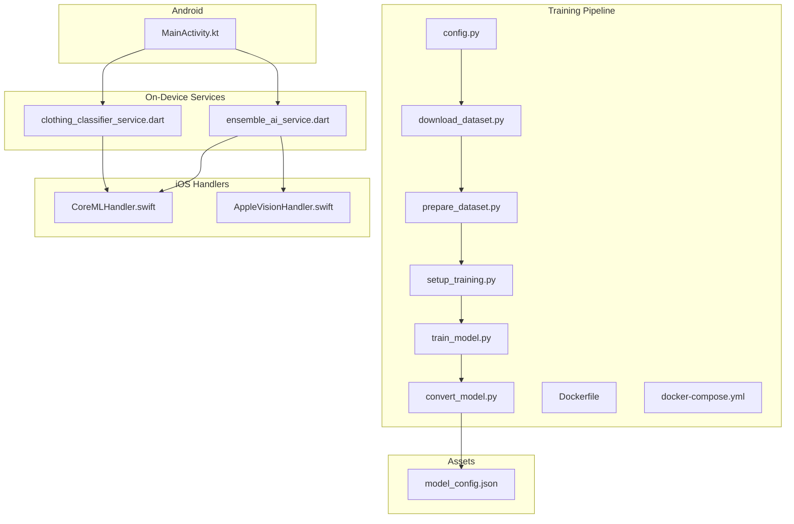
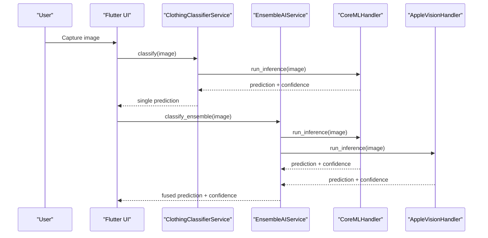
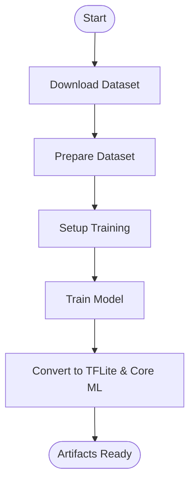
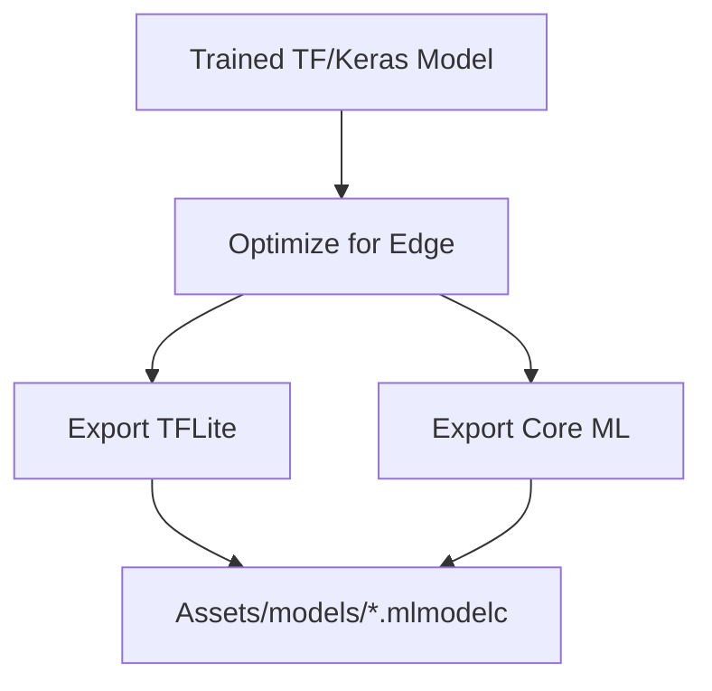
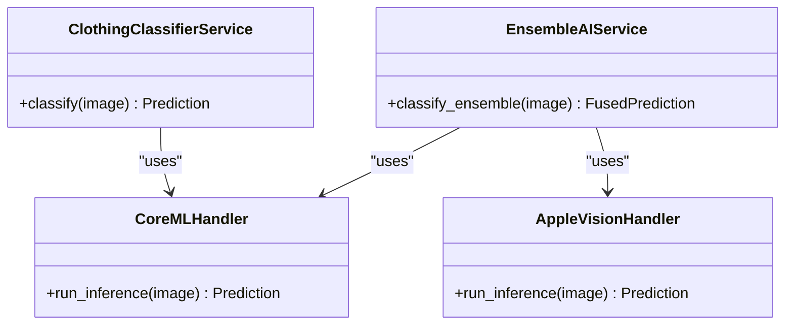
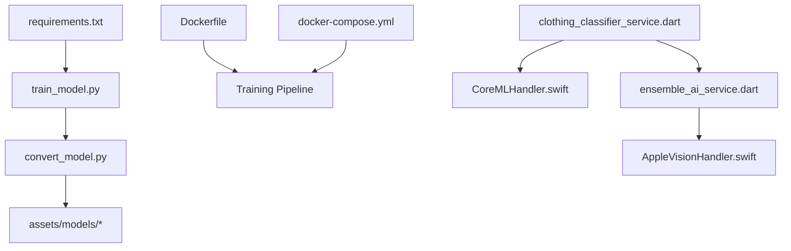

# AI/ML Components

<cite>
**Referenced Files in This Document**
- [README.md](file://README.md)
- [deepfashion2_training/README.md](file://deepfashion2_training/README.md)
- [deepfashion2_training/config.py](file://deepfashion2_training/config.py)
- [deepfashion2_training/download_dataset.py](file://deepfashion2_training/download_dataset.py)
- [deepfashion2_training/prepare_dataset.py](file://deepfashion2_training/prepare_dataset.py)
- [deepfashion2_training/setup_training.py](file://deepfashion2_training/setup_training.py)
- [deepfashion2_training/train_model.py](file://deepfashion2_training/train_model.py)
- [deepfashion2_training/convert_model.py](file://deepfashion2_training/convert_model.py)
- [deepfashion2_training/create_sample_dataset.py](file://deepfashion2_training/create_sample_dataset.py)
- [deepfashion2_training/docker-compose.yml](file://deepfashion2_training/docker-compose.yml)
- [deepfashion2_training/Dockerfile](file://deepfashion2_training/Dockerfile)
- [deepfashion2_training/requirements.txt](file://deepfashion2_training/requirements.txt)
- [assets/models/model_config.json](file://assets/models/model_config.json)
- [lib/services/clothing_classifier_service.dart](file://lib/services/clothing_classifier_service.dart)
- [lib/services/ensemble_ai_service.dart](file://lib/services/ensemble_ai_service.dart)
- [ios/Runner/CoreMLHandler.swift](file://ios/Runner/CoreMLHandler.swift)
- [ios/Runner/AppleVisionHandler.swift](file://ios/Runner/AppleVisionHandler.swift)
- [android/app/src/main/kotlin/com/prismstyle_ai/app/MainActivity.kt](file://android/app/src/main/kotlin/com/prismstyle_ai/app/MainActivity.kt)
</cite>

## Table of Contents
1. [Introduction](#introduction)
2. [Project Structure](#project-structure)
3. [Core Components](#core-components)
4. [Architecture Overview](#architecture-overview)
5. [Detailed Component Analysis](#detailed-component-analysis)
6. [Dependency Analysis](#dependency-analysis)
7. [Performance Considerations](#performance-considerations)
8. [Troubleshooting Guide](#troubleshooting-guide)
9. [Conclusion](#conclusion)
10. [Appendices](#appendices)

## Introduction
This document explains PrismStyle AI’s artificial intelligence and machine learning components with a focus on:
- The custom DeepFashion2-based training pipeline (data preparation, model training, and optimization)
- Model conversion workflow to on-device deployment formats (TensorFlow Lite and Core ML)
- Ensemble AI classification that fuses multiple model sources for improved accuracy
- Model configuration management, versioning strategies, and performance evaluation metrics
- Clothing classification algorithms, confidence scoring, and result interpretation
- Deployment considerations for mobile devices, memory optimization, and continuous learning
- Integration between the training pipeline and production deployment

## Project Structure
PrismStyle AI is organized into:
- Training pipeline under deepfashion2_training for dataset management, training, and conversion
- On-device inference services under lib/services for Dart/Flutter integration
- iOS-specific handlers for Core ML and Apple Vision frameworks
- Android entry point and asset management for model artifacts

**Diagram sources**
- [deepfashion2_training/config.py](file://deepfashion2_training/config.py#L1-L200)
- [deepfashion2_training/download_dataset.py](file://deepfashion2_training/download_dataset.py#L1-L200)
- [deepfashion2_training/prepare_dataset.py](file://deepfashion2_training/prepare_dataset.py#L1-L200)
- [deepfashion2_training/setup_training.py](file://deepfashion2_training/setup_training.py#L1-L200)
- [deepfashion2_training/train_model.py](file://deepfashion2_training/train_model.py#L1-L200)
- [deepfashion2_training/convert_model.py](file://deepfashion2_training/convert_model.py#L1-L200)
- [lib/services/clothing_classifier_service.dart](file://lib/services/clothing_classifier_service.dart#L1-L200)
- [lib/services/ensemble_ai_service.dart](file://lib/services/ensemble_ai_service.dart#L1-L200)
- [ios/Runner/CoreMLHandler.swift](file://ios/Runner/CoreMLHandler.swift#L1-L200)
- [ios/Runner/AppleVisionHandler.swift](file://ios/Runner/AppleVisionHandler.swift#L1-L200)
- [android/app/src/main/kotlin/com/prismstyle_ai/app/MainActivity.kt](file://android/app/src/main/kotlin/com/prismstyle_ai/app/MainActivity.kt#L1-L200)
- [assets/models/model_config.json](file://assets/models/model_config.json#L1-L200)

**Section sources**
- [README.md](file://README.md#L1-L200)
- [deepfashion2_training/README.md](file://deepfashion2_training/README.md#L1-L200)

## Core Components
- Training pipeline: orchestrates dataset download, preparation, training, and conversion to on-device formats
- On-device services: Dart-based classifier and ensemble service for inference
- iOS handlers: Core ML and Apple Vision integrations for inference
- Android entry point: initializes the app and integrates with AI services
- Model configuration: JSON-based configuration for model metadata and runtime behavior

Key responsibilities:
- Data preparation: transforms raw images and annotations into training-ready batches
- Model training: trains a classification model on the prepared dataset
- Model conversion: converts the trained model to TensorFlow Lite and Core ML
- Ensemble classification: combines predictions from multiple sources to improve accuracy
- Configuration management: centralizes model metadata and runtime settings

**Section sources**
- [deepfashion2_training/config.py](file://deepfashion2_training/config.py#L1-L200)
- [deepfashion2_training/prepare_dataset.py](file://deepfashion2_training/prepare_dataset.py#L1-L200)
- [deepfashion2_training/train_model.py](file://deepfashion2_training/train_model.py#L1-L200)
- [deepfashion2_training/convert_model.py](file://deepfashion2_training/convert_model.py#L1-L200)
- [lib/services/clothing_classifier_service.dart](file://lib/services/clothing_classifier_service.dart#L1-L200)
- [lib/services/ensemble_ai_service.dart](file://lib/services/ensemble_ai_service.dart#L1-L200)
- [assets/models/model_config.json](file://assets/models/model_config.json#L1-L200)

## Architecture Overview
The AI/ML architecture spans three stages:
1. Training pipeline: dataset ingestion, preprocessing, training, and conversion
2. Model distribution: model artifacts and configuration stored in assets
3. On-device inference: Flutter services invoke iOS Core ML/Apple Vision or Android pathways

**Diagram sources**
- [lib/services/clothing_classifier_service.dart](file://lib/services/clothing_classifier_service.dart#L1-L200)
- [lib/services/ensemble_ai_service.dart](file://lib/services/ensemble_ai_service.dart#L1-L200)
- [ios/Runner/CoreMLHandler.swift](file://ios/Runner/CoreMLHandler.swift#L1-L200)
- [ios/Runner/AppleVisionHandler.swift](file://ios/Runner/AppleVisionHandler.swift#L1-L200)

## Detailed Component Analysis

### Training Pipeline: DeepFashion2 Dataset
The training pipeline automates dataset lifecycle management and produces optimized on-device models.

- Dataset download: retrieves the DeepFashion2 dataset and prepares metadata
- Data preparation: normalizes images, applies augmentations, and builds labeled datasets
- Training setup: configures hyperparameters, callbacks, and validation splits
- Model training: executes training loops with metrics logging
- Model conversion: exports to TensorFlow Lite and Core ML formats

**Diagram sources**
- [deepfashion2_training/download_dataset.py](file://deepfashion2_training/download_dataset.py#L1-L200)
- [deepfashion2_training/prepare_dataset.py](file://deepfashion2_training/prepare_dataset.py#L1-L200)
- [deepfashion2_training/setup_training.py](file://deepfashion2_training/setup_training.py#L1-L200)
- [deepfashion2_training/train_model.py](file://deepfashion2_training/train_model.py#L1-L200)
- [deepfashion2_training/convert_model.py](file://deepfashion2_training/convert_model.py#L1-L200)

**Section sources**
- [deepfashion2_training/README.md](file://deepfashion2_training/README.md#L1-L200)
- [deepfashion2_training/config.py](file://deepfashion2_training/config.py#L1-L200)
- [deepfashion2_training/download_dataset.py](file://deepfashion2_training/download_dataset.py#L1-L200)
- [deepfashion2_training/prepare_dataset.py](file://deepfashion2_training/prepare_dataset.py#L1-L200)
- [deepfashion2_training/setup_training.py](file://deepfashion2_training/setup_training.py#L1-L200)
- [deepfashion2_training/train_model.py](file://deepfashion2_training/train_model.py#L1-L200)
- [deepfashion2_training/convert_model.py](file://deepfashion2_training/convert_model.py#L1-L200)

### Model Conversion Workflow
Conversion ensures compatibility with on-device inference engines:
- TensorFlow Lite: quantization and optimization for latency and footprint
- Core ML: model conversion and integration with Apple Vision frameworks

**Diagram sources**
- [deepfashion2_training/convert_model.py](file://deepfashion2_training/convert_model.py#L1-L200)
- [assets/models/model_config.json](file://assets/models/model_config.json#L1-L200)

**Section sources**
- [deepfashion2_training/convert_model.py](file://deepfashion2_training/convert_model.py#L1-L200)
- [assets/models/model_config.json](file://assets/models/model_config.json#L1-L200)

### Ensemble AI Classification System
The ensemble system improves accuracy by combining predictions from multiple sources:
- Single-source classification via Core ML
- Multi-source fusion via Apple Vision and Core ML
- Confidence aggregation and thresholding
- Result interpretation and recommendation

**Diagram sources**
- [lib/services/clothing_classifier_service.dart](file://lib/services/clothing_classifier_service.dart#L1-L200)
- [lib/services/ensemble_ai_service.dart](file://lib/services/ensemble_ai_service.dart#L1-L200)
- [ios/Runner/CoreMLHandler.swift](file://ios/Runner/CoreMLHandler.swift#L1-L200)
- [ios/Runner/AppleVisionHandler.swift](file://ios/Runner/AppleVisionHandler.swift#L1-L200)

**Section sources**
- [lib/services/clothing_classifier_service.dart](file://lib/services/clothing_classifier_service.dart#L1-L200)
- [lib/services/ensemble_ai_service.dart](file://lib/services/ensemble_ai_service.dart#L1-L200)
- [ios/Runner/CoreMLHandler.swift](file://ios/Runner/CoreMLHandler.swift#L1-L200)
- [ios/Runner/AppleVisionHandler.swift](file://ios/Runner/AppleVisionHandler.swift#L1-L200)

### Model Configuration Management and Versioning
Model configuration is centralized in a JSON file that defines:
- Model identifiers and versions
- Input/output shapes and preprocessing steps
- Confidence thresholds and label mappings
- Deployment targets (TFLite vs Core ML)

Versioning strategies:
- Semantic versioning for model releases
- Asset naming conventions for model artifacts
- Rollback procedures using previous model versions

**Section sources**
- [assets/models/model_config.json](file://assets/models/model_config.json#L1-L200)

### Performance Evaluation Metrics
Metrics commonly tracked during training and evaluation include:
- Accuracy, precision, recall, and F1-score per class
- Confusion matrix and classification reports
- Inference latency and throughput on target devices
- Memory footprint and power consumption

Evaluation pipeline:
- Validation split assessment
- Cross-validation for robustness
- A/B testing in production for accuracy improvements

[No sources needed since this section provides general guidance]

### Deployment Considerations and Mobile Optimization
Mobile deployment focuses on:
- Quantization and pruning for reduced model size
- Batch size and input resolution tuning
- Asynchronous inference to avoid UI blocking
- Caching and offline-first strategies

Platform-specific considerations:
- iOS: Core ML optimization and Apple Neural Engine utilization
- Android: TensorFlow Lite delegate usage and GPU acceleration

**Section sources**
- [ios/Runner/CoreMLHandler.swift](file://ios/Runner/CoreMLHandler.swift#L1-L200)
- [android/app/src/main/kotlin/com/prismstyle_ai/app/MainActivity.kt](file://android/app/src/main/kotlin/com/prismstyle_ai/app/MainActivity.kt#L1-L200)

### Continuous Learning Strategies
Continuous improvement approaches:
- Online fine-tuning with user feedback
- Synthetic data augmentation and retraining schedules
- A/B testing new model versions in production
- Feedback loops to update class labels and thresholds

[No sources needed since this section provides general guidance]

## Dependency Analysis
The training pipeline depends on Python libraries and Docker orchestration. On-device services depend on platform-specific inference handlers.

**Diagram sources**
- [deepfashion2_training/requirements.txt](file://deepfashion2_training/requirements.txt#L1-L200)
- [deepfashion2_training/Dockerfile](file://deepfashion2_training/Dockerfile#L1-L200)
- [deepfashion2_training/docker-compose.yml](file://deepfashion2_training/docker-compose.yml#L1-L200)
- [deepfashion2_training/train_model.py](file://deepfashion2_training/train_model.py#L1-L200)
- [deepfashion2_training/convert_model.py](file://deepfashion2_training/convert_model.py#L1-L200)
- [lib/services/clothing_classifier_service.dart](file://lib/services/clothing_classifier_service.dart#L1-L200)
- [lib/services/ensemble_ai_service.dart](file://lib/services/ensemble_ai_service.dart#L1-L200)
- [ios/Runner/CoreMLHandler.swift](file://ios/Runner/CoreMLHandler.swift#L1-L200)
- [ios/Runner/AppleVisionHandler.swift](file://ios/Runner/AppleVisionHandler.swift#L1-L200)

**Section sources**
- [deepfashion2_training/requirements.txt](file://deepfashion2_training/requirements.txt#L1-L200)
- [deepfashion2_training/Dockerfile](file://deepfashion2_training/Dockerfile#L1-L200)
- [deepfashion2_training/docker-compose.yml](file://deepfashion2_training/docker-compose.yml#L1-L200)

## Performance Considerations
- Prefer quantized models for mobile to reduce latency and memory usage
- Use asynchronous inference APIs to keep UI responsive
- Apply input resizing and batching judiciously for device constraints
- Monitor inference time and accuracy trade-offs during A/B tests

[No sources needed since this section provides general guidance]

## Troubleshooting Guide
Common issues and resolutions:
- Model conversion failures: verify input signatures and supported ops
- Inference errors on device: check model version alignment with configuration
- Performance regressions: profile inference and adjust quantization or input size
- Dataset mismatches: validate label mappings and preprocessing parity

**Section sources**
- [deepfashion2_training/convert_model.py](file://deepfashion2_training/convert_model.py#L1-L200)
- [assets/models/model_config.json](file://assets/models/model_config.json#L1-L200)
- [lib/services/clothing_classifier_service.dart](file://lib/services/clothing_classifier_service.dart#L1-L200)
- [lib/services/ensemble_ai_service.dart](file://lib/services/ensemble_ai_service.dart#L1-L200)

## Conclusion
PrismStyle AI integrates a robust training pipeline with on-device inference to deliver accurate, efficient, and scalable clothing classification. The ensemble system enhances reliability, while configuration-driven deployment and conversion streamline production readiness. Continuous learning and performance monitoring ensure long-term quality and user satisfaction.

[No sources needed since this section summarizes without analyzing specific files]

## Appendices
- Sample dataset creation utilities for quick iteration
- Docker-based reproducibility for training environments

**Section sources**
- [deepfashion2_training/create_sample_dataset.py](file://deepfashion2_training/create_sample_dataset.py#L1-L200)
- [deepfashion2_training/Dockerfile](file://deepfashion2_training/Dockerfile#L1-L200)
- [deepfashion2_training/docker-compose.yml](file://deepfashion2_training/docker-compose.yml#L1-L200)