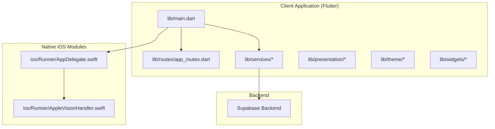
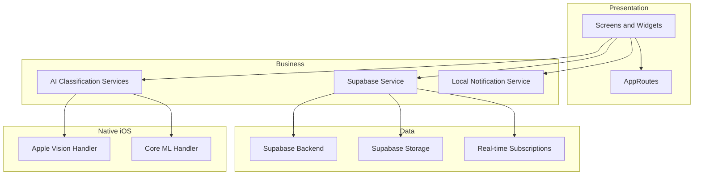
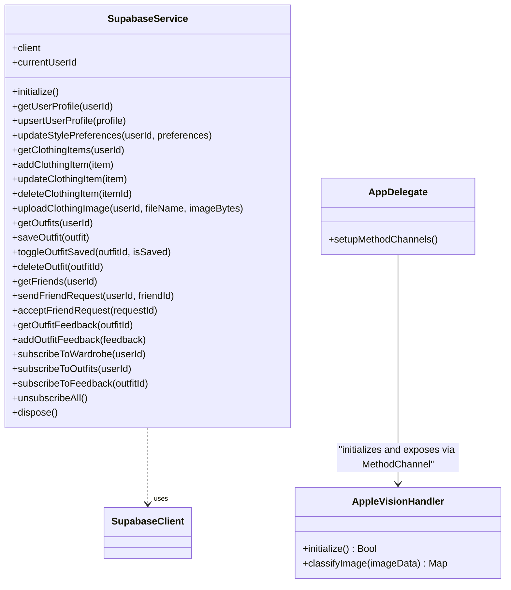
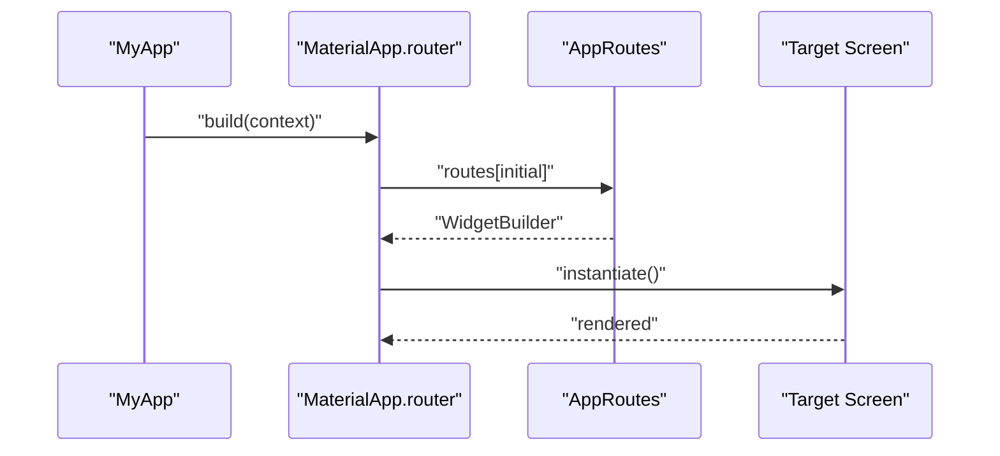
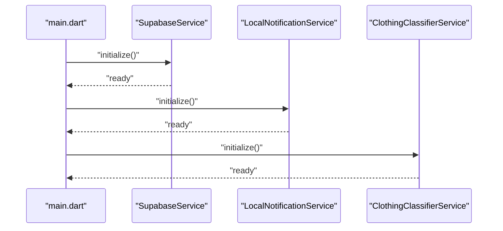
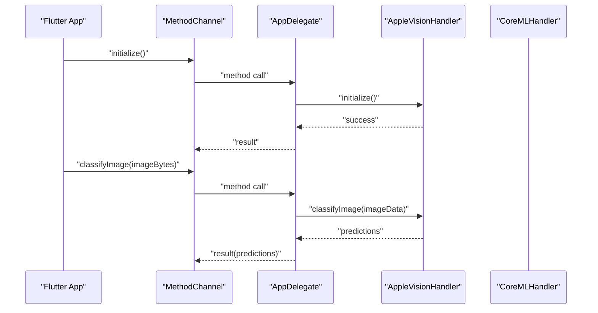
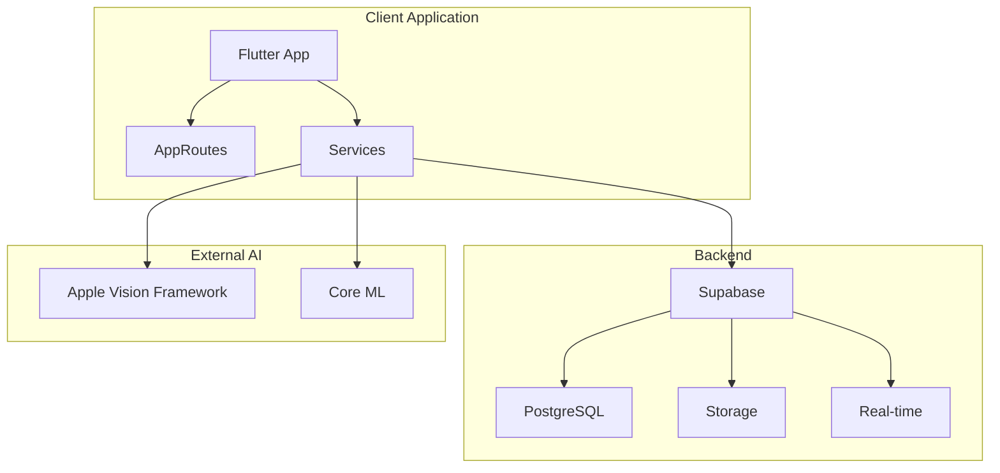
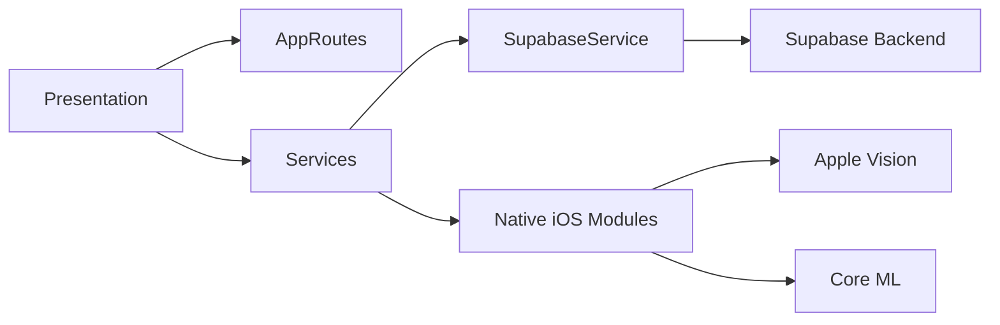

# Architecture Overview

<cite>
**Referenced Files in This Document**
- [main.dart](file://lib/main.dart)
- [app_routes.dart](file://lib/routes/app_routes.dart)
- [supabase_service.dart](file://lib/services/supabase_service.dart)
- [AppDelegate.swift](file://ios/Runner/AppDelegate.swift)
- [AppleVisionHandler.swift](file://ios/Runner/AppleVisionHandler.swift)
</cite>

## Table of Contents
1. [Introduction](#introduction)
2. [Project Structure](#project-structure)
3. [Core Components](#core-components)
4. [Architecture Overview](#architecture-overview)
5. [Detailed Component Analysis](#detailed-component-analysis)
6. [Dependency Analysis](#dependency-analysis)
7. [Performance Considerations](#performance-considerations)
8. [Troubleshooting Guide](#troubleshooting-guide)
9. [Conclusion](#conclusion)

## Introduction
This document presents the architectural design of PrismStyle AI, a Flutter-based mobile application integrating AI-powered fashion recommendations with a Supabase backend and native iOS modules for Apple Vision and Core ML. The system follows a clean architecture with layered presentation, business logic, and data concerns. It leverages route-based navigation and a singleton service pattern for centralized capabilities such as AI classification, database integration, and notifications. Cross-cutting concerns include robust error handling, logging, and performance optimization strategies.

## Project Structure
The repository is organized into platform-specific and shared directories:
- lib: Flutter application code including presentation layers, services, routing, themes, and widgets
- ios: Native iOS integration for Apple Vision and Core ML via Flutter method channels
- android: Android application configuration and Gradle build files
- assets/models: Model configuration for AI training and inference
- deepfashion2_training: Training pipeline for AI models
- Additional assets and scripts for setup and schema management

**Diagram sources**
- [main.dart](file://lib/main.dart#L1-L122)
- [app_routes.dart](file://lib/routes/app_routes.dart#L1-L43)
- [supabase_service.dart](file://lib/services/supabase_service.dart#L1-L673)
- [AppDelegate.swift](file://ios/Runner/AppDelegate.swift#L1-L102)
- [AppleVisionHandler.swift](file://ios/Runner/AppleVisionHandler.swift#L1-L121)

**Section sources**
- [main.dart](file://lib/main.dart#L1-L122)
- [app_routes.dart](file://lib/routes/app_routes.dart#L1-L43)

## Core Components
- Presentation Layer: Screens and widgets organized by feature areas (dashboard, wardrobe, generator, social validation, user profile, onboarding, AI test). Navigation is route-based and configured centrally.
- Business Logic: Services encapsulate domain operations and orchestrate interactions between UI and data layers.
- Data Layer: Supabase service manages authentication, database operations, storage uploads, and real-time subscriptions. Native iOS modules provide AI classification via Apple Vision and Core ML.

Key responsibilities:
- Route configuration and initial navigation
- Centralized service initialization (Supabase, notifications, AI classifier)
- Global error handling and device orientation constraints
- Permission requests for camera, location, and photos

**Section sources**
- [main.dart](file://lib/main.dart#L12-L65)
- [app_routes.dart](file://lib/routes/app_routes.dart#L14-L42)

## Architecture Overview
PrismStyle AI employs a layered clean architecture:
- Presentation: Route-driven screens and reusable widgets
- Business: Service classes for AI classification, database, notifications, and external integrations
- Data: Supabase for persistence and real-time, Apple Vision/Core ML for on-device AI inference

**Diagram sources**
- [main.dart](file://lib/main.dart#L94-L121)
- [app_routes.dart](file://lib/routes/app_routes.dart#L14-L42)
- [supabase_service.dart](file://lib/services/supabase_service.dart#L16-L448)
- [AppDelegate.swift](file://ios/Runner/AppDelegate.swift#L7-L27)
- [AppleVisionHandler.swift](file://ios/Runner/AppleVisionHandler.swift#L5-L17)

## Detailed Component Analysis

### Clean Architecture Layers
- Presentation: Route-based navigation and feature screens. The router defines named routes and their builders.
- Business: Singleton services manage AI classification, database operations, and notifications. They expose typed APIs to the presentation layer.
- Data: Supabase service encapsulates client initialization, CRUD operations, storage uploads, and real-time subscriptions.

**Diagram sources**
- [supabase_service.dart](file://lib/services/supabase_service.dart#L16-L448)
- [AppleVisionHandler.swift](file://ios/Runner/AppleVisionHandler.swift#L8-L68)
- [AppDelegate.swift](file://ios/Runner/AppDelegate.swift#L11-L27)

**Section sources**
- [supabase_service.dart](file://lib/services/supabase_service.dart#L16-L448)
- [AppleVisionHandler.swift](file://ios/Runner/AppleVisionHandler.swift#L8-L68)
- [AppDelegate.swift](file://ios/Runner/AppDelegate.swift#L11-L27)

### Route-Based Navigation
Navigation is centralized in AppRoutes, which defines named routes and their builders. The MaterialApp consumes this configuration for initial route and routing.

**Diagram sources**
- [main.dart](file://lib/main.dart#L94-L121)
- [app_routes.dart](file://lib/routes/app_routes.dart#L14-L42)

**Section sources**
- [main.dart](file://lib/main.dart#L94-L121)
- [app_routes.dart](file://lib/routes/app_routes.dart#L14-L42)

### Service-Oriented Architecture and Singleton Services
Singleton services provide cohesive capabilities:
- SupabaseService: Initializes Supabase, performs CRUD, handles storage, and manages real-time subscriptions
- LocalNotificationService: Provides local notification scheduling without Firebase
- ClothingClassifierService: Integrates with native iOS Apple Vision/Core ML via method channels

**Diagram sources**
- [main.dart](file://lib/main.dart#L12-L37)
- [supabase_service.dart](file://lib/services/supabase_service.dart#L41-L63)

**Section sources**
- [main.dart](file://lib/main.dart#L12-L37)
- [supabase_service.dart](file://lib/services/supabase_service.dart#L41-L63)

### Integration Patterns with Native iOS Modules
The Flutter app communicates with native iOS modules via Flutter method channels:
- Apple Vision channel: "com.prismstyle_ai/apple_vision"
- Core ML channel: "com.prismstyle_ai/coreml"

The AppDelegate sets up channels and delegates method calls to AppleVisionHandler and CoreMLHandler. The handlers perform image classification and return predictions to Flutter.

**Diagram sources**
- [AppDelegate.swift](file://ios/Runner/AppDelegate.swift#L29-L99)
- [AppleVisionHandler.swift](file://ios/Runner/AppleVisionHandler.swift#L12-L68)

**Section sources**
- [AppDelegate.swift](file://ios/Runner/AppDelegate.swift#L29-L99)
- [AppleVisionHandler.swift](file://ios/Runner/AppleVisionHandler.swift#L12-L68)

### System Boundary Diagram
The system boundary separates the client application, Supabase backend, and external AI providers:
- Client Application: Flutter app with route-based navigation and service layer
- Supabase Backend: Authentication, database, storage, and real-time subscriptions
- External AI Providers: Apple Vision and Core ML on iOS devices

**Diagram sources**
- [main.dart](file://lib/main.dart#L94-L121)
- [supabase_service.dart](file://lib/services/supabase_service.dart#L16-L448)
- [AppDelegate.swift](file://ios/Runner/AppDelegate.swift#L7-L27)

## Dependency Analysis
- Presentation depends on routing and services
- Services depend on Supabase client and native iOS modules
- Supabase service encapsulates database and storage operations
- Native iOS modules expose capabilities via method channels

**Diagram sources**
- [main.dart](file://lib/main.dart#L94-L121)
- [app_routes.dart](file://lib/routes/app_routes.dart#L14-L42)
- [supabase_service.dart](file://lib/services/supabase_service.dart#L16-L448)
- [AppDelegate.swift](file://ios/Runner/AppDelegate.swift#L7-L27)

**Section sources**
- [main.dart](file://lib/main.dart#L94-L121)
- [app_routes.dart](file://lib/routes/app_routes.dart#L14-L42)
- [supabase_service.dart](file://lib/services/supabase_service.dart#L16-L448)
- [AppDelegate.swift](file://ios/Runner/AppDelegate.swift#L7-L27)

## Performance Considerations
- Initialization order: Ensure Supabase, notifications, and AI classifiers are initialized before rendering UI to avoid runtime errors
- Real-time subscriptions: Cancel subscriptions and close stream controllers to prevent memory leaks
- Image processing: Offload heavy AI tasks to native iOS modules to reduce Flutter overhead
- Permissions: Request camera, location, and photos permissions early to avoid UI blocking during capture or weather-dependent features
- Orientation lock: Lock portrait orientation to simplify UI rendering and reduce layout thrashing

## Troubleshooting Guide
- Global error handling: A custom ErrorWidget builder displays a unified error UI and prevents cascading errors across screens
- Logging: Extensive debug prints are used during initialization and operations for diagnostics
- Permissions: Verify camera, location, and photos permissions are granted; otherwise, related features will be disabled
- Supabase credentials: Ensure env.json contains SUPABASE_URL and SUPABASE_ANON_KEY; otherwise, initialization will fail
- Method channels: Confirm method channels are registered and available on iOS 13+ devices

**Section sources**
- [main.dart](file://lib/main.dart#L44-L57)
- [main.dart](file://lib/main.dart#L68-L92)
- [supabase_service.dart](file://lib/services/supabase_service.dart#L42-L63)
- [AppDelegate.swift](file://ios/Runner/AppDelegate.swift#L18-L27)

## Conclusion
PrismStyle AI’s architecture cleanly separates presentation, business logic, and data concerns while leveraging route-based navigation and singleton services. The integration with Supabase provides robust backend capabilities, and the native iOS modules enable efficient on-device AI classification. Centralized error handling, logging, and performance-conscious initialization ensure a reliable user experience.