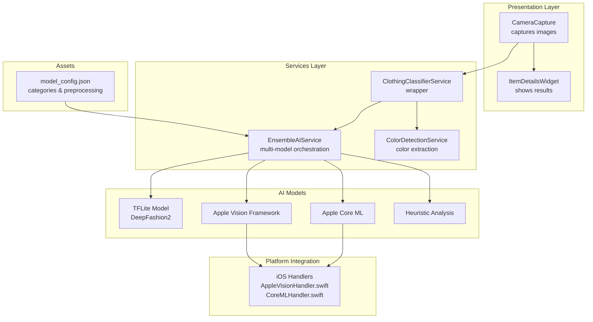
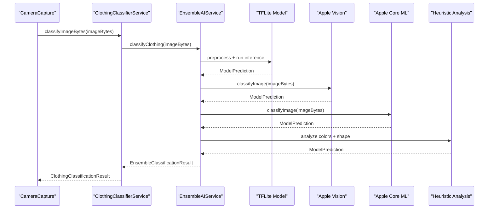
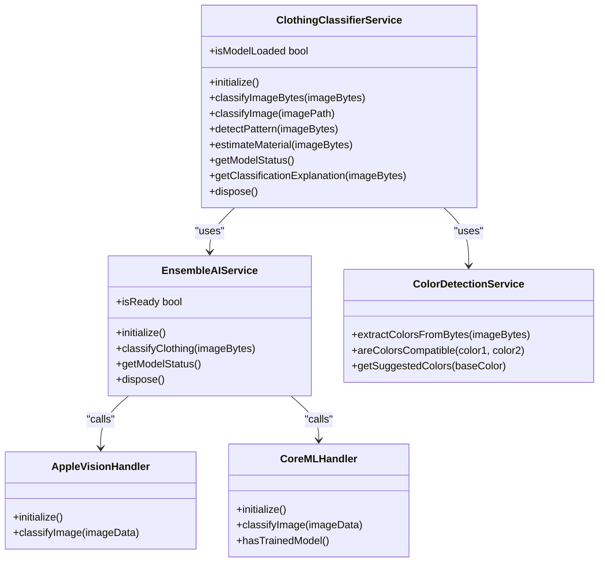

# Clothing Classifier Service

<cite>
**Referenced Files in This Document**
- [clothing_classifier_service.dart](file://lib/services/clothing_classifier_service.dart)
- [ensemble_ai_service.dart](file://lib/services/ensemble_ai_service.dart)
- [camera_capture.dart](file://lib/presentation/camera_capture/camera_capture.dart)
- [model_config.json](file://assets/models/model_config.json)
- [AppleVisionHandler.swift](file://ios/Runner/AppleVisionHandler.swift)
- [CoreMLHandler.swift](file://ios/Runner/CoreMLHandler.swift)
- [color_detection_service.dart](file://lib/services/color_detection_service.dart)
- [item_details_widget.dart](file://lib/presentation/camera_capture/widgets/item_details_widget.dart)
- [main.dart](file://lib/main.dart)
</cite>

## Table of Contents
1. [Introduction](#introduction)
2. [Project Structure](#project-structure)
3. [Core Components](#core-components)
4. [Architecture Overview](#architecture-overview)
5. [Detailed Component Analysis](#detailed-component-analysis)
6. [Dependency Analysis](#dependency-analysis)
7. [Performance Considerations](#performance-considerations)
8. [Troubleshooting Guide](#troubleshooting-guide)
9. [Conclusion](#conclusion)

## Introduction
The Clothing Classifier Service provides high-level AI-powered clothing classification as a wrapper around the Ensemble AI Service. It orchestrates multiple classification models (TFLite, Apple Vision, Apple Core ML, and heuristic analysis) to deliver robust, accurate, and cost-free clothing categorization. The service integrates tightly with the camera capture workflow, transforming raw image bytes into structured classification results enriched with color analysis, style tags, and confidence metrics. It also exposes APIs for pattern detection, material estimation, and model status monitoring, while ensuring graceful fallbacks and error handling.

## Project Structure
The service sits at the intersection of presentation and AI layers:
- Presentation layer captures images via camera/gallery and triggers AI processing.
- AI layer encapsulates the Ensemble AI Service, which coordinates multiple models.
- iOS platform bridges integrate Apple Vision and Core ML for free, high-quality classification.
- Asset configuration defines model metadata and category mappings.

**Diagram sources**
- [camera_capture.dart](file://lib/presentation/camera_capture/camera_capture.dart#L165-L242)
- [clothing_classifier_service.dart](file://lib/services/clothing_classifier_service.dart#L42-L85)
- [ensemble_ai_service.dart](file://lib/services/ensemble_ai_service.dart#L137-L178)
- [AppleVisionHandler.swift](file://ios/Runner/AppleVisionHandler.swift#L12-L68)
- [CoreMLHandler.swift](file://ios/Runner/CoreMLHandler.swift#L51-L110)
- [model_config.json](file://assets/models/model_config.json#L1-L47)

**Section sources**
- [camera_capture.dart](file://lib/presentation/camera_capture/camera_capture.dart#L1-L550)
- [clothing_classifier_service.dart](file://lib/services/clothing_classifier_service.dart#L1-L186)
- [ensemble_ai_service.dart](file://lib/services/ensemble_ai_service.dart#L1-L594)
- [AppleVisionHandler.swift](file://ios/Runner/AppleVisionHandler.swift#L1-L121)
- [CoreMLHandler.swift](file://ios/Runner/CoreMLHandler.swift#L1-L321)
- [model_config.json](file://assets/models/model_config.json#L1-L47)

## Core Components
- ClothingClassifierService: Thin wrapper around EnsembleAIService that normalizes results to app-compatible categories, enriches with color metadata, and provides convenience methods for file and byte-based classification.
- EnsembleAIService: Multi-model orchestrator that loads and runs TFLite, Apple Vision, Apple Core ML, and heuristic models, then combines results using weighted voting.
- CameraCapture: Presentation component that captures images, triggers AI classification and color detection, and renders results.
- ColorDetectionService: Extracts dominant colors via K-means clustering and provides compatibility analysis and suggestions.
- iOS Handlers: Native Swift integrations for Apple Vision and Core ML, mapping results to clothing categories.
- model_config.json: Defines categories, preprocessing, and model metadata for the DeepFashion2 classifier.

Key capabilities:
- Classification: Primary category, confidence, and top predictions.
- Color enrichment: Dominant color, brightness, and metadata from heuristic analysis.
- Style tagging: Category-specific tags for UI and recommendation systems.
- Model status: Availability of TFLite, Apple Vision, Core ML, and heuristic components.
- Fallbacks: Graceful degradation when models are unavailable.

**Section sources**
- [clothing_classifier_service.dart](file://lib/services/clothing_classifier_service.dart#L9-L132)
- [ensemble_ai_service.dart](file://lib/services/ensemble_ai_service.dart#L17-L531)
- [camera_capture.dart](file://lib/presentation/camera_capture/camera_capture.dart#L204-L242)
- [color_detection_service.dart](file://lib/services/color_detection_service.dart#L11-L128)
- [AppleVisionHandler.swift](file://ios/Runner/AppleVisionHandler.swift#L12-L119)
- [CoreMLHandler.swift](file://ios/Runner/CoreMLHandler.swift#L51-L246)
- [model_config.json](file://assets/models/model_config.json#L1-L47)

## Architecture Overview
The service follows a layered architecture:
- Presentation layer handles user interactions and UI rendering.
- Service layer encapsulates AI logic and data transformation.
- Platform layer integrates Apple frameworks for free, high-quality classification.
- Asset layer provides model configuration and category mappings.

**Diagram sources**
- [camera_capture.dart](file://lib/presentation/camera_capture/camera_capture.dart#L204-L242)
- [clothing_classifier_service.dart](file://lib/services/clothing_classifier_service.dart#L42-L69)
- [ensemble_ai_service.dart](file://lib/services/ensemble_ai_service.dart#L137-L178)
- [AppleVisionHandler.swift](file://ios/Runner/AppleVisionHandler.swift#L22-L68)
- [CoreMLHandler.swift](file://ios/Runner/CoreMLHandler.swift#L91-L110)

## Detailed Component Analysis

### ClothingClassifierService
Responsibilities:
- Initialize and expose model readiness.
- Classify images from bytes or file paths.
- Map detailed categories to app categories.
- Enrich results with color metadata and style tags.
- Provide model status and explanation generation.
- Dispose underlying resources.

Public API:
- initialize(): Initializes the Ensemble AI Service.
- isModelLoaded: Boolean indicating readiness.
- classifyImageBytes(imageBytes): Returns ClothingClassificationResult.
- classifyImage(imagePath): Reads file and classifies.
- detectPattern(imageBytes): Placeholder for future implementation.
- estimateMaterial(imageBytes): Placeholder for future implementation.
- getModelStatus(): Returns availability of models.
- getClassificationExplanation(imageBytes): Returns human-readable explanation.
- dispose(): Releases resources.

Result processing:
- Maps ensemble primary category to app category using categoryMapping.
- Generates suggestedTags based on app category.
- Extracts colorAnalysis metadata from heuristic model.
- Builds allPredictions map from top predictions.

Validation and fallback:
- Catches exceptions during classification and returns unknown result.
- Ensures safe file existence checks before reading.

**Section sources**
- [clothing_classifier_service.dart](file://lib/services/clothing_classifier_service.dart#L9-L132)
- [clothing_classifier_service.dart](file://lib/services/clothing_classifier_service.dart#L134-L185)

### EnsembleAIService
Responsibilities:
- Load model configuration from assets.
- Initialize TFLite model (DeepFashion2 or fallback).
- Initialize Apple Vision and Core ML channels on iOS.
- Run classification across all available models.
- Combine results using weighted voting.
- Provide model status and explanation.

Model orchestration:
- TFLite: DeepFashion2 categories mapped to app categories; outputs detailed and aggregated scores.
- Apple Vision: Uses Vision framework to classify; maps keywords to clothing categories.
- Apple Core ML: Loads custom trained model or falls back to heuristic analysis.
- Heuristic: Analyzes color and shape to determine category and confidence.

Weighted voting:
- Weights: TFLite (0.35), Apple Vision (0.30), Apple Core ML (0.20), Heuristic (0.15).
- Normalizes scores and selects top predictions.

Preprocessing:
- Resizes images to 224x224 for TFLite.
- Resizes to 100x100 for heuristic analysis.

**Section sources**
- [ensemble_ai_service.dart](file://lib/services/ensemble_ai_service.dart#L17-L531)
- [AppleVisionHandler.swift](file://ios/Runner/AppleVisionHandler.swift#L12-L119)
- [CoreMLHandler.swift](file://ios/Runner/CoreMLHandler.swift#L51-L246)
- [model_config.json](file://assets/models/model_config.json#L1-L47)

### CameraCapture Integration
Workflow:
- Captures photo via camera controller or picks from gallery.
- Reads image bytes and invokes ClothingClassifierService and ColorDetectionService.
- Builds detectedAttributes map combining classification and color results.
- Renders ItemDetailsWidget with AI-detected attributes and allows manual overrides.

Error handling:
- Shows guidance messages and resets state on failures.
- Provides fallback attributes when AI processing errors occur.

UI integration:
- Displays AI guidance messages and processing overlay.
- Offers lighting tips and camera controls.

**Section sources**
- [camera_capture.dart](file://lib/presentation/camera_capture/camera_capture.dart#L165-L242)
- [item_details_widget.dart](file://lib/presentation/camera_capture/widgets/item_details_widget.dart#L10-L322)

### ColorDetectionService
Capabilities:
- Extracts dominant colors via K-means clustering on resized images.
- Maps RGB centroids to named colors and computes percentages.
- Provides compatibility analysis and suggested combinations.
- Returns JSON-serializable results.

Integration:
- Used alongside classification to enrich detectedAttributes with primary/secondary colors and hex codes.

**Section sources**
- [color_detection_service.dart](file://lib/services/color_detection_service.dart#L11-L128)
- [color_detection_service.dart](file://lib/services/color_detection_service.dart#L131-L197)

### iOS Apple Vision and Core ML Integration
AppleVisionHandler:
- Initializes Apple Vision and performs image classification.
- Maps Vision identifiers to clothing categories with confidence scores.

CoreMLHandler:
- Attempts to load custom trained model; falls back to heuristic analysis.
- Performs Core ML inference and aggregates predictions.
- Heuristic mode analyzes aspect ratio and dominant color to infer categories.

**Section sources**
- [AppleVisionHandler.swift](file://ios/Runner/AppleVisionHandler.swift#L12-L119)
- [CoreMLHandler.swift](file://ios/Runner/CoreMLHandler.swift#L51-L246)

### Data Transformation Pipelines
- Input: Uint8List image bytes.
- Preprocessing: Decode, resize, normalize (TFLite), grid sampling (heuristic).
- Model execution: Parallel inference across available models.
- Aggregation: Weighted voting with normalization and top-k selection.
- Output: ClothingClassificationResult with app category, confidence, tags, color metadata, and all predictions.

Confidence thresholds:
- isConfident getter uses 0.7 threshold for UI decisions.

**Section sources**
- [ensemble_ai_service.dart](file://lib/services/ensemble_ai_service.dart#L215-L262)
- [ensemble_ai_service.dart](file://lib/services/ensemble_ai_service.dart#L351-L408)
- [clothing_classifier_service.dart](file://lib/services/clothing_classifier_service.dart#L171-L172)

### Classification Categories and Mappings
- Detailed categories: short_sleeve_top, long_sleeve_top, short_sleeve_outwear, long_sleeve_outwear, vest, sling, shorts, trousers, skirt, short_sleeve_dress, long_sleeve_dress, vest_dress, sling_dress.
- App categories: Tops, Bottoms, Dresses, Outerwear, Shoes, Accessories.
- Mapping: Consolidates detailed categories into app-friendly categories.

**Section sources**
- [model_config.json](file://assets/models/model_config.json#L6-L20)
- [model_config.json](file://assets/models/model_config.json#L21-L35)
- [ensemble_ai_service.dart](file://lib/services/ensemble_ai_service.dart#L181-L212)
- [clothing_classifier_service.dart](file://lib/services/clothing_classifier_service.dart#L19-L30)

### Public API Methods and Response Formatting
Methods:
- initialize(): Initialize Ensemble AI.
- isModelLoaded: Readiness indicator.
- classifyImageBytes(imageBytes): Returns ClothingClassificationResult.
- classifyImage(imagePath): Reads file and classifies.
- detectPattern(imageBytes): Placeholder.
- estimateMaterial(imageBytes): Placeholder.
- getModelStatus(): Model availability map.
- getClassificationExplanation(imageBytes): Human-readable explanation.
- dispose(): Release resources.

Response formatting:
- ClothingClassificationResult.toJson(): Standardized JSON with category, appCategory, confidence, suggestedTags, primaryColor, pattern, material.
- EnsembleClassificationResult.toJson(): Includes primaryCategory, confidence, predictions, contributingModels.

**Section sources**
- [clothing_classifier_service.dart](file://lib/services/clothing_classifier_service.dart#L32-L132)
- [clothing_classifier_service.dart](file://lib/services/clothing_classifier_service.dart#L174-L184)
- [ensemble_ai_service.dart](file://lib/services/ensemble_ai_service.dart#L582-L592)

## Dependency Analysis
- ClothingClassifierService depends on EnsembleAIService and ColorDetectionService.
- EnsembleAIService depends on:
  - TFLite interpreter for DeepFashion2 classification.
  - Apple Vision and Core ML channels for iOS.
  - Heuristic analysis for baseline.
- Presentation layer depends on ClothingClassifierService and ColorDetectionService.
- iOS handlers depend on Apple Vision and Core ML frameworks.

**Diagram sources**
- [clothing_classifier_service.dart](file://lib/services/clothing_classifier_service.dart#L9-L132)
- [ensemble_ai_service.dart](file://lib/services/ensemble_ai_service.dart#L17-L531)
- [AppleVisionHandler.swift](file://ios/Runner/AppleVisionHandler.swift#L12-L68)
- [CoreMLHandler.swift](file://ios/Runner/CoreMLHandler.swift#L51-L110)

**Section sources**
- [clothing_classifier_service.dart](file://lib/services/clothing_classifier_service.dart#L1-L186)
- [ensemble_ai_service.dart](file://lib/services/ensemble_ai_service.dart#L1-L594)
- [AppleVisionHandler.swift](file://ios/Runner/AppleVisionHandler.swift#L1-L121)
- [CoreMLHandler.swift](file://ios/Runner/CoreMLHandler.swift#L1-L321)

## Performance Considerations
- Model loading:
  - Lazy initialization ensures models are loaded only when needed.
  - TFLite model loading attempts DeepFashion2 first, then fallback model.
- Parallel execution:
  - Ensemble classification runs available models concurrently, reducing latency.
- Preprocessing:
  - TFLite uses 224x224; heuristic uses 100x100 to balance accuracy and speed.
- Weighted voting:
  - Prioritizes reliable models (TFLite, Apple Vision) while incorporating others.
- Memory management:
  - Interpreter is closed on dispose; avoid retaining large image buffers unnecessarily.
- Caching:
  - Not implemented in the classifier service; consider caching model status and recent results at higher layers if needed.

Recommendations:
- Warm-up models during app startup (already handled in main).
- Limit concurrent heavy operations in presentation layer.
- Use appropriate image sizes for device constraints.

**Section sources**
- [ensemble_ai_service.dart](file://lib/services/ensemble_ai_service.dart#L38-L54)
- [ensemble_ai_service.dart](file://lib/services/ensemble_ai_service.dart#L80-L112)
- [ensemble_ai_service.dart](file://lib/services/ensemble_ai_service.dart#L215-L262)
- [main.dart](file://lib/main.dart#L31-L37)

## Troubleshooting Guide
Common issues and resolutions:
- Model initialization failures:
  - TFLite model not found: Falls back to heuristic-only mode; check asset paths and packaging.
  - Apple frameworks initialization errors: Verify iOS handler initialization and permissions.
- Classification errors:
  - Invalid image bytes or decoding failures: Ensure proper image format and size.
  - Empty or low-confidence results: Adjust lighting and composition; leverage heuristic fallback.
- Presentation layer errors:
  - Camera permission denied: Prompt user to enable permissions.
  - Gallery pick failures: Handle gracefully and reset guidance state.

Validation and fallback mechanisms:
- Unknown result returned on classification failure.
- Fallback attributes provided when AI processing errors occur.
- Model status reporting helps diagnose missing components.

**Section sources**
- [ensemble_ai_service.dart](file://lib/services/ensemble_ai_service.dart#L80-L112)
- [ensemble_ai_service.dart](file://lib/services/ensemble_ai_service.dart#L137-L178)
- [camera_capture.dart](file://lib/presentation/camera_capture/camera_capture.dart#L204-L242)
- [camera_capture.dart](file://lib/presentation/camera_capture/camera_capture.dart#L412-L473)

## Conclusion
The Clothing Classifier Service delivers a robust, multi-model classification pipeline that leverages TFLite, Apple Vision, Apple Core ML, and heuristic analysis to provide accurate, cost-free clothing categorization. Its integration with camera capture and color detection enables rich, user-facing insights with clear confidence metrics and style tags. The service’s design emphasizes resilience through fallbacks, transparent model status reporting, and structured result formatting, making it suitable for production-grade wardrobe management and outfit generation workflows.