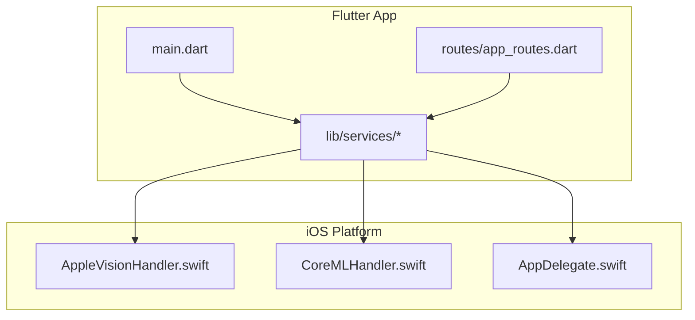
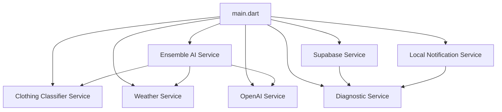
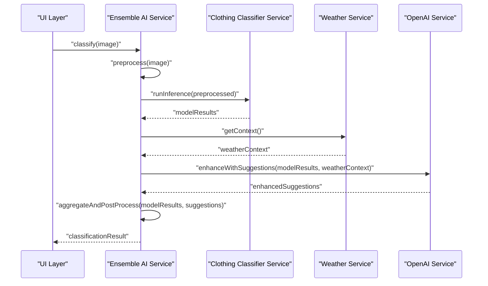
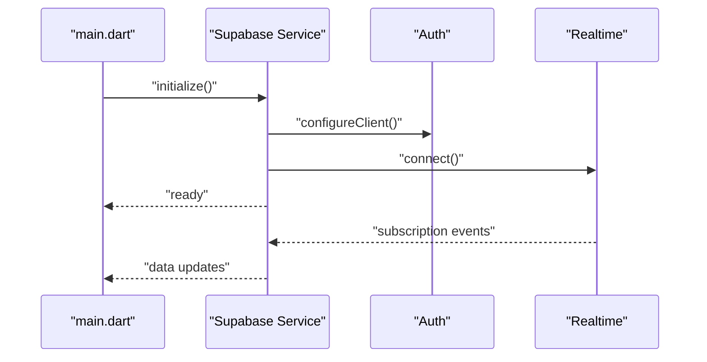
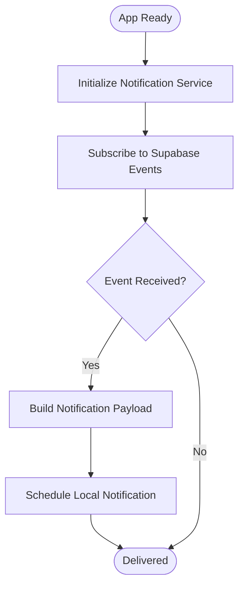
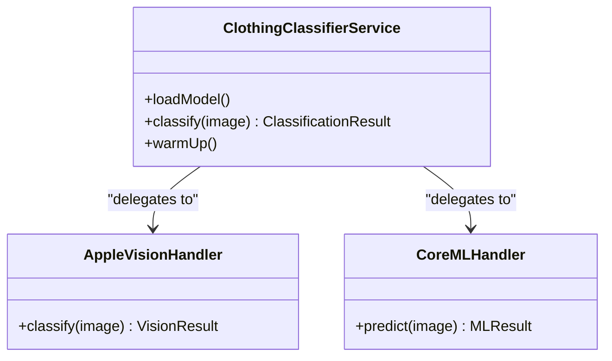
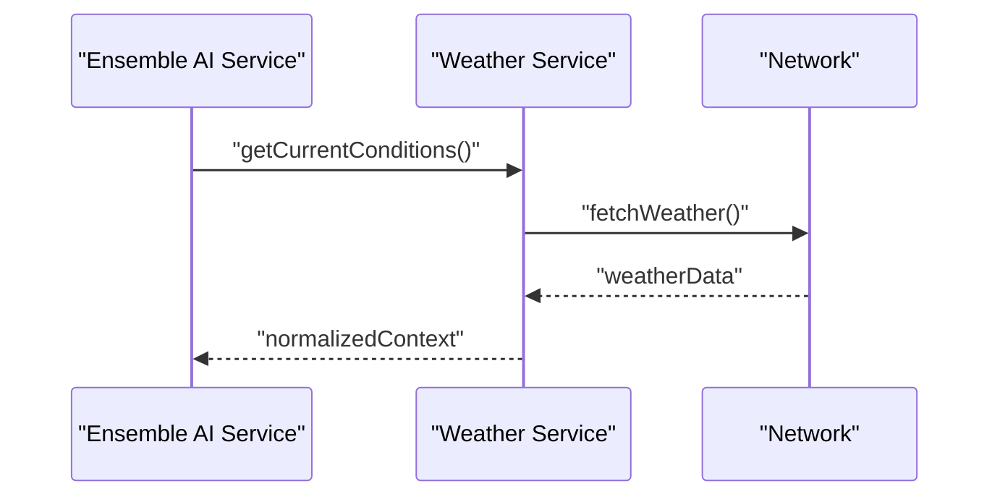
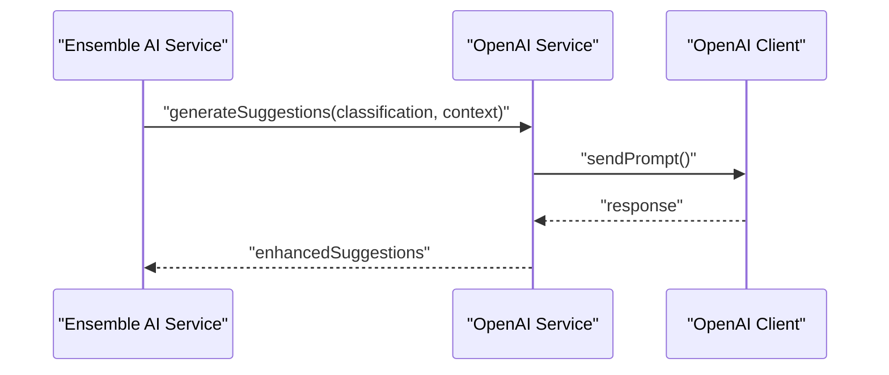
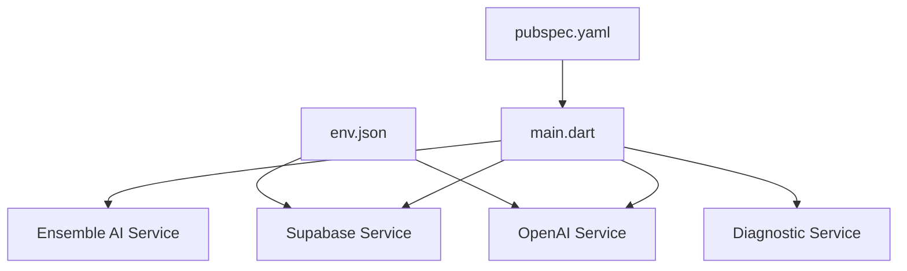

# Core Services

<cite>
**Referenced Files in This Document**
- [main.dart](file://lib/main.dart)
- [app_routes.dart](file://lib/routes/app_routes.dart)
- [ensemble_ai_service.dart](file://lib/services/ensemble_ai_service.dart)
- [supabase_service.dart](file://lib/services/supabase_service.dart)
- [local_notification_service.dart](file://lib/services/local_notification_service.dart)
- [clothing_classifier_service.dart](file://lib/services/clothing_classifier_service.dart)
- [weather_service.dart](file://lib/services/weather_service.dart)
- [openai_service.dart](file://lib/services/openai_service.dart)
- [openai_client.dart](file://lib/services/openai_client.dart)
- [diagnostic_service.dart](file://lib/services/diagnostic_service.dart)
- [AppleVisionHandler.swift](file://ios/Runner/AppleVisionHandler.swift)
- [CoreMLHandler.swift](file://ios/Runner/CoreMLHandler.swift)
- [AppDelegate.swift](file://ios/Runner/AppDelegate.swift)
- [env.json](file://env.json)
- [pubspec.yaml](file://pubspec.yaml)
</cite>

## Table of Contents
1. [Introduction](#introduction)
2. [Project Structure](#project-structure)
3. [Core Components](#core-components)
4. [Architecture Overview](#architecture-overview)
5. [Detailed Component Analysis](#detailed-component-analysis)
6. [Dependency Analysis](#dependency-analysis)
7. [Performance Considerations](#performance-considerations)
8. [Troubleshooting Guide](#troubleshooting-guide)
9. [Conclusion](#conclusion)

## Introduction
This document describes PrismStyle AI’s core service layer that powers AI-driven fashion recommendations. It focuses on:
- Ensemble AI Service: Central coordinator for multi-model AI classification using TensorFlow Lite, Apple Vision, and Core ML.
- Supabase Service: Real-time database, authentication, and data synchronization.
- Local Notification Service: Push notifications and real-time updates.
- Clothing Classifier Service: High-level wrapper around AI model implementations.
- Weather Service: Contextual recommendations.
- OpenAI Service: Enhanced suggestions.
- Diagnostic Service: System health monitoring and error reporting.

It also covers initialization sequences, dependency injection patterns, inter-service communication, error handling, retry strategies, and performance optimizations.

## Project Structure
The core services reside under lib/services and integrate with platform-specific handlers on iOS and Flutter entry points.

**Diagram sources**
- [main.dart](file://lib/main.dart)
- [app_routes.dart](file://lib/routes/app_routes.dart)
- [AppleVisionHandler.swift](file://ios/Runner/AppleVisionHandler.swift)
- [CoreMLHandler.swift](file://ios/Runner/CoreMLHandler.swift)
- [AppDelegate.swift](file://ios/Runner/AppDelegate.swift)

**Section sources**
- [main.dart](file://lib/main.dart)
- [app_routes.dart](file://lib/routes/app_routes.dart)

## Core Components
- Ensemble AI Service: Orchestrates inference across multiple AI backends, aggregates results, and returns unified classifications.
- Supabase Service: Provides client initialization, authentication, real-time subscriptions, and CRUD operations.
- Local Notification Service: Manages scheduling and delivery of local notifications for updates.
- Clothing Classifier Service: Wraps AI model invocations and exposes a simplified interface for classification tasks.
- Weather Service: Fetches current conditions and forecasts to inform recommendations.
- OpenAI Service: Integrates with OpenAI client to generate enhanced suggestions.
- Diagnostic Service: Captures logs, errors, and system metrics for monitoring and reporting.

**Section sources**
- [ensemble_ai_service.dart](file://lib/services/ensemble_ai_service.dart)
- [supabase_service.dart](file://lib/services/supabase_service.dart)
- [local_notification_service.dart](file://lib/services/local_notification_service.dart)
- [clothing_classifier_service.dart](file://lib/services/clothing_classifier_service.dart)
- [weather_service.dart](file://lib/services/weather_service.dart)
- [openai_service.dart](file://lib/services/openai_service.dart)
- [openai_client.dart](file://lib/services/openai_client.dart)
- [diagnostic_service.dart](file://lib/services/diagnostic_service.dart)

## Architecture Overview
The services collaborate around a central initialization and dependency injection pattern. The Ensemble AI Service coordinates AI backends, while Supabase and Weather services provide contextual data. Notifications keep users informed, and diagnostics monitor reliability.

**Diagram sources**
- [main.dart](file://lib/main.dart)
- [ensemble_ai_service.dart](file://lib/services/ensemble_ai_service.dart)
- [supabase_service.dart](file://lib/services/supabase_service.dart)
- [local_notification_service.dart](file://lib/services/local_notification_service.dart)
- [clothing_classifier_service.dart](file://lib/services/clothing_classifier_service.dart)
- [weather_service.dart](file://lib/services/weather_service.dart)
- [openai_service.dart](file://lib/services/openai_service.dart)
- [diagnostic_service.dart](file://lib/services/diagnostic_service.dart)

## Detailed Component Analysis

### Ensemble AI Service
Responsibilities:
- Select and coordinate AI backends (TFLite, Apple Vision, Core ML).
- Preprocess inputs consistently across backends.
- Run inference and aggregate results.
- Apply confidence thresholds and post-processing rules.
- Report diagnostics and handle failures gracefully.

Initialization and DI:
- Constructed during app startup and injected into screens that require AI classification.
- Backends are initialized via platform handlers and exposed through a unified interface.

Inter-service communication:
- Calls Clothing Classifier Service for model-specific operations.
- Uses Weather Service for contextual inputs.
- Integrates OpenAI Service for enhanced suggestions.

Error handling and retries:
- Attempts fallback to alternate backends on failure.
- Retries transient inference errors up to configured limits.
- Logs diagnostics with stack traces and metadata.

Performance:
- Caches preprocessing results where safe.
- Limits concurrent inference requests.
- Offloads heavy work to background isolates.

**Diagram sources**
- [ensemble_ai_service.dart](file://lib/services/ensemble_ai_service.dart)
- [clothing_classifier_service.dart](file://lib/services/clothing_classifier_service.dart)
- [weather_service.dart](file://lib/services/weather_service.dart)
- [openai_service.dart](file://lib/services/openai_service.dart)

**Section sources**
- [ensemble_ai_service.dart](file://lib/services/ensemble_ai_service.dart)

### Supabase Service
Responsibilities:
- Initialize Supabase client with project URL and anon key.
- Provide authentication helpers (sign-in, sign-out, session management).
- Manage real-time subscriptions for synchronized data.
- Expose CRUD operations for user profiles, wardrobe items, posts, and preferences.

Initialization and DI:
- Initialized early in app lifecycle and injected into screens and services requiring backend access.

Real-time and synchronization:
- Subscribes to tables for live updates.
- Handles reconnection and conflict resolution.

Error handling:
- Wraps network calls with retry logic for transient failures.
- Emits structured errors for UI consumption.

**Diagram sources**
- [supabase_service.dart](file://lib/services/supabase_service.dart)
- [main.dart](file://lib/main.dart)

**Section sources**
- [supabase_service.dart](file://lib/services/supabase_service.dart)

### Local Notification Service
Responsibilities:
- Schedule and deliver local notifications for reminders and updates.
- Manage notification channels and permissions.
- Coordinate with Supabase Service for event-driven triggers.

Initialization and DI:
- Bootstrapped at startup and injected into screens and services.

Error handling:
- Validates notification payload and handles permission denials.

**Diagram sources**
- [local_notification_service.dart](file://lib/services/local_notification_service.dart)
- [supabase_service.dart](file://lib/services/supabase_service.dart)

**Section sources**
- [local_notification_service.dart](file://lib/services/local_notification_service.dart)

### Clothing Classifier Service
Responsibilities:
- Provide a high-level interface for clothing classification.
- Wrap platform-specific handlers for Apple Vision and Core ML.
- Manage model loading, warm-up, and inference lifecycle.

Initialization and DI:
- Constructed by higher-level services and injected where classification is needed.

Platform integration:
- Delegates to AppleVisionHandler and CoreMLHandler for inference.

Error handling:
- Returns structured errors and fallback predictions when models fail.

**Diagram sources**
- [clothing_classifier_service.dart](file://lib/services/clothing_classifier_service.dart)
- [AppleVisionHandler.swift](file://ios/Runner/AppleVisionHandler.swift)
- [CoreMLHandler.swift](file://ios/Runner/CoreMLHandler.swift)

**Section sources**
- [clothing_classifier_service.dart](file://lib/services/clothing_classifier_service.dart)
- [AppleVisionHandler.swift](file://ios/Runner/AppleVisionHandler.swift)
- [CoreMLHandler.swift](file://ios/Runner/CoreMLHandler.swift)

### Weather Service
Responsibilities:
- Fetch current weather and forecast data.
- Normalize and cache data for recommendation scoring.
- Provide contextual inputs to Ensemble AI Service.

Initialization and DI:
- Initialized at startup and injected into recommendation flows.

Error handling:
- Uses retry with exponential backoff for network failures.
- Falls back to cached data when offline.

**Diagram sources**
- [weather_service.dart](file://lib/services/weather_service.dart)
- [ensemble_ai_service.dart](file://lib/services/ensemble_ai_service.dart)

**Section sources**
- [weather_service.dart](file://lib/services/weather_service.dart)

### OpenAI Service
Responsibilities:
- Integrate with OpenAI client to generate textual suggestions.
- Enhance AI classification outputs with natural language summaries.
- Manage prompts, tokens, and rate limits.

Initialization and DI:
- Configured with API keys from environment and injected into recommendation pipeline.

Error handling:
- Wraps API calls with retry and circuit-breaker logic.
- Returns graceful fallbacks when unavailable.

**Diagram sources**
- [openai_service.dart](file://lib/services/openai_service.dart)
- [openai_client.dart](file://lib/services/openai_client.dart)
- [ensemble_ai_service.dart](file://lib/services/ensemble_ai_service.dart)

**Section sources**
- [openai_service.dart](file://lib/services/openai_service.dart)
- [openai_client.dart](file://lib/services/openai_client.dart)

### Diagnostic Service
Responsibilities:
- Capture logs, errors, and performance metrics.
- Aggregate telemetry for monitoring and alerting.
- Provide structured reports for debugging.

Initialization and DI:
- Bootstrapped at startup and globally accessible.

Error handling:
- Ensures non-blocking operation; wraps logging calls with guards.

**Section sources**
- [diagnostic_service.dart](file://lib/services/diagnostic_service.dart)

## Dependency Analysis
External dependencies and environment configuration:
- Environment variables for Supabase and OpenAI are loaded from env.json and consumed by services.
- pubspec.yaml defines Flutter and Dart dependencies; platform-specific integrations are handled via iOS handlers.

**Diagram sources**
- [env.json](file://env.json)
- [pubspec.yaml](file://pubspec.yaml)
- [main.dart](file://lib/main.dart)
- [ensemble_ai_service.dart](file://lib/services/ensemble_ai_service.dart)
- [supabase_service.dart](file://lib/services/supabase_service.dart)
- [openai_service.dart](file://lib/services/openai_service.dart)
- [diagnostic_service.dart](file://lib/services/diagnostic_service.dart)

**Section sources**
- [env.json](file://env.json)
- [pubspec.yaml](file://pubspec.yaml)

## Performance Considerations
- Concurrency control: Limit simultaneous AI inferences; queue requests to prevent resource contention.
- Caching: Cache preprocessed inputs and weather data to reduce redundant computations.
- Background processing: Offload heavy tasks to background isolates or platform threads.
- Retry policies: Implement exponential backoff for transient failures; avoid thundering herds.
- Memory hygiene: Dispose temporary tensors/models after use; monitor memory growth.
- Network efficiency: Batch Supabase queries; debounce frequent updates.

## Troubleshooting Guide
Common issues and resolutions:
- Authentication failures: Verify Supabase project URL and anon key; check network connectivity; retry on transient errors.
- AI inference errors: Validate model availability; switch to fallback backend; log diagnostics with metadata.
- Notification delivery: Confirm permissions; validate payload; ensure service is initialized before scheduling.
- Weather data unavailability: Use cached data; apply retry with backoff; degrade gracefully.
- OpenAI quota/rate limits: Implement circuit breaker; queue requests; show user-friendly messages.
- Diagnostics not reporting: Ensure service is initialized; verify logging permissions; check for exceptions in async paths.

**Section sources**
- [supabase_service.dart](file://lib/services/supabase_service.dart)
- [ensemble_ai_service.dart](file://lib/services/ensemble_ai_service.dart)
- [local_notification_service.dart](file://lib/services/local_notification_service.dart)
- [weather_service.dart](file://lib/services/weather_service.dart)
- [openai_service.dart](file://lib/services/openai_service.dart)
- [diagnostic_service.dart](file://lib/services/diagnostic_service.dart)

## Conclusion
PrismStyle AI’s core services form a cohesive, modular system. The Ensemble AI Service orchestrates AI backends, Supabase Service powers real-time data and auth, Local Notification Service keeps users engaged, Clothing Classifier Service abstracts model specifics, Weather Service enriches recommendations, OpenAI Service enhances suggestions, and Diagnostic Service ensures observability. Proper initialization, DI, error handling, and performance strategies enable reliable, scalable operation across platforms.