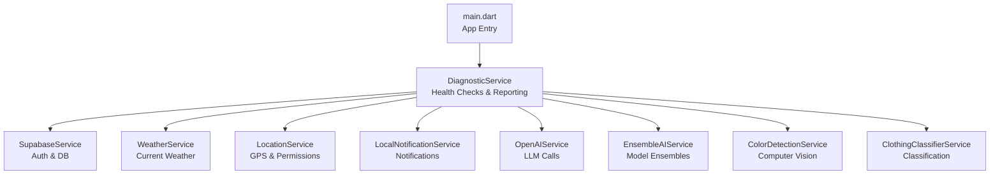
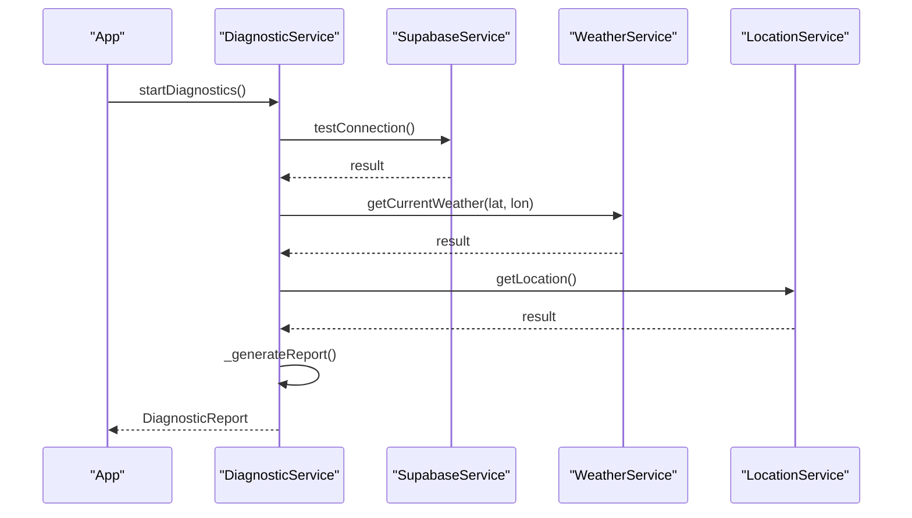
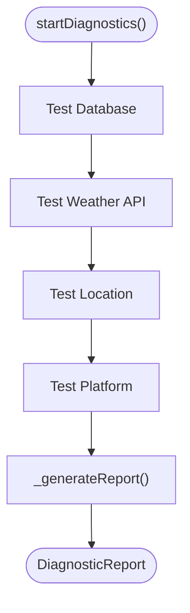
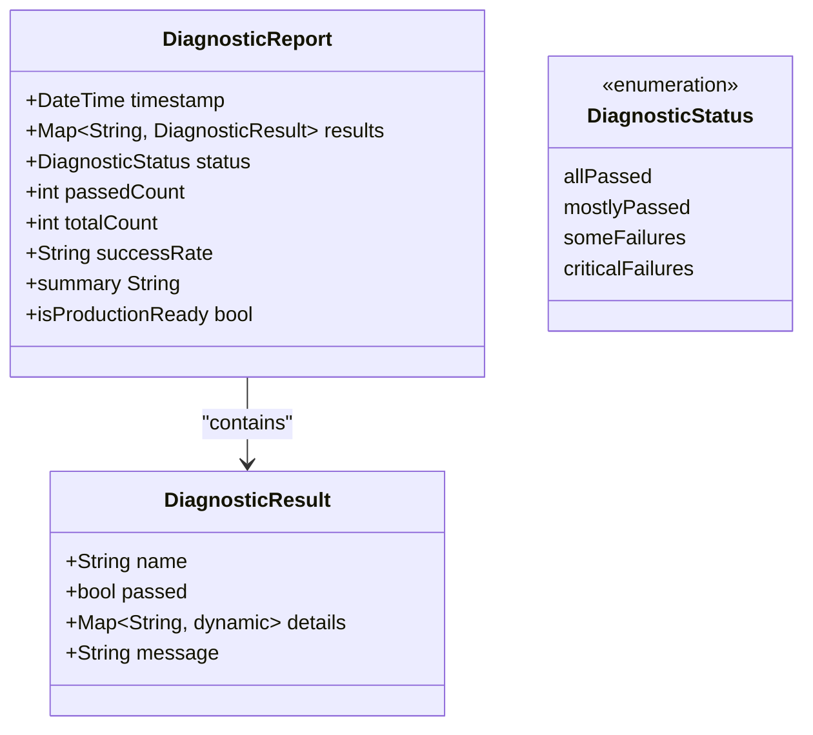
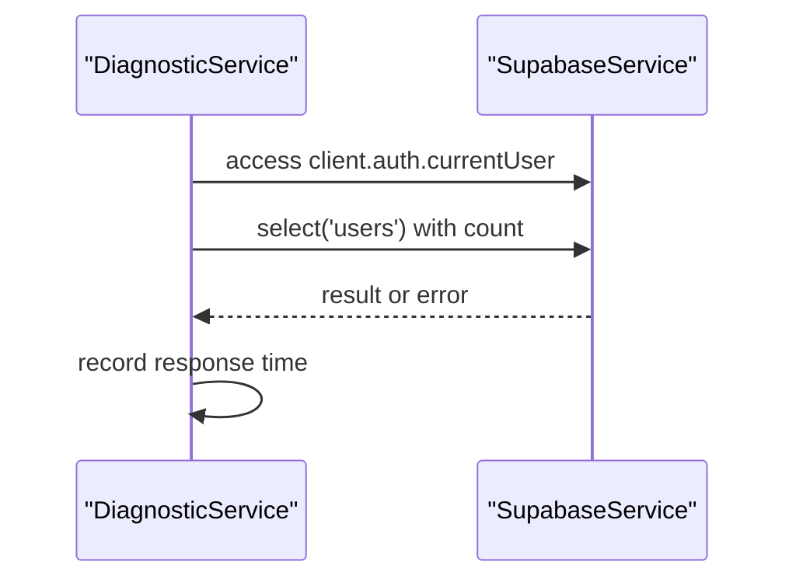
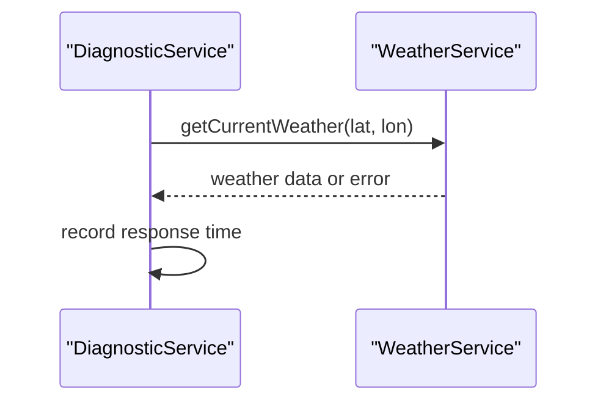
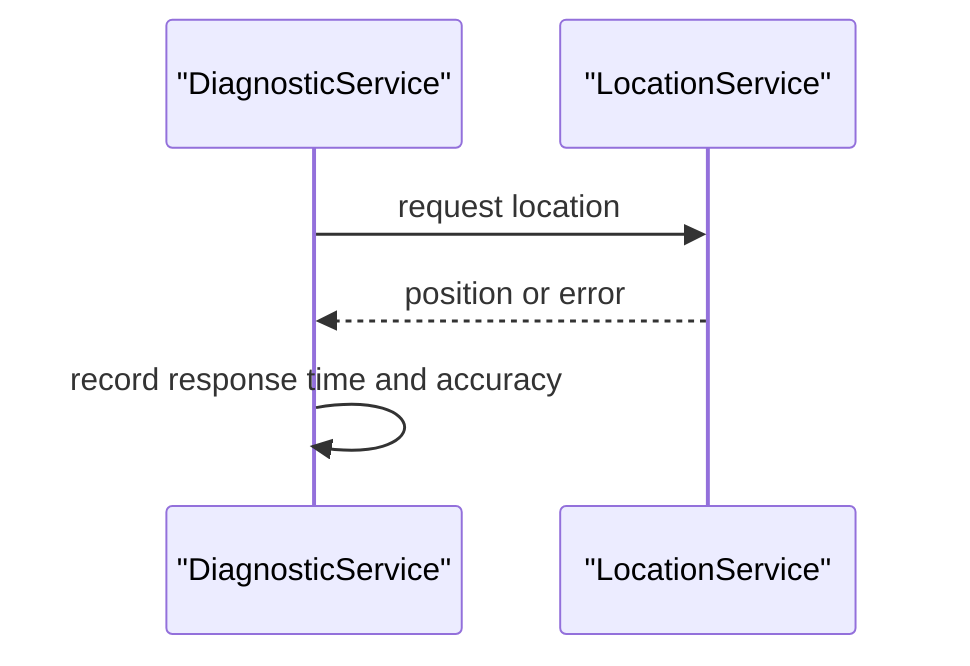
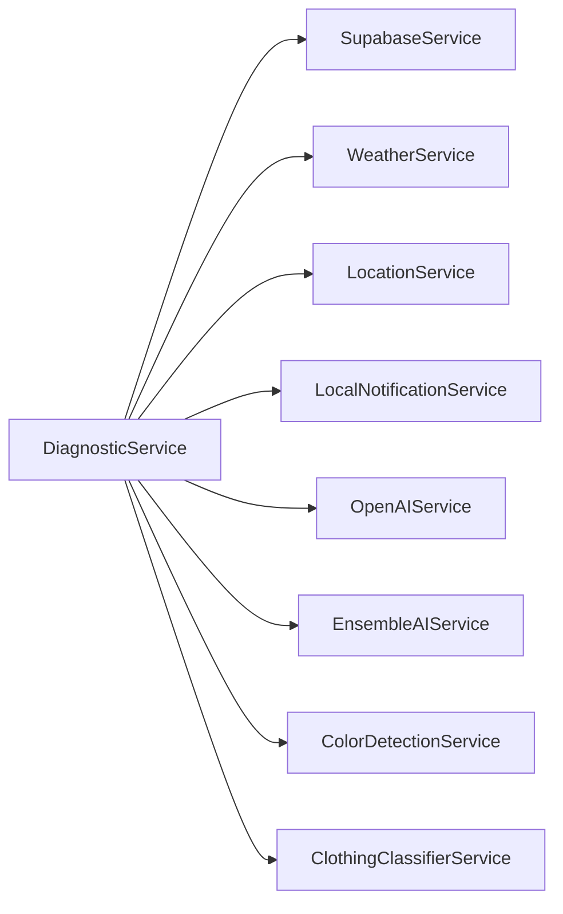

# Diagnostic Service

<cite>
**Referenced Files in This Document**
- [diagnostic_service.dart](file://lib/services/diagnostic_service.dart)
- [supabase_service.dart](file://lib/services/supabase_service.dart)
- [weather_service.dart](file://lib/services/weather_service.dart)
- [location_service.dart](file://lib/services/location_service.dart)
- [local_notification_service.dart](file://lib/services/local_notification_service.dart)
- [openai_service.dart](file://lib/services/openai_service.dart)
- [ensemble_ai_service.dart](file://lib/services/ensemble_ai_service.dart)
- [color_detection_service.dart](file://lib/services/color_detection_service.dart)
- [clothing_classifier_service.dart](file://lib/services/clothing_classifier_service.dart)
- [main.dart](file://lib/main.dart)
- [privacy_policy_screen.dart](file://lib/presentation/privacy_policy/privacy_policy_screen.dart)
</cite>

## Table of Contents
1. [Introduction](#introduction)
2. [Project Structure](#project-structure)
3. [Core Components](#core-components)
4. [Architecture Overview](#architecture-overview)
5. [Detailed Component Analysis](#detailed-component-analysis)
6. [Dependency Analysis](#dependency-analysis)
7. [Performance Considerations](#performance-considerations)
8. [Troubleshooting Guide](#troubleshooting-guide)
9. [Conclusion](#conclusion)
10. [Appendices](#appendices)

## Introduction
This document describes the Diagnostic Service responsible for system health monitoring, error reporting, and performance tracking in PrismStyle AI. It explains how diagnostic data is collected, how health checks are performed across core services, and how results are aggregated into actionable reports. It also covers error logging patterns, exception handling, privacy considerations, and the service's role in ensuring application stability and quality assurance.

## Project Structure
The Diagnostic Service is implemented as a dedicated Dart service that orchestrates health checks for dependent services and platform capabilities. It integrates with:
- Authentication and database connectivity via Supabase
- Weather data retrieval via WeatherService
- Location services via LocationService
- Local notifications via LocalNotificationService
- AI inference services via OpenAIService, EnsembleAIService, ColorDetectionService, and ClothingClassifierService

**Diagram sources**
- [diagnostic_service.dart](file://lib/services/diagnostic_service.dart#L1-L484)
- [supabase_service.dart](file://lib/services/supabase_service.dart#L1-L200)
- [weather_service.dart](file://lib/services/weather_service.dart#L1-L200)
- [location_service.dart](file://lib/services/location_service.dart#L1-L200)
- [local_notification_service.dart](file://lib/services/local_notification_service.dart#L1-L200)
- [openai_service.dart](file://lib/services/openai_service.dart#L1-L200)
- [ensemble_ai_service.dart](file://lib/services/ensemble_ai_service.dart#L1-L200)
- [color_detection_service.dart](file://lib/services/color_detection_service.dart#L1-L200)
- [clothing_classifier_service.dart](file://lib/services/clothing_classifier_service.dart#L1-L200)
- [main.dart](file://lib/main.dart#L1-L200)

**Section sources**
- [diagnostic_service.dart](file://lib/services/diagnostic_service.dart#L1-L484)
- [main.dart](file://lib/main.dart#L1-L200)

## Core Components
- DiagnosticService: Central coordinator that runs health checks against configured services and platform capabilities, aggregates results, and produces a structured DiagnosticReport.
- DiagnosticResult: Encapsulates pass/fail status, details, and human-readable messages per test.
- DiagnosticStatus: Enumerated status levels derived from pass rates.
- DiagnosticReport: Aggregated report with timestamp, counts, pass percentage, and a formatted summary.

Key responsibilities:
- Health check orchestration across Supabase, WeatherService, LocationService, and platform info
- Performance timing for each check
- Structured error logging and messaging
- Production readiness assessment via isProductionReady

**Section sources**
- [diagnostic_service.dart](file://lib/services/diagnostic_service.dart#L390-L484)

## Architecture Overview
The Diagnostic Service follows a modular design:
- Entry point: Called from the application main entry or a dedicated diagnostics screen
- Orchestration: Runs individual tests in sequence, capturing timing and outcomes
- Aggregation: Builds DiagnosticReport with pass/fail status and summary
- Integration: Uses existing service singletons to avoid duplication and maintain consistency

**Diagram sources**
- [diagnostic_service.dart](file://lib/services/diagnostic_service.dart#L100-L420)
- [supabase_service.dart](file://lib/services/supabase_service.dart#L1-L200)
- [weather_service.dart](file://lib/services/weather_service.dart#L1-L200)
- [location_service.dart](file://lib/services/location_service.dart#L1-L200)

## Detailed Component Analysis

### DiagnosticService
Responsibilities:
- Executes health checks for database connectivity, weather API, location services, and platform information
- Measures response times for each check
- Captures detailed diagnostic metadata (configuration presence, auth status, permissions)
- Produces a structured report with pass/fail status and a human-readable summary

Key methods and flows:
- Database connectivity test: Validates Supabase URL/anon key configuration, client initialization, authentication status, and query capability
- Weather API test: Calls current weather endpoint with fixed coordinates and records success/failure and response time
- Location service test: Requests location with permission handling and records accuracy and response time
- Platform info test: Captures operating system and basic device info
- Report generation: Computes pass rate thresholds and assigns DiagnosticStatus

**Diagram sources**
- [diagnostic_service.dart](file://lib/services/diagnostic_service.dart#L100-L420)

**Section sources**
- [diagnostic_service.dart](file://lib/services/diagnostic_service.dart#L100-L484)

### DiagnosticResult and DiagnosticReport
- DiagnosticResult: Stores name, pass/fail flag, details map, and message for each test
- DiagnosticReport: Aggregates all results, computes pass count, total count, and success percentage, and provides a formatted summary

**Diagram sources**
- [diagnostic_service.dart](file://lib/services/diagnostic_service.dart#L422-L484)

**Section sources**
- [diagnostic_service.dart](file://lib/services/diagnostic_service.dart#L422-L484)

### SupabaseService Integration
The diagnostic service validates:
- Supabase URL and anon key configuration
- Client initialization
- Authentication status
- Query capability against public tables
- Response time measurement

**Diagram sources**
- [diagnostic_service.dart](file://lib/services/diagnostic_service.dart#L110-L145)
- [supabase_service.dart](file://lib/services/supabase_service.dart#L1-L200)

**Section sources**
- [diagnostic_service.dart](file://lib/services/diagnostic_service.dart#L110-L145)
- [supabase_service.dart](file://lib/services/supabase_service.dart#L1-L200)

### WeatherService Integration
The diagnostic service calls the weather service with fixed coordinates to validate:
- Network reachability
- API key configuration
- Response parsing and validity

**Diagram sources**
- [diagnostic_service.dart](file://lib/services/diagnostic_service.dart#L246-L275)
- [weather_service.dart](file://lib/services/weather_service.dart#L1-L200)

**Section sources**
- [diagnostic_service.dart](file://lib/services/diagnostic_service.dart#L246-L275)
- [weather_service.dart](file://lib/services/weather_service.dart#L1-L200)

### LocationService Integration
The diagnostic service requests location and evaluates:
- Permission status
- Position availability
- Accuracy and response time

**Diagram sources**
- [diagnostic_service.dart](file://lib/services/diagnostic_service.dart#L210-L244)
- [location_service.dart](file://lib/services/location_service.dart#L1-L200)

**Section sources**
- [diagnostic_service.dart](file://lib/services/diagnostic_service.dart#L210-L244)
- [location_service.dart](file://lib/services/location_service.dart#L1-L200)

### Platform Information Test
The diagnostic service captures platform details and records response time for platform checks.

**Section sources**
- [diagnostic_service.dart](file://lib/services/diagnostic_service.dart#L360-L382)

## Dependency Analysis
The Diagnostic Service depends on:
- SupabaseService for authentication and database connectivity checks
- WeatherService for external API connectivity
- LocationService for device location capabilities
- Platform APIs for OS and device information
- LocalNotificationService for notification capability checks (conceptual integration)
- AI services for inference pipeline checks (conceptual integration)

**Diagram sources**
- [diagnostic_service.dart](file://lib/services/diagnostic_service.dart#L1-L484)
- [supabase_service.dart](file://lib/services/supabase_service.dart#L1-L200)
- [weather_service.dart](file://lib/services/weather_service.dart#L1-L200)
- [location_service.dart](file://lib/services/location_service.dart#L1-L200)
- [local_notification_service.dart](file://lib/services/local_notification_service.dart#L1-L200)
- [openai_service.dart](file://lib/services/openai_service.dart#L1-L200)
- [ensemble_ai_service.dart](file://lib/services/ensemble_ai_service.dart#L1-L200)
- [color_detection_service.dart](file://lib/services/color_detection_service.dart#L1-L200)
- [clothing_classifier_service.dart](file://lib/services/clothing_classifier_service.dart#L1-L200)

**Section sources**
- [diagnostic_service.dart](file://lib/services/diagnostic_service.dart#L1-L484)

## Performance Considerations
- Response time measurement: Each health check measures elapsed time to surface latency issues
- Threshold-based status: DiagnosticStatus thresholds enable quick assessment of overall system health
- Minimal overhead: Tests focus on lightweight operations to avoid impacting user experience
- Scalability: Modular design allows adding new checks without changing core logic

[No sources needed since this section provides general guidance]

## Troubleshooting Guide
Common scenarios and resolutions:
- Database connectivity failures:
  - Verify Supabase URL and anon key configuration
  - Confirm client initialization and authentication status
  - Check query permissions and RLS policies
- Weather API failures:
  - Validate API key and network connectivity
  - Confirm endpoint availability and response format
- Location service failures:
  - Ensure location permissions granted
  - Check GPS availability and accuracy
- Platform-specific issues:
  - Review OS-specific capabilities and configurations

DiagnosticReport.summary provides a consolidated view for quick triage.

**Section sources**
- [diagnostic_service.dart](file://lib/services/diagnostic_service.dart#L463-L480)

## Conclusion
The Diagnostic Service provides a robust framework for continuous system health monitoring, enabling rapid identification of configuration issues, dependency failures, and performance bottlenecks. Its modular design supports extensibility, while structured reporting and status thresholds facilitate automated alerting and operational decision-making.

[No sources needed since this section summarizes without analyzing specific files]

## Appendices

### Privacy and Compliance Considerations
- Data minimization: Diagnostic results exclude personally identifiable information; only metadata (response times, configuration presence) is recorded
- Consent alignment: Diagnostic reporting should align with user consent for analytics and telemetry
- Anonymization: No personal data is transmitted during health checks; results remain local unless explicitly opted-in for remote reporting
- Policy alignment: Ensure diagnostic workflows comply with the application’s privacy policy and applicable regulations

**Section sources**
- [privacy_policy_screen.dart](file://lib/presentation/privacy_policy/privacy_policy_screen.dart#L1-L200)

### Example Diagnostic Workflows
- On-demand diagnostics: Triggered from a diagnostics screen to validate current environment
- Scheduled diagnostics: Periodic checks to monitor long-running sessions
- Pre-flight diagnostics: Validation before critical operations (e.g., model inference)

[No sources needed since this section provides general guidance]

### Monitoring Dashboards and Alerting
- Dashboard views: Surface pass/fail rates, top failing components, and response time trends
- Alerting rules: Trigger alerts when DiagnosticStatus degrades below threshold or when specific components fail consistently
- Integration points: Connect DiagnosticReport to analytics platforms and incident management systems

[No sources needed since this section provides general guidance]