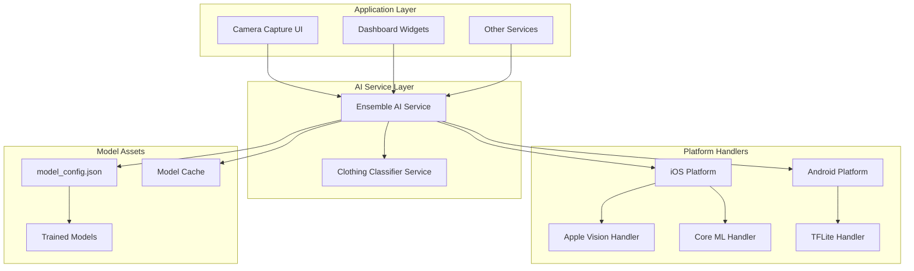
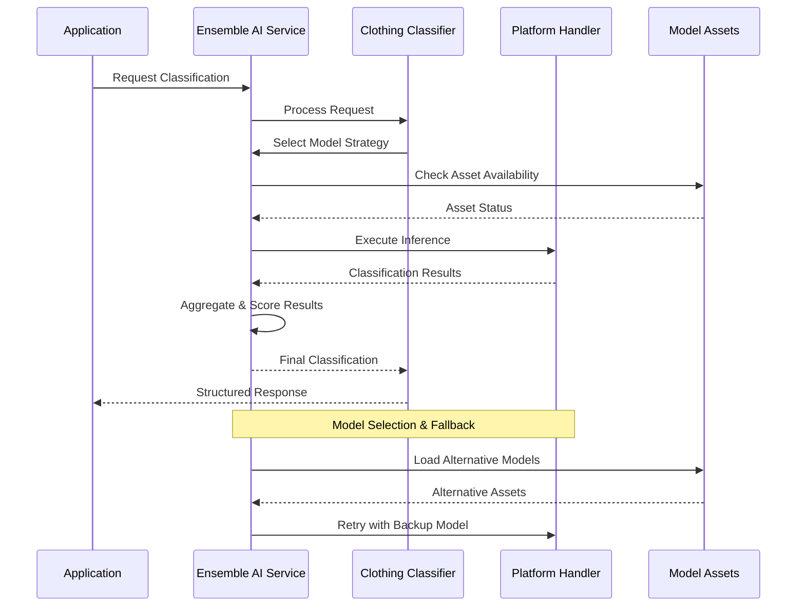
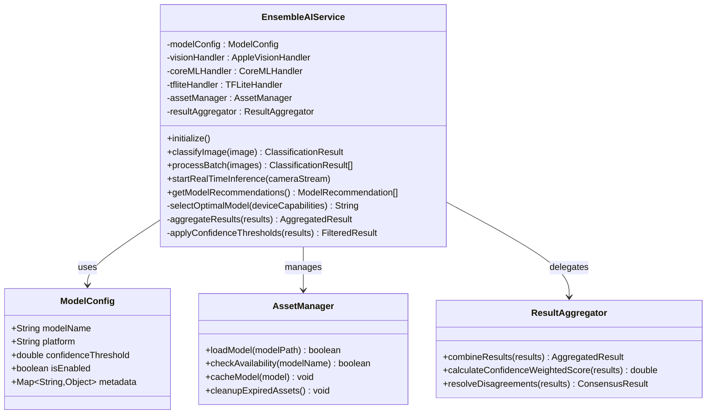
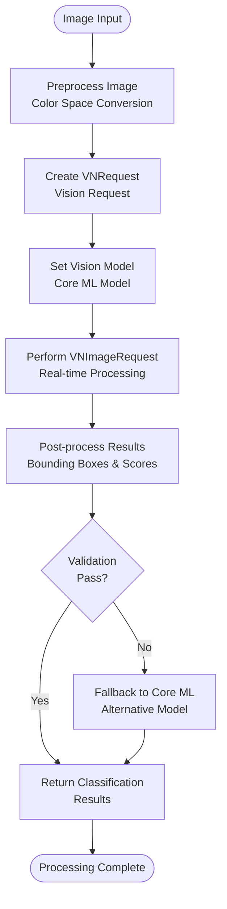
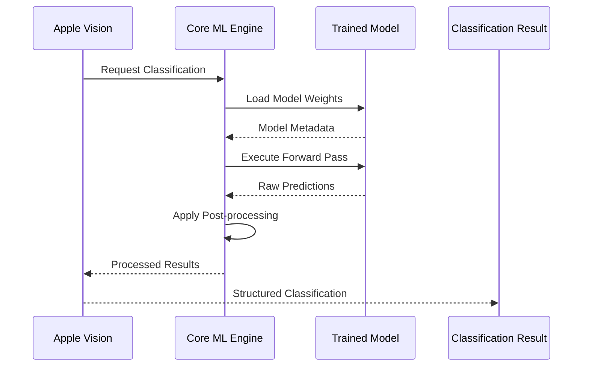
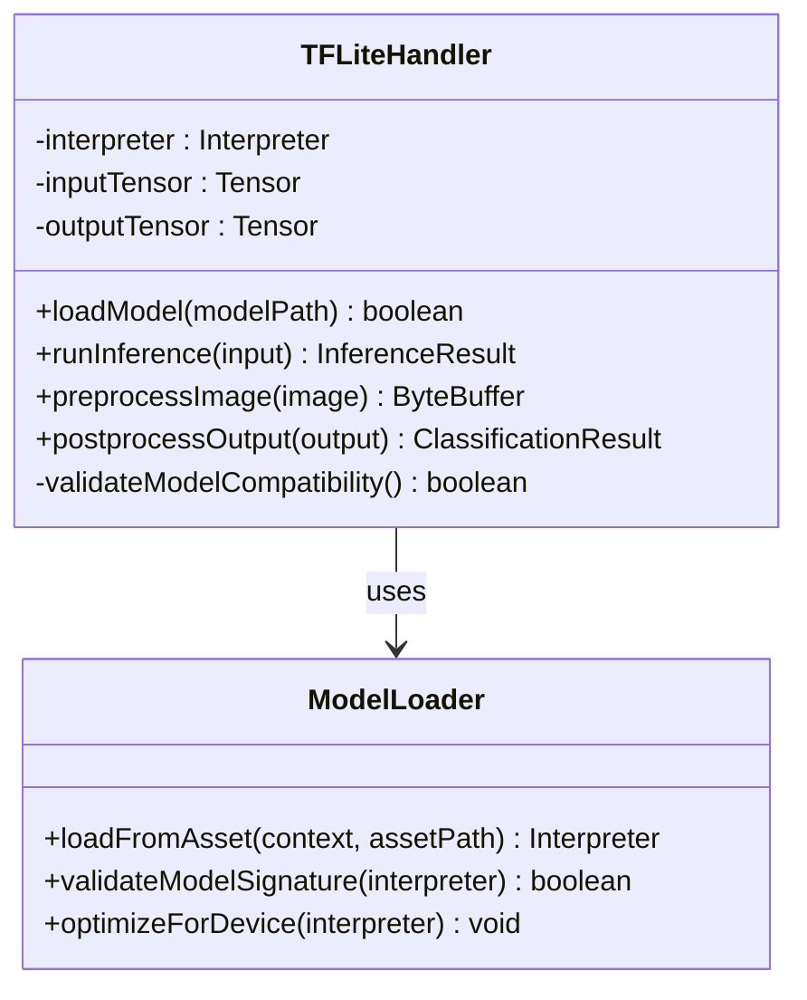
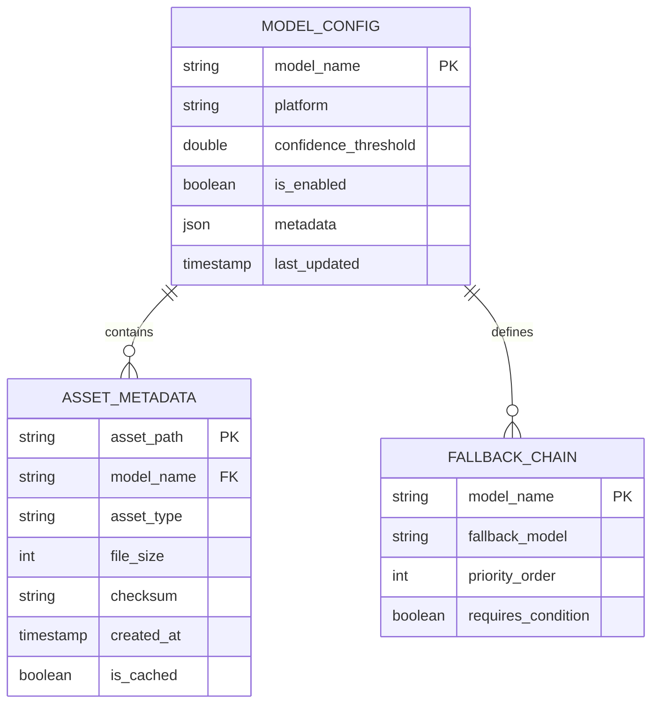
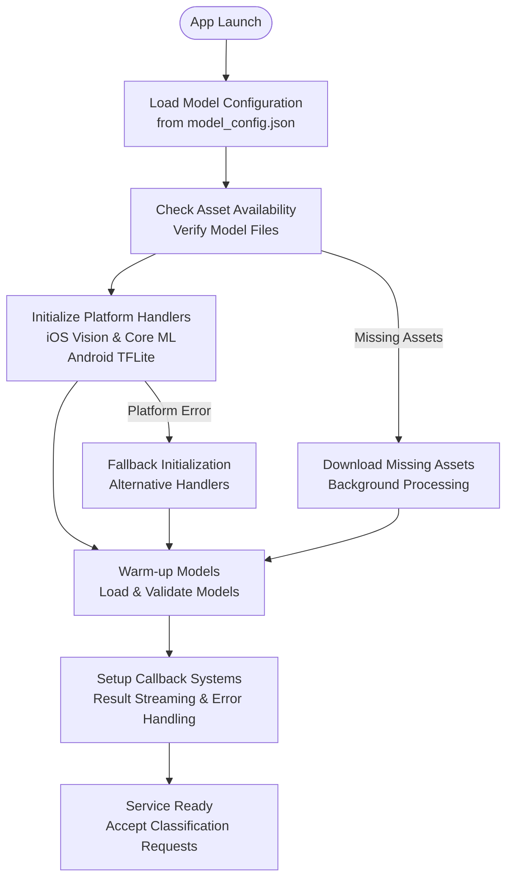
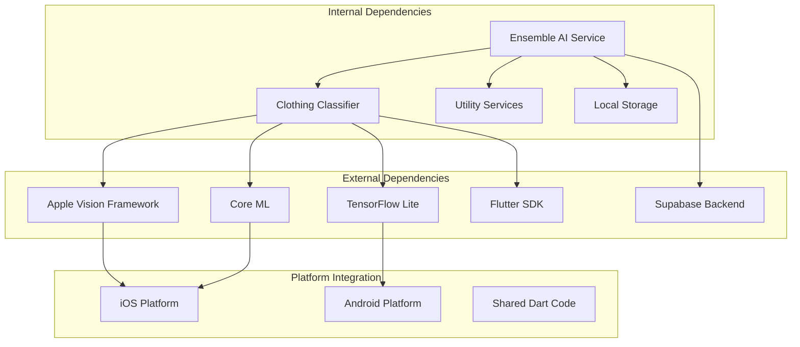

# Ensemble AI Service

<cite>
**Referenced Files in This Document**
- [ensemble_ai_service.dart](file://lib/services/ensemble_ai_service.dart)
- [clothing_classifier_service.dart](file://lib/services/clothing_classifier_service.dart)
- [AppleVisionHandler.swift](file://ios/Runner/AppleVisionHandler.swift)
- [CoreMLHandler.swift](file://ios/Runner/CoreMLHandler.swift)
- [model_config.json](file://assets/models/model_config.json)
- [AppDelegate.swift](file://ios/Runner/AppDelegate.swift)
- [MainActivity.kt](file://android/app/src/main/kotlin/com/prismstyle_ai/app/MainActivity.kt)
- [camera_capture.dart](file://lib/presentation/camera_capture/camera_capture.dart)
- [README.md](file://README.md)
</cite>

## Table of Contents
1. [Introduction](#introduction)
2. [Project Structure](#project-structure)
3. [Core Components](#core-components)
4. [Architecture Overview](#architecture-overview)
5. [Detailed Component Analysis](#detailed-component-analysis)
6. [Dependency Analysis](#dependency-analysis)
7. [Performance Considerations](#performance-considerations)
8. [Troubleshooting Guide](#troubleshooting-guide)
9. [Conclusion](#conclusion)
10. [Appendices](#appendices)

## Introduction
The Ensemble AI Service is the central coordinator for multi-model AI classification in PrismStyle AI. It orchestrates TFLite, Apple Vision Framework, and Core ML capabilities to perform robust clothing recognition. The service implements a model selection strategy that chooses the most appropriate inference engine based on device capabilities, asset availability, and runtime conditions. It aggregates results from multiple models using confidence scoring mechanisms and applies fallback strategies when specific models are unavailable.

The service manages model configuration through JSON-based settings, handles asset lifecycle and caching, and provides a unified API for single-image classification, batch processing, and real-time inference. It ensures device compatibility across iOS and Android platforms while maintaining performance optimization through intelligent model loading and memory management.

## Project Structure
The Ensemble AI Service integrates with the broader PrismStyle AI ecosystem through several key modules:

**Diagram sources**
- [ensemble_ai_service.dart](file://lib/services/ensemble_ai_service.dart)
- [clothing_classifier_service.dart](file://lib/services/clothing_classifier_service.dart)
- [AppleVisionHandler.swift](file://ios/Runner/AppleVisionHandler.swift)
- [CoreMLHandler.swift](file://ios/Runner/CoreMLHandler.swift)
- [model_config.json](file://assets/models/model_config.json)

**Section sources**
- [ensemble_ai_service.dart](file://lib/services/ensemble_ai_service.dart)
- [README.md](file://README.md)

## Core Components
The Ensemble AI Service comprises several interconnected components that work together to provide comprehensive clothing recognition:

### Primary Services
- **Ensemble AI Service**: Central coordinator managing model orchestration and result aggregation
- **Clothing Classifier Service**: High-level interface for clothing classification requests
- **Apple Vision Handler**: iOS-specific handler for Apple Vision Framework integration
- **Core ML Handler**: iOS-specific handler for Core ML model execution
- **TFLite Handler**: Android-specific handler for TensorFlow Lite model execution

### Model Management System
- **Configuration Loader**: Manages model settings and preferences through JSON configuration
- **Asset Manager**: Handles model file lifecycle, caching, and availability checks
- **Fallback Engine**: Implements failover strategies when primary models are unavailable

### Integration Interfaces
- **Real-time Pipeline**: Camera feed processing with continuous inference
- **Batch Processor**: Multi-image classification with optimized batching
- **Diagnostic Tools**: Performance monitoring and model health checking

**Section sources**
- [ensemble_ai_service.dart](file://lib/services/ensemble_ai_service.dart)
- [clothing_classifier_service.dart](file://lib/services/clothing_classifier_service.dart)

## Architecture Overview
The Ensemble AI Service follows a layered architecture that separates concerns between platform-specific handlers, model management, and application integration:

**Diagram sources**
- [ensemble_ai_service.dart](file://lib/services/ensemble_ai_service.dart)
- [AppleVisionHandler.swift](file://ios/Runner/AppleVisionHandler.swift)
- [CoreMLHandler.swift](file://ios/Runner/CoreMLHandler.swift)

The architecture implements several key design patterns:
- **Strategy Pattern**: Dynamic model selection based on device capabilities
- **Observer Pattern**: Real-time result streaming and progress updates
- **Factory Pattern**: Platform-specific handler instantiation
- **Command Pattern**: Batch processing and queued inference requests

## Detailed Component Analysis

### Ensemble AI Service Implementation
The core Ensemble AI Service coordinates multiple inference engines and implements sophisticated model selection logic:

**Diagram sources**
- [ensemble_ai_service.dart](file://lib/services/ensemble_ai_service.dart)

#### Model Selection Strategy
The service implements a hierarchical model selection process:

1. **Device Capability Assessment**: Evaluates CPU/GPU capabilities, memory constraints, and platform-specific optimizations
2. **Model Availability Check**: Verifies asset readiness and cache validity
3. **Performance Profiling**: Considers inference latency and accuracy trade-offs
4. **Fallback Chain**: Establishes backup models for different failure scenarios

#### Confidence Scoring Mechanisms
The result aggregation system applies multiple confidence scoring approaches:

- **Weighted Average**: Combines scores from different models with platform-specific weights
- **Consensus Voting**: Requires agreement from multiple models for high-confidence classifications
- **Threshold Filtering**: Applies dynamic thresholds based on model reliability
- **Uncertainty Quantification**: Estimates prediction uncertainty for edge cases

**Section sources**
- [ensemble_ai_service.dart](file://lib/services/ensemble_ai_service.dart)

### Platform-Specific Handlers

#### Apple Vision Handler
The iOS Apple Vision Handler provides native computer vision capabilities:

**Diagram sources**
- [AppleVisionHandler.swift](file://ios/Runner/AppleVisionHandler.swift)

#### Core ML Handler
The Core ML Handler manages machine learning model execution:

**Diagram sources**
- [CoreMLHandler.swift](file://ios/Runner/CoreMLHandler.swift)

#### TFLite Handler (Android)
The Android TFLite Handler provides TensorFlow Lite model execution:

**Diagram sources**
- [MainActivity.kt](file://android/app/src/main/kotlin/com/prismstyle_ai/app/MainActivity.kt)

**Section sources**
- [AppleVisionHandler.swift](file://ios/Runner/AppleVisionHandler.swift)
- [CoreMLHandler.swift](file://ios/Runner/CoreMLHandler.swift)
- [MainActivity.kt](file://android/app/src/main/kotlin/com/prismstyle_ai/app/MainActivity.kt)

### Model Configuration System
The model configuration system manages model settings and preferences through JSON-based configuration:

**Diagram sources**
- [model_config.json](file://assets/models/model_config.json)

**Section sources**
- [model_config.json](file://assets/models/model_config.json)

### Initialization Sequence
The Ensemble AI Service follows a structured initialization sequence:

**Diagram sources**
- [ensemble_ai_service.dart](file://lib/services/ensemble_ai_service.dart)
- [AppDelegate.swift](file://ios/Runner/AppDelegate.swift)

**Section sources**
- [ensemble_ai_service.dart](file://lib/services/ensemble_ai_service.dart)
- [AppDelegate.swift](file://ios/Runner/AppDelegate.swift)

## Dependency Analysis
The Ensemble AI Service has well-defined dependencies that support modularity and maintainability:

**Diagram sources**
- [ensemble_ai_service.dart](file://lib/services/ensemble_ai_service.dart)
- [clothing_classifier_service.dart](file://lib/services/clothing_classifier_service.dart)

**Section sources**
- [ensemble_ai_service.dart](file://lib/services/ensemble_ai_service.dart)
- [clothing_classifier_service.dart](file://lib/services/clothing_classifier_service.dart)

## Performance Considerations
The Ensemble AI Service implements several optimization strategies for efficient operation:

### Memory Management
- **Model Caching**: Persistent caching of loaded models to avoid repeated initialization
- **Memory Pooling**: Shared memory buffers for intermediate computations
- **Garbage Collection**: Strategic cleanup of unused resources during inference
- **Batch Processing**: Optimized batching to reduce overhead per inference

### Device Compatibility
- **Dynamic Model Selection**: Automatic selection based on device capabilities
- **Resolution Scaling**: Adaptive image scaling for different device resolutions
- **Platform Optimization**: Leverages platform-specific optimizations (Metal Performance Shaders, NNAPI)
- **Fallback Strategies**: Graceful degradation when advanced features are unavailable

### Performance Monitoring
- **Latency Tracking**: Real-time monitoring of inference performance
- **Resource Usage**: Continuous monitoring of CPU, GPU, and memory usage
- **Throughput Optimization**: Batching and queuing strategies for high-throughput scenarios

## Troubleshooting Guide
The Ensemble AI Service includes comprehensive error handling and diagnostic capabilities:

### Common Issues and Solutions
- **Model Loading Failures**: Automatic fallback to alternative models or cached versions
- **Platform Handler Errors**: Graceful degradation to software implementations
- **Memory Constraints**: Dynamic model unloading and resource optimization
- **Network Issues**: Offline mode with pre-downloaded models

### Diagnostic Features
- **Health Monitoring**: Continuous health checks for all components
- **Error Logging**: Comprehensive logging with contextual information
- **Performance Metrics**: Detailed performance profiling and bottleneck identification
- **Debug Mode**: Enhanced logging and visualization for development

**Section sources**
- [ensemble_ai_service.dart](file://lib/services/ensemble_ai_service.dart)

## Conclusion
The Ensemble AI Service represents a sophisticated multi-platform AI coordination system that effectively combines TFLite, Apple Vision Framework, and Core ML capabilities. Its modular architecture, intelligent model selection, and robust fallback mechanisms ensure reliable performance across diverse devices and scenarios.

The service's emphasis on performance optimization, comprehensive error handling, and platform-specific adaptations makes it well-suited for production deployment in mobile applications. The unified API design and flexible configuration system provide developers with the tools needed to integrate advanced AI capabilities into PrismStyle AI seamlessly.

Future enhancements could include expanded model support, improved real-time processing capabilities, and enhanced analytics for model performance optimization.

## Appendices

### API Reference
The Ensemble AI Service exposes the following public methods:

#### Image Classification
- `classifyImage(image)`: Single image classification with confidence scores
- `processBatch(images)`: Batch processing for multiple images
- `startRealTimeInference(stream)`: Continuous inference from camera streams

#### Model Management
- `getModelRecommendations()`: Current model selection recommendations
- `reloadModels()`: Force reload all models from configuration
- `clearCache()`: Clear cached model data

#### Configuration
- `updateModelConfig(config)`: Update model configuration at runtime
- `getModelStatus()`: Get current model availability and performance metrics

### Integration Patterns
Common integration patterns include:
- **Real-time Camera Integration**: Direct camera stream processing
- **Batch Processing Pipelines**: Automated processing of user-uploaded images
- **Hybrid Classification**: Combining multiple models for enhanced accuracy
- **Progressive Enhancement**: Starting with basic models and upgrading based on device capabilities