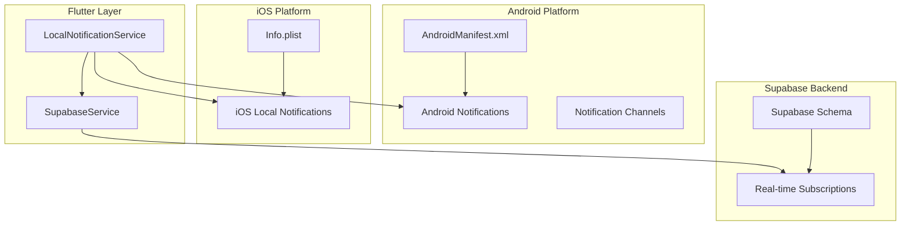
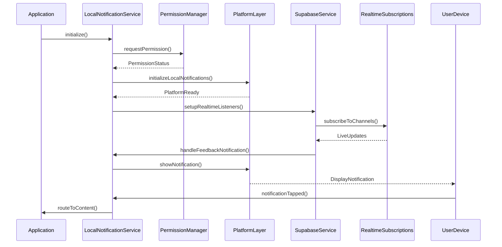
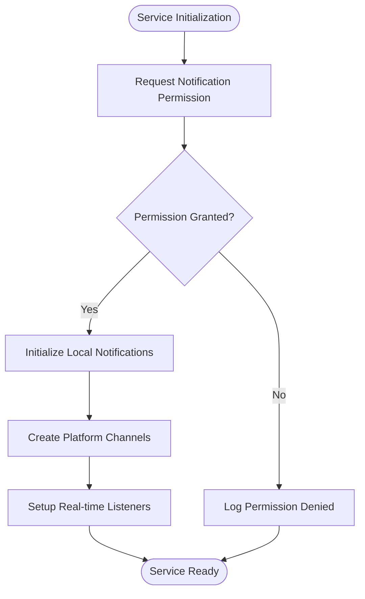
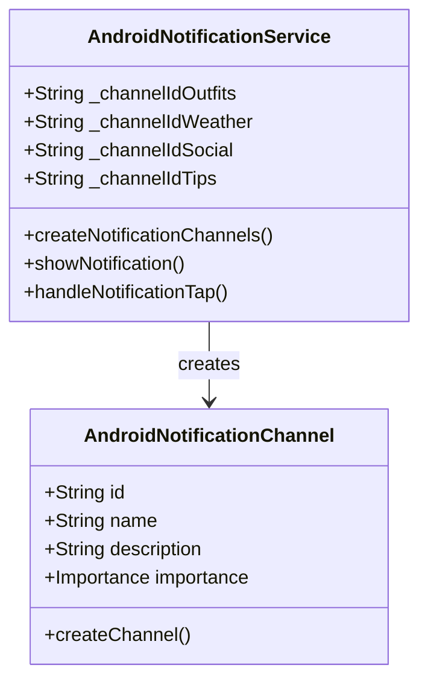
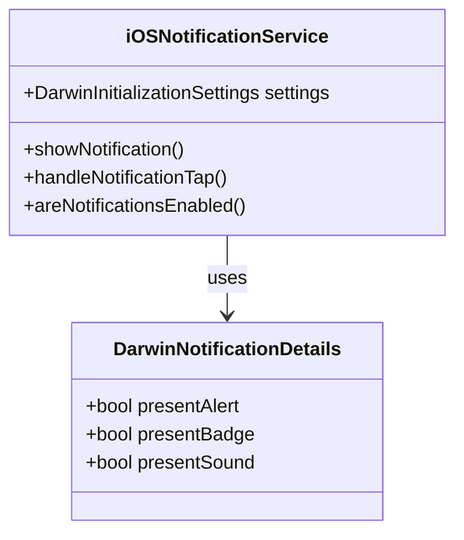
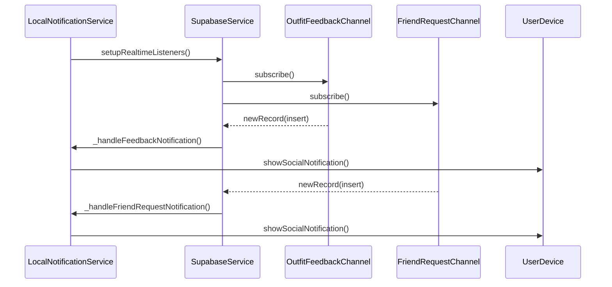
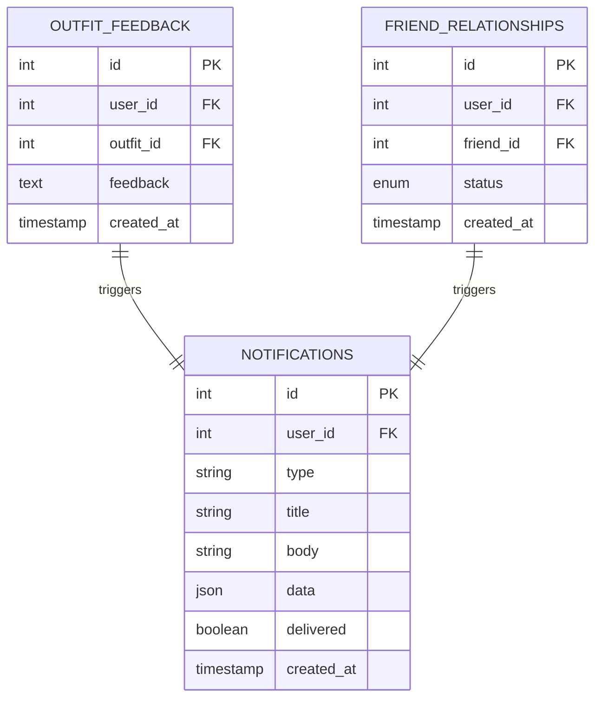
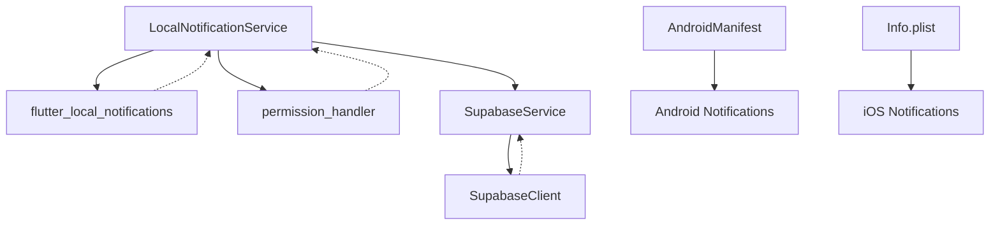

# Local Notification Service

<cite>
**Referenced Files in This Document**
- [local_notification_service.dart](file://lib/services/local_notification_service.dart)
- [supabase_service.dart](file://lib/services/supabase_service.dart)
- [supabase_schema.sql](file://supabase_schema.sql)
- [AndroidManifest.xml](file://android/app/src/main/AndroidManifest.xml)
- [Info.plist](file://ios/Runner/Info.plist)
- [MainActivity.kt](file://android/app/src/main/kotlin/com/prismstyle_ai/app/MainActivity.kt)
- [AppDelegate.swift](file://ios/Runner/AppDelegate.swift)
</cite>

## Table of Contents
1. [Introduction](#introduction)
2. [Project Structure](#project-structure)
3. [Core Components](#core-components)
4. [Architecture Overview](#architecture-overview)
5. [Detailed Component Analysis](#detailed-component-analysis)
6. [Dependency Analysis](#dependency-analysis)
7. [Performance Considerations](#performance-considerations)
8. [Troubleshooting Guide](#troubleshooting-guide)
9. [Conclusion](#conclusion)

## Introduction
This document provides comprehensive documentation for the Local Notification Service in PrismStyle AI, focusing on push notifications and real-time update handling. It covers the notification setup process, permission management, platform-specific implementations, subscription management for real-time data updates, notification scheduling, user preference handling, notification types and triggers, content formatting, integration with Supabase real-time subscriptions, delivery mechanisms, retry strategies, error handling, platform differences between iOS and Android, background processing limitations, battery optimization considerations, and customization options.

## Project Structure
The notification service is implemented as a Flutter service with platform-specific integrations:
- Flutter service layer handles notification lifecycle and user preferences
- Android integration via native Android notifications and channels
- iOS integration via Darwin local notifications
- Supabase real-time integration for live data updates
- Platform-specific manifest configurations for permissions

**Diagram sources**
- [local_notification_service.dart](file://lib/services/local_notification_service.dart#L43-L58)
- [supabase_service.dart](file://lib/services/supabase_service.dart)
- [AndroidManifest.xml](file://android/app/src/main/AndroidManifest.xml)
- [Info.plist](file://ios/Runner/Info.plist)

**Section sources**
- [local_notification_service.dart](file://lib/services/local_notification_service.dart#L1-L50)
- [AndroidManifest.xml](file://android/app/src/main/AndroidManifest.xml)
- [Info.plist](file://ios/Runner/Info.plist)

## Core Components
The Local Notification Service consists of several key components working together to provide comprehensive notification functionality:

### Primary Service Class
The main service class manages notification lifecycle, platform initialization, and real-time integration. It provides methods for:
- Initializing the notification system
- Requesting and checking notification permissions
- Creating platform-specific notification channels
- Scheduling and displaying notifications
- Managing real-time subscriptions
- Handling notification interactions

### Platform-Specific Implementations
The service supports both Android and iOS platforms with distinct implementations:
- Android uses notification channels with different importance levels
- iOS uses Darwin notification settings with permission requests
- Both platforms support rich notification content with actions

### Real-Time Integration
Integration with Supabase enables live updates for:
- Outfit feedback notifications
- Friend request notifications
- Customizable real-time channels

**Section sources**
- [local_notification_service.dart](file://lib/services/local_notification_service.dart#L43-L92)
- [local_notification_service.dart](file://lib/services/local_notification_service.dart#L144-L185)

## Architecture Overview
The notification system follows a layered architecture with clear separation of concerns:

**Diagram sources**
- [local_notification_service.dart](file://lib/services/local_notification_service.dart#L43-L58)
- [local_notification_service.dart](file://lib/services/local_notification_service.dart#L144-L185)
- [supabase_service.dart](file://lib/services/supabase_service.dart)

The architecture ensures loose coupling between components while maintaining efficient communication for real-time updates and user interactions.

## Detailed Component Analysis

### Notification Setup Process
The initialization process follows a structured sequence:

**Diagram sources**
- [local_notification_service.dart](file://lib/services/local_notification_service.dart#L43-L58)
- [local_notification_service.dart](file://lib/services/local_notification_service.dart#L61-L64)

The setup process handles platform-specific requirements and validates user consent before proceeding with initialization.

### Permission Management
The service implements comprehensive permission management:

#### Android Permissions
- Notification channel management for different notification categories
- Background processing permissions for reliable delivery
- Battery optimization exemptions for critical notifications

#### iOS Permissions
- Alert permission requests during initialization
- Badge and sound permission settings
- Silent notification support for background updates

**Section sources**
- [local_notification_service.dart](file://lib/services/local_notification_service.dart#L61-L64)
- [local_notification_service.dart](file://lib/services/local_notification_service.dart#L71-L76)
- [AndroidManifest.xml](file://android/app/src/main/AndroidManifest.xml)
- [Info.plist](file://ios/Runner/Info.plist)

### Platform-Specific Implementations

#### Android Implementation
The Android implementation provides granular control over notification channels:

**Diagram sources**
- [local_notification_service.dart](file://lib/services/local_notification_service.dart#L95-L141)

#### iOS Implementation
The iOS implementation focuses on permission-based delivery:

**Diagram sources**
- [local_notification_service.dart](file://lib/services/local_notification_service.dart#L71-L76)
- [local_notification_service.dart](file://lib/services/local_notification_service.dart#L222-L226)

**Section sources**
- [local_notification_service.dart](file://lib/services/local_notification_service.dart#L67-L92)
- [local_notification_service.dart](file://lib/services/local_notification_service.dart#L95-L141)

### Subscription Management for Real-Time Updates
The service integrates with Supabase for live data updates:

**Diagram sources**
- [local_notification_service.dart](file://lib/services/local_notification_service.dart#L144-L185)
- [local_notification_service.dart](file://lib/services/local_notification_service.dart#L187-L203)

The subscription system listens for specific database events and triggers appropriate notifications.

### Notification Types and Triggers
The service supports multiple notification categories with distinct triggers:

#### Outfit Recommendations
- Triggered by weather changes affecting outfit choices
- Scheduled daily recommendations based on user preferences
- Content includes outfit suggestions and weather context

#### Weather Alerts
- Real-time weather change notifications
- Impact-based recommendations for outfit adjustments
- Priority delivery for significant weather events

#### Social Interactions
- New comments on user outfits
- Friend request notifications
- Reaction and engagement updates

#### Style Tips
- Daily fashion tips and trends
- Personalized recommendations based on user history
- Educational content delivery

**Section sources**
- [local_notification_service.dart](file://lib/services/local_notification_service.dart#L255-L268)
- [local_notification_service.dart](file://lib/services/local_notification_service.dart#L187-L203)

### Content Formatting and User Preferences
The notification system supports rich content formatting:

#### Platform-Specific Formatting
- Android: Channel-based categorization with importance levels
- iOS: Permission-based delivery with alert/badge/sound options
- Cross-platform: Consistent payload structure for deep linking

#### User Preference Integration
- Personalized notification scheduling
- Category-based opt-out capabilities
- Time-based delivery preferences

**Section sources**
- [local_notification_service.dart](file://lib/services/local_notification_service.dart#L205-L240)
- [local_notification_service.dart](file://lib/services/local_notification_service.dart#L397-L400)

### Integration with Supabase Real-time Subscriptions
The service leverages Supabase's real-time capabilities:

**Diagram sources**
- [supabase_schema.sql](file://supabase_schema.sql#L314-L318)

**Section sources**
- [local_notification_service.dart](file://lib/services/local_notification_service.dart#L144-L185)
- [supabase_schema.sql](file://supabase_schema.sql#L314-L318)

## Dependency Analysis
The notification service has well-defined dependencies:

**Diagram sources**
- [local_notification_service.dart](file://lib/services/local_notification_service.dart)
- [AndroidManifest.xml](file://android/app/src/main/AndroidManifest.xml)
- [Info.plist](file://ios/Runner/Info.plist)

**Section sources**
- [local_notification_service.dart](file://lib/services/local_notification_service.dart#L1-L30)
- [AndroidManifest.xml](file://android/app/src/main/AndroidManifest.xml)
- [Info.plist](file://ios/Runner/Info.plist)

## Performance Considerations
The notification service is designed with performance and reliability in mind:

### Background Processing Limitations
- Android: Background execution limits may delay non-critical notifications
- iOS: App refresh cycles limit background processing frequency
- Battery Optimization: System-level restrictions on background activity

### Delivery Mechanisms and Retry Strategies
- Immediate delivery for critical notifications
- Retry logic for failed deliveries
- Queue management for high-volume scenarios
- Platform-specific delivery guarantees

### Optimization Recommendations
- Batch notification processing where appropriate
- Respect user preferences to avoid notification fatigue
- Implement adaptive scheduling based on user behavior
- Monitor delivery rates and adjust strategies accordingly

## Troubleshooting Guide
Common issues and their solutions:

### Permission Issues
- Verify notification permissions are granted
- Check platform-specific permission settings
- Handle permission denials gracefully
- Provide user guidance for enabling permissions

### Platform-Specific Problems
- Android: Verify notification channels are properly configured
- iOS: Ensure proper entitlements and capabilities
- Manifest configurations: Check required permissions and services

### Real-time Integration Issues
- Verify Supabase connection and authentication
- Check database triggers and replication settings
- Monitor subscription health and reconnection logic

**Section sources**
- [local_notification_service.dart](file://lib/services/local_notification_service.dart#L55-L57)
- [local_notification_service.dart](file://lib/services/local_notification_service.dart#L148-L151)

## Conclusion
The Local Notification Service in PrismStyle AI provides a robust, cross-platform solution for delivering timely and relevant notifications. Its architecture supports real-time updates through Supabase integration while maintaining platform-specific optimizations for both Android and iOS. The service handles complex scenarios including permission management, background processing limitations, and user preference integration, making it a comprehensive solution for modern mobile notification needs.

The modular design allows for easy extension and customization, while the real-time integration ensures users receive timely updates about their social interactions, outfit recommendations, and important system events. The service's focus on performance and reliability makes it suitable for production environments where notification delivery is critical to user engagement and retention.