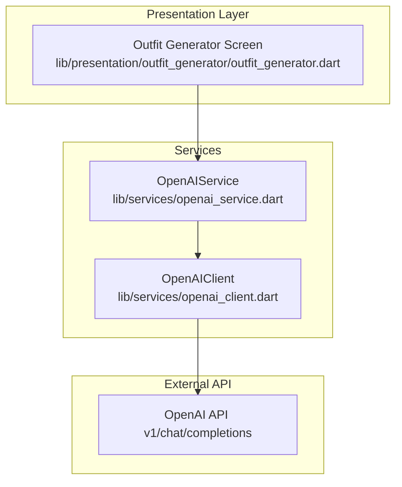
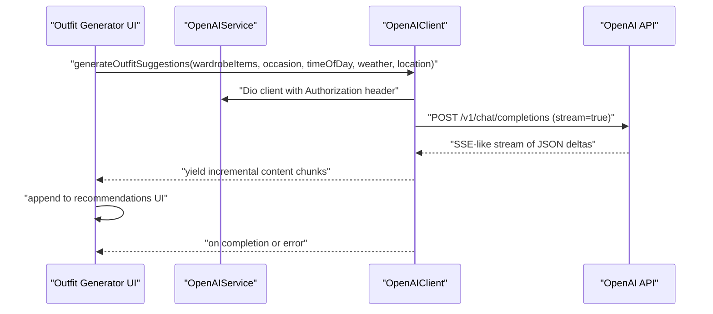
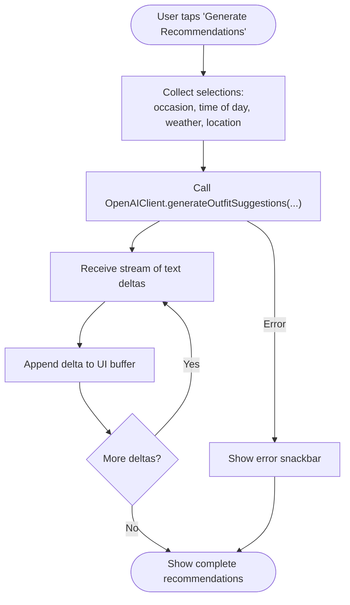
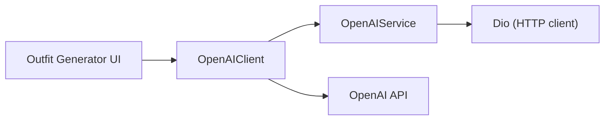

# OpenAI Service

<cite>
**Referenced Files in This Document**
- [openai_service.dart](file://lib/services/openai_service.dart)
- [openai_client.dart](file://lib/services/openai_client.dart)
- [outfit_generator.dart](file://lib/presentation/outfit_generator/outfit_generator.dart)
</cite>

## Table of Contents
1. [Introduction](#introduction)
2. [Project Structure](#project-structure)
3. [Core Components](#core-components)
4. [Architecture Overview](#architecture-overview)
5. [Detailed Component Analysis](#detailed-component-analysis)
6. [Dependency Analysis](#dependency-analysis)
7. [Performance Considerations](#performance-considerations)
8. [Troubleshooting Guide](#troubleshooting-guide)
9. [Conclusion](#conclusion)
10. [Appendices](#appendices)

## Introduction
This document describes the OpenAI Service that powers AI-driven fashion suggestions and natural language processing for PrismStyle AI. It explains how the service integrates with the OpenAI API, how prompts are engineered for outfit analysis and recommendations, and how responses are parsed and refined. It also covers authentication, API key management, streaming response handling, error management, and the end-to-end workflow from user selection to generated suggestions.

## Project Structure
The OpenAI integration spans two primary service layers:
- OpenAIService: Provides a singleton Dio client configured with OpenAI base URL and Authorization header using an API key injected via environment.
- OpenAIClient: Encapsulates API requests to analyze outfits and generate recommendations, including streaming support and response parsing.

These services are consumed by the Outfit Generator UI, which orchestrates user selections (occasion, time of day, weather, location) and triggers AI-powered suggestions.

**Diagram sources**
- [outfit_generator.dart](file://lib/presentation/outfit_generator/outfit_generator.dart#L554-L596)
- [openai_service.dart](file://lib/services/openai_service.dart#L1-L35)
- [openai_client.dart](file://lib/services/openai_client.dart#L1-L125)

**Section sources**
- [openai_service.dart](file://lib/services/openai_service.dart#L1-L35)
- [openai_client.dart](file://lib/services/openai_client.dart#L1-L125)
- [outfit_generator.dart](file://lib/presentation/outfit_generator/outfit_generator.dart#L554-L596)

## Core Components
- OpenAIService
  - Singleton that initializes a Dio client with OpenAI base URL and Authorization header.
  - Requires OPENAI_API_KEY to be provided via --dart-define during build.
  - Exposes a Dio instance for downstream clients to use.

- OpenAIClient
  - analyzeOutfit: Sends an image and contextual prompt to OpenAI and parses the returned text into an OutfitAnalysis object.
  - generateOutfitSuggestions: Streams partial tokens from OpenAI and yields incremental text chunks until completion.
  - OutfitAnalysis: Parses AI text into structured fields (worksWell, styleScore, feedback, suggestions).
  - OpenAIException: Custom exception wrapping HTTP status and error messages.

- Outfit Generator UI
  - Collects user selections (occasion, time of day, weather, optional location).
  - Calls OpenAIClient.generateOutfitSuggestions and renders streamed suggestions incrementally.
  - Handles errors and updates loading states.

**Section sources**
- [openai_service.dart](file://lib/services/openai_service.dart#L1-L35)
- [openai_client.dart](file://lib/services/openai_client.dart#L12-L125)
- [openai_client.dart](file://lib/services/openai_client.dart#L127-L183)
- [outfit_generator.dart](file://lib/presentation/outfit_generator/outfit_generator.dart#L554-L596)

## Architecture Overview
The service follows a layered architecture:
- Presentation layer triggers generation based on user context.
- Service layer encapsulates OpenAI API communication.
- Data layer transforms raw API responses into domain models.

**Diagram sources**
- [outfit_generator.dart](file://lib/presentation/outfit_generator/outfit_generator.dart#L554-L596)
- [openai_client.dart](file://lib/services/openai_client.dart#L59-L124)
- [openai_service.dart](file://lib/services/openai_service.dart#L18-L32)

## Detailed Component Analysis

### OpenAIService
Responsibilities:
- Enforce API key presence via environment injection.
- Configure Dio with base URL and Authorization header.
- Provide a shared Dio instance to consumers.

Key behaviors:
- Throws if OPENAI_API_KEY is missing.
- Sets Content-Type and Authorization headers globally on Dio.

Operational notes:
- Authentication is handled centrally; downstream clients only need to pass the Dio instance.
- Rate limiting and retries are not implemented here; callers should apply appropriate retry/backoff strategies if needed.

**Section sources**
- [openai_service.dart](file://lib/services/openai_service.dart#L8-L32)

### OpenAIClient
Responsibilities:
- Build and send requests to OpenAI chat completions endpoint.
- Support streaming for incremental suggestions.
- Parse textual responses into structured OutfitAnalysis.

Methods and flows:
- analyzeOutfit
  - Builds a multimodal message containing text instructions and an image URL.
  - Sends a single-shot request and returns a parsed OutfitAnalysis.
  - Wraps network errors into OpenAIException.

- generateOutfitSuggestions
  - Builds a user message from selected wardrobe items and contextual metadata.
  - Enables streaming and decodes SSE-like JSON deltas.
  - Yields non-empty content deltas until finish_reason indicates completion.
  - Wraps network errors into OpenAIException.

Response parsing (OutfitAnalysis):
- Works-well determination based on keywords.
- Style score extraction using regex patterns.
- Suggestions extracted from bulleted or numbered lists.
- Limits suggestions to a fixed count.

Error handling:
- Catches DioException and constructs OpenAIException with status and message.

**Section sources**
- [openai_client.dart](file://lib/services/openai_client.dart#L12-L56)
- [openai_client.dart](file://lib/services/openai_client.dart#L59-L124)
- [openai_client.dart](file://lib/services/openai_client.dart#L127-L183)

### Outfit Generator UI Integration
Workflow:
- Collects user selections (occasion, time of day, weather, optional location).
- Calls OpenAIClient.generateOutfitSuggestions with the current context.
- Renders streamed suggestions incrementally.
- Displays loading state and handles exceptions with user feedback.

**Diagram sources**
- [outfit_generator.dart](file://lib/presentation/outfit_generator/outfit_generator.dart#L554-L596)
- [openai_client.dart](file://lib/services/openai_client.dart#L59-L124)

**Section sources**
- [outfit_generator.dart](file://lib/presentation/outfit_generator/outfit_generator.dart#L554-L596)

## Dependency Analysis
- OpenAIService depends on Dio and environment configuration.
- OpenAIClient depends on OpenAIService for the Dio instance and on OpenAI’s API.
- Outfit Generator UI depends on OpenAIClient for suggestions and on WeatherService for contextual weather data.

**Diagram sources**
- [outfit_generator.dart](file://lib/presentation/outfit_generator/outfit_generator.dart#L253-L254)
- [openai_client.dart](file://lib/services/openai_client.dart#L1-L10)
- [openai_service.dart](file://lib/services/openai_service.dart#L18-L32)

**Section sources**
- [outfit_generator.dart](file://lib/presentation/outfit_generator/outfit_generator.dart#L253-L254)
- [openai_client.dart](file://lib/services/openai_client.dart#L1-L10)
- [openai_service.dart](file://lib/services/openai_service.dart#L18-L32)

## Performance Considerations
- Streaming: The service uses stream mode to reduce perceived latency by rendering suggestions incrementally.
- Token limits: max_completion_tokens is set to bound response sizes and cost.
- Reasoning effort: Minimal or low reasoning effort is used to optimize speed for stylistic suggestions.
- Network efficiency: Single-shot requests for analysis and streaming for recommendations balance responsiveness and throughput.
- Retry/backoff: Not implemented in the service; consider adding retry with exponential backoff for transient failures.

[No sources needed since this section provides general guidance]

## Troubleshooting Guide
Common issues and resolutions:
- Missing API key
  - Symptom: Initialization throws an exception indicating OPENAI_API_KEY must be provided.
  - Resolution: Pass the key via --dart-define during build.

- Network errors
  - Symptom: OpenAIException with HTTP status and message.
  - Resolution: Inspect status code and message; verify connectivity, API key validity, and rate limits.

- Parsing errors
  - Symptom: Unexpected OutfitAnalysis fields (e.g., missing score).
  - Resolution: Review prompt consistency and response format expectations.

- Empty or partial suggestions
  - Symptom: UI shows truncated recommendations.
  - Resolution: Confirm stream termination conditions and ensure finish_reason is respected.

**Section sources**
- [openai_service.dart](file://lib/services/openai_service.dart#L19-L21)
- [openai_client.dart](file://lib/services/openai_client.dart#L47-L55)
- [openai_client.dart](file://lib/services/openai_client.dart#L115-L123)

## Conclusion
The OpenAI Service provides a focused, efficient integration for generating fashion recommendations and analyzing outfits. By separating concerns between authentication/configuration (OpenAIService) and API interactions (OpenAIClient), the system remains maintainable and testable. The streaming recommendation pipeline improves user experience, while structured parsing ensures actionable insights. Proper error handling and environment-based configuration are essential for robust operation.

[No sources needed since this section summarizes without analyzing specific files]

## Appendices

### Prompt Engineering Strategies
- Outfit analysis prompt
  - Role: Professional fashion stylist
  - Inputs: Image URL, context, occasion, time of day, weather
  - Outputs: Overall assessment, style score, specific suggestions, color harmony, fit feedback
  - Reference: [openai_client.dart](file://lib/services/openai_client.dart#L21-L31)

- Recommendation prompt
  - Inputs: Wardrobe items, occasion, time of day, weather, optional location
  - Outputs: 3 complete outfit combinations with reasoning
  - Reference: [openai_client.dart](file://lib/services/openai_client.dart#L67-L87)

### Response Processing Mechanisms
- OutfitAnalysis parsing
  - Works-well detection via keywords
  - Score extraction via regex
  - Suggestions extraction from lists
  - Reference: [openai_client.dart](file://lib/services/openai_client.dart#L141-L171)

### Integration Patterns with Recommendation Engine
- Outfit Generator UI composes context from user selections and delegates to OpenAIClient.
- Weather context is fetched separately and combined with user selections.
- Reference: [outfit_generator.dart](file://lib/presentation/outfit_generator/outfit_generator.dart#L554-L596)