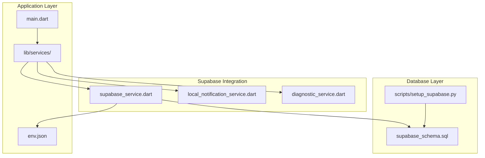
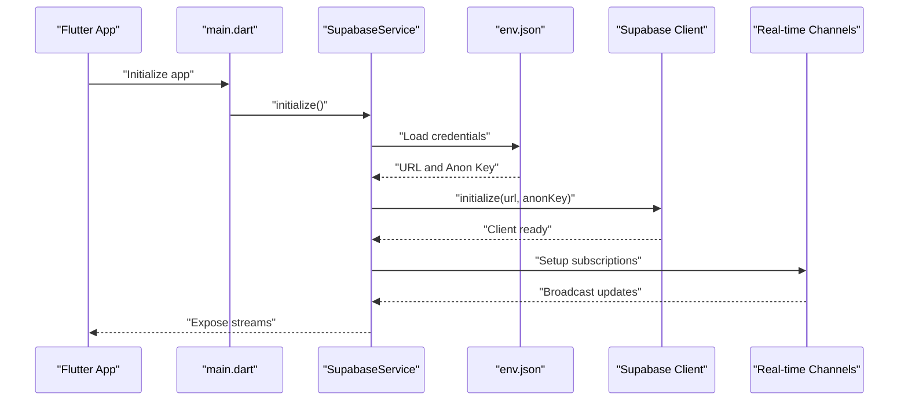
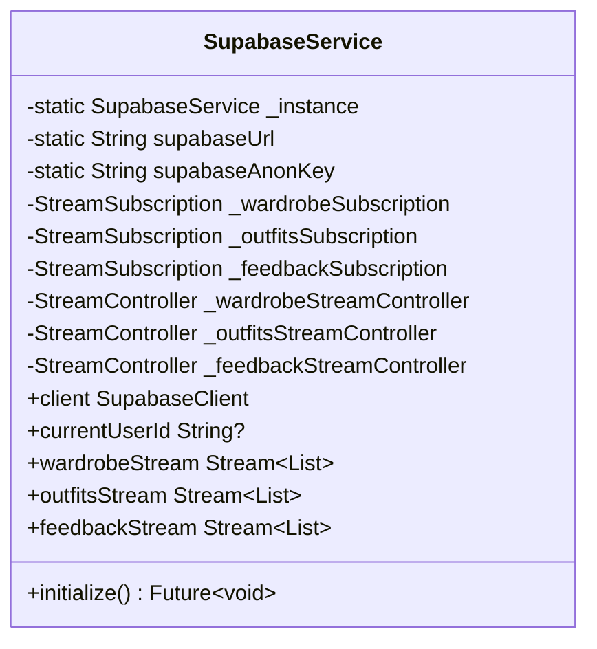
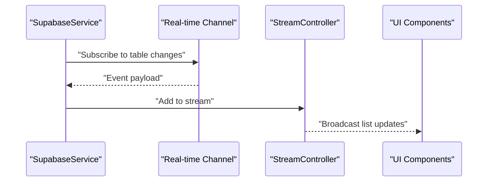
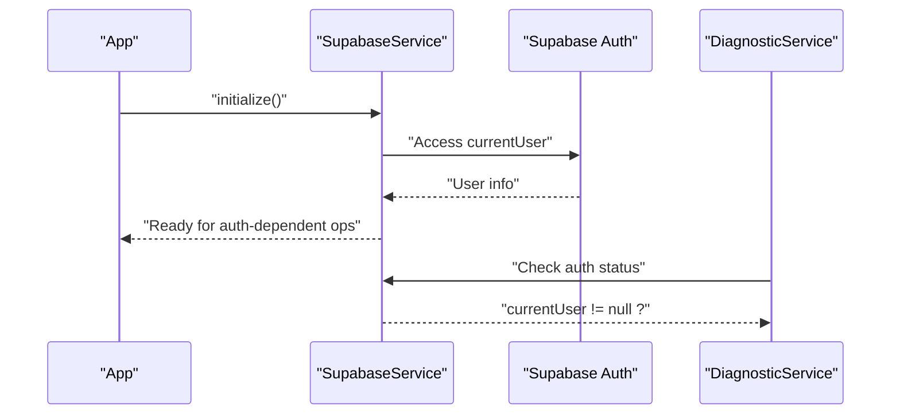
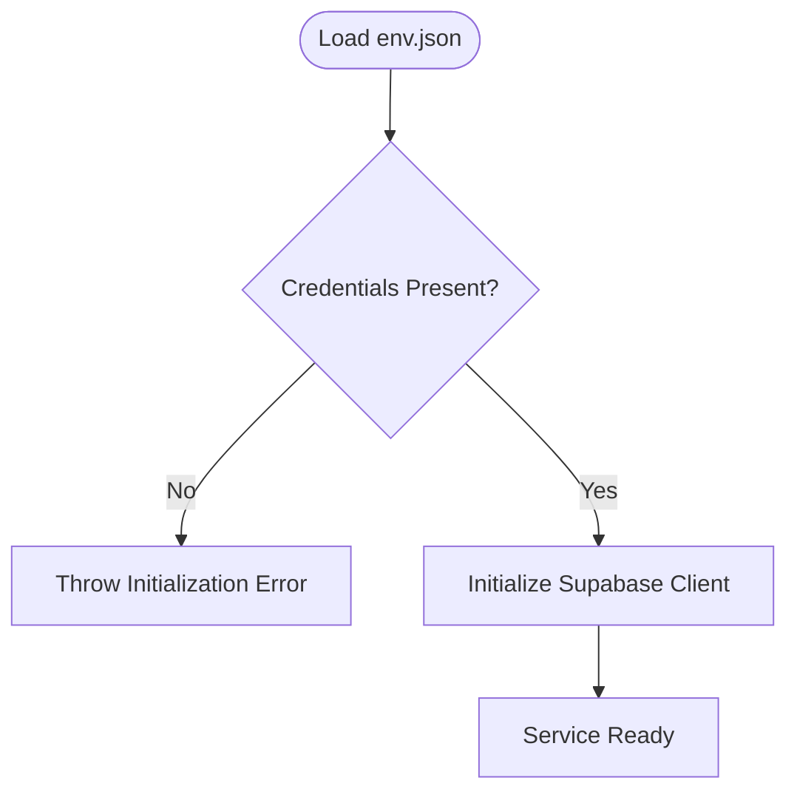
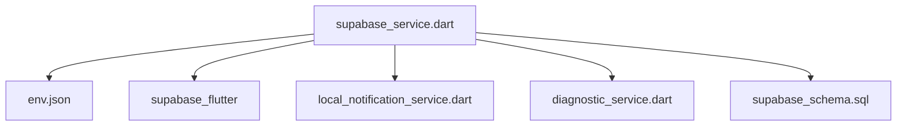

# Supabase Service

<cite>
**Referenced Files in This Document**
- [supabase_service.dart](file://lib/services/supabase_service.dart)
- [env.json](file://env.json)
- [supabase_schema.sql](file://supabase_schema.sql)
- [setup_supabase.py](file://scripts/setup_supabase.py)
- [local_notification_service.dart](file://lib/services/local_notification_service.dart)
- [diagnostic_service.dart](file://lib/services/diagnostic_service.dart)
- [main.dart](file://lib/main.dart)
</cite>

## Table of Contents
1. [Introduction](#introduction)
2. [Project Structure](#project-structure)
3. [Core Components](#core-components)
4. [Architecture Overview](#architecture-overview)
5. [Detailed Component Analysis](#detailed-component-analysis)
6. [Dependency Analysis](#dependency-analysis)
7. [Performance Considerations](#performance-considerations)
8. [Troubleshooting Guide](#troubleshooting-guide)
9. [Conclusion](#conclusion)

## Introduction
This document provides comprehensive documentation for the Supabase Service that powers real-time database integration and backend functionality for PrismStyle AI. It covers service initialization, authentication mechanisms, connection management, real-time subscription systems, conflict resolution strategies, offline-first architecture considerations, database schema integration, CRUD operations, query optimization, data validation strategies, authentication flows, user session management, security considerations, error handling, retry logic, network resilience, and configuration management via environment variables.

## Project Structure
The Supabase Service is implemented as a singleton service integrated into the Flutter application. It initializes the Supabase client using credentials loaded from the application's environment configuration, manages real-time subscriptions for synchronized data updates, and exposes reactive streams for UI components to consume.



**Diagram sources**
- [main.dart](file://lib/main.dart)
- [supabase_service.dart](file://lib/services/supabase_service.dart)
- [local_notification_service.dart](file://lib/services/local_notification_service.dart)
- [diagnostic_service.dart](file://lib/services/diagnostic_service.dart)
- [env.json](file://env.json)
- [supabase_schema.sql](file://supabase_schema.sql)
- [setup_supabase.py](file://scripts/setup_supabase.py)

**Section sources**
- [main.dart](file://lib/main.dart)
- [supabase_service.dart](file://lib/services/supabase_service.dart)
- [env.json](file://env.json)
- [supabase_schema.sql](file://supabase_schema.sql)
- [setup_supabase.py](file://scripts/setup_supabase.py)

## Core Components
- Singleton Service: Provides centralized access to the Supabase client and manages real-time subscriptions.
- Environment Configuration: Loads Supabase URL and anonymous key from env.json during initialization.
- Real-time Streams: Broadcasts synchronized data updates for wardrobe items, outfits, and feedback.
- Authentication Accessors: Exposes current user ID and client instance for downstream services.
- Initialization Lifecycle: Ensures credentials are present and initializes the Supabase client before use.

Key responsibilities:
- Initialize Supabase client with validated environment variables.
- Manage real-time subscriptions and stream controllers.
- Provide reactive streams for UI components.
- Support diagnostic checks for connectivity and authentication status.

**Section sources**
- [supabase_service.dart](file://lib/services/supabase_service.dart)
- [env.json](file://env.json)

## Architecture Overview
The Supabase Service integrates with the Flutter application through a singleton pattern. It loads environment variables, initializes the Supabase client, and sets up real-time channels for synchronized updates. Local notification service subscribes to PostgreSQL change events to deliver push-like notifications for social interactions.



**Diagram sources**
- [main.dart](file://lib/main.dart)
- [supabase_service.dart](file://lib/services/supabase_service.dart)
- [env.json](file://env.json)

## Detailed Component Analysis

### Supabase Service Implementation
The service encapsulates:
- Static singleton instance management.
- Real-time subscription fields and broadcast stream controllers.
- Public reactive streams for wardrobe, outfits, and feedback.
- Initialization routine that validates environment variables and initializes the Supabase client.
- Accessors for the Supabase client and current user ID.



**Diagram sources**
- [supabase_service.dart](file://lib/services/supabase_service.dart)

**Section sources**
- [supabase_service.dart](file://lib/services/supabase_service.dart)

### Real-time Subscription System
The service maintains separate subscriptions for:
- Wardrobe items: Updates to clothing inventory.
- Outfits: Changes to generated or saved outfits.
- Feedback: New comments or ratings on outfits.

Each subscription is managed via dedicated stream controllers and exposed as broadcast streams for UI consumption. The local notification service also subscribes to PostgreSQL change events for social notifications, filtering by user-specific criteria where applicable.



**Diagram sources**
- [supabase_service.dart](file://lib/services/supabase_service.dart)
- [local_notification_service.dart](file://lib/services/local_notification_service.dart)

**Section sources**
- [supabase_service.dart](file://lib/services/supabase_service.dart)
- [local_notification_service.dart](file://lib/services/local_notification_service.dart)

### Authentication Mechanisms and Session Management
- The service exposes the Supabase client and current user ID for downstream components.
- Diagnostic service demonstrates checking authentication status and performing a simple query against a public table to validate connectivity.
- Real-time listeners are conditionally set up only when a user is authenticated.

Authentication flow overview:
- Application starts and initializes Supabase with environment credentials.
- User authenticates via Supabase auth providers.
- Service accesses current user ID for scoped real-time subscriptions and policy enforcement.



**Diagram sources**
- [supabase_service.dart](file://lib/services/supabase_service.dart)
- [diagnostic_service.dart](file://lib/services/diagnostic_service.dart)

**Section sources**
- [supabase_service.dart](file://lib/services/supabase_service.dart)
- [diagnostic_service.dart](file://lib/services/diagnostic_service.dart)

### Database Schema Integration and Relationships
The schema defines core tables and policies for PrismStyle AI:
- Users: User profiles and preferences.
- Clothing Items: Wardrobe inventory with AI-detected attributes.
- Outfits: Generated and saved outfit configurations.
- Friend Relationships: Social connections between users.
- Outfit Feedback: Community-driven comments and ratings.
- Style History: Personalized style evolution tracking.
- Notifications: User-centric alerts.
- FCM Tokens: Push notification endpoint management.

Policies enforce row-level security ensuring users can only access their own data. Triggers automatically maintain updated_at timestamps for auditability.

```mermaid
erDiagram
USERS {
uuid id PK
string email UK
string username UK
jsonb style_preferences
timestamp created_at
timestamp updated_at
}
CLOTHING_ITEMS {
uuid id PK
uuid user_id FK
string name
string category
jsonb ai_attributes
timestamp created_at
timestamp updated_at
}
OUTFITS {
uuid id PK
uuid user_id FK
jsonb items JSONB
string title
timestamp created_at
timestamp updated_at
}
FRIEND_RELATIONSHIPS {
uuid id PK
uuid user_id FK
uuid friend_id FK
enum status
timestamp created_at
timestamp updated_at
}
OUTFIT_FEEDBACK {
uuid id PK
uuid user_id FK
uuid outfit_id FK
text comment
int rating
timestamp created_at
timestamp updated_at
}
STYLE_HISTORY {
uuid id PK
uuid user_id FK
jsonb style_data JSONB
timestamp created_at
}
NOTIFICATIONS {
uuid id PK
uuid user_id FK
string type
text content
boolean read
timestamp created_at
}
FCM_TOKENS {
uuid id PK
uuid user_id FK
string token
timestamp created_at
}
USERS ||--o{ CLOTHING_ITEMS : "owns"
USERS ||--o{ OUTFITS : "creates"
USERS ||--o{ FRIEND_RELATIONSHIPS : "initiates"
FRIEND_RELATIONSHIPS ||--o{ USERS : "is followed by"
USERS ||--o{ OUTFIT_FEEDBACK : "gives"
OUTFITS ||--o{ OUTFIT_FEEDBACK : "receives"
USERS ||--o{ STYLE_HISTORY : "records"
USERS ||--o{ NOTIFICATIONS : "receives"
USERS ||--o{ FCM_TOKENS : "manages"
```

**Diagram sources**
- [supabase_schema.sql](file://supabase_schema.sql)

**Section sources**
- [supabase_schema.sql](file://supabase_schema.sql)

### CRUD Operations and Query Patterns
- Initialization and Connectivity: The service loads environment variables and initializes the Supabase client. Diagnostic service performs a lightweight query against a public table to validate connectivity and RLS behavior.
- Data Access Patterns: Downstream services use the shared client to perform reads, writes, and real-time subscriptions. Real-time channels subscribe to specific tables to receive updates.
- Policy Compliance: Row-level security ensures that queries respect user ownership, preventing unauthorized access.

Example patterns:
- Read: Select counts or records with appropriate filters.
- Write: Insert, update, and delete operations scoped to the authenticated user.
- Real-time: Subscribe to table changes and broadcast updates to UI components.

**Section sources**
- [supabase_service.dart](file://lib/services/supabase_service.dart)
- [diagnostic_service.dart](file://lib/services/diagnostic_service.dart)
- [supabase_schema.sql](file://supabase_schema.sql)

### Conflict Resolution Strategies
- Optimistic Updates: UI components can optimistically update local state while pending server writes. On acknowledgment, conflicts are resolved by applying server-side authoritative state.
- Last-Write-Wins: For non-critical fields, the most recent update prevails.
- Merge Strategies: For structured data (e.g., JSONB arrays), merge logic can combine local additions with remote updates while preserving uniqueness.
- Idempotency Keys: Use unique keys for write operations to prevent duplicate entries during retries.

Note: Specific conflict resolution logic is application-specific and should be implemented per feature domain.

### Offline-First Architecture
- Local State Synchronization: Maintain a local cache of frequently accessed data (e.g., wardrobe items, recent outfits). Use reactive streams to reflect real-time updates when connectivity resumes.
- Operation Queuing: Queue write operations when offline and replay them upon reconnection with conflict resolution.
- Stale-While-Revalidate: Serve cached data immediately while refreshing from the server asynchronously.
- Data Validation: Validate data locally before attempting writes to reduce failed operations.

Note: Offline-first implementation details depend on the chosen caching and synchronization strategy.

### Data Validation Strategies
- Client-Side Validation: Enforce field constraints and data types before sending requests.
- Server-Side Validation: Leverage database constraints and triggers to maintain data integrity.
- RLS Policies: Ensure that all data access adheres to user-scoped policies.
- Audit Fields: Use triggers to automatically populate created_at and updated_at timestamps.

**Section sources**
- [supabase_schema.sql](file://supabase_schema.sql)

### Security Considerations
- Environment Variables: Store Supabase URL and anonymous key in env.json and avoid committing secrets to version control.
- Row-Level Security: Enable and configure policies so users can only access their own data.
- Real-time Access Control: Scope real-time subscriptions to authenticated users and apply filters.
- Token Management: Use secure storage for tokens and refresh mechanisms as needed.

**Section sources**
- [env.json](file://env.json)
- [supabase_schema.sql](file://supabase_schema.sql)

### Error Handling and Network Resilience
- Initialization Failures: Throw explicit exceptions when environment variables are missing or initialization fails.
- Connectivity Checks: Use diagnostic routines to verify connectivity and RLS behavior.
- Retry Logic: Implement exponential backoff for transient failures during initialization or data operations.
- Graceful Degradation: Continue functioning with cached data when network is unavailable.

**Section sources**
- [supabase_service.dart](file://lib/services/supabase_service.dart)
- [diagnostic_service.dart](file://lib/services/diagnostic_service.dart)

### Configuration Management
- Environment Loading: The service reads env.json at runtime to configure Supabase credentials.
- Setup Script: A Python script automates verification of Supabase connectivity, schema deployment, storage bucket creation, and real-time enablement.



**Diagram sources**
- [supabase_service.dart](file://lib/services/supabase_service.dart)
- [env.json](file://env.json)

**Section sources**
- [supabase_service.dart](file://lib/services/supabase_service.dart)
- [env.json](file://env.json)
- [setup_supabase.py](file://scripts/setup_supabase.py)

## Dependency Analysis
The Supabase Service depends on:
- Environment configuration for credentials.
- Supabase Flutter SDK for client operations and real-time subscriptions.
- Local notification service for social interaction alerts.
- Diagnostic service for connectivity and authentication checks.



**Diagram sources**
- [supabase_service.dart](file://lib/services/supabase_service.dart)
- [env.json](file://env.json)
- [local_notification_service.dart](file://lib/services/local_notification_service.dart)
- [diagnostic_service.dart](file://lib/services/diagnostic_service.dart)
- [supabase_schema.sql](file://supabase_schema.sql)

**Section sources**
- [supabase_service.dart](file://lib/services/supabase_service.dart)
- [local_notification_service.dart](file://lib/services/local_notification_service.dart)
- [diagnostic_service.dart](file://lib/services/diagnostic_service.dart)
- [supabase_schema.sql](file://supabase_schema.sql)

## Performance Considerations
- Minimize Real-time Payloads: Subscribe only to necessary tables and columns to reduce bandwidth.
- Efficient Queries: Use selective filters and pagination for large datasets.
- Trigger-Based Timestamps: Utilize triggers to avoid redundant timestamp updates.
- Reactive Streams: Use broadcast streams judiciously to avoid excessive recompositions.

## Troubleshooting Guide
Common issues and resolutions:
- Missing Credentials: Ensure env.json contains SUPABASE_URL and SUPABASE_ANON_KEY.
- Initialization Failure: Verify environment loading and handle exceptions gracefully.
- Authentication Issues: Confirm user authentication before setting up real-time listeners.
- Connectivity Problems: Use diagnostic checks to validate Supabase availability and RLS behavior.
- Schema Mismatch: Confirm that required tables and policies are deployed according to the schema.

**Section sources**
- [supabase_service.dart](file://lib/services/supabase_service.dart)
- [diagnostic_service.dart](file://lib/services/diagnostic_service.dart)
- [setup_supabase.py](file://scripts/setup_supabase.py)

## Conclusion
The Supabase Service provides a robust foundation for PrismStyle AI’s real-time database integration. By centralizing initialization, managing real-time subscriptions, enforcing security policies, and exposing reactive streams, it enables scalable and responsive UI components. Proper configuration, validation, and error handling ensure reliable operation across diverse network conditions.