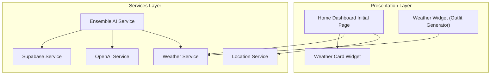
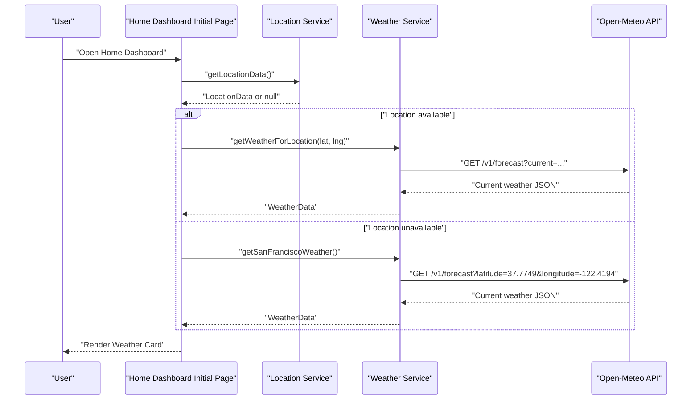
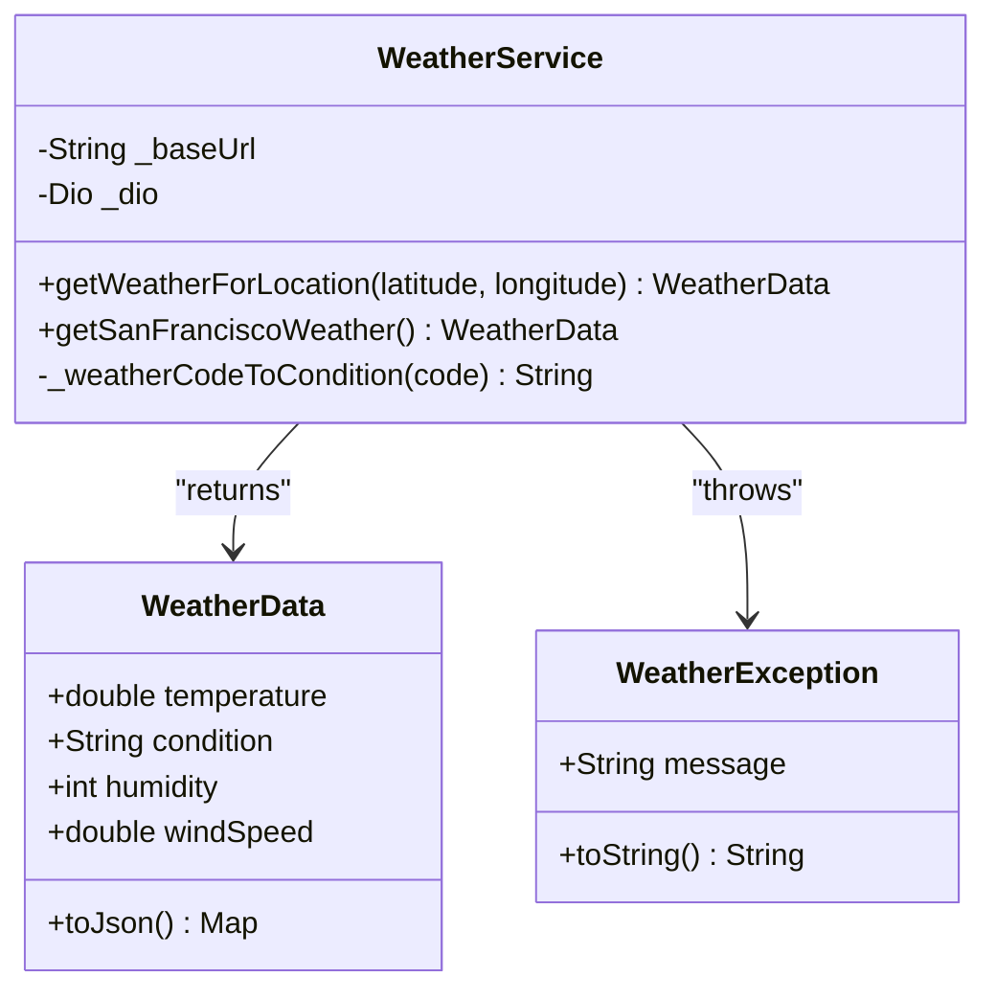
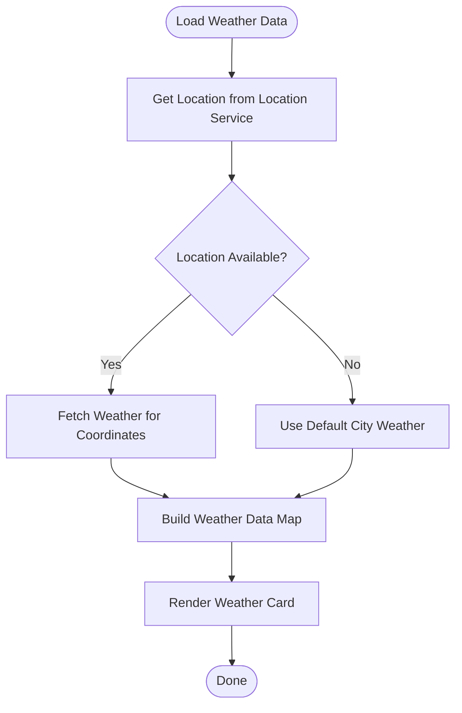
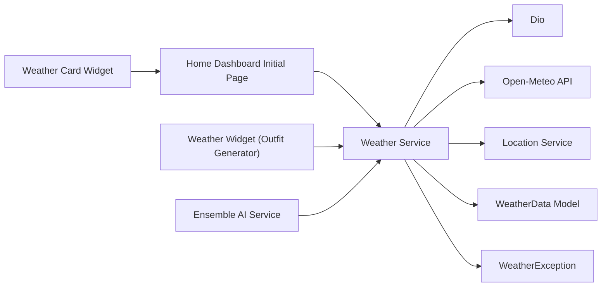

# Weather Service

<cite>
**Referenced Files in This Document**
- [weather_service.dart](file://lib/services/weather_service.dart)
- [location_service.dart](file://lib/services/location_service.dart)
- [home_dashboard_initial_page.dart](file://lib/presentation/home_dashboard/home_dashboard_initial_page.dart)
- [weather_card_widget.dart](file://lib/presentation/home_dashboard/widgets/weather_card_widget.dart)
- [weather_widget.dart](file://lib/presentation/outfit_generator/widgets/weather_widget.dart)
- [home_dashboard.dart](file://lib/presentation/home_dashboard/home_dashboard.dart)
- [ensemble_ai_service.dart](file://lib/services/ensemble_ai_service.dart)
- [openai_service.dart](file://lib/services/openai_service.dart)
- [supabase_service.dart](file://lib/services/supabase_service.dart)
</cite>

## Table of Contents
1. [Introduction](#introduction)
2. [Project Structure](#project-structure)
3. [Core Components](#core-components)
4. [Architecture Overview](#architecture-overview)
5. [Detailed Component Analysis](#detailed-component-analysis)
6. [Dependency Analysis](#dependency-analysis)
7. [Performance Considerations](#performance-considerations)
8. [Troubleshooting Guide](#troubleshooting-guide)
9. [Conclusion](#conclusion)
10. [Appendices](#appendices)

## Introduction
This document provides comprehensive documentation for the Weather Service that powers contextual weather data integration for PrismStyle AI's outfit recommendations. It explains the weather API integration with Open-Meteo, data fetching mechanisms, error handling, and the integration with the Location Service. It also covers how weather data informs outfit suggestions, compatibility scoring, seasonal recommendations, and user preference adaptation, while addressing privacy, offline handling, and performance optimization.

## Project Structure
The Weather Service resides in the services layer and integrates with presentation components that render weather information and influence outfit generation. The primary integration points are:
- Weather Service: API client and data model
- Location Service: Provides coordinates and default fallback location
- Home Dashboard: Displays weather card and triggers weather loading
- Outfit Generator: Uses weather widget to inform recommendations
- Ensemble AI Service: Coordinates AI-driven recommendations that incorporate weather context
- OpenAI Service and Supabase Service: Support broader AI and data persistence workflows

**Diagram sources**
- [home_dashboard_initial_page.dart](file://lib/presentation/home_dashboard/home_dashboard_initial_page.dart#L188-L253)
- [weather_service.dart](file://lib/services/weather_service.dart#L1-L103)
- [location_service.dart](file://lib/services/location_service.dart)
- [weather_card_widget.dart](file://lib/presentation/home_dashboard/widgets/weather_card_widget.dart)
- [weather_widget.dart](file://lib/presentation/outfit_generator/widgets/weather_widget.dart)
- [ensemble_ai_service.dart](file://lib/services/ensemble_ai_service.dart)
- [openai_service.dart](file://lib/services/openai_service.dart)
- [supabase_service.dart](file://lib/services/supabase_service.dart)

**Section sources**
- [weather_service.dart](file://lib/services/weather_service.dart#L1-L103)
- [home_dashboard_initial_page.dart](file://lib/presentation/home_dashboard/home_dashboard_initial_page.dart#L188-L253)

## Core Components
- Weather Service: Implements a Dio-based client to fetch current weather for given coordinates from Open-Meteo. It transforms WMO weather codes into human-readable conditions and exposes typed WeatherData with temperature, condition, humidity, and wind speed.
- WeatherData Model: Encapsulates weather attributes and provides JSON serialization for downstream consumption.
- WeatherException: Standardized exception type for weather-related errors.
- Location Service: Supplies user coordinates and default fallback location for weather queries.
- Home Dashboard Initial Page: Orchestrates weather loading, handles exceptions, and falls back to a default city when location or network fails.
- Weather Card Widget and Weather Widget: Presentational components that consume weather data for display and recommendation context.

Key responsibilities:
- Real-time weather retrieval via Open-Meteo
- Location-based weather context for outfit recommendations
- Graceful degradation to default location on failure
- Data transformation for UI and recommendation systems

**Section sources**
- [weather_service.dart](file://lib/services/weather_service.dart#L1-L103)
- [home_dashboard_initial_page.dart](file://lib/presentation/home_dashboard/home_dashboard_initial_page.dart#L188-L253)

## Architecture Overview
The Weather Service follows a layered architecture:
- Presentation Layer: Widgets and screens trigger weather loading and display results.
- Services Layer: Weather Service encapsulates API communication; Location Service supplies coordinates; Ensemble AI Service coordinates recommendation logic.
- External Integrations: Open-Meteo API for weather data; optional AI services and database for broader recommendation workflows.

**Diagram sources**
- [home_dashboard_initial_page.dart](file://lib/presentation/home_dashboard/home_dashboard_initial_page.dart#L188-L253)
- [weather_service.dart](file://lib/services/weather_service.dart#L18-L68)
- [location_service.dart](file://lib/services/location_service.dart)

## Detailed Component Analysis

### Weather Service
Responsibilities:
- Configure Dio client with timeouts
- Fetch current weather for coordinates
- Transform WMO weather codes to readable conditions
- Return typed WeatherData for downstream use

Processing Logic:
- Validates coordinates and requests current weather fields: temperature, humidity, wind speed, and weather code
- Converts numeric weather code to condition string
- Wraps network errors into WeatherException

**Diagram sources**
- [weather_service.dart](file://lib/services/weather_service.dart#L5-L103)

**Section sources**
- [weather_service.dart](file://lib/services/weather_service.dart#L1-L103)

### WeatherData Model
Responsibilities:
- Encapsulate weather attributes
- Provide JSON serialization for persistence or transport

Attributes:
- Temperature (converted to double)
- Condition (human-readable)
- Humidity (integer percentage)
- Wind speed (converted to double)

Serialization:
- Rounds temperature and wind speed for compact representation

**Section sources**
- [weather_service.dart](file://lib/services/weather_service.dart#L71-L93)

### WeatherException
Responsibilities:
- Standardize error messaging for weather operations
- Enable centralized error handling in presentation layer

**Section sources**
- [weather_service.dart](file://lib/services/weather_service.dart#L95-L103)

### Location Service Integration
Responsibilities:
- Provide user coordinates for weather queries
- Supply default location fallback when GPS is unavailable

Integration Pattern:
- Home Dashboard calls Location Service to obtain coordinates
- If null, Weather Service default method is used

**Section sources**
- [home_dashboard_initial_page.dart](file://lib/presentation/home_dashboard/home_dashboard_initial_page.dart#L188-L253)
- [location_service.dart](file://lib/services/location_service.dart)

### Home Dashboard Weather Loading
Responsibilities:
- Request location from Location Service
- Fetch weather for location or fall back to default city
- Build weather data map for UI rendering and recommendation context
- Handle exceptions and update loading state

**Diagram sources**
- [home_dashboard_initial_page.dart](file://lib/presentation/home_dashboard/home_dashboard_initial_page.dart#L188-L253)

**Section sources**
- [home_dashboard_initial_page.dart](file://lib/presentation/home_dashboard/home_dashboard_initial_page.dart#L188-L253)

### Weather Card Widget
Responsibilities:
- Display temperature, condition, location, and associated imagery
- Provide semantic labels for accessibility
- Integrate with Home Dashboard's weather data structure

Integration:
- Consumes weatherData map built by Home Dashboard Initial Page

**Section sources**
- [weather_card_widget.dart](file://lib/presentation/home_dashboard/widgets/weather_card_widget.dart)

### Weather Widget (Outfit Generator)
Responsibilities:
- Present weather context within the Outfit Generator
- Influence recommendation algorithms with current conditions

Integration:
- Uses Weather Service data to inform compatibility scoring and seasonal suggestions

**Section sources**
- [weather_widget.dart](file://lib/presentation/outfit_generator/widgets/weather_widget.dart)

### Ensemble AI Service Coordination
Responsibilities:
- Coordinate AI-driven recommendations that incorporate weather context
- Integrate with OpenAI Service and Supabase Service for broader recommendation workflows

Integration:
- Receives WeatherData from Weather Service
- Uses OpenAI Service for LLM-based reasoning
- Persists or retrieves user preferences via Supabase Service

**Section sources**
- [ensemble_ai_service.dart](file://lib/services/ensemble_ai_service.dart)
- [openai_service.dart](file://lib/services/openai_service.dart)
- [supabase_service.dart](file://lib/services/supabase_service.dart)

## Dependency Analysis
Weather Service depends on:
- Dio for HTTP requests
- Open-Meteo API for weather data
- Location Service for coordinates
- Presentation components for UI integration

**Diagram sources**
- [weather_service.dart](file://lib/services/weather_service.dart#L1-L103)
- [home_dashboard_initial_page.dart](file://lib/presentation/home_dashboard/home_dashboard_initial_page.dart#L188-L253)
- [weather_card_widget.dart](file://lib/presentation/home_dashboard/widgets/weather_card_widget.dart)
- [weather_widget.dart](file://lib/presentation/outfit_generator/widgets/weather_widget.dart)
- [ensemble_ai_service.dart](file://lib/services/ensemble_ai_service.dart)

**Section sources**
- [weather_service.dart](file://lib/services/weather_service.dart#L1-L103)
- [home_dashboard_initial_page.dart](file://lib/presentation/home_dashboard/home_dashboard_initial_page.dart#L188-L253)

## Performance Considerations
- Network timeouts: Dio client configured with connection and receive timeouts to prevent blocking UI threads.
- Minimal payload: Requests only required fields (temperature, humidity, wind speed, weather code) to reduce bandwidth and parsing overhead.
- Caching strategy: No explicit caching is implemented in the Weather Service. Consider adding short-lived in-memory cache keyed by coordinates to avoid redundant network calls during a single session.
- Batch operations: If multiple weather requests are needed, batch them to minimize repeated network round trips.
- UI responsiveness: Keep weather loading asynchronous and update UI incrementally to maintain smooth user experience.

[No sources needed since this section provides general guidance]

## Troubleshooting Guide
Common issues and recovery strategies:
- Network failures: Catch DioException and fall back to default city weather. Log the error and notify the user if necessary.
- API rate limits: Implement retry with exponential backoff and jitter. Consider caching recent responses to mitigate frequent refreshes.
- Data validation: Validate numeric fields and handle nulls gracefully. Ensure WeatherData serialization rounds values appropriately.
- Location unavailability: Use Location Service default location and display a message indicating approximate weather.
- Error surfacing: Use WeatherException for consistent error messages across the app.

**Section sources**
- [weather_service.dart](file://lib/services/weather_service.dart#L46-L50)
- [home_dashboard_initial_page.dart](file://lib/presentation/home_dashboard/home_dashboard_initial_page.dart#L217-L232)

## Conclusion
The Weather Service provides a focused, reliable mechanism for retrieving contextual weather data from Open-Meteo and integrating it into PrismStyle AI’s recommendation pipeline. Its clean separation of concerns, strong typing with WeatherData, and robust error handling enable seamless weather-aware outfit suggestions. Extending with caching and retry strategies would further improve resilience and performance.

[No sources needed since this section summarizes without analyzing specific files]

## Appendices

### Privacy Considerations
- Location data: Only transmit coordinates to the Weather Service; avoid persisting raw location data unless explicitly required. Ensure user consent and provide opt-out mechanisms.
- Weather data: Treat WeatherData as sensitive context; do not log personally identifiable information alongside it.
- Defaults: Prefer default city weather when location is unavailable to minimize data exposure.

[No sources needed since this section provides general guidance]

### Offline Weather Data Handling
- Store last known WeatherData locally for the current session.
- On resume, attempt to refresh weather; if unavailable, continue with cached data and indicate staleness to the user.
- Respect user preferences for offline mode by disabling weather-dependent recommendations when network is unavailable.

[No sources needed since this section provides general guidance]

### Recommendation Algorithms and Patterns
- Compatibility scoring: Adjust compatibility weights based on temperature thresholds, precipitation likelihood, and wind speed.
- Seasonal recommendations: Bias toward lightweight fabrics in warm weather and insulated layers in cold conditions.
- User preference adaptation: Incorporate user-preferred temperature ranges and style preferences into recommendation scoring.
- Ensemble AI coordination: Use Ensemble AI Service to combine weather context with LLM reasoning and historical preferences.

[No sources needed since this section provides general guidance]