# Data Management

<cite>
**Referenced Files in This Document**
- [supabase_schema.sql](file://supabase_schema.sql)
- [supabase_service.dart](file://lib/services/supabase_service.dart)
- [setup_supabase.py](file://scripts/setup_supabase.py)
- [env.json](file://env.json)
- [diagnostic_service.dart](file://lib/services/diagnostic_service.dart)
</cite>

## Table of Contents
1. [Introduction](#introduction)
2. [Project Structure](#project-structure)
3. [Core Components](#core-components)
4. [Architecture Overview](#architecture-overview)
5. [Detailed Component Analysis](#detailed-component-analysis)
6. [Dependency Analysis](#dependency-analysis)
7. [Performance Considerations](#performance-considerations)
8. [Troubleshooting Guide](#troubleshooting-guide)
9. [Conclusion](#conclusion)
10. [Appendices](#appendices)

## Introduction
This document provides comprehensive data management documentation for PrismStyle AI’s database architecture built on Supabase PostgreSQL. It covers the schema design for users, clothing items, outfits, and related entities, real-time synchronization patterns, offline-first data management approaches, data access/query patterns, caching strategies for mobile performance, migration and version management, data lifecycle policies, security and privacy controls, backup and recovery procedures, validation rules, and integrity constraints. It also explains how the local application state integrates with the remote database via Supabase’s real-time subscriptions.

## Project Structure
The data management layer centers around:
- Supabase PostgreSQL schema defining tables, constraints, indexes, row-level security (RLS), and triggers
- Supabase service client in the Flutter app for database operations and real-time subscriptions
- Setup automation script to validate connectivity and guide manual steps for schema, storage, and replication
- Environment configuration for Supabase credentials
- Diagnostic utilities to verify database connectivity and permissions

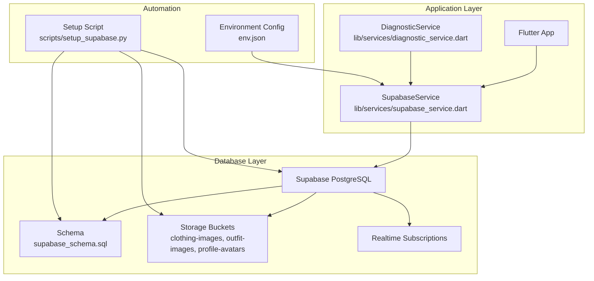

**Diagram sources**
- [supabase_service.dart](file://lib/services/supabase_service.dart#L1-L673)
- [supabase_schema.sql](file://supabase_schema.sql#L1-L319)
- [setup_supabase.py](file://scripts/setup_supabase.py#L1-L274)
- [env.json](file://env.json#L1-L13)
- [diagnostic_service.dart](file://lib/services/diagnostic_service.dart#L110-L145)

**Section sources**
- [supabase_service.dart](file://lib/services/supabase_service.dart#L1-L673)
- [supabase_schema.sql](file://supabase_schema.sql#L1-L319)
- [setup_supabase.py](file://scripts/setup_supabase.py#L1-L274)
- [env.json](file://env.json#L1-L13)
- [diagnostic_service.dart](file://lib/services/diagnostic_service.dart#L110-L145)

## Core Components
- SupabaseService: Centralized service for initializing Supabase, performing CRUD operations, managing real-time subscriptions, and handling storage uploads.
- Supabase Schema: Defines tables, constraints, indexes, RLS policies, triggers, and replication enablement for real-time.
- Setup Script: Automates connection checks, prints manual setup steps, and verifies table existence.
- Environment Configuration: Supplies Supabase URL, anonymous key, and secret key to the app.
- Diagnostic Service: Validates connectivity, authentication status, and query capability.

Key responsibilities:
- Data modeling and validation via PostgreSQL constraints and JSONB fields
- Access control via RLS policies scoped to authenticated users
- Real-time synchronization for wardrobe, outfits, and feedback
- Storage integration for images with bucket policies
- Operational diagnostics for connectivity and permission checks

**Section sources**
- [supabase_service.dart](file://lib/services/supabase_service.dart#L1-L673)
- [supabase_schema.sql](file://supabase_schema.sql#L1-L319)
- [setup_supabase.py](file://scripts/setup_supabase.py#L1-L274)
- [env.json](file://env.json#L1-L13)
- [diagnostic_service.dart](file://lib/services/diagnostic_service.dart#L110-L145)

## Architecture Overview
The system follows an offline-first, real-time sync architecture:
- Local state is represented by model classes and managed through streams for reactive UI updates.
- SupabaseService encapsulates all database interactions and exposes typed APIs for models.
- Real-time subscriptions stream changes from selected tables to keep local state synchronized.
- Storage buckets handle media assets with per-user scoping and public read access.

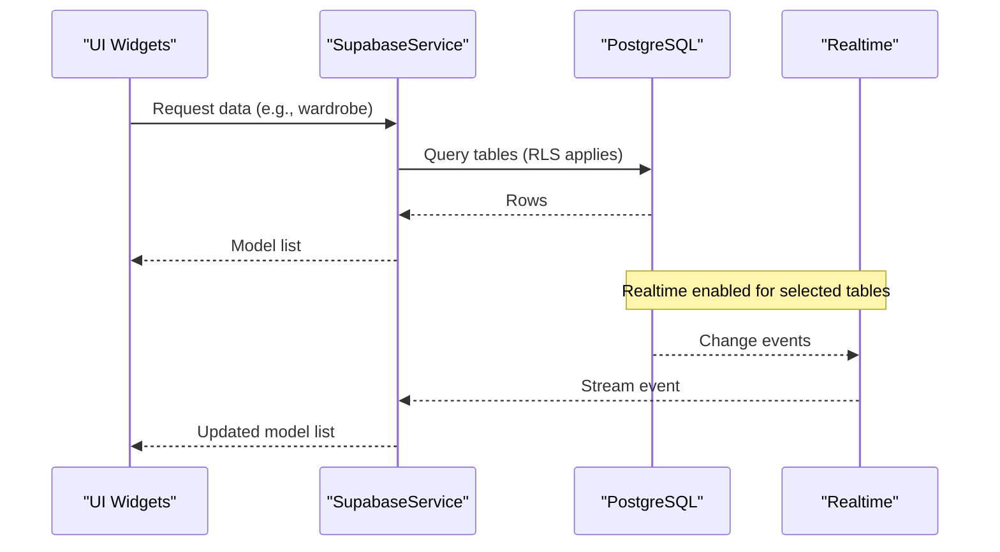

**Diagram sources**
- [supabase_service.dart](file://lib/services/supabase_service.dart#L395-L447)
- [supabase_schema.sql](file://supabase_schema.sql#L314-L319)

**Section sources**
- [supabase_service.dart](file://lib/services/supabase_service.dart#L395-L447)
- [supabase_schema.sql](file://supabase_schema.sql#L314-L319)

## Detailed Component Analysis

### Database Schema: Users
- Purpose: Store user profiles, style preferences, and identity attributes.
- Constraints:
  - Gender constrained to predefined values
  - Unique email
  - JSONB for flexible style preferences
- Indexes: Email lookup
- RLS: Users can select/update only their own profile
- Triggers: Automatic updated_at timestamp

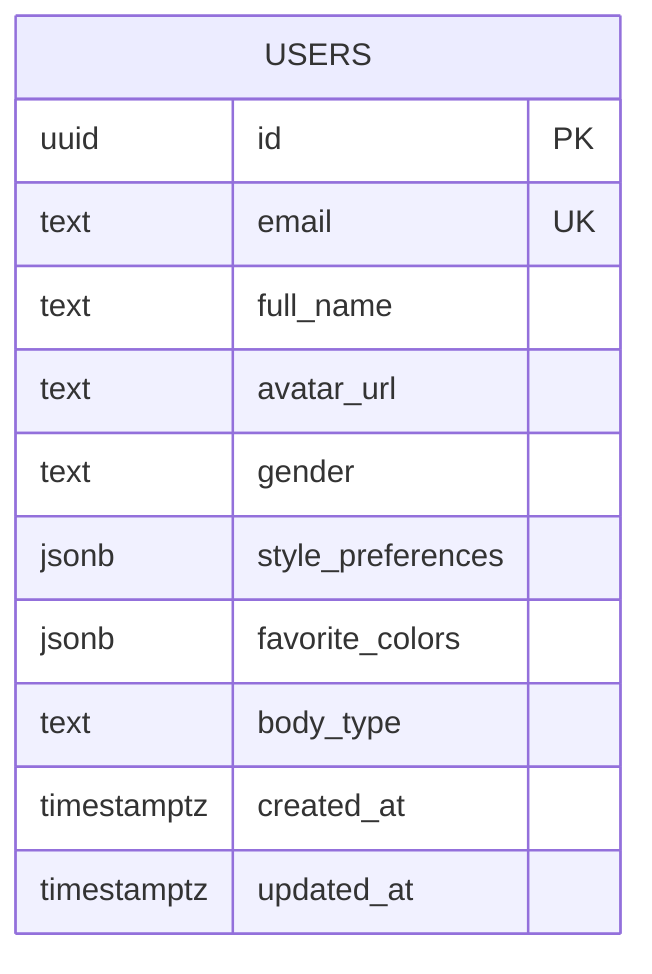

**Diagram sources**
- [supabase_schema.sql](file://supabase_schema.sql#L11-L22)

**Section sources**
- [supabase_schema.sql](file://supabase_schema.sql#L11-L22)

### Database Schema: Clothing Items
- Purpose: Store wardrobe items with AI-detected attributes and metadata.
- Constraints:
  - Category constrained to predefined values
  - Pattern defaults to Solid
  - AI confidence bounded to [0,1]
  - JSONB for predictions, color analysis, and metadata
- Indexes: user_id, category, color, favorites
- RLS: Users can view, insert, update, delete only their own items
- Triggers: Automatic updated_at timestamp

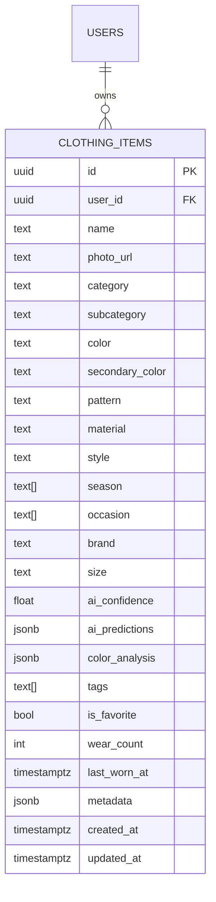

**Diagram sources**
- [supabase_schema.sql](file://supabase_schema.sql#L31-L57)

**Section sources**
- [supabase_schema.sql](file://supabase_schema.sql#L31-L57)

### Database Schema: Outfits
- Purpose: Store generated and saved outfit combinations with metadata.
- Constraints:
  - Compatibility score bounded to [0,100]
  - JSONB for outfit data
- Indexes: user_id, is_saved, occasion
- RLS: Users can view/update/delete only their own outfits; public viewing of shared outfits
- Triggers: Automatic updated_at timestamp

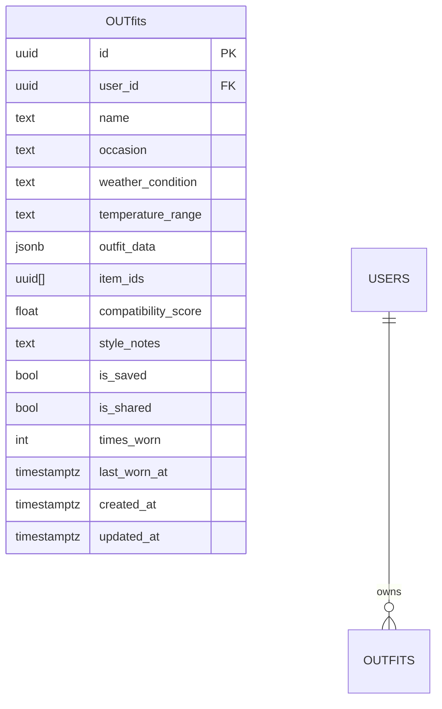

**Diagram sources**
- [supabase_schema.sql](file://supabase_schema.sql#L69-L86)

**Section sources**
- [supabase_schema.sql](file://supabase_schema.sql#L69-L86)

### Database Schema: Friend Relationships
- Purpose: Manage social connections between users.
- Constraints:
  - Status constrained to pending, accepted, rejected, blocked
  - Unique constraint on (user_id, friend_id)
- Indexes: user_id, friend_id, status
- RLS: Users can view/update only their own relationships

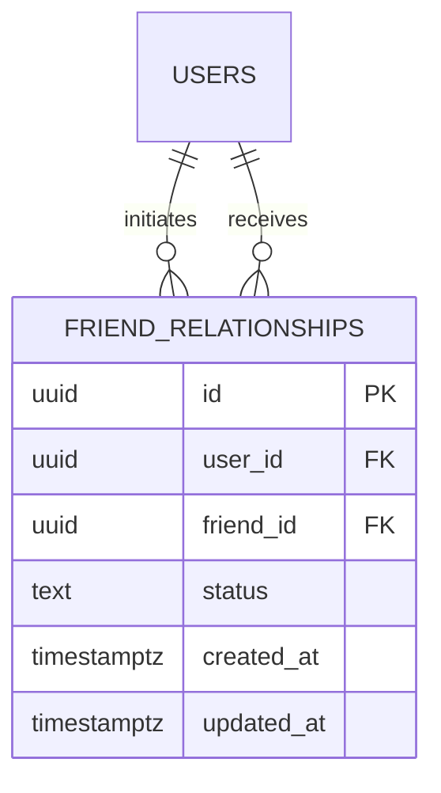

**Diagram sources**
- [supabase_schema.sql](file://supabase_schema.sql#L97-L105)

**Section sources**
- [supabase_schema.sql](file://supabase_schema.sql#L97-L105)

### Database Schema: Outfit Feedback
- Purpose: Community feedback and ratings on shared outfits.
- Constraints:
  - Rating bounded to [1,5]
  - Reaction constrained to predefined values
  - Unique constraint on (outfit_id, from_user_id)
- Indexes: outfit_id, from_user_id
- RLS: Viewable by all; insert restricted to authenticated users

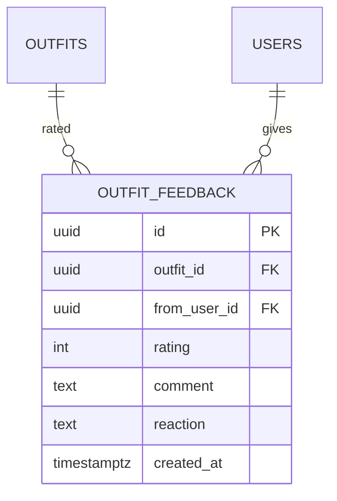

**Diagram sources**
- [supabase_schema.sql](file://supabase_schema.sql#L116-L125)

**Section sources**
- [supabase_schema.sql](file://supabase_schema.sql#L116-L125)

### Database Schema: Style History
- Purpose: Track outfit wearing history for recommendations.
- Constraints:
  - User rating bounded to [1,5]
- Indexes: user_id, worn_date
- RLS: Users can view/insert only their own history

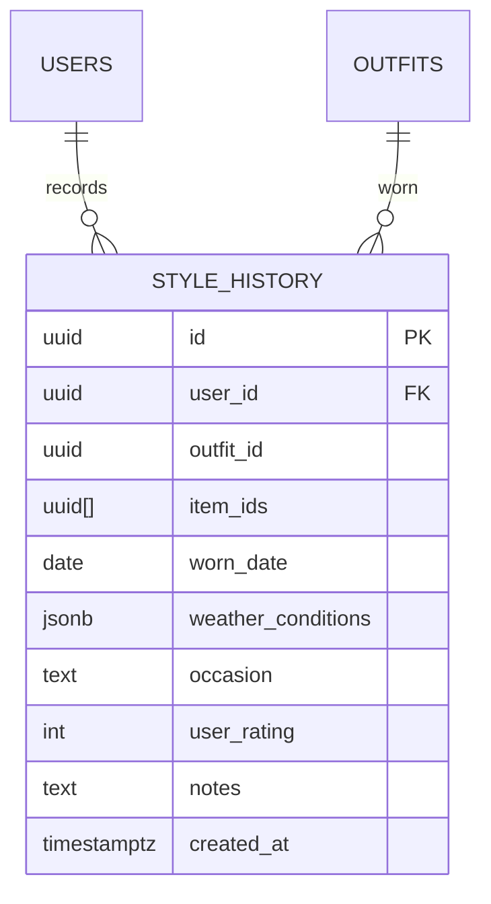

**Diagram sources**
- [supabase_schema.sql](file://supabase_schema.sql#L135-L146)

**Section sources**
- [supabase_schema.sql](file://supabase_schema.sql#L135-L146)

### Database Schema: Notifications and FCM Tokens
- Notifications: Store user-specific notifications with types and read status.
- FCM Tokens: Store push notification tokens scoped to users with device info.
- RLS: Users can view/update only their own notifications; manage their own tokens.

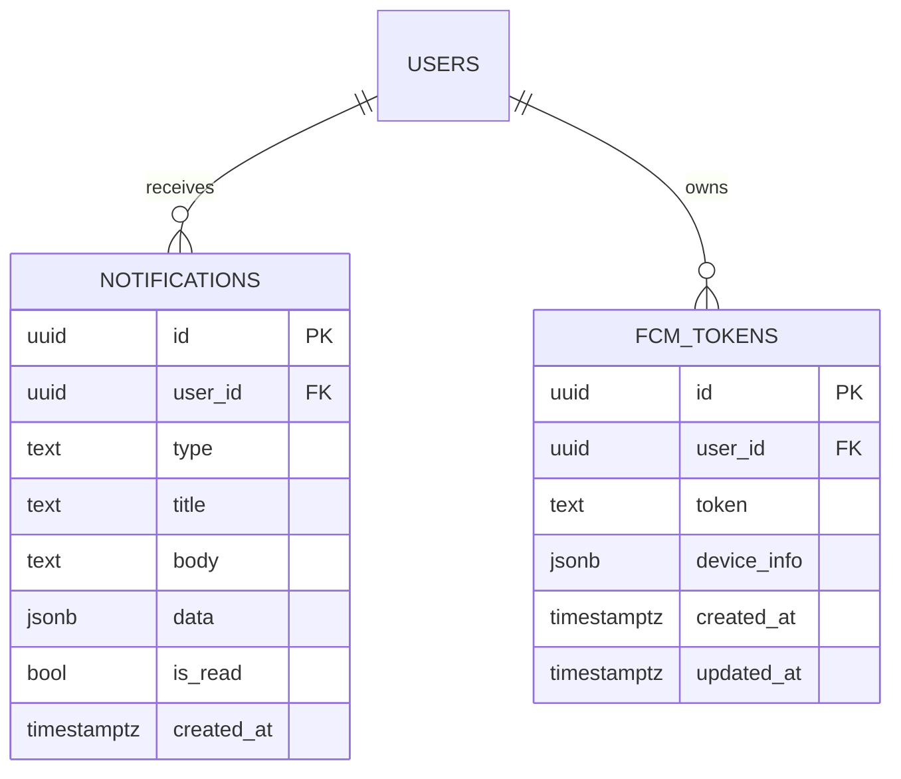

**Diagram sources**
- [supabase_schema.sql](file://supabase_schema.sql#L156-L183)

**Section sources**
- [supabase_schema.sql](file://supabase_schema.sql#L156-L183)

### Application Service: SupabaseService
Responsibilities:
- Initialize Supabase client from environment
- Provide typed CRUD operations for models
- Manage real-time subscriptions for wardrobe, outfits, and feedback
- Upload images to Supabase Storage buckets
- Dispose subscriptions and streams

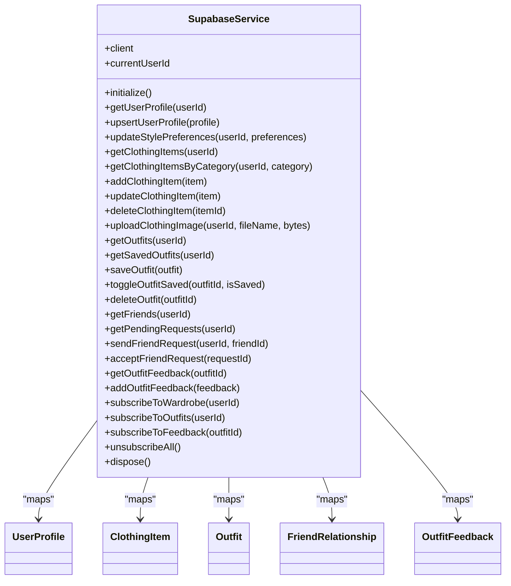

**Diagram sources**
- [supabase_service.dart](file://lib/services/supabase_service.dart#L16-L448)

**Section sources**
- [supabase_service.dart](file://lib/services/supabase_service.dart#L16-L448)

### Real-Time Subscriptions and Offline-First Patterns
- Enabled tables: clothing_items, outfits, outfit_feedback, notifications
- Subscription logic filters by user_id or outfit_id to scope updates
- Streams broadcast updates to UI components for reactive rendering
- Offline-first approach: local UI renders immediately; real-time sync reconciles changes when online

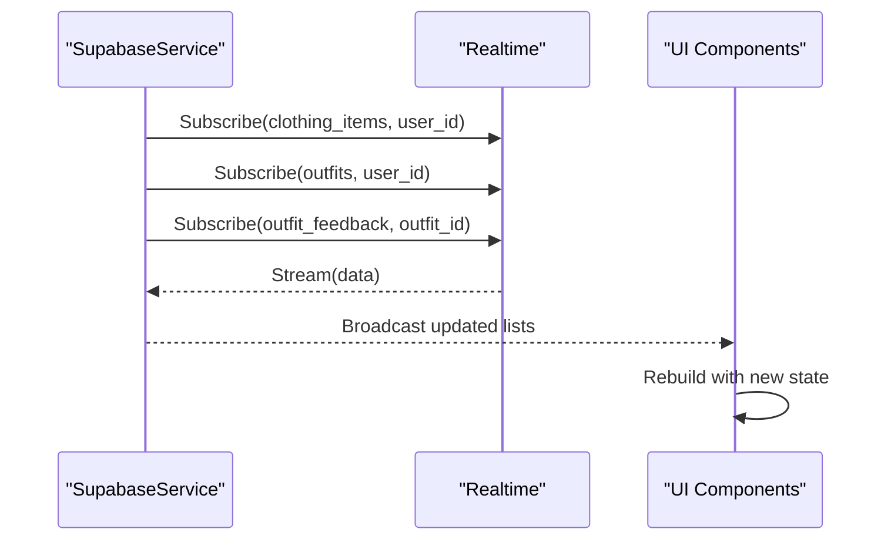

**Diagram sources**
- [supabase_service.dart](file://lib/services/supabase_service.dart#L395-L432)
- [supabase_schema.sql](file://supabase_schema.sql#L314-L319)

**Section sources**
- [supabase_service.dart](file://lib/services/supabase_service.dart#L395-L432)
- [supabase_schema.sql](file://supabase_schema.sql#L314-L319)

### Data Access Patterns and Query Optimization
- Indexed columns: email (users), user_id (clothing_items, outfits, friend_relationships, notifications, fcm_tokens), category, color, is_favorite (clothing_items), is_saved (outfits), occasion (outfits), status (friend_relationships), outfit_id, from_user_id (outfit_feedback), user_id, worn_date (style_history)
- Efficient queries:
  - Filter by user_id for personal data
  - Use category/color filters for wardrobe browsing
  - Order by created_at desc for latest-first views
- JSONB fields support flexible attributes without schema churn

**Section sources**
- [supabase_schema.sql](file://supabase_schema.sql#L24-L25)
- [supabase_schema.sql](file://supabase_schema.sql#L59-L63)
- [supabase_schema.sql](file://supabase_schema.sql#L88-L92)
- [supabase_schema.sql](file://supabase_schema.sql#L107-L110)
- [supabase_schema.sql](file://supabase_schema.sql#L148-L150)
- [supabase_service.dart](file://lib/services/supabase_service.dart#L118-L154)
- [supabase_service.dart](file://lib/services/supabase_service.dart#L219-L252)

### Caching Strategies for Mobile Performance
- Real-time streams minimize repeated polling and keep UI fresh
- Local model mapping ensures predictable serialization/deserialization
- Storage uploads leverage Supabase buckets for scalable media delivery
- Recommendations can be derived from style_history and outfit_feedback aggregates

Note: The codebase demonstrates real-time subscriptions and model mapping; explicit local persistence caches are not present in the analyzed files.

**Section sources**
- [supabase_service.dart](file://lib/services/supabase_service.dart#L395-L447)
- [supabase_service.dart](file://lib/services/supabase_service.dart#L196-L215)

### Database Migration Processes and Version Management
- Manual schema deployment via Supabase SQL Editor using the provided schema file
- Setup script prints step-by-step instructions for enabling replication and verifying RLS
- No automated migration tooling is present in the analyzed files

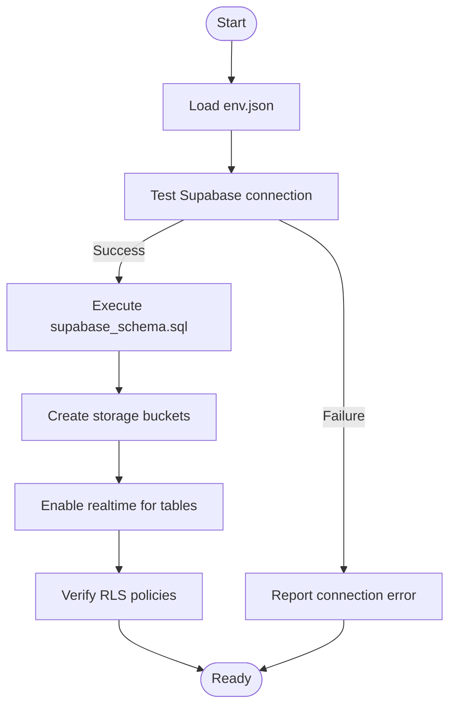

**Diagram sources**
- [setup_supabase.py](file://scripts/setup_supabase.py#L94-L131)
- [setup_supabase.py](file://scripts/setup_supabase.py#L196-L236)

**Section sources**
- [setup_supabase.py](file://scripts/setup_supabase.py#L94-L131)
- [setup_supabase.py](file://scripts/setup_supabase.py#L196-L236)

### Data Lifecycle Policies
- Soft deletion: Not observed in the schema; cascade deletes apply for user-dependent records
- Retention: No explicit retention policies in the schema
- Deletion: Users can delete their own clothing items and outfits; admin-level secret key can be used for maintenance if needed

**Section sources**
- [supabase_schema.sql](file://supabase_schema.sql#L33)
- [supabase_schema.sql](file://supabase_schema.sql#L71)
- [supabase_schema.sql](file://supabase_schema.sql#L99-L100)
- [supabase_schema.sql](file://supabase_schema.sql#L118-L119)
- [supabase_schema.sql](file://supabase_schema.sql#L138)
- [supabase_schema.sql](file://supabase_schema.sql#L158-L159)
- [supabase_schema.sql](file://supabase_schema.sql#L177-L182)

### Security Considerations
- Row Level Security (RLS): Enabled on all tables; policies restrict access to authenticated users’ data
- Authentication: Supabase auth integration; clients must be authenticated to access protected data
- Storage Policies: Bucket policies allow authenticated uploads to user-scoped folders and public reads
- Encryption: TLS in transit via Supabase; no server-side encryption configuration observed in the schema
- Privacy: RLS and bucket scoping enforce data isolation; ensure app-level privacy controls align with policies

**Section sources**
- [supabase_schema.sql](file://supabase_schema.sql#L189-L268)
- [setup_supabase.py](file://scripts/setup_supabase.py#L170-L194)
- [diagnostic_service.dart](file://lib/services/diagnostic_service.dart#L110-L145)

### Backup and Recovery Procedures
- Supabase provides automated backups; consult Supabase dashboard for point-in-time recovery options
- Manual export/import of schema and data can be performed using Supabase SQL Editor and REST API
- The setup script references replication enablement for real-time; ensure replication is enabled post-recovery

**Section sources**
- [setup_supabase.py](file://scripts/setup_supabase.py#L120-L126)

### Data Validation Rules and Integrity Constraints
- Domain constraints: gender, category, status, rating, reaction
- Numeric bounds: ai_confidence [0,1], compatibility_score [0,100], rating [1,5]
- Unique constraints: email (users), (user_id, friend_id), (outfit_id, from_user_id)
- Foreign keys: cascading deletes for user-dependent records
- JSONB fields: flexible schema for predictions, metadata, and preferences

**Section sources**
- [supabase_schema.sql](file://supabase_schema.sql#L16)
- [supabase_schema.sql](file://supabase_schema.sql#L36)
- [supabase_schema.sql](file://supabase_schema.sql#L101)
- [supabase_schema.sql](file://supabase_schema.sql#L120)
- [supabase_schema.sql](file://supabase_schema.sql#L143)
- [supabase_schema.sql](file://supabase_schema.sql#L104)
- [supabase_schema.sql](file://supabase_schema.sql#L124)
- [supabase_schema.sql](file://supabase_schema.sql#L47-L48)
- [supabase_schema.sql](file://supabase_schema.sql#L78)
- [supabase_schema.sql](file://supabase_schema.sql#L119-L122)

## Dependency Analysis
SupabaseService depends on:
- Supabase Flutter SDK for client operations
- Supabase schema for table contracts and RLS
- Storage buckets for media assets
- Realtime for live updates

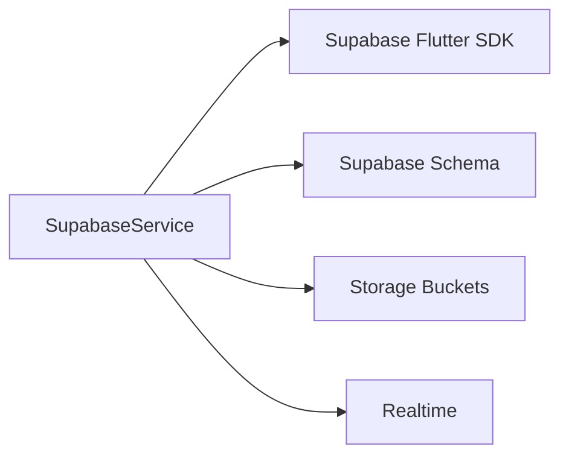

**Diagram sources**
- [supabase_service.dart](file://lib/services/supabase_service.dart#L1-L673)
- [supabase_schema.sql](file://supabase_schema.sql#L1-L319)

**Section sources**
- [supabase_service.dart](file://lib/services/supabase_service.dart#L1-L673)
- [supabase_schema.sql](file://supabase_schema.sql#L1-L319)

## Performance Considerations
- Use indexed columns for filtering (user_id, category, color, is_favorite, is_saved, occasion)
- Prefer streaming updates over frequent polling
- Batch operations where feasible to reduce network overhead
- Optimize JSONB usage for optional attributes to avoid unnecessary schema migrations
- Monitor query latency and adjust indexes as usage patterns evolve

[No sources needed since this section provides general guidance]

## Troubleshooting Guide
Common issues and resolutions:
- Connection failures: Verify SUPABASE_URL and SUPABASE_ANON_KEY in env.json; use diagnostic service to confirm connectivity and auth status
- Permission errors: Ensure RLS policies are applied and user is authenticated before querying private tables
- Realtime not updating: Confirm replication is enabled for target tables and subscriptions are active
- Storage upload failures: Validate bucket policies allow authenticated uploads to user-scoped paths

**Section sources**
- [env.json](file://env.json#L1-L13)
- [diagnostic_service.dart](file://lib/services/diagnostic_service.dart#L110-L145)
- [setup_supabase.py](file://scripts/setup_supabase.py#L94-L131)
- [supabase_schema.sql](file://supabase_schema.sql#L314-L319)

## Conclusion
PrismStyle AI’s data management leverages a robust Supabase architecture with strong access control via RLS, efficient indexing, and real-time synchronization. The SupabaseService centralizes data operations and subscriptions, while the schema supports flexible, AI-driven attributes. Operational tooling automates setup and verification, and security is enforced through bucket policies and row-level restrictions. For production readiness, complement real-time with appropriate caching strategies, monitor performance, and maintain clear migration and backup procedures.

[No sources needed since this section summarizes without analyzing specific files]

## Appendices

### Appendix A: Environment Configuration
- SUPABASE_URL: Supabase project URL
- SUPABASE_ANON_KEY: Anonymous/public key for client initialization
- SUPABASE_SECRET_KEY: Secret key for server/admin operations

**Section sources**
- [env.json](file://env.json#L1-L13)

### Appendix B: Setup Checklist
- Execute connection check and table verification
- Create storage buckets with recommended policies
- Enable real-time for targeted tables
- Confirm RLS policies are active

**Section sources**
- [setup_supabase.py](file://scripts/setup_supabase.py#L94-L131)
- [setup_supabase.py](file://scripts/setup_supabase.py#L147-L194)