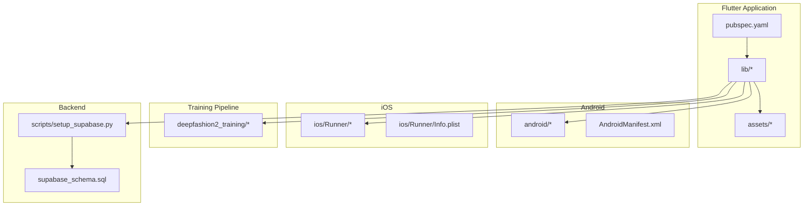
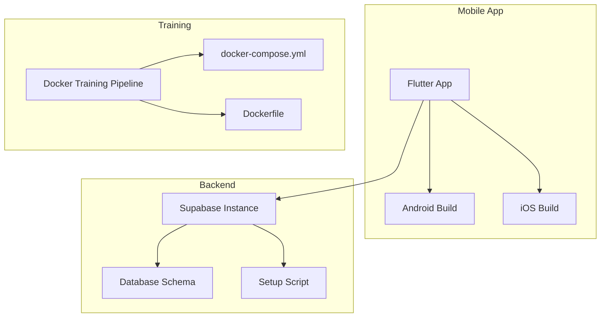
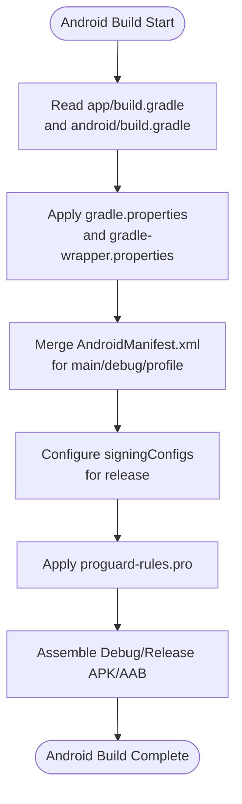
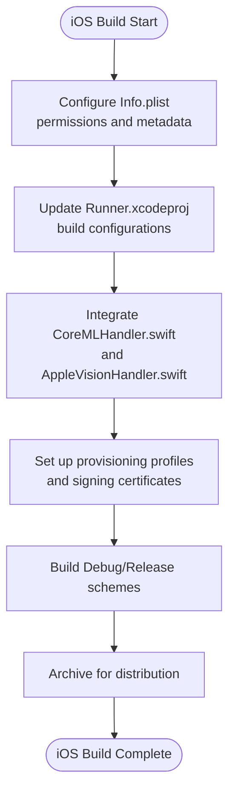
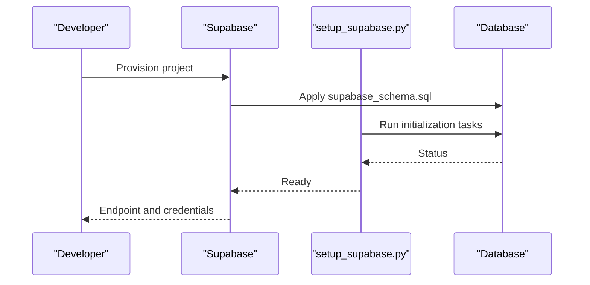
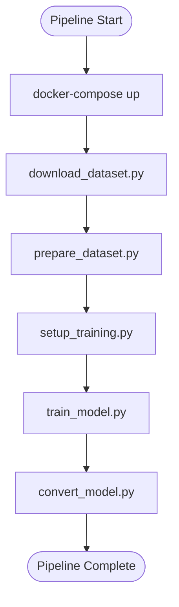
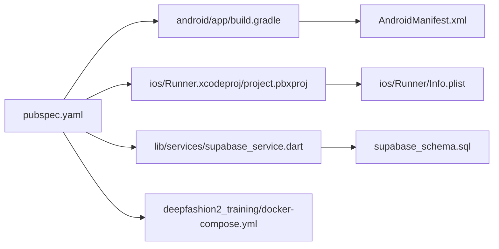

# Deployment and Distribution

<cite>
**Referenced Files in This Document**
- [android/app/build.gradle](file://android/app/build.gradle)
- [android/build.gradle](file://android/build.gradle)
- [android/settings.gradle](file://android/settings.gradle)
- [android/gradle.properties](file://android/gradle.properties)
- [android/gradle/wrapper/gradle-wrapper.properties](file://android/gradle/wrapper/gradle-wrapper.properties)
- [android/app/proguard-rules.pro](file://android/app/proguard-rules.pro)
- [android/app/src/main/AndroidManifest.xml](file://android/app/src/main/AndroidManifest.xml)
- [android/app/src/debug/AndroidManifest.xml](file://android/app/src/debug/AndroidManifest.xml)
- [android/app/src/profile/AndroidManifest.xml](file://android/app/src/profile/AndroidManifest.xml)
- [ios/Runner/Info.plist](file://ios/Runner/Info.plist)
- [ios/Runner.xcodeproj/project.pbxproj](file://ios/Runner.xcodeproj/project.pbxproj)
- [ios/Flutter/Debug.xcconfig](file://ios/Flutter/Debug.xcconfig)
- [ios/Flutter/Release.xcconfig](file://ios/Flutter/Release.xcconfig)
- [ios/Runner/AppDelegate.swift](file://ios/Runner/AppDelegate.swift)
- [ios/Runner/CoreMLHandler.swift](file://ios/Runner/CoreMLHandler.swift)
- [ios/Runner/AppleVisionHandler.swift](file://ios/Runner/AppleVisionHandler.swift)
- [pubspec.yaml](file://pubspec.yaml)
- [lib/services/supabase_service.dart](file://lib/services/supabase_service.dart)
- [scripts/setup_supabase.py](file://scripts/setup_supabase.py)
- [supabase_schema.sql](file://supabase_schema.sql)
- [deepfashion2_training/docker-compose.yml](file://deepfashion2_training/docker-compose.yml)
- [deepfashion2_training/Dockerfile](file://deepfashion2_training/Dockerfile)
- [deepfashion2_training/train_model.py](file://deepfashion2_training/train_model.py)
- [deepfashion2_training/setup_training.py](file://deepfashion2_training/setup_training.py)
- [deepfashion2_training/download_dataset.py](file://deepfashion2_training/download_dataset.py)
- [deepfashion2_training/prepare_dataset.py](file://deepfashion2_training/prepare_dataset.py)
- [deepfashion2_training/create_sample_dataset.py](file://deepfashion2_training/create_sample_dataset.py)
- [deepfashion2_training/convert_model.py](file://deepfashion2_training/convert_model.py)
- [deepfashion2_training/config.py](file://deepfashion2_training/config.py)
- [deepfashion2_training/requirements.txt](file://deepfashion2_training/requirements.txt)
- [env.json](file://env.json)
</cite>

## Table of Contents
1. [Introduction](#introduction)
2. [Project Structure](#project-structure)
3. [Core Components](#core-components)
4. [Architecture Overview](#architecture-overview)
5. [Detailed Component Analysis](#detailed-component-analysis)
6. [Dependency Analysis](#dependency-analysis)
7. [Performance Considerations](#performance-considerations)
8. [Troubleshooting Guide](#troubleshooting-guide)
9. [Conclusion](#conclusion)
10. [Appendices](#appendices)

## Introduction
This document provides comprehensive deployment and distribution guidance for PrismStyle AI across Android and iOS platforms, including build configuration, signing, and app store requirements. It also covers the Docker-based training pipeline, container orchestration, Supabase backend deployment, model serving considerations, CI/CD readiness, security practices, and operational procedures for production environments.

## Project Structure
PrismStyle AI is a Flutter application with platform-specific native integrations for Android and iOS, and a self-contained training pipeline packaged in Docker. The repository includes:
- Android Gradle build configuration and manifests
- iOS Xcode project configuration and Swift handlers
- Flutter pubspec for dependencies and versioning
- Supabase setup script and schema
- Training pipeline with Docker Compose and Python scripts
- Environment configuration and model assets

**Diagram sources**
- [pubspec.yaml](file://pubspec.yaml#L1-L200)
- [android/app/build.gradle](file://android/app/build.gradle#L1-L200)
- [ios/Runner/Info.plist](file://ios/Runner/Info.plist#L1-L200)
- [deepfashion2_training/docker-compose.yml](file://deepfashion2_training/docker-compose.yml#L1-L200)
- [scripts/setup_supabase.py](file://scripts/setup_supabase.py#L1-L200)
- [supabase_schema.sql](file://supabase_schema.sql#L1-L200)

**Section sources**
- [pubspec.yaml](file://pubspec.yaml#L1-L200)
- [android/app/build.gradle](file://android/app/build.gradle#L1-L200)
- [ios/Runner/Info.plist](file://ios/Runner/Info.plist#L1-L200)
- [deepfashion2_training/docker-compose.yml](file://deepfashion2_training/docker-compose.yml#L1-L200)
- [scripts/setup_supabase.py](file://scripts/setup_supabase.py#L1-L200)
- [supabase_schema.sql](file://supabase_schema.sql#L1-L200)

## Core Components
- Android build and packaging: Gradle configuration, signing, manifest entries, and ProGuard/R8 rules.
- iOS build and packaging: Xcode project configuration, Info.plist keys, Swift handlers for Core ML and Apple Vision.
- Flutter application: Dependencies, versioning, and asset management via pubspec.
- Supabase backend: Schema and setup script for database initialization and migration.
- Training pipeline: Dockerized training workflow orchestrated via docker-compose and Python scripts.
- Environment configuration: Centralized environment JSON for runtime configuration.

**Section sources**
- [android/app/build.gradle](file://android/app/build.gradle#L1-L200)
- [android/gradle.properties](file://android/gradle.properties#L1-L200)
- [android/app/proguard-rules.pro](file://android/app/proguard-rules.pro#L1-L200)
- [android/app/src/main/AndroidManifest.xml](file://android/app/src/main/AndroidManifest.xml#L1-L200)
- [ios/Runner/Info.plist](file://ios/Runner/Info.plist#L1-L200)
- [ios/Runner.xcodeproj/project.pbxproj](file://ios/Runner.xcodeproj/project.pbxproj#L1-L200)
- [ios/Flutter/Debug.xcconfig](file://ios/Flutter/Debug.xcconfig#L1-L200)
- [ios/Flutter/Release.xcconfig](file://ios/Flutter/Release.xcconfig#L1-L200)
- [pubspec.yaml](file://pubspec.yaml#L1-L200)
- [lib/services/supabase_service.dart](file://lib/services/supabase_service.dart#L1-L200)
- [scripts/setup_supabase.py](file://scripts/setup_supabase.py#L1-L200)
- [supabase_schema.sql](file://supabase_schema.sql#L1-L200)
- [deepfashion2_training/docker-compose.yml](file://deepfashion2_training/docker-compose.yml#L1-L200)
- [deepfashion2_training/Dockerfile](file://deepfashion2_training/Dockerfile#L1-L200)
- [env.json](file://env.json#L1-L200)

## Architecture Overview
The deployment architecture spans three primary areas:
- Mobile app builds for Android and iOS with platform-specific signing and entitlements.
- Backend services managed via Supabase, initialized using SQL schema and a setup script.
- Training pipeline containerized with Docker Compose, enabling reproducible model training.

**Diagram sources**
- [pubspec.yaml](file://pubspec.yaml#L1-L200)
- [android/app/build.gradle](file://android/app/build.gradle#L1-L200)
- [ios/Runner/Info.plist](file://ios/Runner/Info.plist#L1-L200)
- [lib/services/supabase_service.dart](file://lib/services/supabase_service.dart#L1-L200)
- [scripts/setup_supabase.py](file://scripts/setup_supabase.py#L1-L200)
- [supabase_schema.sql](file://supabase_schema.sql#L1-L200)
- [deepfashion2_training/docker-compose.yml](file://deepfashion2_training/docker-compose.yml#L1-L200)
- [deepfashion2_training/Dockerfile](file://deepfashion2_training/Dockerfile#L1-L200)

## Detailed Component Analysis

### Android Build Configuration and Signing
Key aspects to configure for Android:
- Versioning and build variants (debug, profile, release)
- Signing configuration for release builds
- Manifest permissions and application metadata
- ProGuard/R8 rules for code shrinking and obfuscation
- Gradle wrapper and properties for reproducible builds

Recommended steps:
- Set applicationId, versionCode, and versionName in the app Gradle configuration.
- Configure signingConfigs for release builds with keystore path and credentials.
- Define minSdkVersion, targetSdkVersion, and compileSdkVersion aligned with Flutter SDK.
- Add necessary permissions in the AndroidManifest.xml.
- Enable minification and specify ProGuard rules in the release build type.
- Lock Gradle and AGP versions via gradle-wrapper.properties and android gradle plugin version.

**Diagram sources**
- [android/app/build.gradle](file://android/app/build.gradle#L1-L200)
- [android/build.gradle](file://android/build.gradle#L1-L200)
- [android/gradle.properties](file://android/gradle.properties#L1-L200)
- [android/gradle/wrapper/gradle-wrapper.properties](file://android/gradle/wrapper/gradle-wrapper.properties#L1-L200)
- [android/app/proguard-rules.pro](file://android/app/proguard-rules.pro#L1-L200)
- [android/app/src/main/AndroidManifest.xml](file://android/app/src/main/AndroidManifest.xml#L1-L200)
- [android/app/src/debug/AndroidManifest.xml](file://android/app/src/debug/AndroidManifest.xml#L1-L200)
- [android/app/src/profile/AndroidManifest.xml](file://android/app/src/profile/AndroidManifest.xml#L1-L200)

**Section sources**
- [android/app/build.gradle](file://android/app/build.gradle#L1-L200)
- [android/build.gradle](file://android/build.gradle#L1-L200)
- [android/gradle.properties](file://android/gradle.properties#L1-L200)
- [android/gradle/wrapper/gradle-wrapper.properties](file://android/gradle/wrapper/gradle-wrapper.properties#L1-L200)
- [android/app/proguard-rules.pro](file://android/app/proguard-rules.pro#L1-L200)
- [android/app/src/main/AndroidManifest.xml](file://android/app/src/main/AndroidManifest.xml#L1-L200)
- [android/app/src/debug/AndroidManifest.xml](file://android/app/src/debug/AndroidManifest.xml#L1-L200)
- [android/app/src/profile/AndroidManifest.xml](file://android/app/src/profile/AndroidManifest.xml#L1-L200)

### iOS Build Configuration and Signing
Key aspects to configure for iOS:
- Bundle identifier and app icons
- Info.plist keys for permissions and capabilities
- Xcode project configuration for Debug and Release
- Swift handlers for Core ML and Apple Vision frameworks
- Provisioning profiles and signing certificates for distribution

Recommended steps:
- Set CFBundleIdentifier and related bundle settings in Info.plist.
- Configure Runner.xcodeproj build settings for Debug and Release variants.
- Add required NSCameraUsageDescription and other permission descriptions.
- Integrate Core ML and Apple Vision handlers as needed by the app.
- Prepare provisioning profiles and signing certificates for TestFlight/App Store distribution.

**Diagram sources**
- [ios/Runner/Info.plist](file://ios/Runner/Info.plist#L1-L200)
- [ios/Runner.xcodeproj/project.pbxproj](file://ios/Runner.xcodeproj/project.pbxproj#L1-L200)
- [ios/Flutter/Debug.xcconfig](file://ios/Flutter/Debug.xcconfig#L1-L200)
- [ios/Flutter/Release.xcconfig](file://ios/Flutter/Release.xcconfig#L1-L200)
- [ios/Runner/AppDelegate.swift](file://ios/Runner/AppDelegate.swift#L1-L200)
- [ios/Runner/CoreMLHandler.swift](file://ios/Runner/CoreMLHandler.swift#L1-L200)
- [ios/Runner/AppleVisionHandler.swift](file://ios/Runner/AppleVisionHandler.swift#L1-L200)

**Section sources**
- [ios/Runner/Info.plist](file://ios/Runner/Info.plist#L1-L200)
- [ios/Runner.xcodeproj/project.pbxproj](file://ios/Runner.xcodeproj/project.pbxproj#L1-L200)
- [ios/Flutter/Debug.xcconfig](file://ios/Flutter/Debug.xcconfig#L1-L200)
- [ios/Flutter/Release.xcconfig](file://ios/Flutter/Release.xcconfig#L1-L200)
- [ios/Runner/AppDelegate.swift](file://ios/Runner/AppDelegate.swift#L1-L200)
- [ios/Runner/CoreMLHandler.swift](file://ios/Runner/CoreMLHandler.swift#L1-L200)
- [ios/Runner/AppleVisionHandler.swift](file://ios/Runner/AppleVisionHandler.swift#L1-L200)

### Flutter Application Packaging
- Dependencies and version constraints are defined in pubspec.yaml.
- Asset management and model configuration are handled via Flutter’s asset pipeline.
- Environment configuration is centralized in env.json for runtime values.

Recommended steps:
- Pin Flutter SDK and plugin versions in pubspec.yaml.
- Verify asset paths for models and resources.
- Externalize secrets and environment-specific values into env.json.

**Section sources**
- [pubspec.yaml](file://pubspec.yaml#L1-L200)
- [env.json](file://env.json#L1-L200)

### Supabase Backend Deployment
- Database schema is defined in supabase_schema.sql.
- A setup script automates initialization and seeding.
- The Flutter app communicates with Supabase via lib/services/supabase_service.dart.

Recommended steps:
- Initialize Supabase project and apply supabase_schema.sql.
- Run scripts/setup_supabase.py to finalize setup.
- Configure Supabase client credentials in the app and environment configuration.

**Diagram sources**
- [scripts/setup_supabase.py](file://scripts/setup_supabase.py#L1-L200)
- [supabase_schema.sql](file://supabase_schema.sql#L1-L200)

**Section sources**
- [lib/services/supabase_service.dart](file://lib/services/supabase_service.dart#L1-L200)
- [scripts/setup_supabase.py](file://scripts/setup_supabase.py#L1-L200)
- [supabase_schema.sql](file://supabase_schema.sql#L1-L200)

### Docker-Based Training Pipeline
- The training pipeline is containerized with a Dockerfile and orchestrated via docker-compose.yml.
- Python scripts handle dataset preparation, training, conversion, and model export.
- Configuration and requirements are defined in config.py and requirements.txt.

Recommended steps:
- Build the training image using the provided Dockerfile.
- Run docker-compose to provision training environment and services.
- Execute training scripts in order: download_dataset -> prepare_dataset -> setup_training -> train_model -> convert_model.
- Persist trained models and artifacts according to your storage strategy.

**Diagram sources**
- [deepfashion2_training/docker-compose.yml](file://deepfashion2_training/docker-compose.yml#L1-L200)
- [deepfashion2_training/Dockerfile](file://deepfashion2_training/Dockerfile#L1-L200)
- [deepfashion2_training/train_model.py](file://deepfashion2_training/train_model.py#L1-L200)
- [deepfashion2_training/setup_training.py](file://deepfashion2_training/setup_training.py#L1-L200)
- [deepfashion2_training/download_dataset.py](file://deepfashion2_training/download_dataset.py#L1-L200)
- [deepfashion2_training/prepare_dataset.py](file://deepfashion2_training/prepare_dataset.py#L1-L200)
- [deepfashion2_training/create_sample_dataset.py](file://deepfashion2_training/create_sample_dataset.py#L1-L200)
- [deepfashion2_training/convert_model.py](file://deepfashion2_training/convert_model.py#L1-L200)
- [deepfashion2_training/config.py](file://deepfashion2_training/config.py#L1-L200)
- [deepfashion2_training/requirements.txt](file://deepfashion2_training/requirements.txt#L1-L200)

**Section sources**
- [deepfashion2_training/docker-compose.yml](file://deepfashion2_training/docker-compose.yml#L1-L200)
- [deepfashion2_training/Dockerfile](file://deepfashion2_training/Dockerfile#L1-L200)
- [deepfashion2_training/train_model.py](file://deepfashion2_training/train_model.py#L1-L200)
- [deepfashion2_training/setup_training.py](file://deepfashion2_training/setup_training.py#L1-L200)
- [deepfashion2_training/download_dataset.py](file://deepfashion2_training/download_dataset.py#L1-L200)
- [deepfashion2_training/prepare_dataset.py](file://deepfashion2_training/prepare_dataset.py#L1-L200)
- [deepfashion2_training/create_sample_dataset.py](file://deepfashion2_training/create_sample_dataset.py#L1-L200)
- [deepfashion2_training/convert_model.py](file://deepfashion2_training/convert_model.py#L1-L200)
- [deepfashion2_training/config.py](file://deepfashion2_training/config.py#L1-L200)
- [deepfashion2_training/requirements.txt](file://deepfashion2_training/requirements.txt#L1-L200)

### Continuous Integration and Release Management
- CI readiness: The repository includes Gradle wrapper and Flutter dependencies. CI systems can build Android and iOS targets using standard Flutter commands.
- Automated testing: Unit and widget tests can be executed via flutter test. Integration tests can be added to the test directory.
- Release management: Use semantic versioning from pubspec.yaml and platform-specific versioning in Android/iOS configs. Automate artifact publishing to stores after successful builds and tests.

Recommended steps:
- Configure CI jobs to install Flutter SDK and dependencies, then run flutter pub get and flutter test.
- For Android, run Gradle assemble tasks for release variants.
- For iOS, run xcodebuild or flutter build ios --release.
- Attach generated artifacts (APK/AAB for Android; IPA for iOS) to release artifacts.

**Section sources**
- [pubspec.yaml](file://pubspec.yaml#L1-L200)
- [android/gradle/wrapper/gradle-wrapper.properties](file://android/gradle/wrapper/gradle-wrapper.properties#L1-L200)
- [android/app/build.gradle](file://android/app/build.gradle#L1-L200)
- [ios/Runner.xcodeproj/project.pbxproj](file://ios/Runner.xcodeproj/project.pbxproj#L1-L200)

### App Store Submission and Review Compliance
- Android: Publish to Google Play Console using signed APK/AAB. Ensure privacy policy URL, store listing, and compliance with Google Play policies.
- iOS: Submit via App Store Connect. Ensure Info.plist includes required permissions, privacy labels, and TestFlight distribution for beta review.
- General: Include a privacy policy screen in-app, and ensure all assets and metadata are accurate.

[No sources needed since this section provides general guidance]

### Security Considerations
- Certificate management: Store signing keys and certificates securely in CI secrets; never commit them to the repository.
- Secrets handling: Externalize API keys and tokens via env.json or secure configuration services.
- Vulnerability assessment: Regularly audit dependencies using flutter pub outdated and pip-tools for Python packages.
- Transport security: Enforce HTTPS for all backend communications and secure storage for sensitive data.

[No sources needed since this section provides general guidance]

## Dependency Analysis
The application depends on platform-specific build systems and backend services. The training pipeline is decoupled and can be deployed independently.

**Diagram sources**
- [pubspec.yaml](file://pubspec.yaml#L1-L200)
- [android/app/build.gradle](file://android/app/build.gradle#L1-L200)
- [android/app/src/main/AndroidManifest.xml](file://android/app/src/main/AndroidManifest.xml#L1-L200)
- [ios/Runner.xcodeproj/project.pbxproj](file://ios/Runner.xcodeproj/project.pbxproj#L1-L200)
- [ios/Runner/Info.plist](file://ios/Runner/Info.plist#L1-L200)
- [lib/services/supabase_service.dart](file://lib/services/supabase_service.dart#L1-L200)
- [supabase_schema.sql](file://supabase_schema.sql#L1-L200)
- [deepfashion2_training/docker-compose.yml](file://deepfashion2_training/docker-compose.yml#L1-L200)

**Section sources**
- [pubspec.yaml](file://pubspec.yaml#L1-L200)
- [android/app/build.gradle](file://android/app/build.gradle#L1-L200)
- [ios/Runner.xcodeproj/project.pbxproj](file://ios/Runner.xcodeproj/project.pbxproj#L1-L200)
- [lib/services/supabase_service.dart](file://lib/services/supabase_service.dart#L1-L200)
- [supabase_schema.sql](file://supabase_schema.sql#L1-L200)
- [deepfashion2_training/docker-compose.yml](file://deepfashion2_training/docker-compose.yml#L1-L200)

## Performance Considerations
- Mobile app: Optimize asset sizes, enable code splitting where applicable, and monitor startup time and memory usage.
- Backend: Scale Supabase resources based on concurrent users and API throughput; monitor query performance.
- Training pipeline: Use GPU-enabled runners or cloud instances for training; persist datasets and models efficiently.

[No sources needed since this section provides general guidance]

## Troubleshooting Guide
Common deployment issues and resolutions:
- Android signing failures: Verify keystore path and passwords in signingConfigs; ensure release build type is configured.
- iOS archive errors: Confirm provisioning profiles and signing certificates; check Info.plist permissions and entitlements.
- Supabase connectivity: Validate endpoint and service key; confirm network access and firewall rules.
- Training pipeline failures: Inspect docker-compose logs; verify dataset URLs and disk space; re-run failed stages individually.
- CI failures: Ensure Flutter SDK and dependencies are cached; align Gradle and Xcode versions with CI images.

**Section sources**
- [android/app/build.gradle](file://android/app/build.gradle#L1-L200)
- [ios/Runner/Info.plist](file://ios/Runner/Info.plist#L1-L200)
- [lib/services/supabase_service.dart](file://lib/services/supabase_service.dart#L1-L200)
- [deepfashion2_training/docker-compose.yml](file://deepfashion2_training/docker-compose.yml#L1-L200)

## Conclusion
PrismStyle AI’s deployment stack combines Flutter-based mobile apps with platform-specific build configurations, a Supabase-backed backend, and a Dockerized training pipeline. By following the outlined practices for signing, CI/CD, backend setup, and operational hygiene, teams can achieve reliable, repeatable releases and maintain strong security and performance in production.

[No sources needed since this section summarizes without analyzing specific files]

## Appendices
- Post-release monitoring: Track app store ratings, crash reports, and backend latency; set up alerts for anomalies.
- Rollback procedures: Maintain versioned artifacts and database migrations; keep previous Docker images and Supabase snapshots for quick restoration.

[No sources needed since this section provides general guidance]