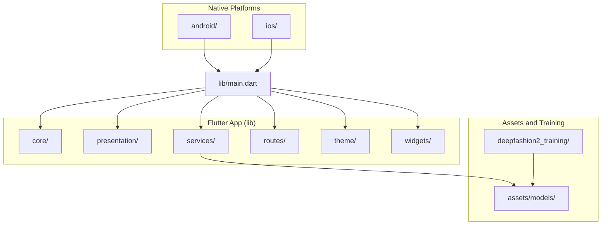
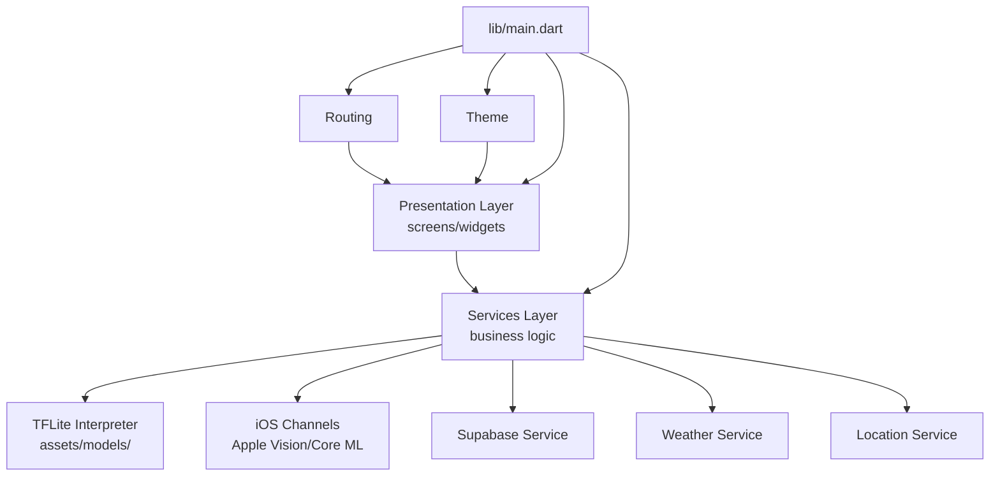
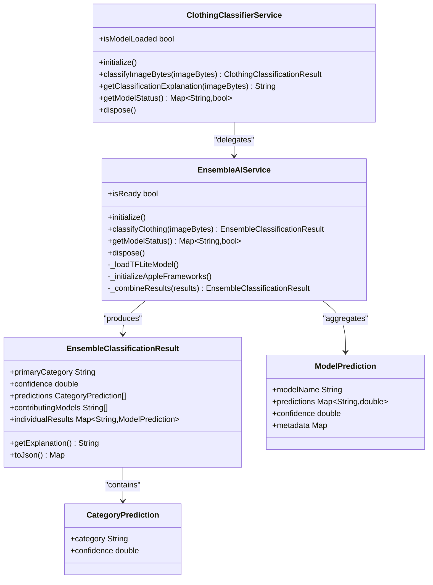
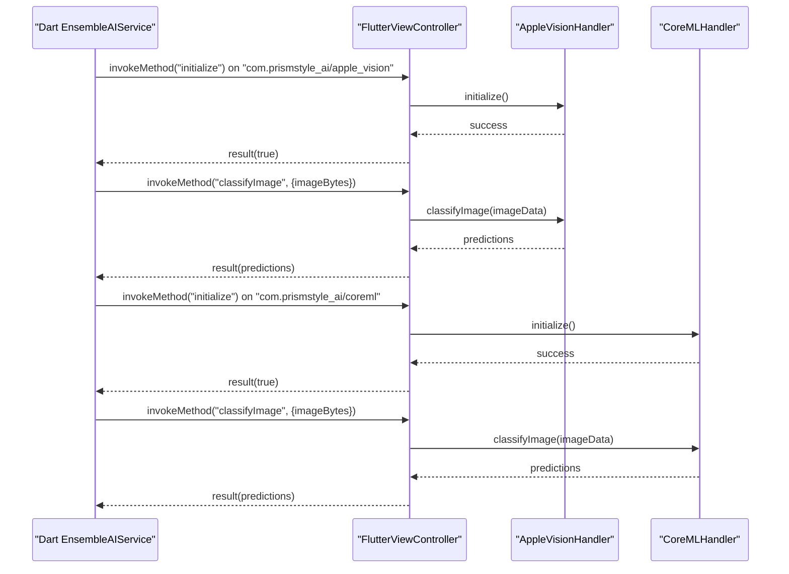
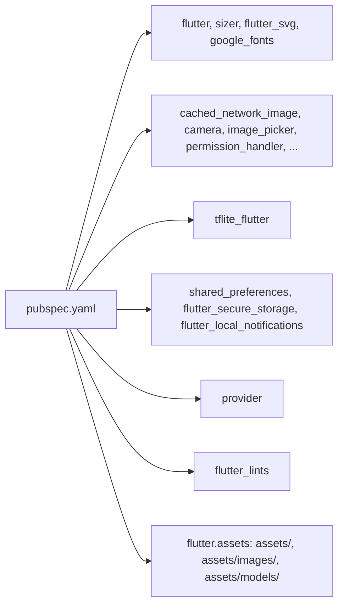

# Development Guidelines

<cite>
**Referenced Files in This Document**
- [README.md](file://README.md)
- [pubspec.yaml](file://pubspec.yaml)
- [lib/main.dart](file://lib/main.dart)
- [android/app/src/main/kotlin/com/prismstyle_ai/app/MainActivity.kt](file://android/app/src/main/kotlin/com/prismstyle_ai/app/MainActivity.kt)
- [ios/Runner/AppDelegate.swift](file://ios/Runner/AppDelegate.swift)
- [lib/services/ensemble_ai_service.dart](file://lib/services/ensemble_ai_service.dart)
- [lib/services/clothing_classifier_service.dart](file://lib/services/clothing_classifier_service.dart)
- [lib/theme/app_theme.dart](file://lib/theme/app_theme.dart)
- [lib/routes/app_routes.dart](file://lib/routes/app_routes.dart)
- [deepfashion2_training/config.py](file://deepfashion2_training/config.py)
</cite>

## Table of Contents
1. [Introduction](#introduction)
2. [Project Structure](#project-structure)
3. [Core Components](#core-components)
4. [Architecture Overview](#architecture-overview)
5. [Detailed Component Analysis](#detailed-component-analysis)
6. [Dependency Analysis](#dependency-analysis)
7. [Performance Considerations](#performance-considerations)
8. [Troubleshooting Guide](#troubleshooting-guide)
9. [Contribution and Collaboration](#contribution-and-collaboration)
10. [Conclusion](#conclusion)

## Introduction
This document provides comprehensive development guidelines for PrismStyle AI contributors and maintainers. It consolidates coding standards, naming conventions, architectural patterns, development workflow, project structure conventions, and operational practices observed in the repository. It also outlines best practices for adding features, integrating third-party libraries, maintaining backward compatibility, debugging, profiling, performance optimization, code quality, documentation, testing, native platform development, AI model integration, and database schema changes.

## Project Structure
PrismStyle AI follows a Flutter-centric structure with clear separation of concerns:
- lib/core: Application configuration exports
- lib/presentation: Feature screens and reusable UI widgets
- lib/services: Business logic and integrations (AI, weather, Supabase, notifications)
- lib/routes: Centralized routing definitions
- lib/theme: Design system and theme definitions
- lib/widgets: Shared UI components
- android/: Android embedding and Gradle configuration
- ios/: iOS embedding, Swift entry points, and native channels
- assets/models: On-device ML models and configuration
- deepfashion2_training: Optional training pipeline for custom models
- Root docs and scripts: Setup, testing, and environment configuration

**Diagram sources**
- [lib/main.dart](file://lib/main.dart#L1-L122)
- [lib/routes/app_routes.dart](file://lib/routes/app_routes.dart#L1-L43)
- [lib/theme/app_theme.dart](file://lib/theme/app_theme.dart#L1-L748)
- [android/app/src/main/kotlin/com/prismstyle_ai/app/MainActivity.kt](file://android/app/src/main/kotlin/com/prismstyle_ai/app/MainActivity.kt#L1-L7)
- [ios/Runner/AppDelegate.swift](file://ios/Runner/AppDelegate.swift#L1-L102)
- [assets/models/model_config.json](file://assets/models/model_config.json)

**Section sources**
- [README.md](file://README.md#L146-L172)
- [lib/main.dart](file://lib/main.dart#L1-L122)
- [lib/routes/app_routes.dart](file://lib/routes/app_routes.dart#L1-L43)

## Core Components
- Application bootstrap and initialization:
  - Initializes Supabase, local notifications, and the AI classifier before runApp.
  - Sets up global error handling and device orientation lock.
- Routing:
  - Centralized route constants and builders for predictable navigation.
- Theming:
  - Comprehensive light/dark theme definitions with color palettes, typography, and component themes.
- AI services:
  - Ensemble AI service orchestrating TFLite, Apple Vision, Core ML, and heuristic analysis.
  - Backward-compatible wrapper service for classification results.

**Section sources**
- [lib/main.dart](file://lib/main.dart#L12-L65)
- [lib/routes/app_routes.dart](file://lib/routes/app_routes.dart#L14-L42)
- [lib/theme/app_theme.dart](file://lib/theme/app_theme.dart#L4-L748)
- [lib/services/ensemble_ai_service.dart](file://lib/services/ensemble_ai_service.dart#L1-L594)
- [lib/services/clothing_classifier_service.dart](file://lib/services/clothing_classifier_service.dart#L1-L186)

## Architecture Overview
The app uses a layered architecture:
- Presentation layer: Screens and widgets under lib/presentation
- Services layer: Business logic and integrations under lib/services
- Native bridges: Android/Kotlin and iOS/Swift for platform-specific capabilities
- Asset-driven AI: TFLite models under assets/models integrated via service layer
- Routing and theming: Centralized under lib/routes and lib/theme

**Diagram sources**
- [lib/main.dart](file://lib/main.dart#L1-L122)
- [lib/services/ensemble_ai_service.dart](file://lib/services/ensemble_ai_service.dart#L1-L594)
- [ios/Runner/AppDelegate.swift](file://ios/Runner/AppDelegate.swift#L1-L102)
- [lib/routes/app_routes.dart](file://lib/routes/app_routes.dart#L1-L43)
- [lib/theme/app_theme.dart](file://lib/theme/app_theme.dart#L1-L748)

## Detailed Component Analysis

### Ensemble AI Service
The Ensemble AI Service coordinates multiple classification models:
- Initialization loads model configuration and attempts to load TFLite models, with graceful fallbacks.
- On iOS, it initializes Apple Vision and Core ML via Flutter method channels.
- Classification runs all available models and combines results using weighted voting.
- Provides detailed explanations and status of contributing models.

**Diagram sources**
- [lib/services/ensemble_ai_service.dart](file://lib/services/ensemble_ai_service.dart#L1-L594)
- [lib/services/clothing_classifier_service.dart](file://lib/services/clothing_classifier_service.dart#L1-L186)

**Section sources**
- [lib/services/ensemble_ai_service.dart](file://lib/services/ensemble_ai_service.dart#L17-L53)
- [lib/services/ensemble_ai_service.dart](file://lib/services/ensemble_ai_service.dart#L136-L178)
- [lib/services/ensemble_ai_service.dart](file://lib/services/ensemble_ai_service.dart#L350-L408)
- [lib/services/clothing_classifier_service.dart](file://lib/services/clothing_classifier_service.dart#L32-L69)

### iOS Native Bridge (Method Channels)
The iOS AppDelegate sets up two Flutter method channels:
- com.prismstyle_ai/apple_vision
- com.prismstyle_ai/coreml

These channels expose initialization and image classification methods to Dart, enabling Apple Vision and Core ML integration.

**Diagram sources**
- [ios/Runner/AppDelegate.swift](file://ios/Runner/AppDelegate.swift#L29-L100)
- [lib/services/ensemble_ai_service.dart](file://lib/services/ensemble_ai_service.dart#L28-L32)
- [lib/services/ensemble_ai_service.dart](file://lib/services/ensemble_ai_service.dart#L264-L320)

**Section sources**
- [ios/Runner/AppDelegate.swift](file://ios/Runner/AppDelegate.swift#L11-L27)
- [ios/Runner/AppDelegate.swift](file://ios/Runner/AppDelegate.swift#L29-L100)
- [lib/services/ensemble_ai_service.dart](file://lib/services/ensemble_ai_service.dart#L28-L32)

### Android Entry Point
The Android MainActivity extends FlutterFragmentActivity and registers plugins, ensuring the Flutter engine is properly initialized.

**Section sources**
- [android/app/src/main/kotlin/com/prismstyle_ai/app/MainActivity.kt](file://android/app/src/main/kotlin/com/prismstyle_ai/app/MainActivity.kt#L1-L7)

### Theme System
The theme defines:
- Color palettes for light and dark modes
- Typography using Google Fonts
- Component themes for AppBar, Cards, Buttons, Inputs, Tabs, Tooltips, SnackBars, Bottom Sheets, and Dialogs

**Section sources**
- [lib/theme/app_theme.dart](file://lib/theme/app_theme.dart#L4-L748)

### Routing
Centralized route constants and builders enable consistent navigation across screens.

**Section sources**
- [lib/routes/app_routes.dart](file://lib/routes/app_routes.dart#L14-L42)

### AI Model Training (Optional)
Training configuration supports DeepFashion2 with configurable augmentation, mixup, label smoothing, and checkpointing.

**Section sources**
- [deepfashion2_training/config.py](file://deepfashion2_training/config.py#L1-L56)

## Dependency Analysis
- Flutter SDK and core packages are declared in pubspec.yaml with explicit versions.
- Asset management is centralized; TFLite models are included under assets/models.
- Third-party dependencies include Supabase, TensorFlow Lite, image processing, charts, permissions, and others.
- Linting is enforced via flutter_lints.

**Diagram sources**
- [pubspec.yaml](file://pubspec.yaml#L1-L76)

**Section sources**
- [pubspec.yaml](file://pubspec.yaml#L6-L76)

## Performance Considerations
- AI inference performance varies by device; refer to documented ranges for iOS and Android.
- Ensemble AI uses weighted voting to balance accuracy and latency.
- Image preprocessing and tensor conversion impact inference time; keep preprocessing efficient.
- Use device-specific optimizations (Apple Vision/Core ML) on supported platforms.
- Keep asset sizes reasonable; leverage compression and appropriate image dimensions.

**Section sources**
- [README.md](file://README.md#L210-L222)
- [lib/services/ensemble_ai_service.dart](file://lib/services/ensemble_ai_service.dart#L350-L408)

## Troubleshooting Guide
Common issues and resolutions:
- Flutter command not found: Use fvm prefix if applicable.
- iOS build failures: Deintegrate and reinstall CocoaPods, then clean and fetch dependencies.
- TFLite model not loading: Ensure model files are placed under assets/models and included in pubspec.yaml assets.
- Apple frameworks not working: Verify iOS 13+ requirement, test on real devices, and inspect Xcode console logs.

**Section sources**
- [README.md](file://README.md#L223-L253)

## Contribution and Collaboration
This section consolidates repository-provided guidance and established best practices:
- Coding Standards and Naming Conventions
  - Use clear, descriptive names for classes, methods, and variables.
  - Group related functionality into cohesive modules (services, presentation, widgets).
  - Maintain consistent casing and naming across Dart and native files.
- Architectural Patterns
  - Prefer service-layer orchestration for integrations (e.g., EnsembleAIService).
  - Keep presentation stateless; delegate business logic to services.
  - Use centralized routing and theming for consistency.
- Development Workflow
  - Branching: Use feature branches for new features; keep main stable.
  - Pull Requests: Open PRs early for visibility; include rationale and screenshots for UI changes.
  - Code Review: Focus on correctness, performance, maintainability, and adherence to conventions.
- Project Structure Conventions
  - Place assets under existing directories (assets/, assets/images/) and avoid adding new asset folders.
  - Keep fonts managed via Google Fonts; do not add local font files.
  - Group features under lib/presentation with dedicated directories and widgets.
- Adding New Features
  - Introduce new services under lib/services and register routes in lib/routes.
  - Ensure proper initialization order in lib/main.dart.
  - Add tests for critical logic; run flutter test locally.
- Integrating Third-Party Libraries
  - Add dependencies to pubspec.yaml; update assets and native configs as needed.
  - For native integrations, define and document method channels clearly.
- Maintaining Backward Compatibility
  - Wrap breaking changes behind optional services or feature flags.
  - Preserve public APIs and provide migration paths.
- Debugging and Profiling
  - Use debugPrint for diagnostics; inspect logs on both platforms.
  - Profile UI and CPU usage with Flutter DevTools.
- Code Quality and Documentation
  - Enforce lint rules via flutter_lints.
  - Document public APIs and complex logic with inline comments and README updates.
- Testing Obligations
  - Write unit tests for services and business logic.
  - Validate platform-specific features on real devices when applicable.
- Native Platform Development
  - Android: Extend FlutterFragmentActivity; manage permissions and manifest entries.
  - iOS: Register method channels in AppDelegate; ensure platform availability checks.
- AI Model Integration
  - Place models under assets/models; update model_config.json accordingly.
  - Implement fallbacks and graceful degradation when models are unavailable.
- Database Schema Changes
  - Update Supabase schema and migrations; coordinate client-side changes carefully.
- Open Source Collaboration
  - Follow repository’s contributing guidelines and licensing terms.
  - Report issues with reproducible steps and environment details.

**Section sources**
- [pubspec.yaml](file://pubspec.yaml#L63-L76)
- [lib/main.dart](file://lib/main.dart#L12-L65)
- [lib/routes/app_routes.dart](file://lib/routes/app_routes.dart#L14-L42)
- [lib/theme/app_theme.dart](file://lib/theme/app_theme.dart#L1-L748)
- [README.md](file://README.md#L287-L289)

## Conclusion
These guidelines consolidate the repository’s structure, patterns, and operational practices to help contributors develop reliably and efficiently. By adhering to the established conventions—layered architecture, centralized routing and theming, service-driven integrations, and disciplined asset and dependency management—you can extend PrismStyle AI while preserving performance, maintainability, and user experience.