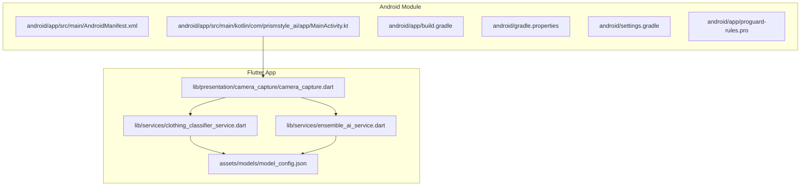
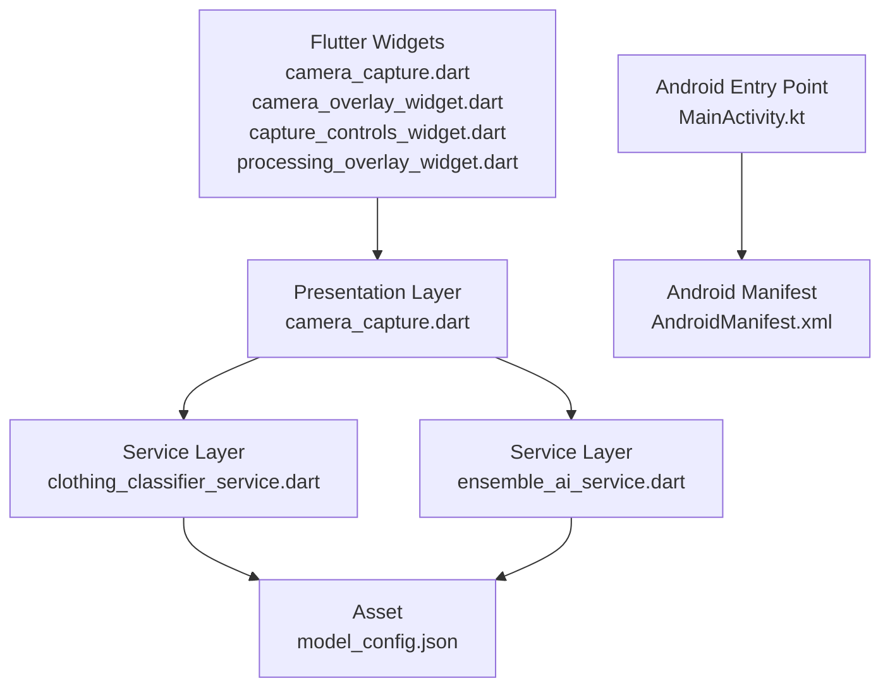
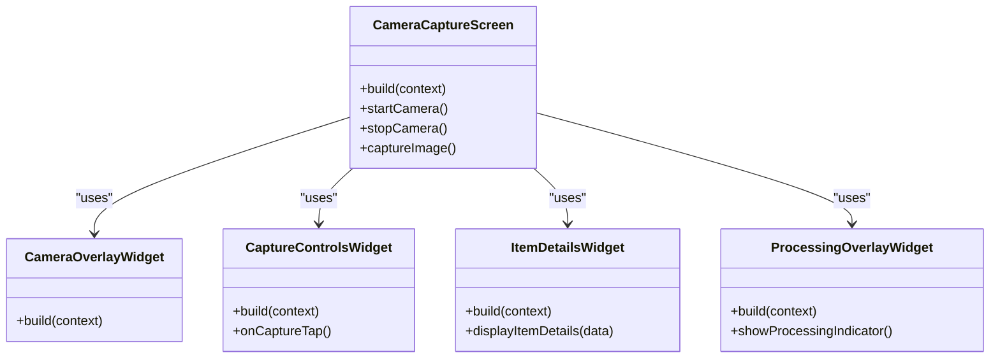
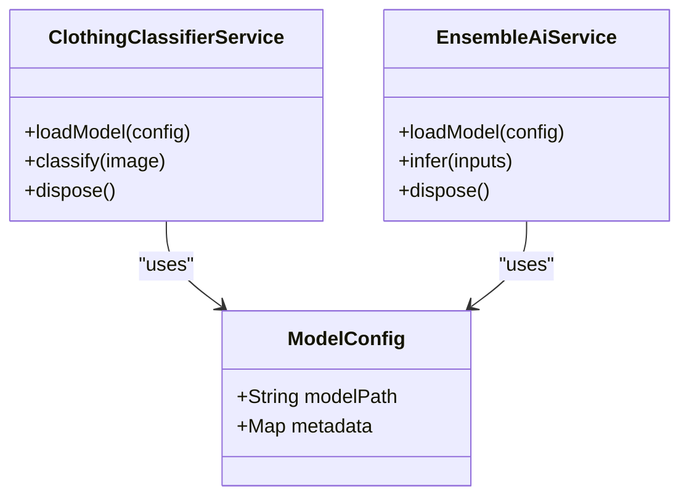
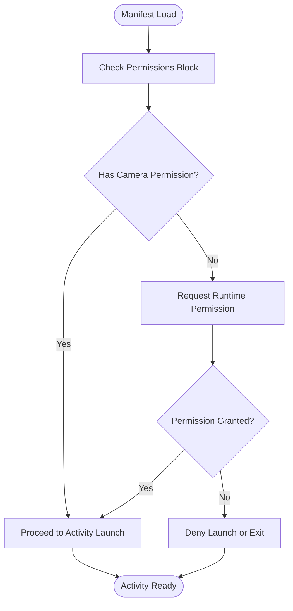
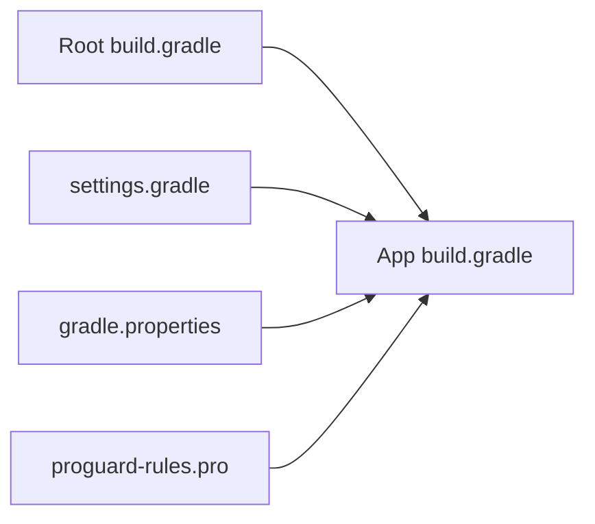
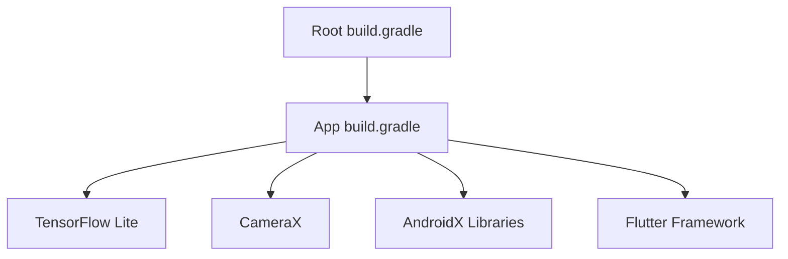

# Android Integration

<cite>
**Referenced Files in This Document**
- [MainActivity.kt](file://android/app/src/main/kotlin/com/prismstyle_ai/app/MainActivity.kt)
- [AndroidManifest.xml (main)](file://android/app/src/main/AndroidManifest.xml)
- [AndroidManifest.xml (debug)](file://android/app/src/debug/AndroidManifest.xml)
- [AndroidManifest.xml (profile)](file://android/app/src/profile/AndroidManifest.xml)
- [build.gradle (app)](file://android/app/build.gradle)
- [build.gradle (root)](file://android/build.gradle)
- [gradle.properties](file://android/gradle.properties)
- [settings.gradle](file://android/settings.gradle)
- [proguard-rules.pro](file://android/app/proguard-rules.pro)
- [camera_capture.dart](file://lib/presentation/camera_capture/camera_capture.dart)
- [camera_overlay_widget.dart](file://lib/presentation/camera_capture/widgets/camera_overlay_widget.dart)
- [capture_controls_widget.dart](file://lib/presentation/camera_capture/widgets/capture_controls_widget.dart)
- [item_details_widget.dart](file://lib/presentation/camera_capture/widgets/item_details_widget.dart)
- [processing_overlay_widget.dart](file://lib/presentation/camera_capture/widgets/processing_overlay_widget.dart)
- [clothing_classifier_service.dart](file://lib/services/clothing_classifier_service.dart)
- [ensemble_ai_service.dart](file://lib/services/ensemble_ai_service.dart)
- [model_config.json](file://assets/models/model_config.json)
- [pubspec.yaml](file://pubspec.yaml)
</cite>

## Table of Contents
1. [Introduction](#introduction)
2. [Project Structure](#project-structure)
3. [Core Components](#core-components)
4. [Architecture Overview](#architecture-overview)
5. [Detailed Component Analysis](#detailed-component-analysis)
6. [Dependency Analysis](#dependency-analysis)
7. [Performance Considerations](#performance-considerations)
8. [Troubleshooting Guide](#troubleshooting-guide)
9. [Conclusion](#conclusion)
10. [Appendices](#appendices)

## Introduction
This document provides comprehensive Android integration documentation for PrismStyle AI. It focuses on on-device machine learning inference using TensorFlow Lite, camera capture via Android’s CameraX API, asset management for model files, Android Manifest configuration, Gradle build setup, and Android-specific security and runtime permissions. It also covers debugging techniques, performance optimization strategies, and Google Play Store submission considerations.

## Project Structure
The Android module is organized under the Flutter project’s android directory. Key areas include:
- Android app module with Kotlin entry point and Android manifests for different build variants
- Gradle build configuration for the app and root project
- Flutter presentation layer with camera capture UI and service integrations
- Asset management for TensorFlow Lite model metadata

**Diagram sources**
- [AndroidManifest.xml (main)](file://android/app/src/main/AndroidManifest.xml#L1-L200)
- [MainActivity.kt](file://android/app/src/main/kotlin/com/prismstyle_ai/app/MainActivity.kt#L1-L200)
- [build.gradle (app)](file://android/app/build.gradle#L1-L200)
- [camera_capture.dart](file://lib/presentation/camera_capture/camera_capture.dart#L1-L200)
- [clothing_classifier_service.dart](file://lib/services/clothing_classifier_service.dart#L1-L200)
- [ensemble_ai_service.dart](file://lib/services/ensemble_ai_service.dart#L1-L200)
- [model_config.json](file://assets/models/model_config.json#L1-L200)

**Section sources**
- [AndroidManifest.xml (main)](file://android/app/src/main/AndroidManifest.xml#L1-L200)
- [MainActivity.kt](file://android/app/src/main/kotlin/com/prismstyle_ai/app/MainActivity.kt#L1-L200)
- [build.gradle (app)](file://android/app/build.gradle#L1-L200)
- [build.gradle (root)](file://android/build.gradle#L1-L200)
- [gradle.properties](file://android/gradle.properties#L1-L200)
- [settings.gradle](file://android/settings.gradle#L1-L200)
- [proguard-rules.pro](file://android/app/proguard-rules.pro#L1-L200)
- [camera_capture.dart](file://lib/presentation/camera_capture/camera_capture.dart#L1-L200)
- [clothing_classifier_service.dart](file://lib/services/clothing_classifier_service.dart#L1-L200)
- [ensemble_ai_service.dart](file://lib/services/ensemble_ai_service.dart#L1-L200)
- [model_config.json](file://assets/models/model_config.json#L1-L200)

## Core Components
- Android entry point and lifecycle integration via MainActivity
- Camera capture UI and controls implemented in Flutter widgets
- On-device ML inference services for clothing classification and ensemble AI
- Asset management for TensorFlow Lite model configuration

Key responsibilities:
- MainActivity integrates Flutter engine with Android platform
- Camera capture screen orchestrates UI overlays and capture controls
- Services encapsulate ML model loading and inference logic
- model_config.json defines model metadata for asset resolution

**Section sources**
- [MainActivity.kt](file://android/app/src/main/kotlin/com/prismstyle_ai/app/MainActivity.kt#L1-L200)
- [camera_capture.dart](file://lib/presentation/camera_capture/camera_capture.dart#L1-L200)
- [clothing_classifier_service.dart](file://lib/services/clothing_classifier_service.dart#L1-L200)
- [ensemble_ai_service.dart](file://lib/services/ensemble_ai_service.dart#L1-L200)
- [model_config.json](file://assets/models/model_config.json#L1-L200)

## Architecture Overview
The Android integration follows a layered architecture:
- UI Layer: Flutter widgets for camera capture, overlays, and controls
- Presentation Layer: Camera capture screen coordinating UI and services
- Service Layer: ML inference services for on-device classification and ensemble processing
- Platform Layer: Android MainActivity and Android manifests for permissions and lifecycle

**Diagram sources**
- [camera_capture.dart](file://lib/presentation/camera_capture/camera_capture.dart#L1-L200)
- [camera_overlay_widget.dart](file://lib/presentation/camera_capture/widgets/camera_overlay_widget.dart#L1-L200)
- [capture_controls_widget.dart](file://lib/presentation/camera_capture/widgets/capture_controls_widget.dart#L1-L200)
- [processing_overlay_widget.dart](file://lib/presentation/camera_capture/widgets/processing_overlay_widget.dart#L1-L200)
- [clothing_classifier_service.dart](file://lib/services/clothing_classifier_service.dart#L1-L200)
- [ensemble_ai_service.dart](file://lib/services/ensemble_ai_service.dart#L1-L200)
- [model_config.json](file://assets/models/model_config.json#L1-L200)
- [MainActivity.kt](file://android/app/src/main/kotlin/com/prismstyle_ai/app/MainActivity.kt#L1-L200)
- [AndroidManifest.xml (main)](file://android/app/src/main/AndroidManifest.xml#L1-L200)

## Detailed Component Analysis

### Android Entry Point and Lifecycle (MainActivity)
- MainActivity initializes the Flutter engine and bridges Android platform capabilities with Flutter UI
- Ensures proper activity lifecycle handling for camera and ML inference contexts

Implementation patterns:
- Minimal Kotlin entry point delegating to Flutter framework
- Proper handling of Android-specific lifecycle events

**Section sources**
- [MainActivity.kt](file://android/app/src/main/kotlin/com/prismstyle_ai/app/MainActivity.kt#L1-L200)

### Camera Capture Implementation (Flutter)
The camera capture screen composes multiple widgets:
- Overlay widget for visual feedback during capture
- Controls widget for capture actions and settings
- Item details widget for displaying inference results
- Processing overlay widget for real-time inference indicators

**Diagram sources**
- [camera_capture.dart](file://lib/presentation/camera_capture/camera_capture.dart#L1-L200)
- [camera_overlay_widget.dart](file://lib/presentation/camera_capture/widgets/camera_overlay_widget.dart#L1-L200)
- [capture_controls_widget.dart](file://lib/presentation/camera_capture/widgets/capture_controls_widget.dart#L1-L200)
- [item_details_widget.dart](file://lib/presentation/camera_capture/widgets/item_details_widget.dart#L1-L200)
- [processing_overlay_widget.dart](file://lib/presentation/camera_capture/widgets/processing_overlay_widget.dart#L1-L200)

**Section sources**
- [camera_capture.dart](file://lib/presentation/camera_capture/camera_capture.dart#L1-L200)
- [camera_overlay_widget.dart](file://lib/presentation/camera_capture/widgets/camera_overlay_widget.dart#L1-L200)
- [capture_controls_widget.dart](file://lib/presentation/camera_capture/widgets/capture_controls_widget.dart#L1-L200)
- [item_details_widget.dart](file://lib/presentation/camera_capture/widgets/item_details_widget.dart#L1-L200)
- [processing_overlay_widget.dart](file://lib/presentation/camera_capture/widgets/processing_overlay_widget.dart#L1-L200)

### On-Device ML Inference Services
Two primary services handle on-device inference:
- Clothing classifier service for single-image classification
- Ensemble AI service for combined model inference

**Diagram sources**
- [clothing_classifier_service.dart](file://lib/services/clothing_classifier_service.dart#L1-L200)
- [ensemble_ai_service.dart](file://lib/services/ensemble_ai_service.dart#L1-L200)
- [model_config.json](file://assets/models/model_config.json#L1-L200)

**Section sources**
- [clothing_classifier_service.dart](file://lib/services/clothing_classifier_service.dart#L1-L200)
- [ensemble_ai_service.dart](file://lib/services/ensemble_ai_service.dart#L1-L200)
- [model_config.json](file://assets/models/model_config.json#L1-L200)

### Android Manifest Configuration
The Android manifests define application-level permissions and metadata:
- Camera permission declaration for device camera access
- Debug and profile variants for development and testing builds
- Application-level attributes and intent filters

**Diagram sources**
- [AndroidManifest.xml (main)](file://android/app/src/main/AndroidManifest.xml#L1-L200)
- [AndroidManifest.xml (debug)](file://android/app/src/debug/AndroidManifest.xml#L1-L200)
- [AndroidManifest.xml (profile)](file://android/app/src/profile/AndroidManifest.xml#L1-L200)

**Section sources**
- [AndroidManifest.xml (main)](file://android/app/src/main/AndroidManifest.xml#L1-L200)
- [AndroidManifest.xml (debug)](file://android/app/src/debug/AndroidManifest.xml#L1-L200)
- [AndroidManifest.xml (profile)](file://android/app/src/profile/AndroidManifest.xml#L1-L200)

### Gradle Build Configuration and Dependencies
The Gradle configuration manages:
- App-level dependencies for Android and Flutter integration
- Root project repositories and plugins
- ProGuard/R8 rules for code shrinking and obfuscation
- Multi-architecture support via NDK and ABI splits

**Diagram sources**
- [build.gradle (root)](file://android/build.gradle#L1-L200)
- [build.gradle (app)](file://android/app/build.gradle#L1-L200)
- [settings.gradle](file://android/settings.gradle#L1-L200)
- [gradle.properties](file://android/gradle.properties#L1-L200)
- [proguard-rules.pro](file://android/app/proguard-rules.pro#L1-L200)

**Section sources**
- [build.gradle (root)](file://android/build.gradle#L1-L200)
- [build.gradle (app)](file://android/app/build.gradle#L1-L200)
- [settings.gradle](file://android/settings.gradle#L1-L200)
- [gradle.properties](file://android/gradle.properties#L1-L200)
- [proguard-rules.pro](file://android/app/proguard-rules.pro#L1-L200)

### Asset Management for TensorFlow Lite Models
Model metadata is managed via model_config.json:
- Defines model file paths and inference parameters
- Supports asset resolution for on-device loading
- Enables dynamic configuration updates without recompilation

**Section sources**
- [model_config.json](file://assets/models/model_config.json#L1-L200)

## Dependency Analysis
The Android module depends on:
- Flutter framework for UI rendering and platform channels
- AndroidX libraries for modern Android APIs
- CameraX for camera capture orchestration
- TensorFlow Lite for on-device inference
- ProGuard/R8 for release optimization

**Diagram sources**
- [build.gradle (app)](file://android/app/build.gradle#L1-L200)
- [build.gradle (root)](file://android/build.gradle#L1-L200)

**Section sources**
- [build.gradle (app)](file://android/app/build.gradle#L1-L200)
- [build.gradle (root)](file://android/build.gradle#L1-L200)

## Performance Considerations
Optimization strategies for Android devices:
- Use TensorFlow Lite with quantization for reduced memory footprint
- Enable GPU delegate for supported devices to accelerate inference
- Optimize image preprocessing pipeline to minimize CPU overhead
- Implement background thread scheduling for ML inference
- Leverage Android NDK for native performance-critical paths
- Apply ProGuard/R8 rules to reduce APK size and improve runtime performance

[No sources needed since this section provides general guidance]

## Troubleshooting Guide
Common Android integration issues and resolutions:
- Camera permission denied: Ensure runtime permission handling and user consent flow
- Model load failures: Verify asset packaging and model_config.json correctness
- Memory pressure on low-end devices: Reduce batch sizes and enable model quantization
- CameraX initialization errors: Confirm device compatibility and lifecycle state
- Gradle sync failures: Validate SDK versions and plugin compatibility

**Section sources**
- [AndroidManifest.xml (main)](file://android/app/src/main/AndroidManifest.xml#L1-L200)
- [model_config.json](file://assets/models/model_config.json#L1-L200)
- [build.gradle (app)](file://android/app/build.gradle#L1-L200)

## Conclusion
PrismStyle AI’s Android integration combines Flutter UI with Android platform capabilities to deliver on-device machine learning inference and camera capture. The architecture emphasizes modularity, asset-driven configuration, and robust Android lifecycle management. By following the outlined patterns and best practices, developers can achieve reliable performance across diverse Android hardware while meeting platform requirements.

[No sources needed since this section summarizes without analyzing specific files]

## Appendices

### Android Security and Permissions
- Camera permission model: Request camera permission at runtime and handle denials gracefully
- Storage permissions: Minimize storage access; prefer internal cache for temporary assets
- Data protection: Encrypt sensitive data at rest and transmit data over secure channels

**Section sources**
- [AndroidManifest.xml (main)](file://android/app/src/main/AndroidManifest.xml#L1-L200)

### Google Play Store Submission Requirements
- Privacy policy and data collection disclosure
- Permission rationale and minimal data access
- Device compatibility declarations and ABI splits
- Release signing and test coverage requirements

**Section sources**
- [AndroidManifest.xml (main)](file://android/app/src/main/AndroidManifest.xml#L1-L200)
- [build.gradle (app)](file://android/app/build.gradle#L1-L200)

### Flutter and Android Integration References
- Flutter Android embedding documentation
- AndroidX migration and compatibility
- CameraX integration patterns
- TensorFlow Lite Android deployment guide

**Section sources**
- [MainActivity.kt](file://android/app/src/main/kotlin/com/prismstyle_ai/app/MainActivity.kt#L1-L200)
- [camera_capture.dart](file://lib/presentation/camera_capture/camera_capture.dart#L1-L200)
- [pubspec.yaml](file://pubspec.yaml#L1-L200)