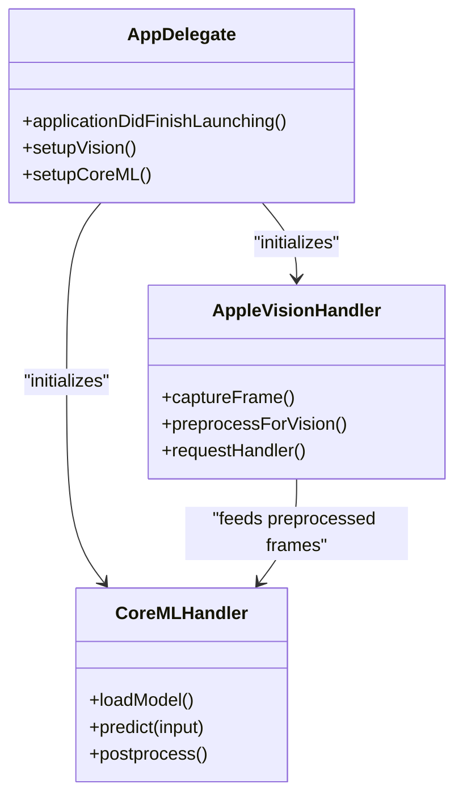
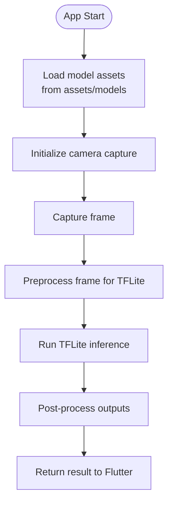
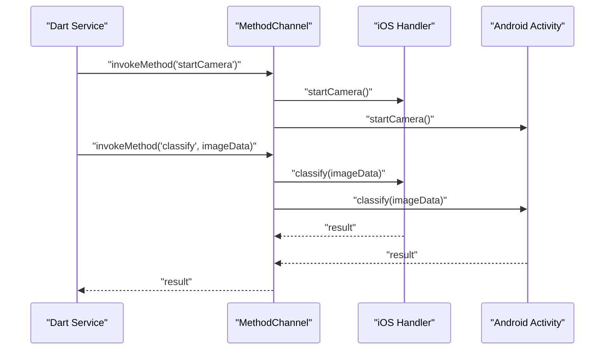
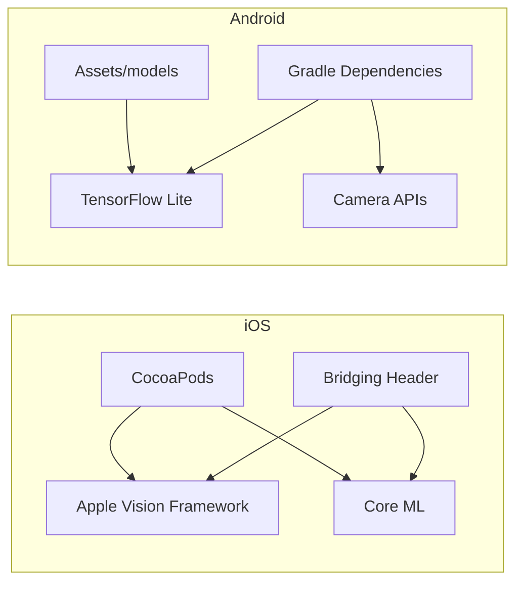

# Native Integration

<cite>
**Referenced Files in This Document**
- [AppDelegate.swift](file://ios/Runner/AppDelegate.swift)
- [AppleVisionHandler.swift](file://ios/Runner/AppleVisionHandler.swift)
- [CoreMLHandler.swift](file://ios/Runner/CoreMLHandler.swift)
- [Runner-Bridging-Header.h](file://ios/Runner/Runner-Bridging-Header.h)
- [Podfile](file://ios/Podfile)
- [Info.plist](file://ios/Runner/Info.plist)
- [MainActivity.kt](file://android/app/src/main/kotlin/com/prismstyle_ai/app/MainActivity.kt)
- [AndroidManifest.xml (main)](file://android/app/src/main/AndroidManifest.xml)
- [AndroidManifest.xml (debug)](file://android/app/src/debug/AndroidManifest.xml)
- [AndroidManifest.xml (profile)](file://android/app/src/profile/AndroidManifest.xml)
- [build.gradle (app)](file://android/app/build.gradle)
- [pubspec.yaml](file://pubspec.yaml)
- [clothing_classifier_service.dart](file://lib/services/clothing_classifier_service.dart)
- [camera_capture.dart](file://lib/presentation/camera_capture/camera_capture.dart)
- [model_config.json](file://assets/models/model_config.json)
</cite>

## Table of Contents
1. [Introduction](#introduction)
2. [Project Structure](#project-structure)
3. [Core Components](#core-components)
4. [Architecture Overview](#architecture-overview)
5. [Detailed Component Analysis](#detailed-component-analysis)
6. [Dependency Analysis](#dependency-analysis)
7. [Performance Considerations](#performance-considerations)
8. [Troubleshooting Guide](#troubleshooting-guide)
9. [Security and Compliance](#security-and-compliance)
10. [Conclusion](#conclusion)

## Introduction
This document explains PrismStyle AI’s native platform integration for iOS and Android. It covers:
- iOS integration with Apple Vision Framework for image processing and Core ML for on-device inference
- Swift/Objective-C interoperability via a bridging header
- Flutter MethodChannel communication between Dart and native code
- Permission handling for camera access on iOS
- Android integration with TensorFlow Lite (TFLite) model loading, camera capture, and asset management
- Platform-specific configuration requirements, manifest permissions, and build configuration differences
- Debugging techniques, performance optimization strategies, and platform-specific troubleshooting
- Security considerations and compliance requirements

## Project Structure
The repository organizes platform-specific code under dedicated folders:
- iOS: Swift handlers for Apple Vision and Core ML, bridging header, and CocoaPods configuration
- Android: Kotlin main activity, manifests, Gradle build configuration, and assets for models
- Flutter: Dart services and UI that communicate with native code via MethodChannel

```mermaid
graph TB
subgraph "Flutter"
DART["Dart Services<br/>camera_capture.dart<br/>clothing_classifier_service.dart"]
end
subgraph "iOS"
IOS_APP["AppDelegate.swift"]
IOS_VISION["AppleVisionHandler.swift"]
IOS_COREML["CoreMLHandler.swift"]
IOS_BRIDGE["Runner-Bridging-Header.h"]
IOS_PODS["Podfile"]
IOS_INFO["Info.plist"]
end
subgraph "Android"
AND_MAIN["MainActivity.kt"]
AND_MAN_MAIN["AndroidManifest.xml (main)"]
AND_MAN_DEBUG["AndroidManifest.xml (debug)"]
AND_MAN_PROFILE["AndroidManifest.xml (profile)"]
AND_BUILD["build.gradle (app)"]
AND_ASSETS["assets/models/model_config.json"]
end
DART <- --> IOS_APP
DART <- --> AND_MAIN
IOS_APP --> IOS_VISION
IOS_APP --> IOS_COREML
IOS_APP --> IOS_BRIDGE
IOS_APP --> IOS_PODS
IOS_APP --> IOS_INFO
AND_MAIN --> AND_MAN_MAIN
AND_MAIN --> AND_MAN_DEBUG
AND_MAIN --> AND_MAN_PROFILE
AND_MAIN --> AND_BUILD
AND_MAIN --> AND_ASSETS
```

**Diagram sources**
- [AppDelegate.swift](file://ios/Runner/AppDelegate.swift#L1-L200)
- [AppleVisionHandler.swift](file://ios/Runner/AppleVisionHandler.swift#L1-L200)
- [CoreMLHandler.swift](file://ios/Runner/CoreMLHandler.swift#L1-L200)
- [Runner-Bridging-Header.h](file://ios/Runner/Runner-Bridging-Header.h#L1-L200)
- [Podfile](file://ios/Podfile#L1-L200)
- [Info.plist](file://ios/Runner/Info.plist#L1-L200)
- [MainActivity.kt](file://android/app/src/main/kotlin/com/prismstyle_ai/app/MainActivity.kt#L1-L200)
- [AndroidManifest.xml (main)](file://android/app/src/main/AndroidManifest.xml#L1-L200)
- [AndroidManifest.xml (debug)](file://android/app/src/debug/AndroidManifest.xml#L1-L200)
- [AndroidManifest.xml (profile)](file://android/app/src/profile/AndroidManifest.xml#L1-L200)
- [build.gradle (app)](file://android/app/build.gradle#L1-L200)
- [model_config.json](file://assets/models/model_config.json#L1-L200)

**Section sources**
- [AppDelegate.swift](file://ios/Runner/AppDelegate.swift#L1-L200)
- [MainActivity.kt](file://android/app/src/main/kotlin/com/prismstyle_ai/app/MainActivity.kt#L1-L200)
- [AndroidManifest.xml (main)](file://android/app/src/main/AndroidManifest.xml#L1-L200)
- [AndroidManifest.xml (debug)](file://android/app/src/debug/AndroidManifest.xml#L1-L200)
- [AndroidManifest.xml (profile)](file://android/app/src/profile/AndroidManifest.xml#L1-L200)
- [build.gradle (app)](file://android/app/build.gradle#L1-L200)
- [pubspec.yaml](file://pubspec.yaml#L1-L200)

## Core Components
- iOS Vision/Core ML pipeline: Image acquisition, preprocessing, and inference using Apple Vision and Core ML
- Android TFLite pipeline: Model loading, preprocessing, and inference using TensorFlow Lite
- Flutter MethodChannel: Communication bridge between Dart and native code for camera capture, inference, and configuration
- Permissions and configuration: Camera access on iOS and Android, and platform-specific build settings

Key implementation anchors:
- iOS handlers and bridging header define the Swift/Objective-C interoperability surface
- Android main activity integrates camera capture and asset loading
- Dart services orchestrate UI flows and native calls

**Section sources**
- [AppleVisionHandler.swift](file://ios/Runner/AppleVisionHandler.swift#L1-L200)
- [CoreMLHandler.swift](file://ios/Runner/CoreMLHandler.swift#L1-L200)
- [Runner-Bridging-Header.h](file://ios/Runner/Runner-Bridging-Header.h#L1-L200)
- [MainActivity.kt](file://android/app/src/main/kotlin/com/prismstyle_ai/app/MainActivity.kt#L1-L200)
- [clothing_classifier_service.dart](file://lib/services/clothing_classifier_service.dart#L1-L200)
- [camera_capture.dart](file://lib/presentation/camera_capture/camera_capture.dart#L1-L200)

## Architecture Overview
The system uses a layered architecture:
- Flutter UI and services trigger native operations via MethodChannel
- iOS delegates to Apple Vision for image processing and Core ML for inference
- Android delegates to TensorFlow Lite for inference after camera capture and preprocessing
- Shared assets (models) are managed per platform

```mermaid
sequenceDiagram
participant UI as "Flutter UI<br/>camera_capture.dart"
participant SVC as "Dart Service<br/>clothing_classifier_service.dart"
participant IOS as "iOS Native<br/>AppleVisionHandler.swift<br/>CoreMLHandler.swift"
participant AND as "Android Native<br/>MainActivity.kt"
UI->>SVC : "Start capture and classification"
SVC->>IOS : "MethodChannel : startCamera/iOS"
SVC->>AND : "MethodChannel : startCamera/Android"
IOS-->>SVC : "Frame processed via Vision"
AND-->>SVC : "Frame captured via Camera"
SVC->>IOS : "MethodChannel : classify(imageData)"
SVC->>AND : "MethodChannel : classify(imageData)"
IOS-->>SVC : "Classification result (Core ML)"
AND-->>SVC : "Classification result (TFLite)"
SVC-->>UI : "Display recommendations"
```

**Diagram sources**
- [camera_capture.dart](file://lib/presentation/camera_capture/camera_capture.dart#L1-L200)
- [clothing_classifier_service.dart](file://lib/services/clothing_classifier_service.dart#L1-L200)
- [AppleVisionHandler.swift](file://ios/Runner/AppleVisionHandler.swift#L1-L200)
- [CoreMLHandler.swift](file://ios/Runner/CoreMLHandler.swift#L1-L200)
- [MainActivity.kt](file://android/app/src/main/kotlin/com/prismstyle_ai/app/MainActivity.kt#L1-L200)

## Detailed Component Analysis

### iOS Integration: Apple Vision and Core ML
- Apple Vision Framework: Handles image acquisition, orientation, and preprocessing for inference
- Core ML: Performs on-device machine learning inference using compiled models
- Swift/Objective-C Interoperability: Bridging header exposes Swift APIs to Objective-C/Objective-C++ code paths
- Permissions: Camera access requires Info.plist entries and runtime authorization



**Diagram sources**
- [AppleVisionHandler.swift](file://ios/Runner/AppleVisionHandler.swift#L1-L200)
- [CoreMLHandler.swift](file://ios/Runner/CoreMLHandler.swift#L1-L200)
- [AppDelegate.swift](file://ios/Runner/AppDelegate.swift#L1-L200)

Implementation highlights:
- Vision pipeline: Frame capture, orientation correction, and region-of-interest preparation
- Core ML pipeline: Model loading, input tensor preparation, inference, and output decoding
- Bridging header: Exposes Swift classes to Objective-C for Flutter plugin integration
- Permissions: Camera usage description and authorization flow

**Section sources**
- [AppleVisionHandler.swift](file://ios/Runner/AppleVisionHandler.swift#L1-L200)
- [CoreMLHandler.swift](file://ios/Runner/CoreMLHandler.swift#L1-L200)
- [Runner-Bridging-Header.h](file://ios/Runner/Runner-Bridging-Header.h#L1-L200)
- [Info.plist](file://ios/Runner/Info.plist#L1-L200)

### Android Integration: TFLite, Camera Capture, and Asset Management
- TensorFlow Lite: Loads quantized models and performs inference on device
- Camera Capture: Uses platform camera APIs to capture frames and feed to inference
- Asset Management: Model metadata and configurations stored under assets for packaging and runtime access



**Diagram sources**
- [MainActivity.kt](file://android/app/src/main/kotlin/com/prismstyle_ai/app/MainActivity.kt#L1-L200)
- [AndroidManifest.xml (main)](file://android/app/src/main/AndroidManifest.xml#L1-L200)
- [model_config.json](file://assets/models/model_config.json#L1-L200)

Implementation highlights:
- Camera initialization and lifecycle management
- TFLite interpreter setup and input/output tensors
- Asset loading and model configuration parsing

**Section sources**
- [MainActivity.kt](file://android/app/src/main/kotlin/com/prismstyle_ai/app/MainActivity.kt#L1-L200)
- [AndroidManifest.xml (main)](file://android/app/src/main/AndroidManifest.xml#L1-L200)
- [AndroidManifest.xml (debug)](file://android/app/src/debug/AndroidManifest.xml#L1-L200)
- [AndroidManifest.xml (profile)](file://android/app/src/profile/AndroidManifest.xml#L1-L200)
- [build.gradle (app)](file://android/app/build.gradle#L1-L200)
- [model_config.json](file://assets/models/model_config.json#L1-L200)

### Flutter MethodChannel Communication
- Dart services coordinate UI flows and invoke native capabilities
- MethodChannel channels are used to start camera, capture frames, and run classification
- Platform-specific implementations expose methods consumed by Dart



**Diagram sources**
- [clothing_classifier_service.dart](file://lib/services/clothing_classifier_service.dart#L1-L200)
- [camera_capture.dart](file://lib/presentation/camera_capture/camera_capture.dart#L1-L200)
- [AppDelegate.swift](file://ios/Runner/AppDelegate.swift#L1-L200)
- [MainActivity.kt](file://android/app/src/main/kotlin/com/prismstyle_ai/app/MainActivity.kt#L1-L200)

**Section sources**
- [clothing_classifier_service.dart](file://lib/services/clothing_classifier_service.dart#L1-L200)
- [camera_capture.dart](file://lib/presentation/camera_capture/camera_capture.dart#L1-L200)

### Platform-Specific Configuration and Build Differences
- iOS
  - CocoaPods dependency management via Podfile
  - Info.plist camera usage description and privacy declarations
  - Swift bridging header for Objective-C interoperability
- Android
  - Gradle build configuration for dependencies and packaging
  - Manifest permissions for camera and storage
  - Assets folder for model files and configuration

**Section sources**
- [Podfile](file://ios/Podfile#L1-L200)
- [Info.plist](file://ios/Runner/Info.plist#L1-L200)
- [Runner-Bridging-Header.h](file://ios/Runner/Runner-Bridging-Header.h#L1-L200)
- [build.gradle (app)](file://android/app/build.gradle#L1-L200)
- [AndroidManifest.xml (main)](file://android/app/src/main/AndroidManifest.xml#L1-L200)

## Dependency Analysis
- iOS
  - Apple Vision Framework and Core ML frameworks integrated via Xcode and bridging header
  - Pods managed by CocoaPods
- Android
  - TensorFlow Lite dependency configured in Gradle
  - CameraX or Camera2 APIs for capture (implementation depends on MainActivity)
  - Assets packaged under app/src/main/assets



**Diagram sources**
- [Podfile](file://ios/Podfile#L1-L200)
- [Runner-Bridging-Header.h](file://ios/Runner/Runner-Bridging-Header.h#L1-L200)
- [build.gradle (app)](file://android/app/build.gradle#L1-L200)
- [model_config.json](file://assets/models/model_config.json#L1-L200)

**Section sources**
- [Podfile](file://ios/Podfile#L1-L200)
- [build.gradle (app)](file://android/app/build.gradle#L1-L200)

## Performance Considerations
- On-device inference
  - Prefer quantized models to reduce memory footprint and latency
  - Batch inference where applicable to amortize overhead
- Image preprocessing
  - Minimize allocations and copy operations
  - Use hardware-accelerated pipelines (Vision, GPU-backed TFLite delegate)
- Memory management
  - Dispose of intermediate buffers promptly
  - Avoid retaining frames beyond inference window
- Threading
  - Keep UI thread responsive; perform heavy work on background threads
  - Use async/await patterns in Dart and dispatch queues on iOS
- Platform-specific optimizations
  - iOS: Use Metal Performance Shaders for compute-heavy steps
  - Android: Enable NNAPI or GPU delegates for TFLite

[No sources needed since this section provides general guidance]

## Troubleshooting Guide
- iOS
  - Camera permissions: Verify Info.plist usage description and runtime authorization flow
  - Vision/Core ML models: Ensure models are bundled and compatible with target devices
  - Bridging header: Confirm Swift classes are visible to Objective-C
- Android
  - Camera permissions: Confirm manifest entries and runtime permission requests
  - Model loading: Validate asset paths and model checksums
  - TFLite delegate: Ensure delegates are enabled only when available
- Flutter MethodChannel
  - Channel registration: Ensure channel names match between Dart and native
  - Error propagation: Wrap native exceptions and return structured errors to Dart
- General
  - Logging: Add platform logs around camera start, inference start, and completion
  - Profiling: Measure inference latency and memory usage per frame

**Section sources**
- [Info.plist](file://ios/Runner/Info.plist#L1-L200)
- [Runner-Bridging-Header.h](file://ios/Runner/Runner-Bridging-Header.h#L1-L200)
- [AndroidManifest.xml (main)](file://android/app/src/main/AndroidManifest.xml#L1-L200)
- [MainActivity.kt](file://android/app/src/main/kotlin/com/prismstyle_ai/app/MainActivity.kt#L1-L200)
- [clothing_classifier_service.dart](file://lib/services/clothing_classifier_service.dart#L1-L200)

## Security and Compliance
- Data minimization
  - Capture only necessary frames for inference
  - Avoid storing personal data unless required by features
- Privacy controls
  - Provide clear consent prompts and revoke access gracefully
  - Respect user opt-out and deletion requests
- Secure transport
  - Use HTTPS for any network calls and secure storage for tokens
- Model integrity
  - Validate model signatures and checksums at load time
- Platform-specific policies
  - iOS: Adhere to App Store guidelines for camera usage and privacy
  - Android: Comply with Google Play policies and device security requirements

[No sources needed since this section provides general guidance]

## Conclusion
PrismStyle AI integrates iOS and Android platforms to deliver on-device image classification. The iOS stack leverages Apple Vision and Core ML with Swift/Objective-C interoperability, while Android relies on TensorFlow Lite and camera capture. Flutter MethodChannel unifies the UI layer with native capabilities. Proper configuration, permissions, and performance optimizations are essential for robust operation. Security and compliance practices should be embedded across both platforms.

[No sources needed since this section summarizes without analyzing specific files]