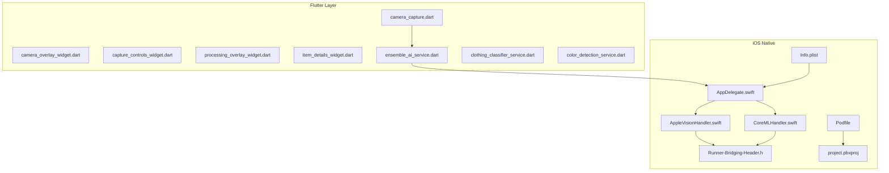
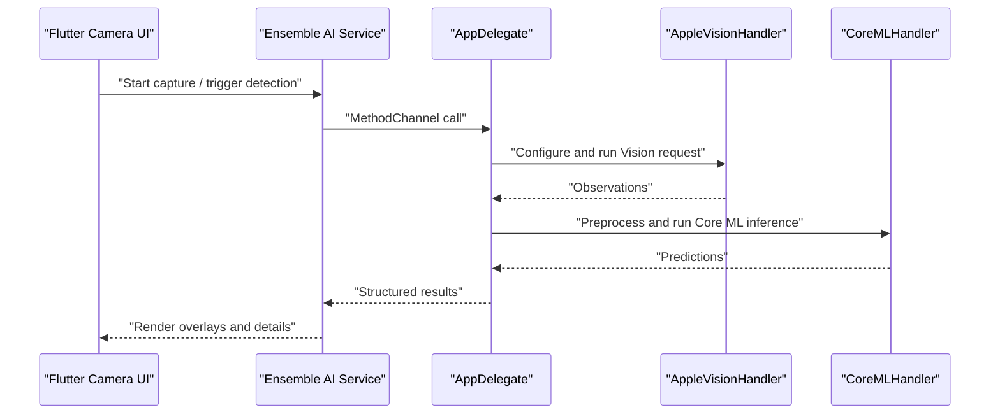
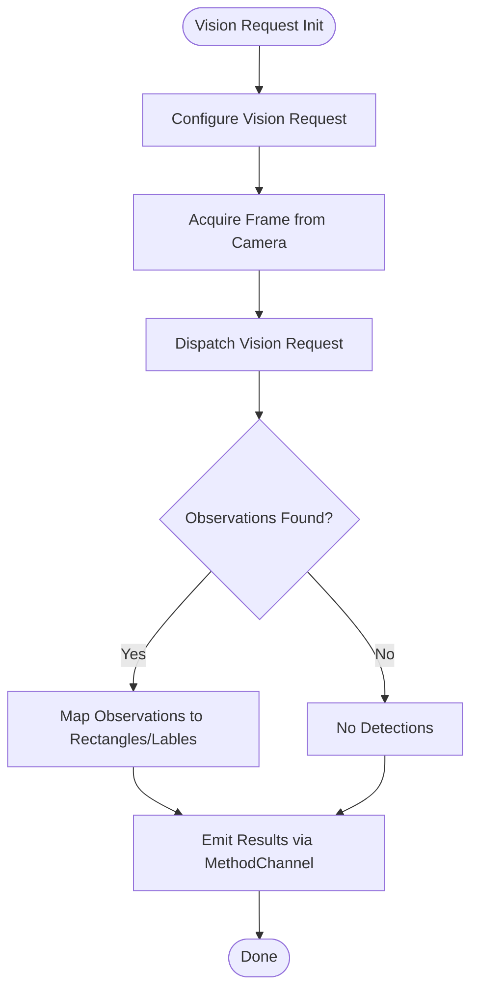
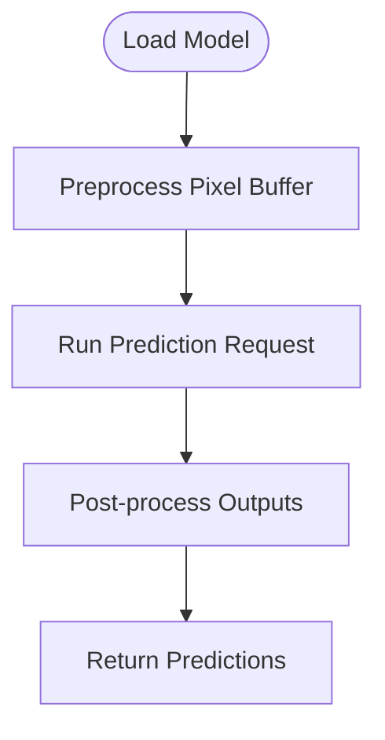
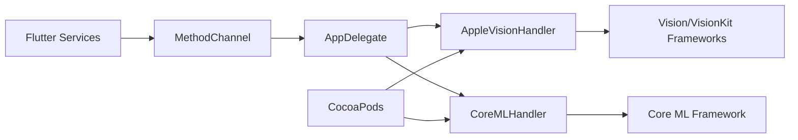

# iOS Integration

<cite>
**Referenced Files in This Document**
- [AppDelegate.swift](file://ios/Runner/AppDelegate.swift)
- [AppleVisionHandler.swift](file://ios/Runner/AppleVisionHandler.swift)
- [CoreMLHandler.swift](file://ios/Runner/CoreMLHandler.swift)
- [Runner-Bridging-Header.h](file://ios/Runner/Runner-Bridging-Header.h)
- [Info.plist](file://ios/Runner/Info.plist)
- [Podfile](file://ios/Podfile)
- [project.pbxproj](file://ios/Runner.xcodeproj/project.pbxproj)
- [camera_capture.dart](file://lib/presentation/camera_capture/camera_capture.dart)
- [camera_overlay_widget.dart](file://lib/presentation/camera_capture/widgets/camera_overlay_widget.dart)
- [capture_controls_widget.dart](file://lib/presentation/camera_capture/widgets/capture_controls_widget.dart)
- [processing_overlay_widget.dart](file://lib/presentation/camera_capture/widgets/processing_overlay_widget.dart)
- [item_details_widget.dart](file://lib/presentation/camera_capture/widgets/item_details_widget.dart)
- [ensemble_ai_service.dart](file://lib/services/ensemble_ai_service.dart)
- [clothing_classifier_service.dart](file://lib/services/clothing_classifier_service.dart)
- [color_detection_service.dart](file://lib/services/color_detection_service.dart)
- [model_config.json](file://assets/models/model_config.json)
</cite>

## Table of Contents
1. [Introduction](#introduction)
2. [Project Structure](#project-structure)
3. [Core Components](#core-components)
4. [Architecture Overview](#architecture-overview)
5. [Detailed Component Analysis](#detailed-component-analysis)
6. [Dependency Analysis](#dependency-analysis)
7. [Performance Considerations](#performance-considerations)
8. [Troubleshooting Guide](#troubleshooting-guide)
9. [Conclusion](#conclusion)
10. [Appendices](#appendices)

## Introduction
This document explains PrismStyle AI’s iOS platform integration, focusing on Apple Vision Framework-based real-time image processing and object detection, Core ML model inference for on-device machine learning, and Flutter-to-native iOS communication via MethodChannel. It also covers bridging header configuration, camera permissions, privacy compliance, Xcode project setup, debugging techniques, performance optimization, and App Store submission considerations.

## Project Structure
The iOS integration resides under the ios/Runner directory and consists of:
- Native Swift handlers for Apple Vision and Core ML
- A bridging header enabling Objective-C/Swift interop
- Flutter plugin channels for cross-language communication
- Xcode project configuration and CocoaPods dependencies
- Flutter UI components orchestrating camera capture and overlays

**Diagram sources**
- [AppDelegate.swift](file://ios/Runner/AppDelegate.swift#L1-L200)
- [AppleVisionHandler.swift](file://ios/Runner/AppleVisionHandler.swift#L1-L200)
- [CoreMLHandler.swift](file://ios/Runner/CoreMLHandler.swift#L1-L200)
- [Runner-Bridging-Header.h](file://ios/Runner/Runner-Bridging-Header.h#L1-L100)
- [Info.plist](file://ios/Runner/Info.plist#L1-L200)
- [Podfile](file://ios/Podfile#L1-L100)
- [project.pbxproj](file://ios/Runner.xcodeproj/project.pbxproj#L1-L300)
- [camera_capture.dart](file://lib/presentation/camera_capture/camera_capture.dart#L1-L200)
- [camera_overlay_widget.dart](file://lib/presentation/camera_capture/widgets/camera_overlay_widget.dart#L1-L200)
- [capture_controls_widget.dart](file://lib/presentation/camera_capture/widgets/capture_controls_widget.dart#L1-L200)
- [processing_overlay_widget.dart](file://lib/presentation/camera_capture/widgets/processing_overlay_widget.dart#L1-L200)
- [item_details_widget.dart](file://lib/presentation/camera_capture/widgets/item_details_widget.dart#L1-L200)
- [ensemble_ai_service.dart](file://lib/services/ensemble_ai_service.dart#L1-L200)
- [clothing_classifier_service.dart](file://lib/services/clothing_classifier_service.dart#L1-L200)
- [color_detection_service.dart](file://lib/services/color_detection_service.dart#L1-L200)

**Section sources**
- [AppDelegate.swift](file://ios/Runner/AppDelegate.swift#L1-L200)
- [AppleVisionHandler.swift](file://ios/Runner/AppleVisionHandler.swift#L1-L200)
- [CoreMLHandler.swift](file://ios/Runner/CoreMLHandler.swift#L1-L200)
- [Runner-Bridging-Header.h](file://ios/Runner/Runner-Bridging-Header.h#L1-L100)
- [Info.plist](file://ios/Runner/Info.plist#L1-L200)
- [Podfile](file://ios/Podfile#L1-L100)
- [project.pbxproj](file://ios/Runner.xcodeproj/project.pbxproj#L1-L300)
- [camera_capture.dart](file://lib/presentation/camera_capture/camera_capture.dart#L1-L200)
- [camera_overlay_widget.dart](file://lib/presentation/camera_capture/widgets/camera_overlay_widget.dart#L1-L200)
- [capture_controls_widget.dart](file://lib/presentation/camera_capture/widgets/capture_controls_widget.dart#L1-L200)
- [processing_overlay_widget.dart](file://lib/presentation/camera_capture/widgets/processing_overlay_widget.dart#L1-L200)
- [item_details_widget.dart](file://lib/presentation/camera_capture/widgets/item_details_widget.dart#L1-L200)
- [ensemble_ai_service.dart](file://lib/services/ensemble_ai_service.dart#L1-L200)
- [clothing_classifier_service.dart](file://lib/services/clothing_classifier_service.dart#L1-L200)
- [color_detection_service.dart](file://lib/services/color_detection_service.dart#L1-L200)

## Core Components
- Apple Vision Handler: Implements real-time image processing and object detection using Apple Vision APIs. It manages frame acquisition, Vision requests, and result callbacks to Flutter.
- Core ML Handler: Manages Core ML model loading, preprocessing, inference, and post-processing. It exposes inference results to Flutter via MethodChannel.
- Bridging Header: Enables Objective-C/Swift interoperability for native libraries and frameworks used by the handlers.
- MethodChannel Communication: Flutter invokes native iOS methods for camera control, Vision/VisionKit requests, and Core ML inference, receiving structured results back.
- Camera Capture UI: Flutter widgets coordinate camera preview, overlay rendering, capture controls, and processing indicators.

Key implementation patterns:
- Vision Request Pipeline: Configure Vision requests, dispatch to a Vision request handler, and return observations to Flutter.
- Core ML Inference Pipeline: Load compiled .mlmodelc, preprocess pixel buffers, run predictions, and interpret class labels/confidences.
- Overlay Rendering: Render Vision observations and classification results over the live camera feed.

**Section sources**
- [AppleVisionHandler.swift](file://ios/Runner/AppleVisionHandler.swift#L1-L200)
- [CoreMLHandler.swift](file://ios/Runner/CoreMLHandler.swift#L1-L200)
- [Runner-Bridging-Header.h](file://ios/Runner/Runner-Bridging-Header.h#L1-L100)
- [camera_capture.dart](file://lib/presentation/camera_capture/camera_capture.dart#L1-L200)
- [camera_overlay_widget.dart](file://lib/presentation/camera_capture/widgets/camera_overlay_widget.dart#L1-L200)
- [capture_controls_widget.dart](file://lib/presentation/camera_capture/widgets/capture_controls_widget.dart#L1-L200)
- [processing_overlay_widget.dart](file://lib/presentation/camera_capture/widgets/processing_overlay_widget.dart#L1-L200)
- [item_details_widget.dart](file://lib/presentation/camera_capture/widgets/item_details_widget.dart#L1-L200)

## Architecture Overview
The iOS integration follows a layered architecture:
- Flutter UI layer orchestrates camera capture and overlays
- Service layer translates UI actions into native method invocations
- Native iOS layer handles camera, Vision, and Core ML operations
- Results are serialized and returned to Flutter for display

**Diagram sources**
- [ensemble_ai_service.dart](file://lib/services/ensemble_ai_service.dart#L1-L200)
- [AppDelegate.swift](file://ios/Runner/AppDelegate.swift#L1-L200)
- [AppleVisionHandler.swift](file://ios/Runner/AppleVisionHandler.swift#L1-L200)
- [CoreMLHandler.swift](file://ios/Runner/CoreMLHandler.swift#L1-L200)

## Detailed Component Analysis

### Apple Vision Handler
Responsibilities:
- Initialize Vision request objects for object detection
- Receive frames from the camera pipeline
- Dispatch Vision requests and receive observations
- Convert Vision observations into a Flutter-friendly format

Processing logic:
- Configure Vision requests with bounding boxes and classification options
- Run inference on CMSampleBuffer frames
- Map Vision observations to rectangles and labels
- Emit results via MethodChannel

**Diagram sources**
- [AppleVisionHandler.swift](file://ios/Runner/AppleVisionHandler.swift#L1-L200)

**Section sources**
- [AppleVisionHandler.swift](file://ios/Runner/AppleVisionHandler.swift#L1-L200)

### Core ML Handler
Responsibilities:
- Load Core ML model (.mlmodelc) from bundle
- Preprocess frames into CVPixelBuffer suitable for Core ML
- Execute prediction requests
- Post-process outputs into labels and confidence scores

**Diagram sources**
- [CoreMLHandler.swift](file://ios/Runner/CoreMLHandler.swift#L1-L200)

**Section sources**
- [CoreMLHandler.swift](file://ios/Runner/CoreMLHandler.swift#L1-L200)
- [model_config.json](file://assets/models/model_config.json#L1-L200)

### MethodChannel Communication
Flutter invokes native iOS methods for:
- Starting/stopping camera sessions
- Configuring Vision requests
- Running Core ML inference
- Receiving structured results for UI rendering

Patterns:
- Use MethodChannel to send JSON-like payloads
- Decode payloads in Swift and call appropriate handlers
- Return typed results to Flutter for overlay rendering

**Section sources**
- [ensemble_ai_service.dart](file://lib/services/ensemble_ai_service.dart#L1-L200)
- [AppDelegate.swift](file://ios/Runner/AppDelegate.swift#L1-L200)

### Swift/Objective-C Interoperability and Bridging Header
The bridging header enables importing Objective-C frameworks/libraries into Swift, allowing Vision/VisionKit and other system frameworks to be used alongside Swift handlers.

Guidelines:
- Declare Objective-C imports in the bridging header
- Keep bridging header minimal and focused
- Avoid exposing internal Objective-C details to Flutter

**Section sources**
- [Runner-Bridging-Header.h](file://ios/Runner/Runner-Bridging-Header.h#L1-L100)

### Camera Permission Handling and Privacy
Permissions:
- Add NSCameraUsageDescription to Info.plist to request camera access
- Prompt users during runtime when capturing images
- Respect user denials and disable camera-dependent features

Privacy considerations:
- Process images on-device; avoid uploading raw frames
- Clear sensitive data after processing
- Comply with applicable privacy regulations

**Section sources**
- [Info.plist](file://ios/Runner/Info.plist#L1-L200)

### Xcode Project Configuration and Dependencies
Xcode project:
- Runner.xcodeproj defines targets, build phases, and signing
- project.pbxproj lists source files, frameworks, and build settings

CocoaPods:
- Podfile declares third-party dependencies
- Pods integrate via CocoaPods installation and workspace

Build settings:
- Enable Swift compiler options for interoperability
- Set deployment target and device capabilities
- Configure signing and provisioning profiles

**Section sources**
- [project.pbxproj](file://ios/Runner.xcodeproj/project.pbxproj#L1-L300)
- [Podfile](file://ios/Podfile#L1-L100)

## Dependency Analysis
External dependencies and integrations:
- Apple Vision/VisionKit for object detection
- Core ML for on-device inference
- Flutter MethodChannel for cross-language communication
- CocoaPods-managed third-party libraries

**Diagram sources**
- [ensemble_ai_service.dart](file://lib/services/ensemble_ai_service.dart#L1-L200)
- [AppDelegate.swift](file://ios/Runner/AppDelegate.swift#L1-L200)
- [AppleVisionHandler.swift](file://ios/Runner/AppleVisionHandler.swift#L1-L200)
- [CoreMLHandler.swift](file://ios/Runner/CoreMLHandler.swift#L1-L200)
- [Podfile](file://ios/Podfile#L1-L100)

**Section sources**
- [ensemble_ai_service.dart](file://lib/services/ensemble_ai_service.dart#L1-L200)
- [AppleVisionHandler.swift](file://ios/Runner/AppleVisionHandler.swift#L1-L200)
- [CoreMLHandler.swift](file://ios/Runner/CoreMLHandler.swift#L1-L200)
- [Podfile](file://ios/Podfile#L1-L100)

## Performance Considerations
Optimization strategies for mobile devices:
- Use Metal Performance Shaders for efficient tensor operations if extending Core ML
- Minimize memory allocations during inference loops
- Throttle frame rates for Vision requests to balance accuracy and battery life
- Defer heavy post-processing to background queues
- Cache compiled Core ML models and reuse contexts
- Prefer low-resolution inference for real-time constraints, scaling up only when needed

[No sources needed since this section provides general guidance]

## Troubleshooting Guide
Common iOS integration issues and resolutions:
- Camera permission denied: Ensure NSCameraUsageDescription is present and prompt users appropriately
- Vision request failures: Verify Vision request configuration and device compatibility
- Core ML model load errors: Confirm .mlmodelc is bundled and compiled for target architecture
- MethodChannel timeouts: Validate channel registration and payload sizes
- Build errors with pods: Clean derived data, run pod install, and verify workspace integrity
- Memory pressure during inference: Reduce batch size or resolution; monitor memory usage

**Section sources**
- [Info.plist](file://ios/Runner/Info.plist#L1-L200)
- [AppleVisionHandler.swift](file://ios/Runner/AppleVisionHandler.swift#L1-L200)
- [CoreMLHandler.swift](file://ios/Runner/CoreMLHandler.swift#L1-L200)
- [ensemble_ai_service.dart](file://lib/services/ensemble_ai_service.dart#L1-L200)

## Conclusion
PrismStyle AI’s iOS integration leverages Apple Vision for real-time object detection and Core ML for on-device inference, communicating seamlessly with Flutter via MethodChannel. The solution emphasizes privacy, performance, and maintainability through on-device processing, structured overlays, and robust error handling.

[No sources needed since this section summarizes without analyzing specific files]

## Appendices

### A. Camera Capture UI Components
- Camera Capture Screen: Orchestrates camera initialization, overlay rendering, and capture events
- Camera Overlay Widget: Renders Vision detections and classification results
- Capture Controls Widget: Provides capture and toggle controls
- Processing Overlay Widget: Shows inference progress and status
- Item Details Widget: Displays detailed classification results

**Section sources**
- [camera_capture.dart](file://lib/presentation/camera_capture/camera_capture.dart#L1-L200)
- [camera_overlay_widget.dart](file://lib/presentation/camera_capture/widgets/camera_overlay_widget.dart#L1-L200)
- [capture_controls_widget.dart](file://lib/presentation/camera_capture/widgets/capture_controls_widget.dart#L1-L200)
- [processing_overlay_widget.dart](file://lib/presentation/camera_capture/widgets/processing_overlay_widget.dart#L1-L200)
- [item_details_widget.dart](file://lib/presentation/camera_capture/widgets/item_details_widget.dart#L1-L200)

### B. Service Layer Integration
- Ensemble AI Service: Coordinates Vision and Core ML pipelines
- Clothing Classifier Service: Uses Core ML for fashion item classification
- Color Detection Service: Processes detected regions for color analysis

**Section sources**
- [ensemble_ai_service.dart](file://lib/services/ensemble_ai_service.dart#L1-L200)
- [clothing_classifier_service.dart](file://lib/services/clothing_classifier_service.dart#L1-L200)
- [color_detection_service.dart](file://lib/services/color_detection_service.dart#L1-L200)

### C. Model Configuration
- model_config.json: Defines model metadata and inference parameters used by Core ML handler

**Section sources**
- [model_config.json](file://assets/models/model_config.json#L1-L200)