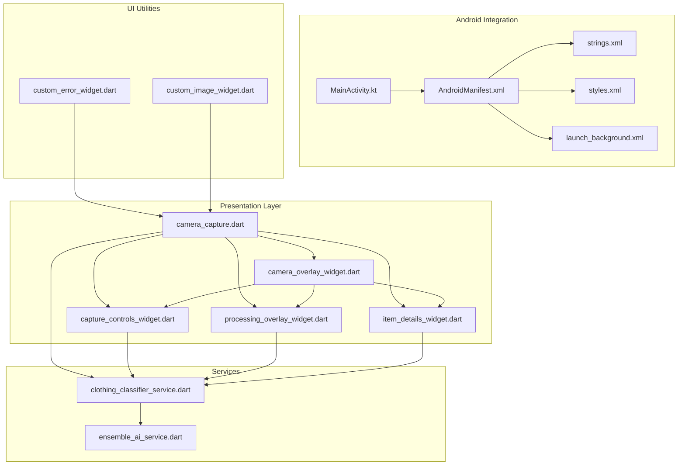
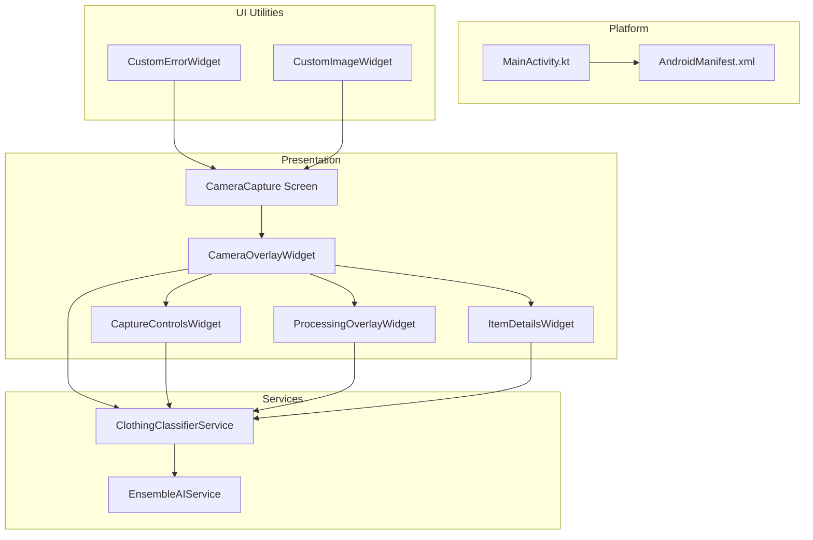
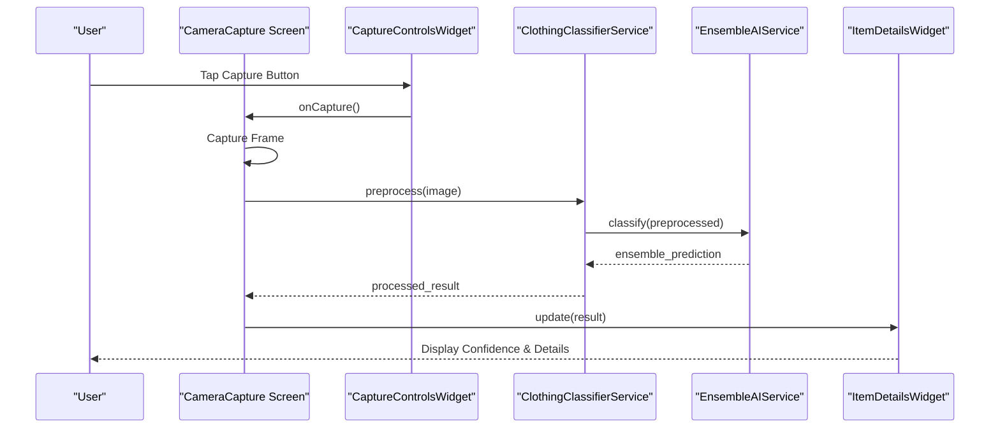
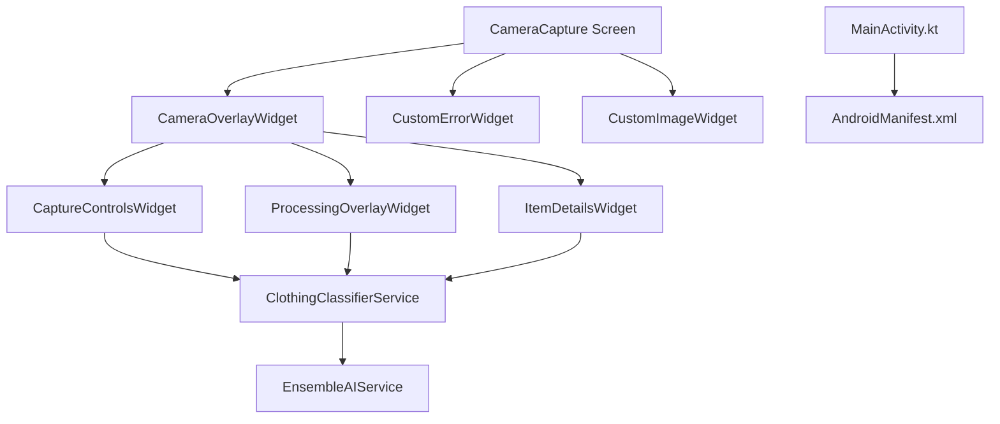

# Camera Capture

<cite>
**Referenced Files in This Document**
- [camera_capture.dart](file://lib/presentation/camera_capture/camera_capture.dart)
- [camera_overlay_widget.dart](file://lib/presentation/camera_capture/widgets/camera_overlay_widget.dart)
- [capture_controls_widget.dart](file://lib/presentation/camera_capture/widgets/capture_controls_widget.dart)
- [processing_overlay_widget.dart](file://lib/presentation/camera_capture/widgets/processing_overlay_widget.dart)
- [item_details_widget.dart](file://lib/presentation/camera_capture/widgets/item_details_widget.dart)
- [clothing_classifier_service.dart](file://lib/services/clothing_classifier_service.dart)
- [ensemble_ai_service.dart](file://lib/services/ensemble_ai_service.dart)
- [MainActivity.kt](file://android/app/src/main/kotlin/com/prismstyle_ai/app/MainActivity.kt)
- [AndroidManifest.xml](file://android/app/src/main/AndroidManifest.xml)
- [strings.xml](file://android/app/src/main/res/values/strings.xml)
- [styles.xml](file://android/app/src/main/res/values/styles.xml)
- [launch_background.xml](file://android/app/src/main/res/drawable/launch_background.xml)
- [custom_error_widget.dart](file://lib/widgets/custom_error_widget.dart)
- [custom_image_widget.dart](file://lib/widgets/custom_image_widget.dart)
</cite>

## Table of Contents
1. [Introduction](#introduction)
2. [Project Structure](#project-structure)
3. [Core Components](#core-components)
4. [Architecture Overview](#architecture-overview)
5. [Detailed Component Analysis](#detailed-component-analysis)
6. [Dependency Analysis](#dependency-analysis)
7. [Performance Considerations](#performance-considerations)
8. [Troubleshooting Guide](#troubleshooting-guide)
9. [Conclusion](#conclusion)

## Introduction
This document provides comprehensive documentation for the Camera Capture feature, the core AI-powered clothing recognition system. It covers camera integration, real-time image capture, permission handling, overlay widgets for controls and feedback, AI classification workflows, error handling, accessibility, camera switching, and gallery import functionality. The system integrates with an Ensemble AI Service for multi-model classification and includes performance optimizations and memory management strategies for continuous camera usage.

## Project Structure
The Camera Capture feature is implemented primarily in the presentation layer under the camera_capture module, with supporting widgets and services. The Android integration resides in the android/app/src directory, while shared UI components and error handling are located in the lib/widgets directory.

**Diagram sources**
- [camera_capture.dart](file://lib/presentation/camera_capture/camera_capture.dart#L1-L200)
- [camera_overlay_widget.dart](file://lib/presentation/camera_capture/widgets/camera_overlay_widget.dart#L1-L200)
- [capture_controls_widget.dart](file://lib/presentation/camera_capture/widgets/capture_controls_widget.dart#L1-L200)
- [processing_overlay_widget.dart](file://lib/presentation/camera_capture/widgets/processing_overlay_widget.dart#L1-L200)
- [item_details_widget.dart](file://lib/presentation/camera_capture/widgets/item_details_widget.dart#L1-L200)
- [clothing_classifier_service.dart](file://lib/services/clothing_classifier_service.dart#L1-L200)
- [ensemble_ai_service.dart](file://lib/services/ensemble_ai_service.dart#L1-L200)
- [MainActivity.kt](file://android/app/src/main/kotlin/com/prismstyle_ai/app/MainActivity.kt#L1-L200)
- [AndroidManifest.xml](file://android/app/src/main/AndroidManifest.xml#L1-L200)
- [strings.xml](file://android/app/src/main/res/values/strings.xml#L1-L200)
- [styles.xml](file://android/app/src/main/res/values/styles.xml#L1-L200)
- [launch_background.xml](file://android/app/src/main/res/drawable/launch_background.xml#L1-L200)
- [custom_error_widget.dart](file://lib/widgets/custom_error_widget.dart#L1-L200)
- [custom_image_widget.dart](file://lib/widgets/custom_image_widget.dart#L1-L200)

**Section sources**
- [camera_capture.dart](file://lib/presentation/camera_capture/camera_capture.dart#L1-L200)
- [camera_overlay_widget.dart](file://lib/presentation/camera_capture/widgets/camera_overlay_widget.dart#L1-L200)
- [capture_controls_widget.dart](file://lib/presentation/camera_capture/widgets/capture_controls_widget.dart#L1-L200)
- [processing_overlay_widget.dart](file://lib/presentation/camera_capture/widgets/processing_overlay_widget.dart#L1-L200)
- [item_details_widget.dart](file://lib/presentation/camera_capture/widgets/item_details_widget.dart#L1-L200)
- [clothing_classifier_service.dart](file://lib/services/clothing_classifier_service.dart#L1-L200)
- [ensemble_ai_service.dart](file://lib/services/ensemble_ai_service.dart#L1-L200)
- [MainActivity.kt](file://android/app/src/main/kotlin/com/prismstyle_ai/app/MainActivity.kt#L1-L200)
- [AndroidManifest.xml](file://android/app/src/main/AndroidManifest.xml#L1-L200)
- [strings.xml](file://android/app/src/main/res/values/strings.xml#L1-L200)
- [styles.xml](file://android/app/src/main/res/values/styles.xml#L1-L200)
- [launch_background.xml](file://android/app/src/main/res/drawable/launch_background.xml#L1-L200)
- [custom_error_widget.dart](file://lib/widgets/custom_error_widget.dart#L1-L200)
- [custom_image_widget.dart](file://lib/widgets/custom_image_widget.dart#L1-L200)

## Core Components
- Camera Capture Screen: Orchestrates camera initialization, permission handling, real-time preview, capture triggers, and result display.
- Overlay Widgets: Provide camera controls, capture button, processing indicators, and item details presentation.
- AI Classification Services: Handle image preprocessing, multi-model inference via Ensemble AI Service, and result post-processing.
- Android Integration: Manages camera permissions, manifest declarations, and platform-specific lifecycle hooks.
- Error Handling and Accessibility: Centralized error rendering and guidance for user-friendly recovery.

Key responsibilities:
- Real-time camera preview and capture
- Permission requests and handling
- Overlay controls for capture and camera switching
- Processing indicators during AI inference
- Confidence scoring and item details display
- Ensemble AI integration for robust classification
- Memory management and performance optimization
- Accessibility support and fallbacks

**Section sources**
- [camera_capture.dart](file://lib/presentation/camera_capture/camera_capture.dart#L1-L200)
- [camera_overlay_widget.dart](file://lib/presentation/camera_capture/widgets/camera_overlay_widget.dart#L1-L200)
- [capture_controls_widget.dart](file://lib/presentation/camera_capture/widgets/capture_controls_widget.dart#L1-L200)
- [processing_overlay_widget.dart](file://lib/presentation/camera_capture/widgets/processing_overlay_widget.dart#L1-L200)
- [item_details_widget.dart](file://lib/presentation/camera_capture/widgets/item_details_widget.dart#L1-L200)
- [clothing_classifier_service.dart](file://lib/services/clothing_classifier_service.dart#L1-L200)
- [ensemble_ai_service.dart](file://lib/services/ensemble_ai_service.dart#L1-L200)
- [custom_error_widget.dart](file://lib/widgets/custom_error_widget.dart#L1-L200)

## Architecture Overview
The Camera Capture feature follows a layered architecture:
- Presentation Layer: Screen and overlay widgets manage UI state, user interactions, and visual feedback.
- Service Layer: Clothing classifier service handles image preprocessing and delegates to Ensemble AI Service for inference.
- Platform Layer: Android integration manages camera permissions and lifecycle events.
- UI Utilities: Shared widgets provide consistent error handling and image rendering.

**Diagram sources**
- [camera_capture.dart](file://lib/presentation/camera_capture/camera_capture.dart#L1-L200)
- [camera_overlay_widget.dart](file://lib/presentation/camera_capture/widgets/camera_overlay_widget.dart#L1-L200)
- [capture_controls_widget.dart](file://lib/presentation/camera_capture/widgets/capture_controls_widget.dart#L1-L200)
- [processing_overlay_widget.dart](file://lib/presentation/camera_capture/widgets/processing_overlay_widget.dart#L1-L200)
- [item_details_widget.dart](file://lib/presentation/camera_capture/widgets/item_details_widget.dart#L1-L200)
- [clothing_classifier_service.dart](file://lib/services/clothing_classifier_service.dart#L1-L200)
- [ensemble_ai_service.dart](file://lib/services/ensemble_ai_service.dart#L1-L200)
- [MainActivity.kt](file://android/app/src/main/kotlin/com/prismstyle_ai/app/MainActivity.kt#L1-L200)
- [AndroidManifest.xml](file://android/app/src/main/AndroidManifest.xml#L1-L200)
- [custom_error_widget.dart](file://lib/widgets/custom_error_widget.dart#L1-L200)
- [custom_image_widget.dart](file://lib/widgets/custom_image_widget.dart#L1-L200)

## Detailed Component Analysis

### Camera Capture Screen
Responsibilities:
- Initialize camera controller and start preview
- Request and handle camera permissions
- Manage camera switching (front/back)
- Trigger image capture and pass frames to classifier
- Display classification results with confidence scores and item details
- Handle errors and show user guidance
- Optimize memory usage during continuous capture

Key implementation patterns:
- State management for camera state, capture state, and error state
- Lifecycle-aware camera controller disposal
- Async image capture and inference pipeline
- Accessibility considerations for controls and feedback

**Section sources**
- [camera_capture.dart](file://lib/presentation/camera_capture/camera_capture.dart#L1-L200)

### Camera Overlay Widget
Responsibilities:
- Render camera preview surface
- Host child widgets for controls, processing indicator, and item details
- Coordinate layout and z-index of overlay elements
- Provide responsive positioning for controls

Implementation patterns:
- Stack-based composition of overlay elements
- Conditional visibility based on capture and processing states
- Gesture and focus handling for accessibility

**Section sources**
- [camera_overlay_widget.dart](file://lib/presentation/camera_capture/widgets/camera_overlay_widget.dart#L1-L200)

### Capture Controls Widget
Responsibilities:
- Provide capture button with visual feedback
- Enable camera switch toggle
- Handle capture gestures and keyboard shortcuts
- Announce actions for accessibility

Implementation patterns:
- Animated capture button with pressed/released states
- Toggle button for front/back camera selection
- Focus management and screen reader announcements

**Section sources**
- [capture_controls_widget.dart](file://lib/presentation/camera_capture/widgets/capture_controls_widget.dart#L1-L200)

### Processing Overlay Widget
Responsibilities:
- Display loading indicators during AI inference
- Show progress and estimated wait times
- Provide cancel option for ongoing captures
- Announce processing state to assistive technologies

Implementation patterns:
- Animated spinner or progress bar
- Cancel callback to abort current inference
- Accessible labels and ARIA attributes

**Section sources**
- [processing_overlay_widget.dart](file://lib/presentation/camera_capture/widgets/processing_overlay_widget.dart#L1-L200)

### Item Details Widget
Responsibilities:
- Present classification results with confidence scores
- Display item categories, attributes, and metadata
- Provide expandable details for deeper insights
- Support copy-to-clipboard for sharing results

Implementation patterns:
- Card-based layout with typography hierarchy
- Expandable sections for detailed attributes
- Accessibility labels for each detail field

**Section sources**
- [item_details_widget.dart](file://lib/presentation/camera_capture/widgets/item_details_widget.dart#L1-L200)

### AI Classification Integration
Workflow:
- Image capture triggers preprocessing pipeline
- Preprocessed tensors are sent to Ensemble AI Service
- Ensemble combines predictions from multiple models
- Results are post-processed and returned to UI
- Confidence thresholds and filtering applied

**Diagram sources**
- [camera_capture.dart](file://lib/presentation/camera_capture/camera_capture.dart#L1-L200)
- [capture_controls_widget.dart](file://lib/presentation/camera_capture/widgets/capture_controls_widget.dart#L1-L200)
- [clothing_classifier_service.dart](file://lib/services/clothing_classifier_service.dart#L1-L200)
- [ensemble_ai_service.dart](file://lib/services/ensemble_ai_service.dart#L1-L200)
- [item_details_widget.dart](file://lib/presentation/camera_capture/widgets/item_details_widget.dart#L1-L200)

**Section sources**
- [clothing_classifier_service.dart](file://lib/services/clothing_classifier_service.dart#L1-L200)
- [ensemble_ai_service.dart](file://lib/services/ensemble_ai_service.dart#L1-L200)

### Android Integration and Permissions
Responsibilities:
- Declare camera permissions in AndroidManifest.xml
- Request runtime permissions in MainActivity.kt
- Handle permission denials gracefully
- Manage camera lifecycle and resource cleanup

Implementation patterns:
- Manifest entries for camera and hardware features
- Runtime permission checks and rationale dialogs
- Lifecycle callbacks to pause/resume camera usage

**Section sources**
- [AndroidManifest.xml](file://android/app/src/main/AndroidManifest.xml#L1-L200)
- [MainActivity.kt](file://android/app/src/main/kotlin/com/prismstyle_ai/app/MainActivity.kt#L1-L200)
- [strings.xml](file://android/app/src/main/res/values/strings.xml#L1-L200)
- [styles.xml](file://android/app/src/main/res/values/styles.xml#L1-L200)
- [launch_background.xml](file://android/app/src/main/res/drawable/launch_background.xml#L1-L200)

### Error Handling and User Guidance
Responsibilities:
- Centralized error rendering with actionable messages
- Fallback options for camera failures, permission denials, and network issues
- Accessibility announcements for error states
- Graceful degradation when AI services are unavailable

Implementation patterns:
- Custom error widget with retry actions
- User-friendly messaging and next steps
- Logging and diagnostics for troubleshooting

**Section sources**
- [custom_error_widget.dart](file://lib/widgets/custom_error_widget.dart#L1-L200)
- [camera_capture.dart](file://lib/presentation/camera_capture/camera_capture.dart#L1-L200)

### Accessibility Features
Responsibilities:
- Screen reader support for all interactive elements
- Keyboard navigation and focus management
- High contrast and readable typography
- Alternative input methods for capture and controls

Implementation patterns:
- Semantic labels and roles for controls
- Focus traps and navigation hints
- Dynamic text sizing and color contrast checks

**Section sources**
- [camera_overlay_widget.dart](file://lib/presentation/camera_capture/widgets/camera_overlay_widget.dart#L1-L200)
- [capture_controls_widget.dart](file://lib/presentation/camera_capture/widgets/capture_controls_widget.dart#L1-L200)
- [processing_overlay_widget.dart](file://lib/presentation/camera_capture/widgets/processing_overlay_widget.dart#L1-L200)
- [item_details_widget.dart](file://lib/presentation/camera_capture/widgets/item_details_widget.dart#L1-L200)

### Gallery Image Import Functionality
Responsibilities:
- Allow users to select images from device gallery
- Preprocess gallery images similarly to live camera frames
- Maintain consistent classification pipeline
- Preserve user experience parity between gallery and camera capture

Implementation patterns:
- Platform channel integration for gallery picker
- Unified preprocessing pipeline for both sources
- Consistent result presentation and confidence scoring

**Section sources**
- [custom_image_widget.dart](file://lib/widgets/custom_image_widget.dart#L1-L200)
- [camera_capture.dart](file://lib/presentation/camera_capture/camera_capture.dart#L1-L200)

## Dependency Analysis
The Camera Capture feature exhibits strong cohesion within the presentation layer and clear separation of concerns between UI, services, and platform integration. Dependencies are primarily unidirectional from UI to services and platform.

**Diagram sources**
- [camera_capture.dart](file://lib/presentation/camera_capture/camera_capture.dart#L1-L200)
- [camera_overlay_widget.dart](file://lib/presentation/camera_capture/widgets/camera_overlay_widget.dart#L1-L200)
- [capture_controls_widget.dart](file://lib/presentation/camera_capture/widgets/capture_controls_widget.dart#L1-L200)
- [processing_overlay_widget.dart](file://lib/presentation/camera_capture/widgets/processing_overlay_widget.dart#L1-L200)
- [item_details_widget.dart](file://lib/presentation/camera_capture/widgets/item_details_widget.dart#L1-L200)
- [clothing_classifier_service.dart](file://lib/services/clothing_classifier_service.dart#L1-L200)
- [ensemble_ai_service.dart](file://lib/services/ensemble_ai_service.dart#L1-L200)
- [custom_error_widget.dart](file://lib/widgets/custom_error_widget.dart#L1-L200)
- [custom_image_widget.dart](file://lib/widgets/custom_image_widget.dart#L1-L200)
- [MainActivity.kt](file://android/app/src/main/kotlin/com/prismstyle_ai/app/MainActivity.kt#L1-L200)
- [AndroidManifest.xml](file://android/app/src/main/AndroidManifest.xml#L1-L200)

**Section sources**
- [camera_capture.dart](file://lib/presentation/camera_capture/camera_capture.dart#L1-L200)
- [clothing_classifier_service.dart](file://lib/services/clothing_classifier_service.dart#L1-L200)
- [ensemble_ai_service.dart](file://lib/services/ensemble_ai_service.dart#L1-L200)
- [MainActivity.kt](file://android/app/src/main/kotlin/com/prismstyle_ai/app/MainActivity.kt#L1-L200)
- [AndroidManifest.xml](file://android/app/src/main/AndroidManifest.xml#L1-L200)

## Performance Considerations
- Continuous camera usage requires careful memory management to prevent leaks and maintain smooth frame rates.
- Preprocessing and inference should be optimized to minimize latency and battery consumption.
- Use background threads for heavy computations and avoid blocking the UI thread.
- Implement frame rate throttling and adaptive resolution based on device capabilities.
- Dispose of camera controllers and image streams promptly during lifecycle changes.
- Cache frequently used model artifacts and reuse resources where possible.

[No sources needed since this section provides general guidance]

## Troubleshooting Guide
Common issues and resolutions:
- Camera permission denied: Prompt user to enable permission in system settings and provide a retry mechanism.
- Camera initialization failure: Detect device compatibility, switch cameras, and offer gallery import as fallback.
- AI service unavailability: Display offline mode with cached results or retry after delay.
- Memory pressure: Reduce image resolution, limit concurrent requests, and clear caches periodically.
- Accessibility barriers: Ensure all controls have labels and provide haptic feedback for gestures.

**Section sources**
- [custom_error_widget.dart](file://lib/widgets/custom_error_widget.dart#L1-L200)
- [camera_capture.dart](file://lib/presentation/camera_capture/camera_capture.dart#L1-L200)
- [AndroidManifest.xml](file://android/app/src/main/AndroidManifest.xml#L1-L200)

## Conclusion
The Camera Capture feature delivers a robust, accessible, and efficient clothing recognition experience. By combining real-time camera capture with AI-powered classification, the system provides immediate and actionable insights. Through layered architecture, comprehensive error handling, and performance optimizations, it ensures reliability across diverse devices and usage scenarios. The integration with Ensemble AI Service enhances accuracy, while overlay widgets and accessibility features improve usability. Future enhancements can focus on advanced gesture controls, extended gallery support, and adaptive performance tuning.