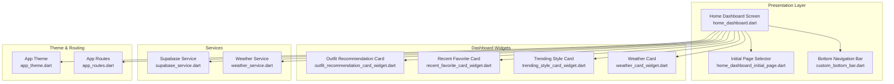
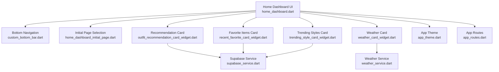
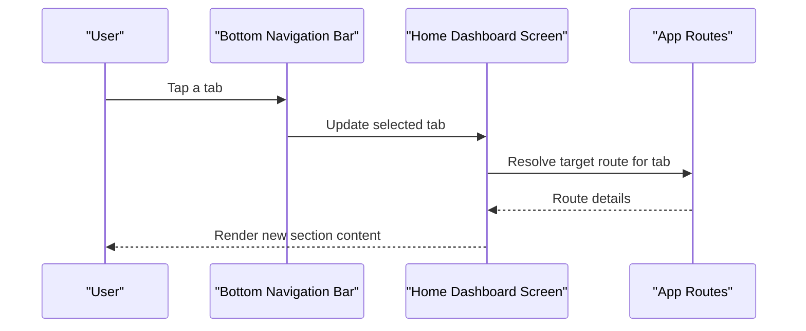
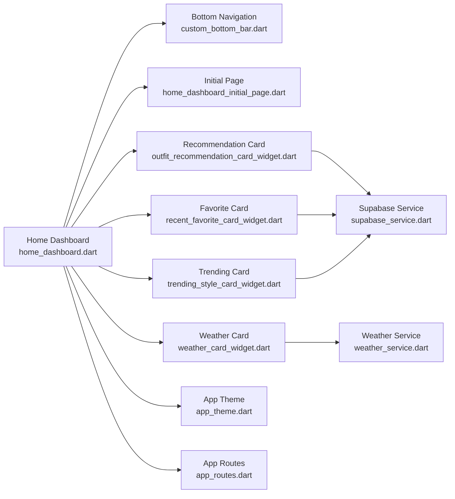

# Home Dashboard

<cite>
**Referenced Files in This Document**
- [home_dashboard.dart](file://lib/presentation/home_dashboard/home_dashboard.dart)
- [home_dashboard_initial_page.dart](file://lib/presentation/home_dashboard/home_dashboard_initial_page.dart)
- [outfit_recommendation_card_widget.dart](file://lib/presentation/home_dashboard/widgets/outfit_recommendation_card_widget.dart)
- [recent_favorite_card_widget.dart](file://lib/presentation/home_dashboard/widgets/recent_favorite_card_widget.dart)
- [trending_style_card_widget.dart](file://lib/presentation/home_dashboard/widgets/trending_style_card_widget.dart)
- [weather_card_widget.dart](file://lib/presentation/home_dashboard/widgets/weather_card_widget.dart)
- [custom_bottom_bar.dart](file://lib/widgets/custom_bottom_bar.dart)
- [supabase_service.dart](file://lib/services/supabase_service.dart)
- [weather_service.dart](file://lib/services/weather_service.dart)
- [app_theme.dart](file://lib/theme/app_theme.dart)
- [main.dart](file://lib/main.dart)
- [app_routes.dart](file://lib/routes/app_routes.dart)
</cite>

## Table of Contents
1. [Introduction](#introduction)
2. [Project Structure](#project-structure)
3. [Core Components](#core-components)
4. [Architecture Overview](#architecture-overview)
5. [Detailed Component Analysis](#detailed-component-analysis)
6. [Dependency Analysis](#dependency-analysis)
7. [Performance Considerations](#performance-considerations)
8. [Troubleshooting Guide](#troubleshooting-guide)
9. [Conclusion](#conclusion)

## Introduction
This document provides comprehensive documentation for the Home Dashboard component, the primary navigation hub of PrismStyle AI. It explains the main dashboard layout, bottom navigation bar implementation, initial page selection logic, and the widget composition pattern that powers recommendation cards, favorite items display, trending styles showcase, and weather integration. It also covers state management via Provider for real-time updates, responsive design for different screen sizes, Supabase integration for dynamic content, navigation flows, user interaction patterns, performance optimizations, theming system integration, and accessibility features.

## Project Structure
The Home Dashboard resides under the presentation layer and is composed of:
- A top-level dashboard screen that orchestrates the layout and navigation
- A bottom navigation bar widget for section switching
- Initial page selection logic for default tab routing
- Widget composition pattern for recommendation cards, favorites, trending styles, and weather
- Integration with Supabase for dynamic content and with Weather service for current conditions
- Theming and responsive design support

**Diagram sources**
- [home_dashboard.dart](file://lib/presentation/home_dashboard/home_dashboard.dart)
- [home_dashboard_initial_page.dart](file://lib/presentation/home_dashboard/home_dashboard_initial_page.dart)
- [custom_bottom_bar.dart](file://lib/widgets/custom_bottom_bar.dart)
- [outfit_recommendation_card_widget.dart](file://lib/presentation/home_dashboard/widgets/outfit_recommendation_card_widget.dart)
- [recent_favorite_card_widget.dart](file://lib/presentation/home_dashboard/widgets/recent_favorite_card_widget.dart)
- [trending_style_card_widget.dart](file://lib/presentation/home_dashboard/widgets/trending_style_card_widget.dart)
- [weather_card_widget.dart](file://lib/presentation/home_dashboard/widgets/weather_card_widget.dart)
- [supabase_service.dart](file://lib/services/supabase_service.dart)
- [weather_service.dart](file://lib/services/weather_service.dart)
- [app_theme.dart](file://lib/theme/app_theme.dart)
- [app_routes.dart](file://lib/routes/app_routes.dart)

**Section sources**
- [home_dashboard.dart](file://lib/presentation/home_dashboard/home_dashboard.dart)
- [custom_bottom_bar.dart](file://lib/widgets/custom_bottom_bar.dart)
- [home_dashboard_initial_page.dart](file://lib/presentation/home_dashboard/home_dashboard_initial_page.dart)

## Core Components
- Home Dashboard Screen: Hosts the main layout, bottom navigation, and widget composition. It coordinates initial page selection and delegates content rendering to child widgets.
- Bottom Navigation Bar: Provides quick access to dashboard sections with persistent selection state.
- Initial Page Selector: Determines the default tab shown on first load.
- Widget Composition Pattern:
  - Outfit Recommendation Card: Displays personalized recommendations.
  - Recent Favorite Card: Shows user’s recently favorited items.
  - Trending Style Card: Highlights popular styles in the community.
  - Weather Card: Integrates current weather conditions for contextual styling suggestions.
- Services:
  - Supabase Service: Supplies dynamic content and user preferences.
  - Weather Service: Fetches current weather for the dashboard.
- Theming and Routing: Centralized theme definitions and route configuration.

**Section sources**
- [home_dashboard.dart](file://lib/presentation/home_dashboard/home_dashboard.dart)
- [custom_bottom_bar.dart](file://lib/widgets/custom_bottom_bar.dart)
- [home_dashboard_initial_page.dart](file://lib/presentation/home_dashboard/home_dashboard_initial_page.dart)
- [outfit_recommendation_card_widget.dart](file://lib/presentation/home_dashboard/widgets/outfit_recommendation_card_widget.dart)
- [recent_favorite_card_widget.dart](file://lib/presentation/home_dashboard/widgets/recent_favorite_card_widget.dart)
- [trending_style_card_widget.dart](file://lib/presentation/home_dashboard/widgets/trending_style_card_widget.dart)
- [weather_card_widget.dart](file://lib/presentation/home_dashboard/widgets/weather_card_widget.dart)
- [supabase_service.dart](file://lib/services/supabase_service.dart)
- [weather_service.dart](file://lib/services/weather_service.dart)
- [app_theme.dart](file://lib/theme/app_theme.dart)
- [app_routes.dart](file://lib/routes/app_routes.dart)

## Architecture Overview
The Home Dashboard follows a layered architecture:
- Presentation layer: Dashboard screen and widgets
- Domain services: Weather and Supabase services
- Theme and routing: Centralized theme and navigation configuration
- State management: Provider-driven reactive updates

**Diagram sources**
- [home_dashboard.dart](file://lib/presentation/home_dashboard/home_dashboard.dart)
- [custom_bottom_bar.dart](file://lib/widgets/custom_bottom_bar.dart)
- [home_dashboard_initial_page.dart](file://lib/presentation/home_dashboard/home_dashboard_initial_page.dart)
- [outfit_recommendation_card_widget.dart](file://lib/presentation/home_dashboard/widgets/outfit_recommendation_card_widget.dart)
- [recent_favorite_card_widget.dart](file://lib/presentation/home_dashboard/widgets/recent_favorite_card_widget.dart)
- [trending_style_card_widget.dart](file://lib/presentation/home_dashboard/widgets/trending_style_card_widget.dart)
- [weather_card_widget.dart](file://lib/presentation/home_dashboard/widgets/weather_card_widget.dart)
- [supabase_service.dart](file://lib/services/supabase_service.dart)
- [weather_service.dart](file://lib/services/weather_service.dart)
- [app_theme.dart](file://lib/theme/app_theme.dart)
- [app_routes.dart](file://lib/routes/app_routes.dart)

## Detailed Component Analysis

### Home Dashboard Screen
Responsibilities:
- Compose the main dashboard layout
- Manage bottom navigation selection
- Render widget composition pattern (recommendations, favorites, trending, weather)
- Integrate with Supabase for dynamic content and Weather service for current conditions
- Apply theme and handle responsive sizing

Key behaviors:
- Initializes selected tab based on initial page selector
- Delegates content rendering to individual widgets
- Uses Provider for reactive updates to content and preferences

**Section sources**
- [home_dashboard.dart](file://lib/presentation/home_dashboard/home_dashboard.dart)

### Bottom Navigation Bar
Responsibilities:
- Provide persistent navigation across dashboard sections
- Maintain current tab state
- Trigger navigation actions to switch tabs

Integration:
- Connected to the Home Dashboard screen to reflect and update selection state
- Supports accessibility labels and icons for each tab

**Section sources**
- [custom_bottom_bar.dart](file://lib/widgets/custom_bottom_bar.dart)

### Initial Page Selection Logic
Responsibilities:
- Determine the default tab shown on first load
- Provide a stable entry point for navigation

Implementation:
- Returns a default index for the initial tab selection
- Used by the Home Dashboard to set the initial value before user interaction

**Section sources**
- [home_dashboard_initial_page.dart](file://lib/presentation/home_dashboard/home_dashboard_initial_page.dart)

### Widget Composition Pattern

#### Outfit Recommendation Card
Purpose:
- Display personalized recommendations based on user preferences and history

Data sources:
- Supabase service for fetching recommendations

Behavior:
- Renders recommendation items
- Supports user interactions (e.g., tapping to view details)
- Integrates with Provider for real-time updates

**Section sources**
- [outfit_recommendation_card_widget.dart](file://lib/presentation/home_dashboard/widgets/outfit_recommendation_card_widget.dart)
- [supabase_service.dart](file://lib/services/supabase_service.dart)

#### Recent Favorite Card
Purpose:
- Showcase items the user recently favorited

Data sources:
- Supabase service for retrieving favorites

Behavior:
- Displays recent favorites with quick access
- Supports navigation to item details
- Reactive updates via Provider

**Section sources**
- [recent_favorite_card_widget.dart](file://lib/presentation/home_dashboard/widgets/recent_favorite_card_widget.dart)
- [supabase_service.dart](file://lib/services/supabase_service.dart)

#### Trending Style Card
Purpose:
- Highlight popular styles in the community

Data sources:
- Supabase service for trending data

Behavior:
- Presents trending styles in a scrollable card
- Supports navigation to explore more trends
- Real-time updates through Provider

**Section sources**
- [trending_style_card_widget.dart](file://lib/presentation/home_dashboard/widgets/trending_style_card_widget.dart)
- [supabase_service.dart](file://lib/services/supabase_service.dart)

#### Weather Card
Purpose:
- Integrate current weather conditions to inform styling suggestions

Data sources:
- Weather service for current conditions

Behavior:
- Displays weather summary and condition icon
- Supports contextual styling suggestions based on weather
- Reactive updates via Provider

**Section sources**
- [weather_card_widget.dart](file://lib/presentation/home_dashboard/widgets/weather_card_widget.dart)
- [weather_service.dart](file://lib/services/weather_service.dart)

### Navigation Flow Between Dashboard Sections
- Bottom navigation triggers tab changes
- Each tab corresponds to a section within the dashboard
- Route configuration defines navigation targets for each tab
- Initial page selection ensures a consistent first-load experience

**Diagram sources**
- [custom_bottom_bar.dart](file://lib/widgets/custom_bottom_bar.dart)
- [home_dashboard.dart](file://lib/presentation/home_dashboard/home_dashboard.dart)
- [app_routes.dart](file://lib/routes/app_routes.dart)

### State Management with Provider
Approach:
- Provider wraps the Home Dashboard to expose reactive state
- Widgets subscribe to relevant providers for real-time updates
- Changes in user preferences, favorites, recommendations, or weather trigger UI refresh

Benefits:
- Decouples UI from data sources
- Enables efficient partial updates
- Simplifies testing and maintainability

**Section sources**
- [home_dashboard.dart](file://lib/presentation/home_dashboard/home_dashboard.dart)

### Responsive Design Implementation
Techniques:
- Adaptive layouts adjust to different screen sizes
- Flexible widgets scale content appropriately
- Grid and list views adapt to viewport width
- Typography and spacing scale with breakpoints

Outcome:
- Consistent experience across phones, tablets, and desktops

**Section sources**
- [home_dashboard.dart](file://lib/presentation/home_dashboard/home_dashboard.dart)
- [app_theme.dart](file://lib/theme/app_theme.dart)

### Integration with Supabase for Dynamic Content
Capabilities:
- Fetch recommendations, favorites, and trending styles
- Retrieve user-specific preferences and history
- Support real-time subscriptions for live updates

Implementation:
- Supabase service encapsulates queries and subscriptions
- Dashboard widgets consume data via Provider
- Error handling and loading states are managed centrally

**Section sources**
- [supabase_service.dart](file://lib/services/supabase_service.dart)
- [home_dashboard.dart](file://lib/presentation/home_dashboard/home_dashboard.dart)

### Theming System Integration
Features:
- Centralized theme definitions for colors, typography, and spacing
- Consistent styling across dashboard widgets
- Dark/light mode support aligned with platform conventions

Application:
- Widgets inherit theme properties
- Custom bottom bar and cards apply theme tokens
- Responsive adjustments align with theme breakpoints

**Section sources**
- [app_theme.dart](file://lib/theme/app_theme.dart)
- [custom_bottom_bar.dart](file://lib/widgets/custom_bottom_bar.dart)
- [home_dashboard.dart](file://lib/presentation/home_dashboard/home_dashboard.dart)

### Accessibility Features
Measures:
- Semantic labels for bottom navigation tabs
- Focus management for keyboard navigation
- Sufficient color contrast per theme guidelines
- Touch targets sized for accessibility
- Screen reader-friendly content descriptions

**Section sources**
- [custom_bottom_bar.dart](file://lib/widgets/custom_bottom_bar.dart)
- [home_dashboard.dart](file://lib/presentation/home_dashboard/home_dashboard.dart)
- [app_theme.dart](file://lib/theme/app_theme.dart)

## Dependency Analysis
The Home Dashboard depends on:
- Bottom navigation widget for user interaction
- Initial page selector for default tab behavior
- Widget composition pattern for content rendering
- Supabase service for dynamic data
- Weather service for contextual information
- Theme for styling and responsive behavior
- Routes for navigation resolution

**Diagram sources**
- [home_dashboard.dart](file://lib/presentation/home_dashboard/home_dashboard.dart)
- [custom_bottom_bar.dart](file://lib/widgets/custom_bottom_bar.dart)
- [home_dashboard_initial_page.dart](file://lib/presentation/home_dashboard/home_dashboard_initial_page.dart)
- [outfit_recommendation_card_widget.dart](file://lib/presentation/home_dashboard/widgets/outfit_recommendation_card_widget.dart)
- [recent_favorite_card_widget.dart](file://lib/presentation/home_dashboard/widgets/recent_favorite_card_widget.dart)
- [trending_style_card_widget.dart](file://lib/presentation/home_dashboard/widgets/trending_style_card_widget.dart)
- [weather_card_widget.dart](file://lib/presentation/home_dashboard/widgets/weather_card_widget.dart)
- [supabase_service.dart](file://lib/services/supabase_service.dart)
- [weather_service.dart](file://lib/services/weather_service.dart)
- [app_theme.dart](file://lib/theme/app_theme.dart)
- [app_routes.dart](file://lib/routes/app_routes.dart)

**Section sources**
- [home_dashboard.dart](file://lib/presentation/home_dashboard/home_dashboard.dart)
- [custom_bottom_bar.dart](file://lib/widgets/custom_bottom_bar.dart)
- [home_dashboard_initial_page.dart](file://lib/presentation/home_dashboard/home_dashboard_initial_page.dart)
- [supabase_service.dart](file://lib/services/supabase_service.dart)
- [weather_service.dart](file://lib/services/weather_service.dart)
- [app_theme.dart](file://lib/theme/app_theme.dart)
- [app_routes.dart](file://lib/routes/app_routes.dart)

## Performance Considerations
Optimization techniques:
- Lazy loading for recommendation and trending lists to reduce initial render cost
- Efficient list rendering with virtualization for long content
- Debounced updates for weather and preference changes to minimize re-renders
- Caching of frequently accessed data from Supabase
- Minimal rebuilds using scoped Provider to isolate widget updates
- Smooth scrolling with optimized gesture handling

[No sources needed since this section provides general guidance]

## Troubleshooting Guide
Common issues and resolutions:
- Navigation not updating after tab change: Verify bottom navigation binding to the Home Dashboard state and route resolution.
- Recommendations not appearing: Check Supabase service connectivity and query permissions; confirm Provider subscription is active.
- Weather data not refreshing: Validate Weather service endpoint and network permissions; ensure Provider exposes updated data.
- Theme inconsistencies: Confirm theme application across widgets and responsive breakpoints.
- Accessibility problems: Review semantic labels and focus order; test with assistive technologies.

**Section sources**
- [home_dashboard.dart](file://lib/presentation/home_dashboard/home_dashboard.dart)
- [custom_bottom_bar.dart](file://lib/widgets/custom_bottom_bar.dart)
- [supabase_service.dart](file://lib/services/supabase_service.dart)
- [weather_service.dart](file://lib/services/weather_service.dart)
- [app_theme.dart](file://lib/theme/app_theme.dart)

## Conclusion
The Home Dashboard serves as PrismStyle AI’s primary navigation hub, combining a responsive layout, bottom navigation, and a robust widget composition pattern. Through Provider-based state management, Supabase integration, and Weather service connectivity, it delivers personalized and contextual experiences. The theming system and accessibility features ensure a consistent, inclusive interface across devices and user needs.