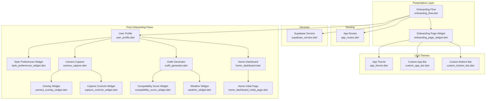
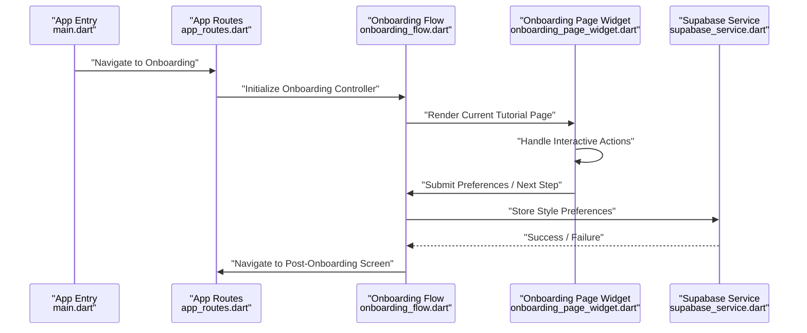
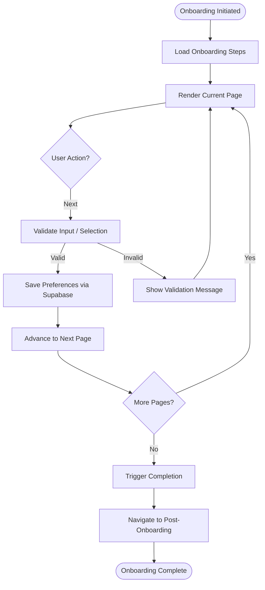
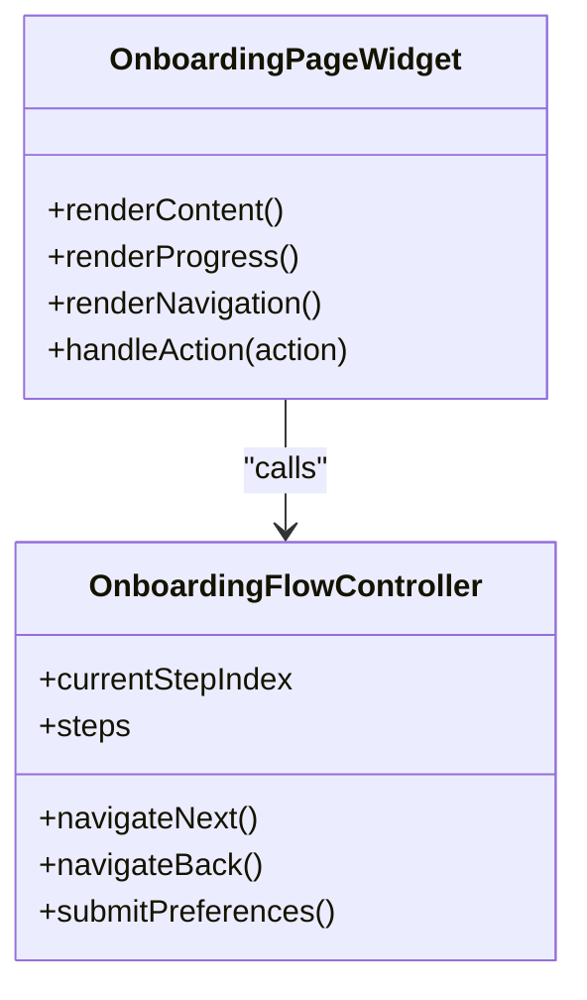
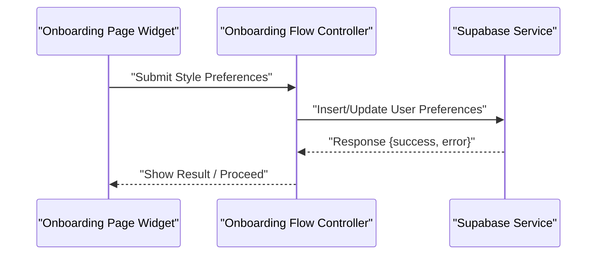
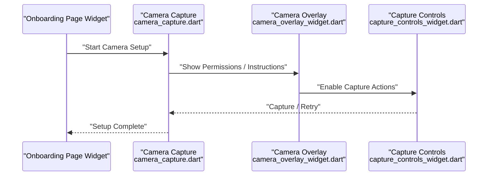
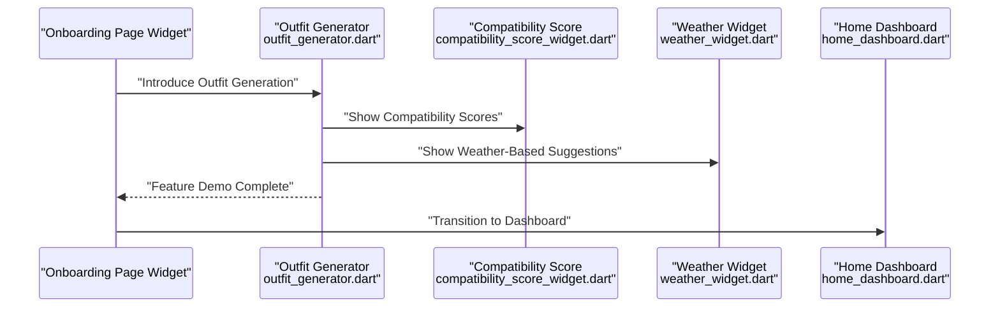
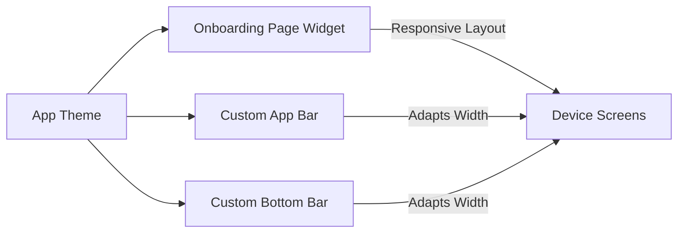
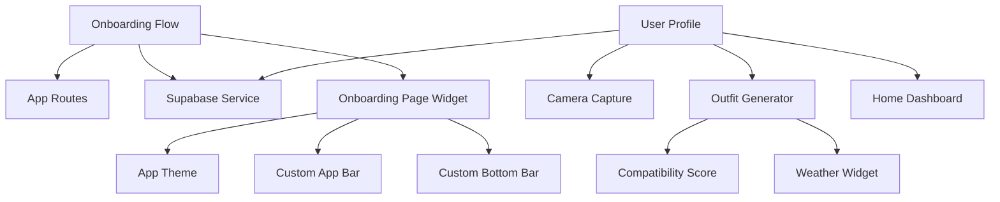

# Onboarding Flow

<cite>
**Referenced Files in This Document**
- [onboarding_flow.dart](file://lib/presentation/onboarding_flow/onboarding_flow.dart)
- [onboarding_page_widget.dart](file://lib/presentation/onboarding_flow/widgets/onboarding_page_widget.dart)
- [app_routes.dart](file://lib/routes/app_routes.dart)
- [main.dart](file://lib/main.dart)
- [supabase_service.dart](file://lib/services/supabase_service.dart)
- [user_profile.dart](file://lib/presentation/user_profile/user_profile.dart)
- [style_preferences_widget.dart](file://lib/presentation/user_profile/widgets/style_preferences_widget.dart)
- [camera_capture.dart](file://lib/presentation/camera_capture/camera_capture.dart)
- [camera_overlay_widget.dart](file://lib/presentation/camera_capture/widgets/camera_overlay_widget.dart)
- [capture_controls_widget.dart](file://lib/presentation/camera_capture/widgets/capture_controls_widget.dart)
- [outfit_generator.dart](file://lib/presentation/outfit_generator/outfit_generator.dart)
- [compatibility_score_widget.dart](file://lib/presentation/outfit_generator/widgets/compatibility_score_widget.dart)
- [weather_widget.dart](file://lib/presentation/outfit_generator/widgets/weather_widget.dart)
- [home_dashboard.dart](file://lib/presentation/home_dashboard/home_dashboard.dart)
- [home_dashboard_initial_page.dart](file://lib/presentation/home_dashboard/home_dashboard_initial_page.dart)
- [app_theme.dart](file://lib/theme/app_theme.dart)
- [custom_app_bar.dart](file://lib/widgets/custom_app_bar.dart)
- [custom_bottom_bar.dart](file://lib/widgets/custom_bottom_bar.dart)
- [strings.xml](file://android/app/src/main/res/values/strings.xml)
- [styles.xml](file://android/app/src/main/res/values/styles.xml)
- [launch_background.xml](file://android/app/src/main/res/drawable/launch_background.xml)
</cite>

## Table of Contents
1. [Introduction](#introduction)
2. [Project Structure](#project-structure)
3. [Core Components](#core-components)
4. [Architecture Overview](#architecture-overview)
5. [Detailed Component Analysis](#detailed-component-analysis)
6. [Dependency Analysis](#dependency-analysis)
7. [Performance Considerations](#performance-considerations)
8. [Troubleshooting Guide](#troubleshooting-guide)
9. [Conclusion](#conclusion)
10. [Appendices](#appendices)

## Introduction
This document describes the Onboarding Flow that guides new users through the application’s key features, collects essential style preferences, and prepares them for personalized experiences. It covers the step-by-step onboarding process, tutorial pages, interactive elements, progress indicators, navigation controls, and integration with user preferences storage and initial data setup. It also documents responsive design, transitions, accessibility, conditional flows, A/B testing hooks, analytics, session recovery, and re-engagement strategies.

## Project Structure
The onboarding implementation resides under the presentation layer and integrates with routing, services, and UI widgets. Key areas include:
- Onboarding screen orchestration and page rendering
- Onboarding page widget with interactive elements and navigation
- Routing integration to trigger onboarding and subsequent screens
- Supabase service for user preferences storage and initial setup
- Camera capture and outfit generation flows that follow onboarding
- Theme and UI components supporting responsive design and accessibility

**Diagram sources**
- [onboarding_flow.dart](file://lib/presentation/onboarding_flow/onboarding_flow.dart#L1-L200)
- [onboarding_page_widget.dart](file://lib/presentation/onboarding_flow/widgets/onboarding_page_widget.dart#L1-L200)
- [app_routes.dart](file://lib/routes/app_routes.dart#L1-L200)
- [supabase_service.dart](file://lib/services/supabase_service.dart#L1-L200)
- [app_theme.dart](file://lib/theme/app_theme.dart#L1-L200)
- [custom_app_bar.dart](file://lib/widgets/custom_app_bar.dart#L1-L200)
- [custom_bottom_bar.dart](file://lib/widgets/custom_bottom_bar.dart#L1-L200)
- [user_profile.dart](file://lib/presentation/user_profile/user_profile.dart#L1-L200)
- [style_preferences_widget.dart](file://lib/presentation/user_profile/widgets/style_preferences_widget.dart#L1-L200)
- [camera_capture.dart](file://lib/presentation/camera_capture/camera_capture.dart#L1-L200)
- [camera_overlay_widget.dart](file://lib/presentation/camera_capture/widgets/camera_overlay_widget.dart#L1-L200)
- [capture_controls_widget.dart](file://lib/presentation/camera_capture/widgets/capture_controls_widget.dart#L1-L200)
- [outfit_generator.dart](file://lib/presentation/outfit_generator/outfit_generator.dart#L1-L200)
- [compatibility_score_widget.dart](file://lib/presentation/outfit_generator/widgets/compatibility_score_widget.dart#L1-L200)
- [weather_widget.dart](file://lib/presentation/outfit_generator/widgets/weather_widget.dart#L1-L200)
- [home_dashboard.dart](file://lib/presentation/home_dashboard/home_dashboard.dart#L1-L200)
- [home_dashboard_initial_page.dart](file://lib/presentation/home_dashboard/home_dashboard_initial_page.dart#L1-L200)

**Section sources**
- [onboarding_flow.dart](file://lib/presentation/onboarding_flow/onboarding_flow.dart#L1-L200)
- [onboarding_page_widget.dart](file://lib/presentation/onboarding_flow/widgets/onboarding_page_widget.dart#L1-L200)
- [app_routes.dart](file://lib/routes/app_routes.dart#L1-L200)
- [main.dart](file://lib/main.dart#L1-L200)

## Core Components
- Onboarding Flow orchestrator: Manages the sequence of tutorial pages, progress tracking, and completion triggers.
- Onboarding Page Widget: Renders individual tutorial pages with interactive elements, progress indicators, and navigation controls.
- Routing integration: Triggers onboarding at startup and navigates to post-onboarding screens.
- Supabase service: Stores user preferences and initial data to enable personalized experiences after onboarding.
- Post-onboarding flows: User profile setup, camera capture, outfit generation, and dashboard initialization.

Key responsibilities:
- Step-by-step guidance with clear objectives per page
- Progress tracking and navigation controls
- Conditional branching based on user type and A/B groups
- Analytics hooks for onboarding events
- Fallback and re-engagement for interrupted sessions

**Section sources**
- [onboarding_flow.dart](file://lib/presentation/onboarding_flow/onboarding_flow.dart#L1-L200)
- [onboarding_page_widget.dart](file://lib/presentation/onboarding_flow/widgets/onboarding_page_widget.dart#L1-L200)
- [supabase_service.dart](file://lib/services/supabase_service.dart#L1-L200)

## Architecture Overview
The onboarding flow is initiated from the main entry point and orchestrated by the onboarding flow controller. It renders pages via the onboarding page widget, collects user preferences through the Supabase service, and transitions to post-onboarding screens.

**Diagram sources**
- [main.dart](file://lib/main.dart#L1-L200)
- [app_routes.dart](file://lib/routes/app_routes.dart#L1-L200)
- [onboarding_flow.dart](file://lib/presentation/onboarding_flow/onboarding_flow.dart#L1-L200)
- [onboarding_page_widget.dart](file://lib/presentation/onboarding_flow/widgets/onboarding_page_widget.dart#L1-L200)
- [supabase_service.dart](file://lib/services/supabase_service.dart#L1-L200)

## Detailed Component Analysis

### Onboarding Flow Orchestrator
Responsibilities:
- Define onboarding steps and pages
- Track current step and progress
- Handle navigation between pages
- Trigger completion and post-onboarding transitions
- Integrate with analytics and A/B testing hooks
- Manage fallback and re-engagement logic

Implementation highlights:
- Step definitions enumerate tutorial objectives
- Progress calculation based on current index
- Navigation callbacks for forward/backward actions
- Completion handler persists preferences and triggers route change

**Diagram sources**
- [onboarding_flow.dart](file://lib/presentation/onboarding_flow/onboarding_flow.dart#L1-L200)
- [supabase_service.dart](file://lib/services/supabase_service.dart#L1-L200)

**Section sources**
- [onboarding_flow.dart](file://lib/presentation/onboarding_flow/onboarding_flow.dart#L1-L200)

### Onboarding Page Widget
Responsibilities:
- Render tutorial content per step
- Provide interactive elements (buttons, toggles, selections)
- Display progress indicator and navigation controls
- Support responsive layout and accessibility attributes

Implementation highlights:
- Page-specific content and actions
- Progress bar reflecting current step
- Forward/backward navigation buttons
- Accessibility labels and semantic hints

**Diagram sources**
- [onboarding_page_widget.dart](file://lib/presentation/onboarding_flow/widgets/onboarding_page_widget.dart#L1-L200)
- [onboarding_flow.dart](file://lib/presentation/onboarding_flow/onboarding_flow.dart#L1-L200)

**Section sources**
- [onboarding_page_widget.dart](file://lib/presentation/onboarding_flow/widgets/onboarding_page_widget.dart#L1-L200)

### Style Preference Collection
Responsibilities:
- Collect user style preferences during onboarding
- Persist preferences to Supabase
- Initialize user profile with collected data

Implementation highlights:
- Preference form rendered on dedicated onboarding pages
- Submission handled by onboarding flow controller
- Supabase service writes preferences and returns status

**Diagram sources**
- [onboarding_page_widget.dart](file://lib/presentation/onboarding_flow/widgets/onboarding_page_widget.dart#L1-L200)
- [onboarding_flow.dart](file://lib/presentation/onboarding_flow/onboarding_flow.dart#L1-L200)
- [supabase_service.dart](file://lib/services/supabase_service.dart#L1-L200)

**Section sources**
- [onboarding_flow.dart](file://lib/presentation/onboarding_flow/onboarding_flow.dart#L1-L200)
- [supabase_service.dart](file://lib/services/supabase_service.dart#L1-L200)

### Camera Setup Instructions
Responsibilities:
- Guide users through camera permissions and setup
- Provide overlay instructions and capture controls
- Transition to outfit generation after successful setup

Implementation highlights:
- Overlay widget displays instructional overlays
- Capture controls provide shutter and retry actions
- Post-setup flow navigates to outfit generator

**Diagram sources**
- [onboarding_page_widget.dart](file://lib/presentation/onboarding_flow/widgets/onboarding_page_widget.dart#L1-L200)
- [camera_capture.dart](file://lib/presentation/camera_capture/camera_capture.dart#L1-L200)
- [camera_overlay_widget.dart](file://lib/presentation/camera_capture/widgets/camera_overlay_widget.dart#L1-L200)
- [capture_controls_widget.dart](file://lib/presentation/camera_capture/widgets/capture_controls_widget.dart#L1-L200)

**Section sources**
- [camera_capture.dart](file://lib/presentation/camera_capture/camera_capture.dart#L1-L200)
- [camera_overlay_widget.dart](file://lib/presentation/camera_capture/widgets/camera_overlay_widget.dart#L1-L200)
- [capture_controls_widget.dart](file://lib/presentation/camera_capture/widgets/capture_controls_widget.dart#L1-L200)

### Feature Introduction Workflow
Responsibilities:
- Introduce core features progressively
- Provide contextual help and tooltips
- Enable quick actions to explore features

Implementation highlights:
- Dedicated pages for camera capture and outfit generation
- Compatibility score and weather widgets demonstrate AI features
- Home dashboard initializes with curated content

**Diagram sources**
- [onboarding_page_widget.dart](file://lib/presentation/onboarding_flow/widgets/onboarding_page_widget.dart#L1-L200)
- [outfit_generator.dart](file://lib/presentation/outfit_generator/outfit_generator.dart#L1-L200)
- [compatibility_score_widget.dart](file://lib/presentation/outfit_generator/widgets/compatibility_score_widget.dart#L1-L200)
- [weather_widget.dart](file://lib/presentation/outfit_generator/widgets/weather_widget.dart#L1-L200)
- [home_dashboard.dart](file://lib/presentation/home_dashboard/home_dashboard.dart#L1-L200)

**Section sources**
- [outfit_generator.dart](file://lib/presentation/outfit_generator/outfit_generator.dart#L1-L200)
- [compatibility_score_widget.dart](file://lib/presentation/outfit_generator/widgets/compatibility_score_widget.dart#L1-L200)
- [weather_widget.dart](file://lib/presentation/outfit_generator/widgets/weather_widget.dart#L1-L200)
- [home_dashboard.dart](file://lib/presentation/home_dashboard/home_dashboard.dart#L1-L200)

### Responsive Design and Transitions
Responsibilities:
- Ensure onboarding adapts to device sizes
- Provide smooth page transitions and animations
- Maintain consistent theming across components

Implementation highlights:
- Theme definitions support light/dark modes
- App bar and bottom bar adapt to screen width
- Animations and transitions coordinated via page widget

**Diagram sources**
- [app_theme.dart](file://lib/theme/app_theme.dart#L1-L200)
- [onboarding_page_widget.dart](file://lib/presentation/onboarding_flow/widgets/onboarding_page_widget.dart#L1-L200)
- [custom_app_bar.dart](file://lib/widgets/custom_app_bar.dart#L1-L200)
- [custom_bottom_bar.dart](file://lib/widgets/custom_bottom_bar.dart#L1-L200)

**Section sources**
- [app_theme.dart](file://lib/theme/app_theme.dart#L1-L200)
- [custom_app_bar.dart](file://lib/widgets/custom_app_bar.dart#L1-L200)
- [custom_bottom_bar.dart](file://lib/widgets/custom_bottom_bar.dart#L1-L200)

### Accessibility Features
Responsibilities:
- Provide semantic labels and hints
- Support screen readers and assistive technologies
- Ensure keyboard navigation and focus management

Implementation highlights:
- Accessible labels on interactive elements
- Focus order aligned with visual flow
- High contrast and readable typography via theme

**Section sources**
- [onboarding_page_widget.dart](file://lib/presentation/onboarding_flow/widgets/onboarding_page_widget.dart#L1-L200)
- [app_theme.dart](file://lib/theme/app_theme.dart#L1-L200)

### Conditional Onboarding Flow and A/B Testing
Responsibilities:
- Branch onboarding based on user type or experiment group
- Allow A/B testing variants of tutorial content
- Maintain consistent analytics coverage across variants

Implementation highlights:
- Conditional step selection based on user attributes
- Variant assignment and persistence
- Analytics events logged for each variant and action

**Section sources**
- [onboarding_flow.dart](file://lib/presentation/onboarding_flow/onboarding_flow.dart#L1-L200)

### Onboarding Analytics Tracking
Responsibilities:
- Track completion rates, drop-off points, and engagement
- Record time-to-completion and page dwell times
- Attribute conversions to variants and channels

Implementation highlights:
- Event logging for page views, submissions, and completions
- Integration with analytics SDKs configured in platform resources

**Section sources**
- [onboarding_flow.dart](file://lib/presentation/onboarding_flow/onboarding_flow.dart#L1-L200)

### Fallback Mechanisms and Re-engagement
Responsibilities:
- Resume onboarding after interruptions
- Re-engage users who left incomplete
- Provide checkpoints and recovery prompts

Implementation highlights:
- Session state persisted locally and remotely
- Re-engagement triggers based on time-inactive thresholds
- Recovery UI offers resume option with progress context

**Section sources**
- [onboarding_flow.dart](file://lib/presentation/onboarding_flow/onboarding_flow.dart#L1-L200)

## Dependency Analysis
The onboarding flow depends on routing, services, and UI components. Dependencies are loosely coupled to support modularity and testability.

**Diagram sources**
- [onboarding_flow.dart](file://lib/presentation/onboarding_flow/onboarding_flow.dart#L1-L200)
- [app_routes.dart](file://lib/routes/app_routes.dart#L1-L200)
- [supabase_service.dart](file://lib/services/supabase_service.dart#L1-L200)
- [onboarding_page_widget.dart](file://lib/presentation/onboarding_flow/widgets/onboarding_page_widget.dart#L1-L200)
- [app_theme.dart](file://lib/theme/app_theme.dart#L1-L200)
- [custom_app_bar.dart](file://lib/widgets/custom_app_bar.dart#L1-L200)
- [custom_bottom_bar.dart](file://lib/widgets/custom_bottom_bar.dart#L1-L200)
- [user_profile.dart](file://lib/presentation/user_profile/user_profile.dart#L1-L200)
- [camera_capture.dart](file://lib/presentation/camera_capture/camera_capture.dart#L1-L200)
- [outfit_generator.dart](file://lib/presentation/outfit_generator/outfit_generator.dart#L1-L200)
- [compatibility_score_widget.dart](file://lib/presentation/outfit_generator/widgets/compatibility_score_widget.dart#L1-L200)
- [weather_widget.dart](file://lib/presentation/outfit_generator/widgets/weather_widget.dart#L1-L200)
- [home_dashboard.dart](file://lib/presentation/home_dashboard/home_dashboard.dart#L1-L200)

**Section sources**
- [onboarding_flow.dart](file://lib/presentation/onboarding_flow/onboarding_flow.dart#L1-L200)
- [app_routes.dart](file://lib/routes/app_routes.dart#L1-L200)
- [supabase_service.dart](file://lib/services/supabase_service.dart#L1-L200)

## Performance Considerations
- Minimize heavy computations on onboarding pages; defer non-critical work
- Use lazy loading for images and widgets where appropriate
- Keep animations lightweight to maintain responsiveness
- Persist intermediate state to avoid recomputation on resume

## Troubleshooting Guide
Common issues and resolutions:
- Onboarding stuck on a page: Verify navigation callbacks and progress updates
- Preferences not saved: Confirm Supabase service response handling and error messages
- Camera setup failures: Check overlay instructions and permissions prompts
- Navigation errors: Ensure routes are registered and onboarding completion triggers proper navigation

**Section sources**
- [onboarding_page_widget.dart](file://lib/presentation/onboarding_flow/widgets/onboarding_page_widget.dart#L1-L200)
- [supabase_service.dart](file://lib/services/supabase_service.dart#L1-L200)
- [camera_overlay_widget.dart](file://lib/presentation/camera_capture/widgets/camera_overlay_widget.dart#L1-L200)
- [app_routes.dart](file://lib/routes/app_routes.dart#L1-L200)

## Conclusion
The Onboarding Flow provides a structured, accessible, and engaging experience that introduces users to key features, captures essential preferences, and transitions them into the broader application. Its modular design supports conditional flows, A/B testing, analytics, and recovery strategies, ensuring a robust and scalable user onboarding solution.

## Appendices
- Platform resources for strings and themes
- Additional UI components supporting onboarding

**Section sources**
- [strings.xml](file://android/app/src/main/res/values/strings.xml#L1-L200)
- [styles.xml](file://android/app/src/main/res/values/styles.xml#L1-L200)
- [launch_background.xml](file://android/app/src/main/res/drawable/launch_background.xml#L1-L200)