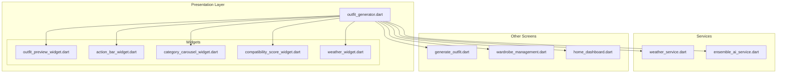
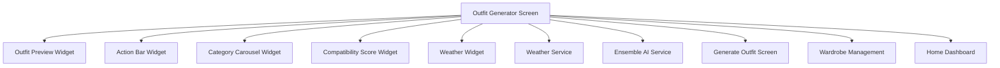
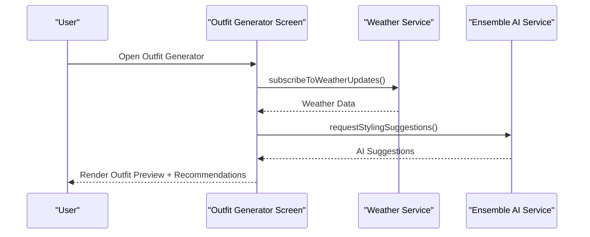
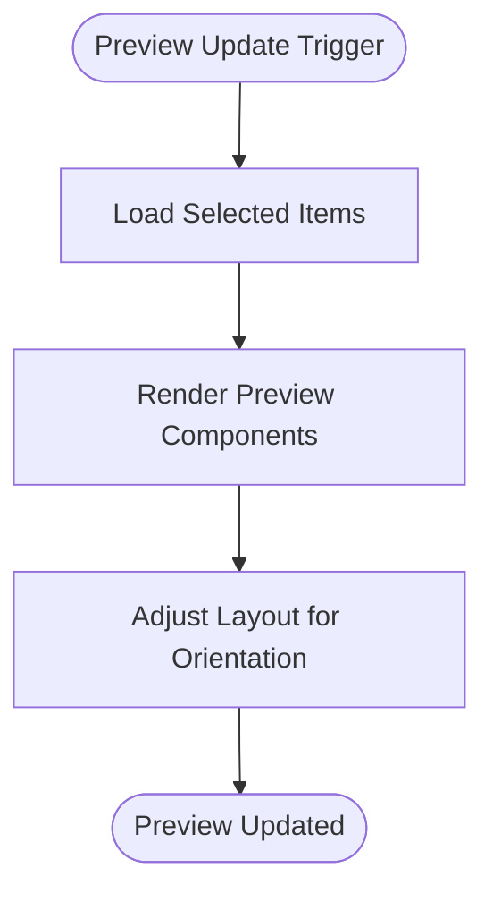
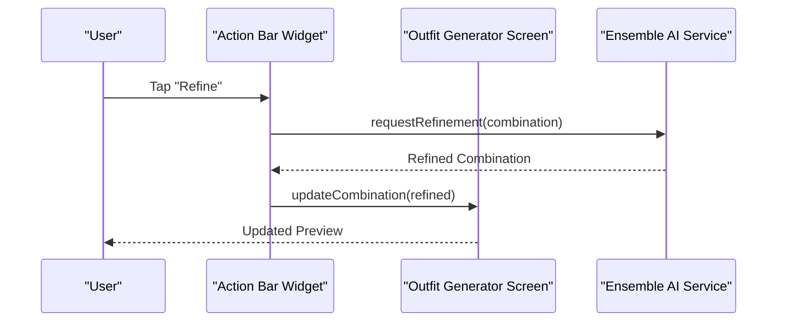
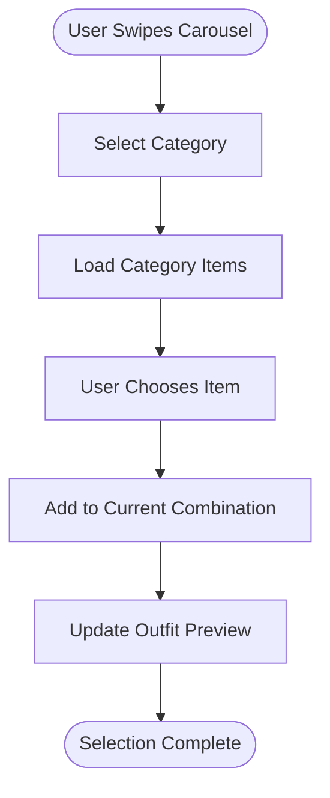
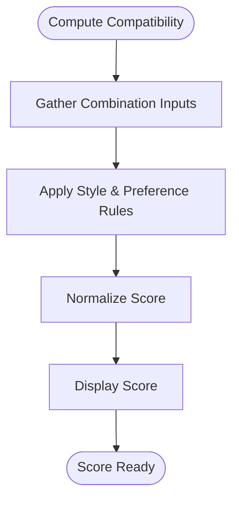
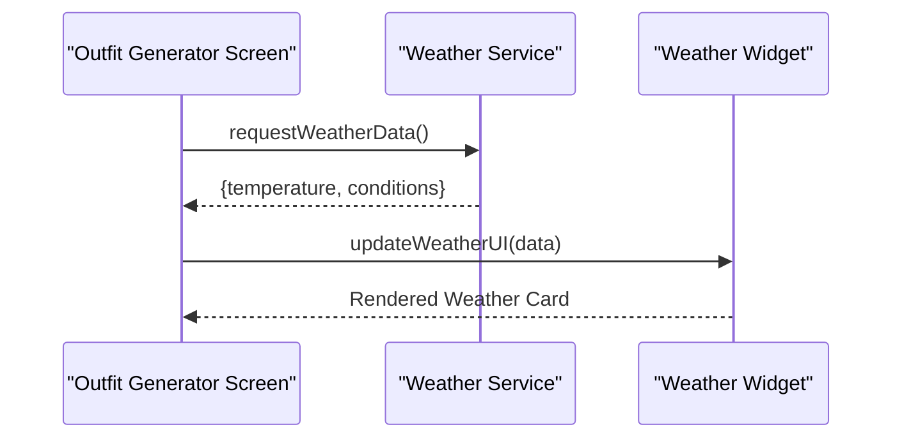
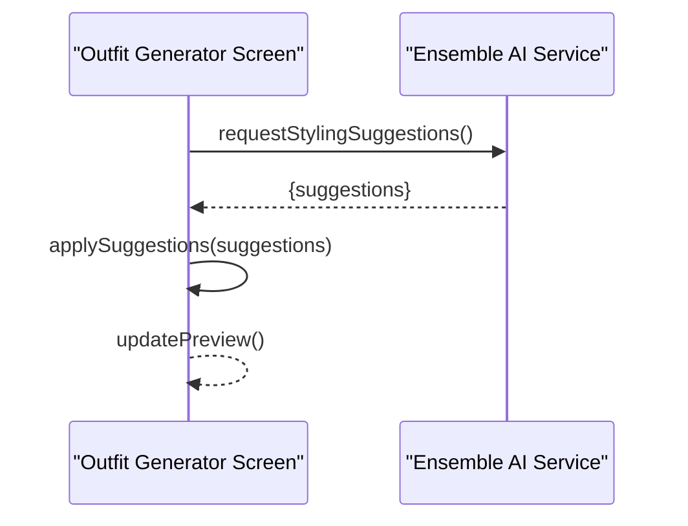
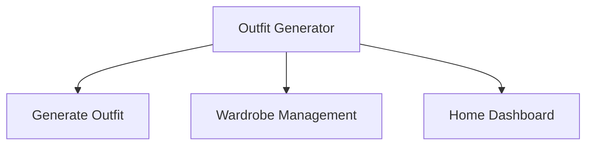

# Outfit Generator

<cite>
**Referenced Files in This Document**
- [outfit_generator.dart](file://lib/presentation/outfit_generator/outfit_generator.dart)
- [outfit_preview_widget.dart](file://lib/presentation/outfit_generator/widgets/outfit_preview_widget.dart)
- [action_bar_widget.dart](file://lib/presentation/outfit_generator/widgets/action_bar_widget.dart)
- [category_carousel_widget.dart](file://lib/presentation/outfit_generator/widgets/category_carousel_widget.dart)
- [compatibility_score_widget.dart](file://lib/presentation/outfit_generator/widgets/compatibility_score_widget.dart)
- [weather_widget.dart](file://lib/presentation/outfit_generator/widgets/weather_widget.dart)
- [weather_service.dart](file://lib/services/weather_service.dart)
- [ensemble_ai_service.dart](file://lib/services/ensemble_ai_service.dart)
- [generate_outfit.dart](file://lib/presentation/generate_outfit/generate_outfit.dart)
- [wardrobe_management.dart](file://lib/presentation/wardrobe_management/wardrobe_management.dart)
- [home_dashboard.dart](file://lib/presentation/home_dashboard/home_dashboard.dart)
- [custom_app_bar.dart](file://lib/widgets/custom_app_bar.dart)
- [custom_bottom_bar.dart](file://lib/widgets/custom_bottom_bar.dart)
- [app_routes.dart](file://lib/routes/app_routes.dart)
- [MainActivity.kt](file://android/app/src/main/kotlin/com/prismstyle_ai/app/MainActivity.kt)
- [strings.xml](file://android/app/src/main/res/values/strings.xml)
- [styles.xml](file://android/app/src/main/res/values/styles.xml)
- [values-night/styles.xml](file://android/app/src/main/res/values-night/styles.xml)
- [launch_background.xml](file://android/app/src/main/res/drawable/launch_background.xml)
- [launch_background.xml (v21)](file://android/app/src/main/res/drawable-v21/launch_background.xml)
- [AndroidManifest.xml](file://android/app/src/main/AndroidManifest.xml)
- [build.gradle](file://android/app/build.gradle)
- [settings.gradle](file://android/settings.gradle)
- [pubspec.yaml](file://pubspec.yaml)
- [README.md](file://README.md)
</cite>

## Table of Contents
1. [Introduction](#introduction)
2. [Project Structure](#project-structure)
3. [Core Components](#core-components)
4. [Architecture Overview](#architecture-overview)
5. [Detailed Component Analysis](#detailed-component-analysis)
6. [Dependency Analysis](#dependency-analysis)
7. [Performance Considerations](#performance-considerations)
8. [Troubleshooting Guide](#troubleshooting-guide)
9. [Conclusion](#conclusion)
10. [Appendices](#appendices)

## Introduction
The Outfit Generator is an intelligent combination creation system designed to help users build stylish and compatible outfits. It integrates a real-time preview widget, compatibility scoring, category-based carousel navigation, and an action bar for saving, sharing, and refining combinations. The system also incorporates weather integration for contextual recommendations and leverages AI services for ensemble generation and styling suggestions.

## Project Structure
The Outfit Generator feature is organized under the presentation layer with dedicated widgets and a main screen controller. Supporting services handle weather data and AI-driven ensemble generation. The Android application configuration defines the runtime environment and resources.

**Diagram sources**
- [outfit_generator.dart](file://lib/presentation/outfit_generator/outfit_generator.dart#L1-L200)
- [outfit_preview_widget.dart](file://lib/presentation/outfit_generator/widgets/outfit_preview_widget.dart#L1-L200)
- [action_bar_widget.dart](file://lib/presentation/outfit_generator/widgets/action_bar_widget.dart#L1-L200)
- [category_carousel_widget.dart](file://lib/presentation/outfit_generator/widgets/category_carousel_widget.dart#L1-L200)
- [compatibility_score_widget.dart](file://lib/presentation/outfit_generator/widgets/compatibility_score_widget.dart#L1-L200)
- [weather_widget.dart](file://lib/presentation/outfit_generator/widgets/weather_widget.dart#L1-L200)
- [weather_service.dart](file://lib/services/weather_service.dart#L1-L200)
- [ensemble_ai_service.dart](file://lib/services/ensemble_ai_service.dart#L1-L200)
- [generate_outfit.dart](file://lib/presentation/generate_outfit/generate_outfit.dart#L1-L200)
- [wardrobe_management.dart](file://lib/presentation/wardrobe_management/wardrobe_management.dart#L1-L200)
- [home_dashboard.dart](file://lib/presentation/home_dashboard/home_dashboard.dart#L1-L200)

**Section sources**
- [outfit_generator.dart](file://lib/presentation/outfit_generator/outfit_generator.dart#L1-L200)
- [pubspec.yaml](file://pubspec.yaml#L1-L200)
- [README.md](file://README.md#L1-L200)

## Core Components
- Outfit Generator Screen: Orchestrates the entire Outfit Generator experience, coordinating widget interactions, state management, and service integrations.
- Outfit Preview Widget: Renders the current combination in real-time, updating visuals as users select items.
- Action Bar Widget: Provides controls for saving, sharing, and refining the selected combination.
- Category Carousel Widget: Enables browsing and selection of clothing items by category.
- Compatibility Score Widget: Computes and displays a compatibility score for the current combination.
- Weather Widget: Displays contextual weather information influencing recommendations.
- Weather Service: Fetches and normalizes weather data for dynamic recommendations.
- Ensemble AI Service: Powers AI-driven ensemble generation and styling suggestions.

**Section sources**
- [outfit_generator.dart](file://lib/presentation/outfit_generator/outfit_generator.dart#L1-L200)
- [outfit_preview_widget.dart](file://lib/presentation/outfit_generator/widgets/outfit_preview_widget.dart#L1-L200)
- [action_bar_widget.dart](file://lib/presentation/outfit_generator/widgets/action_bar_widget.dart#L1-L200)
- [category_carousel_widget.dart](file://lib/presentation/outfit_generator/widgets/category_carousel_widget.dart#L1-L200)
- [compatibility_score_widget.dart](file://lib/presentation/outfit_generator/widgets/compatibility_score_widget.dart#L1-L200)
- [weather_widget.dart](file://lib/presentation/outfit_generator/widgets/weather_widget.dart#L1-L200)
- [weather_service.dart](file://lib/services/weather_service.dart#L1-L200)
- [ensemble_ai_service.dart](file://lib/services/ensemble_ai_service.dart#L1-L200)

## Architecture Overview
The Outfit Generator follows a modular architecture:
- Presentation Layer: Contains the Outfit Generator screen and reusable widgets.
- Services Layer: Handles external integrations (weather, AI).
- Navigation and Routing: Manages transitions between screens.
- Platform Integration: Android-specific configuration for runtime behavior.

**Diagram sources**
- [outfit_generator.dart](file://lib/presentation/outfit_generator/outfit_generator.dart#L1-L200)
- [outfit_preview_widget.dart](file://lib/presentation/outfit_generator/widgets/outfit_preview_widget.dart#L1-L200)
- [action_bar_widget.dart](file://lib/presentation/outfit_generator/widgets/action_bar_widget.dart#L1-L200)
- [category_carousel_widget.dart](file://lib/presentation/outfit_generator/widgets/category_carousel_widget.dart#L1-L200)
- [compatibility_score_widget.dart](file://lib/presentation/outfit_generator/widgets/compatibility_score_widget.dart#L1-L200)
- [weather_widget.dart](file://lib/presentation/outfit_generator/widgets/weather_widget.dart#L1-L200)
- [weather_service.dart](file://lib/services/weather_service.dart#L1-L200)
- [ensemble_ai_service.dart](file://lib/services/ensemble_ai_service.dart#L1-L200)
- [generate_outfit.dart](file://lib/presentation/generate_outfit/generate_outfit.dart#L1-L200)
- [wardrobe_management.dart](file://lib/presentation/wardrobe_management/wardrobe_management.dart#L1-L200)
- [home_dashboard.dart](file://lib/presentation/home_dashboard/home_dashboard.dart#L1-L200)

## Detailed Component Analysis

### Outfit Generator Screen
The Outfit Generator screen initializes the combination builder, manages state for selected items, and coordinates interactions with widgets and services. It subscribes to weather updates and delegates AI-powered suggestions to the Ensemble AI Service.

Key responsibilities:
- Initialize and manage the current combination state.
- Subscribe to weather service updates for contextual recommendations.
- Integrate Ensemble AI Service for advanced styling suggestions.
- Navigate to related screens (Generate Outfit, Wardrobe Management, Home Dashboard).

**Diagram sources**
- [outfit_generator.dart](file://lib/presentation/outfit_generator/outfit_generator.dart#L1-L200)
- [weather_service.dart](file://lib/services/weather_service.dart#L1-L200)
- [ensemble_ai_service.dart](file://lib/services/ensemble_ai_service.dart#L1-L200)

**Section sources**
- [outfit_generator.dart](file://lib/presentation/outfit_generator/outfit_generator.dart#L1-L200)

### Outfit Preview Widget
The Outfit Preview Widget renders the current combination in real-time. It listens to state changes and updates visuals accordingly, ensuring immediate feedback as users modify selections.

Implementation highlights:
- Real-time rendering of selected items.
- Responsive layout adjustments for different orientations.
- Integration with the Outfit Generator Screen for state synchronization.

**Diagram sources**
- [outfit_preview_widget.dart](file://lib/presentation/outfit_generator/widgets/outfit_preview_widget.dart#L1-L200)

**Section sources**
- [outfit_preview_widget.dart](file://lib/presentation/outfit_generator/widgets/outfit_preview_widget.dart#L1-L200)

### Action Bar Widget
The Action Bar Widget provides essential actions for managing the current combination:
- Save: Persist the combination to the user's collection.
- Share: Generate shareable content for the combination.
- Refine: Apply AI refinement suggestions to improve compatibility or style.

**Diagram sources**
- [action_bar_widget.dart](file://lib/presentation/outfit_generator/widgets/action_bar_widget.dart#L1-L200)
- [ensemble_ai_service.dart](file://lib/services/ensemble_ai_service.dart#L1-L200)
- [outfit_generator.dart](file://lib/presentation/outfit_generator/outfit_generator.dart#L1-L200)

**Section sources**
- [action_bar_widget.dart](file://lib/presentation/outfit_generator/widgets/action_bar_widget.dart#L1-L200)

### Category Carousel Widget
The Category Carousel Widget enables intuitive browsing of clothing items by category. Users can swipe through categories and select items to add to the current combination.

Key behaviors:
- Horizontal scrolling through categories.
- Item selection triggers updates in the Outfit Preview Widget.
- Integration with Wardrobe Management for item sourcing.

**Diagram sources**
- [category_carousel_widget.dart](file://lib/presentation/outfit_generator/widgets/category_carousel_widget.dart#L1-L200)
- [wardrobe_management.dart](file://lib/presentation/wardrobe_management/wardrobe_management.dart#L1-L200)
- [outfit_preview_widget.dart](file://lib/presentation/outfit_generator/widgets/outfit_preview_widget.dart#L1-L200)

**Section sources**
- [category_carousel_widget.dart](file://lib/presentation/outfit_generator/widgets/category_carousel_widget.dart#L1-L200)
- [wardrobe_management.dart](file://lib/presentation/wardrobe_management/wardrobe_management.dart#L1-L200)

### Compatibility Score Widget
The Compatibility Score Widget computes and displays a numerical score representing how well the current combination aligns with style guidelines and user preferences. The score influences refinement decisions and recommendation prioritization.

**Diagram sources**
- [compatibility_score_widget.dart](file://lib/presentation/outfit_generator/widgets/compatibility_score_widget.dart#L1-L200)

**Section sources**
- [compatibility_score_widget.dart](file://lib/presentation/outfit_generator/widgets/compatibility_score_widget.dart#L1-L200)

### Weather Widget and Integration
The Weather Widget displays contextual weather information that influences outfit recommendations. The Weather Service fetches and normalizes data, which the Outfit Generator Screen consumes to adjust suggestions.

**Diagram sources**
- [weather_widget.dart](file://lib/presentation/outfit_generator/widgets/weather_widget.dart#L1-L200)
- [weather_service.dart](file://lib/services/weather_service.dart#L1-L200)
- [outfit_generator.dart](file://lib/presentation/outfit_generator/outfit_generator.dart#L1-L200)

**Section sources**
- [weather_widget.dart](file://lib/presentation/outfit_generator/widgets/weather_widget.dart#L1-L200)
- [weather_service.dart](file://lib/services/weather_service.dart#L1-L200)

### Ensemble AI Service Integration
The Ensemble AI Service provides advanced styling suggestions and refinements. The Outfit Generator Screen coordinates requests and applies returned suggestions to the current combination.

**Diagram sources**
- [ensemble_ai_service.dart](file://lib/services/ensemble_ai_service.dart#L1-L200)
- [outfit_generator.dart](file://lib/presentation/outfit_generator/outfit_generator.dart#L1-L200)

**Section sources**
- [ensemble_ai_service.dart](file://lib/services/ensemble_ai_service.dart#L1-L200)

### Related Screens and Navigation
- Generate Outfit Screen: Allows users to generate new combinations using AI.
- Wardrobe Management: Manages personal clothing inventory and categories.
- Home Dashboard: Provides overview cards including weather and recommendations.

**Diagram sources**
- [generate_outfit.dart](file://lib/presentation/generate_outfit/generate_outfit.dart#L1-L200)
- [wardrobe_management.dart](file://lib/presentation/wardrobe_management/wardrobe_management.dart#L1-L200)
- [home_dashboard.dart](file://lib/presentation/home_dashboard/home_dashboard.dart#L1-L200)

**Section sources**
- [generate_outfit.dart](file://lib/presentation/generate_outfit/generate_outfit.dart#L1-L200)
- [wardrobe_management.dart](file://lib/presentation/wardrobe_management/wardrobe_management.dart#L1-L200)
- [home_dashboard.dart](file://lib/presentation/home_dashboard/home_dashboard.dart#L1-L200)

## Dependency Analysis
The Outfit Generator depends on several services and widgets. The following diagram outlines primary dependencies:

**Diagram sources**
- [outfit_generator.dart](file://lib/presentation/outfit_generator/outfit_generator.dart#L1-L200)
- [outfit_preview_widget.dart](file://lib/presentation/outfit_generator/widgets/outfit_preview_widget.dart#L1-L200)
- [action_bar_widget.dart](file://lib/presentation/outfit_generator/widgets/action_bar_widget.dart#L1-L200)
- [category_carousel_widget.dart](file://lib/presentation/outfit_generator/widgets/category_carousel_widget.dart#L1-L200)
- [compatibility_score_widget.dart](file://lib/presentation/outfit_generator/widgets/compatibility_score_widget.dart#L1-L200)
- [weather_widget.dart](file://lib/presentation/outfit_generator/widgets/weather_widget.dart#L1-L200)
- [weather_service.dart](file://lib/services/weather_service.dart#L1-L200)
- [ensemble_ai_service.dart](file://lib/services/ensemble_ai_service.dart#L1-L200)
- [generate_outfit.dart](file://lib/presentation/generate_outfit/generate_outfit.dart#L1-L200)
- [wardrobe_management.dart](file://lib/presentation/wardrobe_management/wardrobe_management.dart#L1-L200)
- [home_dashboard.dart](file://lib/presentation/home_dashboard/home_dashboard.dart#L1-L200)

**Section sources**
- [outfit_generator.dart](file://lib/presentation/outfit_generator/outfit_generator.dart#L1-L200)
- [weather_service.dart](file://lib/services/weather_service.dart#L1-L200)
- [ensemble_ai_service.dart](file://lib/services/ensemble_ai_service.dart#L1-L200)

## Performance Considerations
- Real-time Preview Updates: Debounce preview updates to avoid excessive recomputation when users rapidly change selections.
- Memory Management: Dispose of subscriptions and cancel ongoing AI requests when leaving the screen to prevent memory leaks.
- Weather Data Caching: Cache weather responses with expiration to reduce network calls and improve responsiveness.
- AI Request Throttling: Limit concurrent AI requests and queue refinement tasks to maintain smooth interactions.
- Rendering Optimization: Use efficient list rendering for category carousels and preview updates.

[No sources needed since this section provides general guidance]

## Troubleshooting Guide
Common issues and resolutions:
- Preview Not Updating: Verify that state changes trigger preview refresh and that widget rebuilds occur on updates.
- Weather Data Errors: Check service initialization and handle network failures gracefully with fallback UI.
- AI Suggestions Failures: Implement retry logic and display user-friendly messages when AI requests fail.
- Memory Leaks: Ensure subscriptions are canceled and timers are disposed of during screen disposal.

**Section sources**
- [outfit_generator.dart](file://lib/presentation/outfit_generator/outfit_generator.dart#L1-L200)
- [weather_service.dart](file://lib/services/weather_service.dart#L1-L200)
- [ensemble_ai_service.dart](file://lib/services/ensemble_ai_service.dart#L1-L200)

## Conclusion
The Outfit Generator delivers a seamless, intelligent combination creation experience by integrating real-time preview updates, compatibility scoring, category navigation, and weather-aware recommendations. Its modular architecture supports extensibility and maintainability while leveraging AI services for advanced styling suggestions.

[No sources needed since this section summarizes without analyzing specific files]

## Appendices
- Android Runtime Configuration: Defines app metadata, themes, and resources for the Android platform.
- Routing and Navigation: Maps screen routes and manages navigation between Outfit Generator and related screens.
- Custom UI Components: Provides reusable app bar and bottom bar components used across screens.

**Section sources**
- [MainActivity.kt](file://android/app/src/main/kotlin/com/prismstyle_ai/app/MainActivity.kt#L1-L200)
- [strings.xml](file://android/app/src/main/res/values/strings.xml#L1-L200)
- [styles.xml](file://android/app/src/main/res/values/styles.xml#L1-L200)
- [values-night/styles.xml](file://android/app/src/main/res/values-night/styles.xml#L1-L200)
- [launch_background.xml](file://android/app/src/main/res/drawable/launch_background.xml#L1-L200)
- [launch_background.xml (v21)](file://android/app/src/main/res/drawable-v21/launch_background.xml#L1-L200)
- [AndroidManifest.xml](file://android/app/src/main/AndroidManifest.xml#L1-L200)
- [build.gradle](file://android/app/build.gradle#L1-L200)
- [settings.gradle](file://android/settings.gradle#L1-L200)
- [app_routes.dart](file://lib/routes/app_routes.dart#L1-L200)
- [custom_app_bar.dart](file://lib/widgets/custom_app_bar.dart#L1-L200)
- [custom_bottom_bar.dart](file://lib/widgets/custom_bottom_bar.dart#L1-L200)