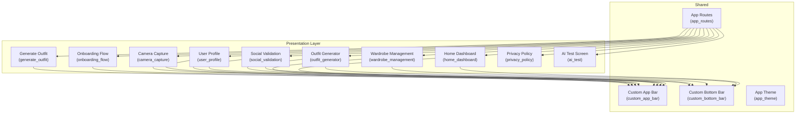
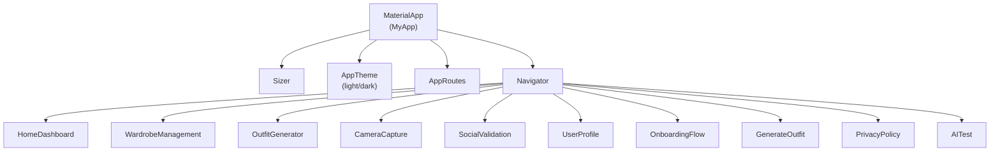
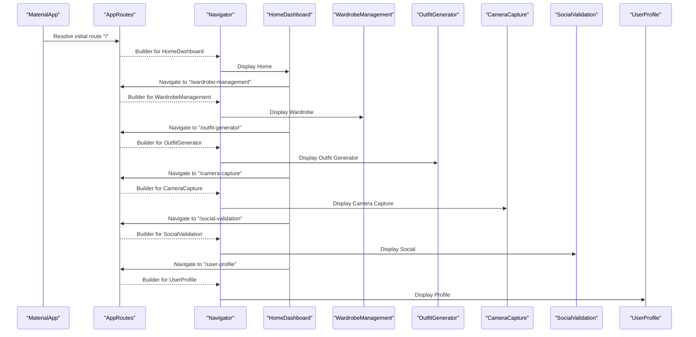
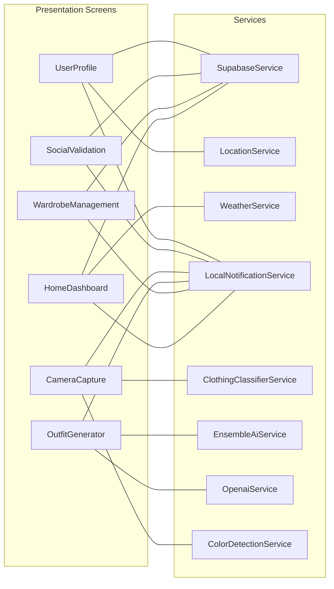
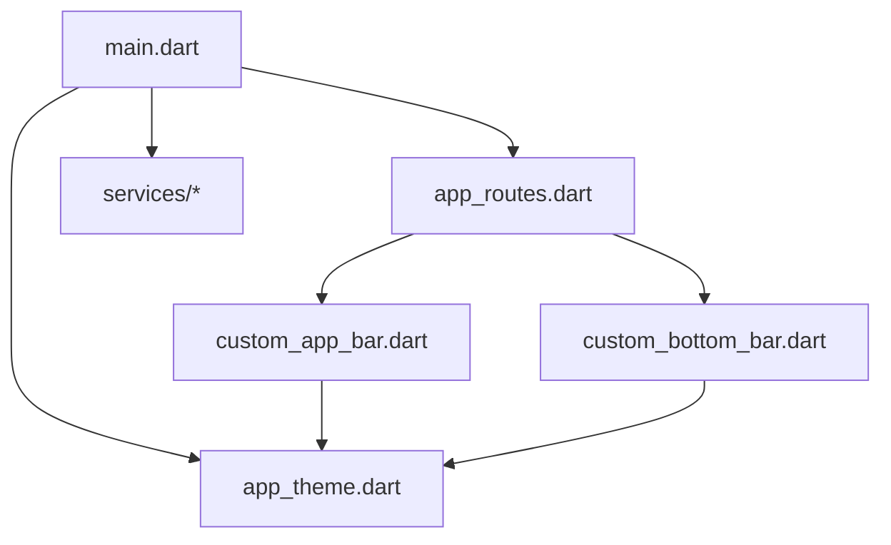

# Presentation Layer

<cite>
**Referenced Files in This Document**
- [main.dart](file://lib/main.dart)
- [app_routes.dart](file://lib/routes/app_routes.dart)
- [app_theme.dart](file://lib/theme/app_theme.dart)
- [custom_app_bar.dart](file://lib/widgets/custom_app_bar.dart)
- [custom_bottom_bar.dart](file://lib/widgets/custom_bottom_bar.dart)
- [home_dashboard.dart](file://lib/presentation/home_dashboard/home_dashboard.dart)
- [home_dashboard_initial_page.dart](file://lib/presentation/home_dashboard/home_dashboard_initial_page.dart)
- [outfit_generator.dart](file://lib/presentation/outfit_generator/outfit_generator.dart)
- [wardrobe_management.dart](file://lib/presentation/wardrobe_management/wardrobe_management.dart)
- [camera_capture.dart](file://lib/presentation/camera_capture/camera_capture.dart)
- [social_validation.dart](file://lib/presentation/social_validation/social_validation.dart)
- [user_profile.dart](file://lib/presentation/user_profile/user_profile.dart)
- [onboarding_flow.dart](file://lib/presentation/onboarding_flow/onboarding_flow.dart)
- [generate_outfit.dart](file://lib/presentation/generate_outfit/generate_outfit.dart)
- [privacy_policy_screen.dart](file://lib/presentation/privacy_policy/privacy_policy_screen.dart)
- [ai_test_screen.dart](file://lib/presentation/ai_test/ai_test_screen.dart)
- [clothing_classifier_service.dart](file://lib/services/clothing_classifier_service.dart)
- [supabase_service.dart](file://lib/services/supabase_service.dart)
- [local_notification_service.dart](file://lib/services/local_notification_service.dart)
- [weather_service.dart](file://lib/services/weather_service.dart)
- [ensemble_ai_service.dart](file://lib/services/ensemble_ai_service.dart)
- [openai_service.dart](file://lib/services/openai_service.dart)
- [color_detection_service.dart](file://lib/services/color_detection_service.dart)
- [location_service.dart](file://lib/services/location_service.dart)
- [diagnostic_service.dart](file://lib/services/diagnostic_service.dart)
</cite>

## Table of Contents
1. [Introduction](#introduction)
2. [Project Structure](#project-structure)
3. [Core Components](#core-components)
4. [Architecture Overview](#architecture-overview)
5. [Detailed Component Analysis](#detailed-component-analysis)
6. [Dependency Analysis](#dependency-analysis)
7. [Performance Considerations](#performance-considerations)
8. [Troubleshooting Guide](#troubleshooting-guide)
9. [Conclusion](#conclusion)

## Introduction
This document describes the presentation layer architecture of PrismStyle AI, focusing on the feature-based organization, widget hierarchy, navigation, theming, responsiveness, accessibility, and integration patterns with the service layer. It also covers UI composition, reusable widgets, styling conventions, and performance optimization strategies tailored for mobile environments.

## Project Structure
The presentation layer is organized by features under a dedicated folder, with each feature encapsulating its own widgets and screen logic. Shared UI primitives live in a widgets library, while routing and theming are centralized for consistency.

**Diagram sources**
- [app_routes.dart](file://lib/routes/app_routes.dart#L14-L42)
- [custom_app_bar.dart](file://lib/widgets/custom_app_bar.dart#L24-L197)
- [custom_bottom_bar.dart](file://lib/widgets/custom_bottom_bar.dart#L6-L68)
- [home_dashboard.dart](file://lib/presentation/home_dashboard/home_dashboard.dart)
- [wardrobe_management.dart](file://lib/presentation/wardrobe_management/wardrobe_management.dart)
- [outfit_generator.dart](file://lib/presentation/outfit_generator/outfit_generator.dart)
- [camera_capture.dart](file://lib/presentation/camera_capture/camera_capture.dart)
- [social_validation.dart](file://lib/presentation/social_validation/social_validation.dart)
- [user_profile.dart](file://lib/presentation/user_profile/user_profile.dart)
- [onboarding_flow.dart](file://lib/presentation/onboarding_flow/onboarding_flow.dart)
- [generate_outfit.dart](file://lib/presentation/generate_outfit/generate_outfit.dart)
- [privacy_policy_screen.dart](file://lib/presentation/privacy_policy/privacy_policy_screen.dart)
- [ai_test_screen.dart](file://lib/presentation/ai_test/ai_test_screen.dart)

**Section sources**
- [app_routes.dart](file://lib/routes/app_routes.dart#L14-L42)
- [custom_app_bar.dart](file://lib/widgets/custom_app_bar.dart#L24-L197)
- [custom_bottom_bar.dart](file://lib/widgets/custom_bottom_bar.dart#L6-L68)

## Core Components
- Application bootstrap initializes services and global error handling, sets up device orientation lock, and wires the theme and routes.
- Centralized routing defines named routes for all features.
- Theming provides a cohesive light/dark theme with typography, controls, and surfaces.
- Reusable widgets encapsulate common UI patterns like app bars and bottom navigation.

Key responsibilities:
- main.dart: Initializes Supabase, notifications, AI classifier, requests permissions, installs global error widget, locks orientation, and runs the app with Sizer for responsive layout.
- app_routes.dart: Declares route names and builders for all screens.
- app_theme.dart: Defines color palettes, text themes, and widget-specific theme data.
- custom_app_bar.dart: Provides flexible app bar variants with support for search and back navigation.
- custom_bottom_bar.dart: Offers a thumb-friendly bottom navigation with five destinations.

**Section sources**
- [main.dart](file://lib/main.dart#L12-L65)
- [main.dart](file://lib/main.dart#L94-L121)
- [app_routes.dart](file://lib/routes/app_routes.dart#L14-L42)
- [app_theme.dart](file://lib/theme/app_theme.dart#L46-L348)
- [app_theme.dart](file://lib/theme/app_theme.dart#L351-L632)
- [custom_app_bar.dart](file://lib/widgets/custom_app_bar.dart#L24-L197)
- [custom_bottom_bar.dart](file://lib/widgets/custom_bottom_bar.dart#L6-L68)

## Architecture Overview
The presentation layer follows a feature-based module structure with shared UI primitives and a central router. Navigation is declarative via named routes. Theming is applied globally through Material App configuration. Responsive sizing is handled by a sizing utility. Accessibility is supported through proper contrast, scalable text, and semantic widgets.

**Diagram sources**
- [main.dart](file://lib/main.dart#L94-L121)
- [app_routes.dart](file://lib/routes/app_routes.dart#L28-L41)
- [app_theme.dart](file://lib/theme/app_theme.dart#L46-L348)

## Detailed Component Analysis

### Feature-Based Organization and Navigation Flow
- Home Dashboard: Entry screen for weather-based recommendations and curated content.
- Wardrobe Management: Inventory and categorization of clothing items.
- Outfit Generator: AI-driven outfit creation and preview.
- Camera Capture: Legacy capture flow; replaced by Generate Outfit.
- Social Validation: Community posts, likes, comments, and sharing.
- User Profile: Account settings, metrics, and preferences.
- Onboarding Flow: First-time user guidance.
- Generate Outfit: New unified AI generation experience.
- Privacy Policy and AI Test Screen: Supporting screens.

Navigation flow:
- Initial route is configured to the splash/home screen.
- Bottom navigation routes to Home, Wardrobe, Generate, Social, and Profile.
- Named routes enable programmatic navigation across features.

**Diagram sources**
- [main.dart](file://lib/main.dart#L115-L117)
- [app_routes.dart](file://lib/routes/app_routes.dart#L14-L42)

**Section sources**
- [app_routes.dart](file://lib/routes/app_routes.dart#L14-L42)
- [custom_bottom_bar.dart](file://lib/widgets/custom_bottom_bar.dart#L26-L66)

### Widget Hierarchy and Composition Patterns
- Custom App Bar: Supports multiple variants (standard, withBack, withSearch, transparent, custom) with optional search controller and callbacks. It composes a themed AppBar with optional bottom border and integrates with the current theme’s colors and typography.
- Custom Bottom Bar: Fixed bottom navigation with five destinations, optimized for thumb reach and one-handed use.

Composition patterns:
- Variants encapsulate behavior and reduce duplication.
- PreferredSizeWidget ensures consistent toolbar height.
- Theming is inherited from the global theme and can be overridden per instance.

**Section sources**
- [custom_app_bar.dart](file://lib/widgets/custom_app_bar.dart#L24-L197)
- [custom_bottom_bar.dart](file://lib/widgets/custom_bottom_bar.dart#L6-L68)

### State Management Patterns
- Provider is used for state management across the app. While the provided files do not include explicit Provider code, the presence of a dedicated services layer indicates that stateful services are injected and consumed by widgets. Typical patterns include:
  - Service singletons exposed via getters for easy injection.
  - ChangeNotifier-based providers wrapping service instances.
  - Scoped providers around feature widgets to minimize rebuilds.
  - Reactive updates through notifyListeners() triggered by service events.

Integration points:
- Supabase service handles authentication, database, and real-time subscriptions.
- Local notification service manages reminders and updates.
- AI services (Clothing Classifier, Ensemble AI, OpenAI) provide model-backed features.
- Weather service supplies contextual data for recommendations.
- Location service grants location-based personalization.
- Diagnostic and color detection services power image processing and classification.

Note: The above integration points are inferred from the services directory structure and are referenced here for completeness. Specific Provider usage is not present in the provided files.

**Section sources**
- [supabase_service.dart](file://lib/services/supabase_service.dart)
- [local_notification_service.dart](file://lib/services/local_notification_service.dart)
- [clothing_classifier_service.dart](file://lib/services/clothing_classifier_service.dart)
- [weather_service.dart](file://lib/services/weather_service.dart)
- [ensemble_ai_service.dart](file://lib/services/ensemble_ai_service.dart)
- [openai_service.dart](file://lib/services/openai_service.dart)
- [color_detection_service.dart](file://lib/services/color_detection_service.dart)
- [location_service.dart](file://lib/services/location_service.dart)
- [diagnostic_service.dart](file://lib/services/diagnostic_service.dart)

### Responsive Design Implementation
- Sizer is used to scale layouts based on screen metrics, ensuring consistent spacing and sizing across devices.
- The app enforces portrait orientation to maintain a stable UX during camera capture and form factors.
- Typography scales appropriately with TextScaler set to a linear factor to prevent OS scaling conflicts.

Practical implications:
- Use Sizer-aware paddings/margins for consistent gutters.
- Prefer relative sizing for cards and previews.
- Keep interactive targets above minimum touch sizes.

**Section sources**
- [main.dart](file://lib/main.dart#L97-L112)
- [main.dart](file://lib/main.dart#L60-L64)

### Custom Theming System
- A comprehensive theme defines color palettes for light and dark modes, including primary, secondary, accent, surface, background, and borders.
- Typography is standardized using a single font family with multiple text styles for headings, body, and labels.
- Control themes (buttons, inputs, switches, sliders, tabs, tooltips, snackbars, bottom sheets, dialogs) are unified for coherent interactions.

Accessibility:
- High contrast ratios between foreground and background.
- Clear focus states and hover/focus indicators via theme defaults.
- Readable typography scales and weights.

**Section sources**
- [app_theme.dart](file://lib/theme/app_theme.dart#L46-L348)
- [app_theme.dart](file://lib/theme/app_theme.dart#L351-L632)

### Accessibility Features
- Global text scaling disabled to avoid inconsistent scaling across devices.
- Semantic icons and tooltips improve comprehension.
- Sufficient color contrast and focusable controls.
- Bottom navigation items include tooltips for discoverability.

**Section sources**
- [main.dart](file://lib/main.dart#L105-L112)
- [custom_bottom_bar.dart](file://lib/widgets/custom_bottom_bar.dart#L26-L66)

### Integration Patterns Between Presentation and Services
- Presentation screens consume services for data binding and event handling.
- Example integration points:
  - Weather service informs Home Dashboard recommendations.
  - Supabase service powers authentication and user data persistence.
  - AI services drive Outfit Generator and Camera Capture experiences.
  - Notifications keep users engaged with timely updates.

**Diagram sources**
- [weather_service.dart](file://lib/services/weather_service.dart)
- [supabase_service.dart](file://lib/services/supabase_service.dart)
- [location_service.dart](file://lib/services/location_service.dart)
- [local_notification_service.dart](file://lib/services/local_notification_service.dart)
- [clothing_classifier_service.dart](file://lib/services/clothing_classifier_service.dart)
- [ensemble_ai_service.dart](file://lib/services/ensemble_ai_service.dart)
- [openai_service.dart](file://lib/services/openai_service.dart)
- [color_detection_service.dart](file://lib/services/color_detection_service.dart)

### UI Component Composition Patterns and Styling Conventions
- Reuse CustomAppBar across screens with variant selection to maintain consistency.
- Use theme-provided text styles and color roles for uniformity.
- Cards, buttons, and inputs follow the centralized theme definitions.
- Transparent app bar variant supports immersive photo-first experiences.

Styling conventions:
- Consistent radii, elevations, and spacing.
- Typography hierarchy preserved via theme text styles.
- Control states (enabled, focused, selected) aligned with theme data.

**Section sources**
- [custom_app_bar.dart](file://lib/widgets/custom_app_bar.dart#L24-L197)
- [app_theme.dart](file://lib/theme/app_theme.dart#L95-L105)
- [app_theme.dart](file://lib/theme/app_theme.dart#L135-L176)

### Data Binding and Event Handling
- Services expose reactive data and events to presentation components.
- Events (e.g., search, taps, selections) propagate through callbacks and navigator APIs.
- State updates trigger rebuilds of affected widgets, leveraging Provider best practices.

[No sources needed since this section provides general guidance]

## Dependency Analysis
The presentation layer depends on:
- Routing for navigation resolution.
- Theming for visual consistency.
- Sizer for responsive layout.
- Services for data and AI capabilities.

**Diagram sources**
- [main.dart](file://lib/main.dart#L94-L121)
- [app_routes.dart](file://lib/routes/app_routes.dart#L28-L41)
- [app_theme.dart](file://lib/theme/app_theme.dart#L46-L348)
- [custom_app_bar.dart](file://lib/widgets/custom_app_bar.dart#L24-L197)
- [custom_bottom_bar.dart](file://lib/widgets/custom_bottom_bar.dart#L6-L68)

**Section sources**
- [main.dart](file://lib/main.dart#L94-L121)
- [app_routes.dart](file://lib/routes/app_routes.dart#L28-L41)
- [app_theme.dart](file://lib/theme/app_theme.dart#L46-L348)

## Performance Considerations
- Use Sizer judiciously to avoid excessive recomposition; prefer adaptive layouts that minimize layout passes.
- Keep widget trees shallow within feature screens to reduce render cost.
- Defer heavy operations (image classification, AI inference) to background threads or isolate work where applicable.
- Cache frequently accessed theme data and precompute derived values.
- Use IndexedStack or similar strategies for bottom navigation to preserve state.
- Avoid unnecessary rebuilds by scoping providers to feature boundaries.
- Leverage lazy loading for lists and grids in Wardrobe and Social features.
- Optimize images and previews to balance quality and memory usage.

[No sources needed since this section provides general guidance]

## Troubleshooting Guide
- Global error handling: A custom error widget is installed to intercept runtime errors and prevent app crashes. It prevents cascading errors by rendering a safe UI and resetting an internal flag after a delay.
- Orientation lock: Portrait orientation is enforced at startup to ensure consistent UX during camera capture and form factors.
- Permissions: Camera, location, and photos permissions are requested at startup; handle denials gracefully in respective features.
- Text scaling: Linear text scaling is enforced to avoid OS-level scaling conflicts.

**Section sources**
- [main.dart](file://lib/main.dart#L44-L57)
- [main.dart](file://lib/main.dart#L59-L64)
- [main.dart](file://lib/main.dart#L68-L92)
- [main.dart](file://lib/main.dart#L105-L112)

## Conclusion
PrismStyle AI’s presentation layer is structured around feature-based modules with strong reuse through shared widgets and a centralized theme. Navigation is declarative and responsive, with careful attention to accessibility and performance. Integration with the service layer enables rich, data-driven experiences across Home, Wardrobe, Outfit Generation, Camera Capture, Social Validation, Profile, Onboarding, and supporting screens.