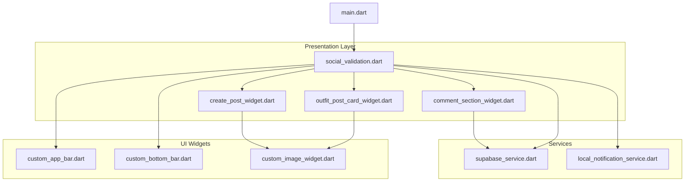
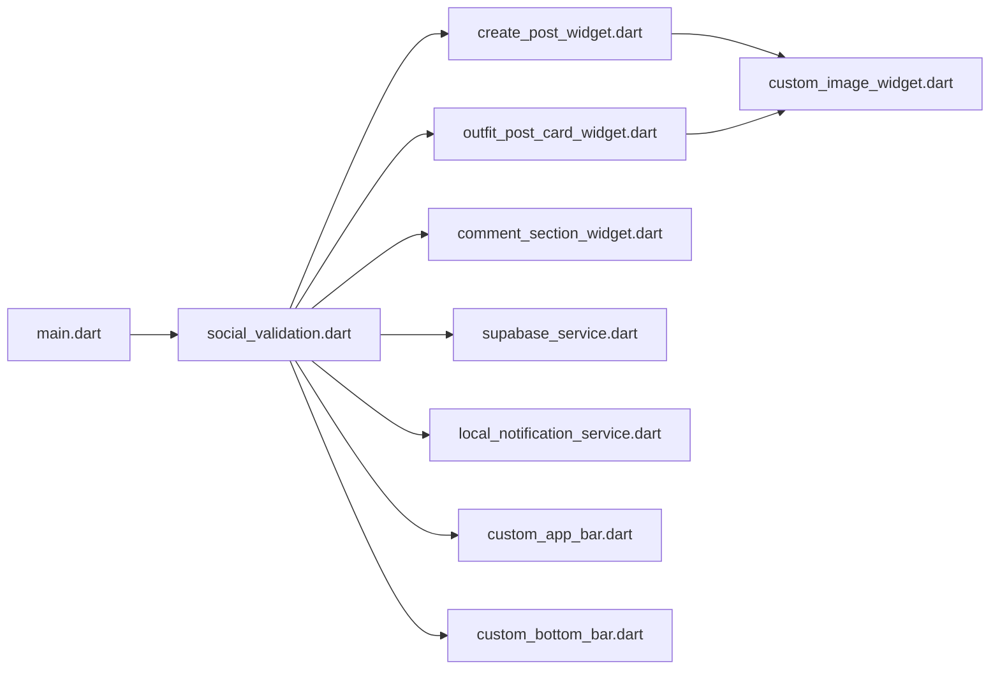
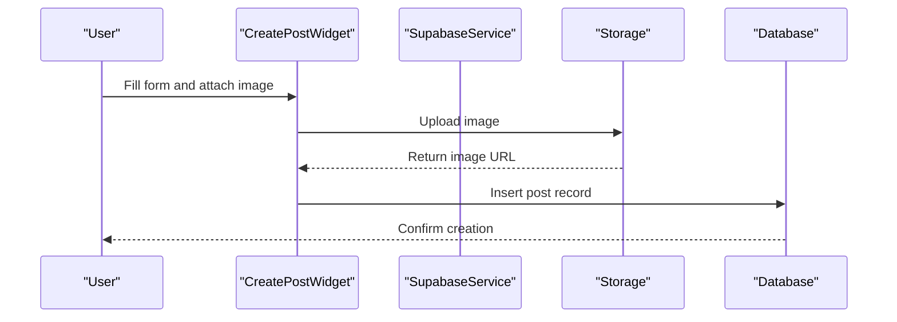
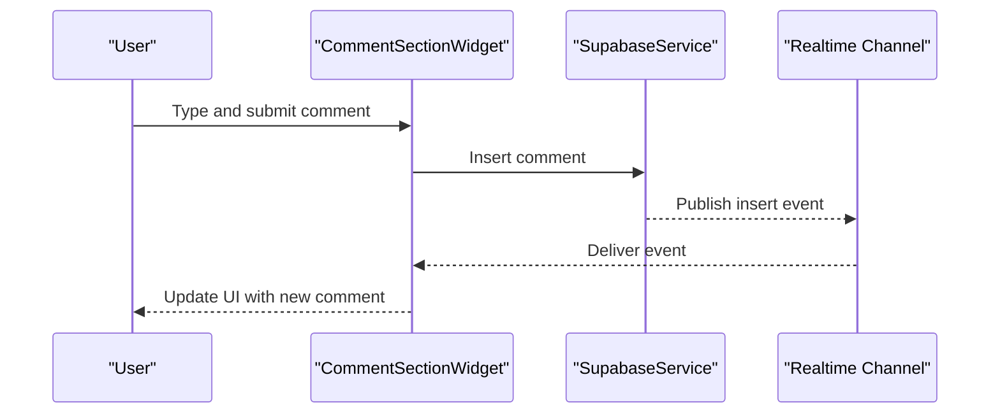

# Social Validation

<cite>
**Referenced Files in This Document**
- [social_validation.dart](file://lib/presentation/social_validation/social_validation.dart)
- [create_post_widget.dart](file://lib/presentation/social_validation/widgets/create_post_widget.dart)
- [outfit_post_card_widget.dart](file://lib/presentation/social_validation/widgets/outfit_post_card_widget.dart)
- [comment_section_widget.dart](file://lib/presentation/social_validation/widgets/comment_section_widget.dart)
- [supabase_service.dart](file://lib/services/supabase_service.dart)
- [main.dart](file://lib/main.dart)
- [local_notification_service.dart](file://lib/services/local_notification_service.dart)
- [custom_app_bar.dart](file://lib/widgets/custom_app_bar.dart)
- [custom_bottom_bar.dart](file://lib/widgets/custom_bottom_bar.dart)
- [custom_image_widget.dart](file://lib/widgets/custom_image_widget.dart)
- [supabase_schema.sql](file://supabase_schema.sql)
- [env.json](file://env.json)
</cite>

## Table of Contents
1. [Introduction](#introduction)
2. [Project Structure](#project-structure)
3. [Core Components](#core-components)
4. [Architecture Overview](#architecture-overview)
5. [Detailed Component Analysis](#detailed-component-analysis)
6. [Dependency Analysis](#dependency-analysis)
7. [Performance Considerations](#performance-considerations)
8. [Troubleshooting Guide](#troubleshooting-guide)
9. [Conclusion](#conclusion)
10. [Appendices](#appendices)

## Introduction
This document describes the Social Validation feature, a community-driven feedback system enabling users to share outfits, receive peer reviews, and discover trending styles. It covers the post creation interface, outfit sharing functionality, real-time community interactions, comment section widget, engagement metrics, social discovery, and the outfit post card widget. It also documents integrations with Supabase for real-time updates, user authentication, content moderation, community guidelines enforcement, content filtering, privacy controls, responsive design, infinite scrolling, performance optimization, notifications, friend connections, and trending style discovery.

## Project Structure
The Social Validation feature is organized under the presentation layer with dedicated widgets and a coordinating screen. Supporting services include Supabase integration and local notifications. The main entry point initializes the app and routes to the Social Validation screen.



**Diagram sources**
- [social_validation.dart](file://lib/presentation/social_validation/social_validation.dart#L1-L200)
- [create_post_widget.dart](file://lib/presentation/social_validation/widgets/create_post_widget.dart#L1-L200)
- [outfit_post_card_widget.dart](file://lib/presentation/social_validation/widgets/outfit_post_card_widget.dart#L1-L200)
- [comment_section_widget.dart](file://lib/presentation/social_validation/widgets/comment_section_widget.dart#L1-L200)
- [supabase_service.dart](file://lib/services/supabase_service.dart#L1-L200)
- [local_notification_service.dart](file://lib/services/local_notification_service.dart#L1-L200)
- [custom_app_bar.dart](file://lib/widgets/custom_app_bar.dart#L1-L200)
- [custom_bottom_bar.dart](file://lib/widgets/custom_bottom_bar.dart#L1-L200)
- [custom_image_widget.dart](file://lib/widgets/custom_image_widget.dart#L1-L200)
- [main.dart](file://lib/main.dart#L1-L200)

**Section sources**
- [social_validation.dart](file://lib/presentation/social_validation/social_validation.dart#L1-L200)
- [main.dart](file://lib/main.dart#L1-L200)

## Core Components
- Social Validation Screen: Orchestrates the feed, post creation, comments, and navigation.
- Create Post Widget: Provides the interface for posting new outfit content.
- Outfit Post Card Widget: Renders individual posts with images, metadata, likes, and sharing actions.
- Comment Section Widget: Manages comments, replies, and real-time updates.
- Supabase Service: Handles authentication, real-time subscriptions, and database operations.
- Local Notification Service: Delivers notifications for likes, comments, follows, and trends.
- UI Widgets: Reusable components for app bar, bottom navigation, and image rendering.

**Section sources**
- [social_validation.dart](file://lib/presentation/social_validation/social_validation.dart#L1-L200)
- [create_post_widget.dart](file://lib/presentation/social_validation/widgets/create_post_widget.dart#L1-L200)
- [outfit_post_card_widget.dart](file://lib/presentation/social_validation/widgets/outfit_post_card_widget.dart#L1-L200)
- [comment_section_widget.dart](file://lib/presentation/social_validation/widgets/comment_section_widget.dart#L1-L200)
- [supabase_service.dart](file://lib/services/supabase_service.dart#L1-L200)
- [local_notification_service.dart](file://lib/services/local_notification_service.dart#L1-L200)
- [custom_app_bar.dart](file://lib/widgets/custom_app_bar.dart#L1-L200)
- [custom_bottom_bar.dart](file://lib/widgets/custom_bottom_bar.dart#L1-L200)
- [custom_image_widget.dart](file://lib/widgets/custom_image_widget.dart#L1-L200)

## Architecture Overview
The Social Validation feature integrates UI widgets with Supabase for real-time data and notifications. The flow includes user actions (post creation, likes, comments), service interactions, and UI updates.

```mermaid
sequenceDiagram
participant User as "User"
participant Screen as "SocialValidationScreen"
participant Create as "CreatePostWidget"
participant Feed as "OutfitPostCardWidget"
participant Comments as "CommentSectionWidget"
participant Supabase as "SupabaseService"
participant Notify as "LocalNotificationService"
User->>Screen : Open Social Validation
Screen->>Create : Render post creation UI
User->>Create : Submit new post
Create->>Supabase : Insert post record
Supabase-->>Screen : Real-time insert event
Screen->>Feed : Add new post to feed
User->>Feed : Like/Share post
Feed->>Supabase : Update likes/shares
Supabase-->>Notify : Publish like/comment events
Notify-->>User : Show notification
User->>Comments : Open comments
Comments->>Supabase : Subscribe to comments
Supabase-->>Comments : Stream comments
```

**Diagram sources**
- [social_validation.dart](file://lib/presentation/social_validation/social_validation.dart#L1-L200)
- [create_post_widget.dart](file://lib/presentation/social_validation/widgets/create_post_widget.dart#L1-L200)
- [outfit_post_card_widget.dart](file://lib/presentation/social_validation/widgets/outfit_post_card_widget.dart#L1-L200)
- [comment_section_widget.dart](file://lib/presentation/social_validation/widgets/comment_section_widget.dart#L1-L200)
- [supabase_service.dart](file://lib/services/supabase_service.dart#L1-L200)
- [local_notification_service.dart](file://lib/services/local_notification_service.dart#L1-L200)

## Detailed Component Analysis

### Social Validation Screen
Responsibilities:
- Hosts the post creation, feed, and comment sections.
- Integrates navigation via custom app bar and bottom bar.
- Subscribes to Supabase real-time channels for posts and comments.
- Triggers local notifications for social interactions.

Key behaviors:
- Initializes Supabase client and authentication state.
- Manages pagination/infinite scroll for the feed.
- Coordinates UI updates from real-time events.

**Section sources**
- [social_validation.dart](file://lib/presentation/social_validation/social_validation.dart#L1-L200)
- [custom_app_bar.dart](file://lib/widgets/custom_app_bar.dart#L1-L200)
- [custom_bottom_bar.dart](file://lib/widgets/custom_bottom_bar.dart#L1-L200)

### Create Post Widget
Responsibilities:
- Captures user input for outfit posts (description, tags, visibility).
- Uploads media to storage and persists metadata to the database.
- Publishes new posts to the public feed via real-time channels.

Implementation highlights:
- Uses custom image widget for preview and upload.
- Validates input against community guidelines.
- Enforces privacy controls (public/private/friends-only).

**Section sources**
- [create_post_widget.dart](file://lib/presentation/social_validation/widgets/create_post_widget.dart#L1-L200)
- [custom_image_widget.dart](file://lib/widgets/custom_image_widget.dart#L1-L200)

### Outfit Post Card Widget
Responsibilities:
- Displays post image, author info, caption, and metadata.
- Provides interactive actions: like, comment, share.
- Supports engagement metrics display (likes, comments count).

Data model mapping:
- Image URL from storage.
- Author profile and timestamp.
- Engagement counts and user-specific like state.

**Section sources**
- [outfit_post_card_widget.dart](file://lib/presentation/social_validation/widgets/outfit_post_card_widget.dart#L1-L200)
- [custom_image_widget.dart](file://lib/widgets/custom_image_widget.dart#L1-L200)

### Comment Section Widget
Responsibilities:
- Renders comments and nested replies.
- Streams new comments via Supabase real-time subscription.
- Supports user moderation actions (report, delete).

Real-time flow:
- Subscribes to comments channel filtered by post ID.
- Updates UI reactively on insert/update/delete events.

**Section sources**
- [comment_section_widget.dart](file://lib/presentation/social_validation/widgets/comment_section_widget.dart#L1-L200)
- [supabase_service.dart](file://lib/services/supabase_service.dart#L1-L200)

### Supabase Service
Responsibilities:
- Authentication: handles sign-in/sign-up and session management.
- Database: manages posts, comments, likes, and user profiles.
- Real-time: subscribes to tables and channels for live updates.
- Storage: uploads and serves media assets.
- Moderation hooks: integrates with server-side functions for filtering and reporting.

Integration points:
- Auth state stream for UI updates.
- Post/comment/like tables with foreign keys to users.
- Channels for comments and global announcements.

**Section sources**
- [supabase_service.dart](file://lib/services/supabase_service.dart#L1-L200)
- [supabase_schema.sql](file://supabase_schema.sql#L1-L200)
- [env.json](file://env.json#L1-L200)

### Local Notification Service
Responsibilities:
- Receives events from Supabase channels.
- Displays contextual notifications for likes, comments, follows, and trending style alerts.
- Respects user notification preferences.

**Section sources**
- [local_notification_service.dart](file://lib/services/local_notification_service.dart#L1-L200)

### Community Guidelines and Privacy Controls
- Content filtering: server-side functions enforce keyword filters and NSFW checks.
- Reporting: users can flag inappropriate content; moderators review reports.
- Privacy: visibility settings per post; friends-only mode restricts audience.
- Moderation dashboard: curated lists for flagged content and user reports.

**Section sources**
- [supabase_service.dart](file://lib/services/supabase_service.dart#L1-L200)
- [supabase_schema.sql](file://supabase_schema.sql#L1-L200)

### Social Discovery and Trending Styles
- Trending algorithm: aggregates likes/comments over time windows.
- Personalized feed: combines friend activity and style preferences.
- Hashtag and tag exploration: surfaces popular styles and categories.

**Section sources**
- [social_validation.dart](file://lib/presentation/social_validation/social_validation.dart#L1-L200)

### Responsive Design and Infinite Scrolling
- Adaptive layouts: grid/list modes adjust to viewport width.
- Infinite scroll: loads more posts when nearing the end of the list.
- Performance: virtualization of list items, lazy loading of images.

**Section sources**
- [social_validation.dart](file://lib/presentation/social_validation/social_validation.dart#L1-L200)
- [custom_image_widget.dart](file://lib/widgets/custom_image_widget.dart#L1-L200)

## Dependency Analysis
The Social Validation feature depends on Supabase for backend services and Flutter widgets for UI. The main dependencies are:



**Diagram sources**
- [main.dart](file://lib/main.dart#L1-L200)
- [social_validation.dart](file://lib/presentation/social_validation/social_validation.dart#L1-L200)
- [create_post_widget.dart](file://lib/presentation/social_validation/widgets/create_post_widget.dart#L1-L200)
- [outfit_post_card_widget.dart](file://lib/presentation/social_validation/widgets/outfit_post_card_widget.dart#L1-L200)
- [comment_section_widget.dart](file://lib/presentation/social_validation/widgets/comment_section_widget.dart#L1-L200)
- [supabase_service.dart](file://lib/services/supabase_service.dart#L1-L200)
- [local_notification_service.dart](file://lib/services/local_notification_service.dart#L1-L200)
- [custom_app_bar.dart](file://lib/widgets/custom_app_bar.dart#L1-L200)
- [custom_bottom_bar.dart](file://lib/widgets/custom_bottom_bar.dart#L1-L200)
- [custom_image_widget.dart](file://lib/widgets/custom_image_widget.dart#L1-L200)

**Section sources**
- [social_validation.dart](file://lib/presentation/social_validation/social_validation.dart#L1-L200)
- [supabase_service.dart](file://lib/services/supabase_service.dart#L1-L200)

## Performance Considerations
- Lazy loading: defer image decoding until visible.
- Virtualization: recycle list items to minimize memory usage.
- Pagination: fetch batches of posts to avoid large payloads.
- Debounced search: throttle queries for hashtags and tags.
- Caching: cache frequently accessed user avatars and metadata.
- Background sync: update counters and trending stats periodically.

[No sources needed since this section provides general guidance]

## Troubleshooting Guide
Common issues and resolutions:
- Authentication failures: verify credentials and refresh tokens; check environment variables for Supabase configuration.
- Real-time disconnects: confirm network connectivity and re-subscribe to channels after reconnect.
- Media upload errors: validate file types and sizes; retry uploads with exponential backoff.
- Notification permissions: prompt users to enable notifications; handle platform-specific settings.
- Feed not updating: ensure correct channel subscriptions and table triggers are active.

**Section sources**
- [supabase_service.dart](file://lib/services/supabase_service.dart#L1-L200)
- [local_notification_service.dart](file://lib/services/local_notification_service.dart#L1-L200)
- [env.json](file://env.json#L1-L200)

## Conclusion
The Social Validation feature provides a robust foundation for community-driven fashion feedback. Its modular architecture, real-time capabilities, and integrated moderation ensure a safe and engaging experience. By leveraging Supabase for authentication, storage, and real-time updates, and Flutter for responsive UI, the system scales efficiently while maintaining user privacy and discoverability.

[No sources needed since this section summarizes without analyzing specific files]

## Appendices

### API and Data Model Overview
- Posts: author_id, caption, image_url, visibility, created_at, updated_at.
- Comments: post_id, author_id, content, parent_comment_id, created_at.
- Likes: post_id, user_id, created_at.
- Users: id, username, avatar_url, preferences, created_at.

**Section sources**
- [supabase_schema.sql](file://supabase_schema.sql#L1-L200)

### Example Workflows

#### Post Creation Flow


**Diagram sources**
- [create_post_widget.dart](file://lib/presentation/social_validation/widgets/create_post_widget.dart#L1-L200)
- [supabase_service.dart](file://lib/services/supabase_service.dart#L1-L200)

#### Comment Interaction Flow


**Diagram sources**
- [comment_section_widget.dart](file://lib/presentation/social_validation/widgets/comment_section_widget.dart#L1-L200)
- [supabase_service.dart](file://lib/services/supabase_service.dart#L1-L200)