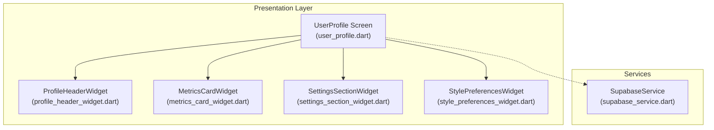
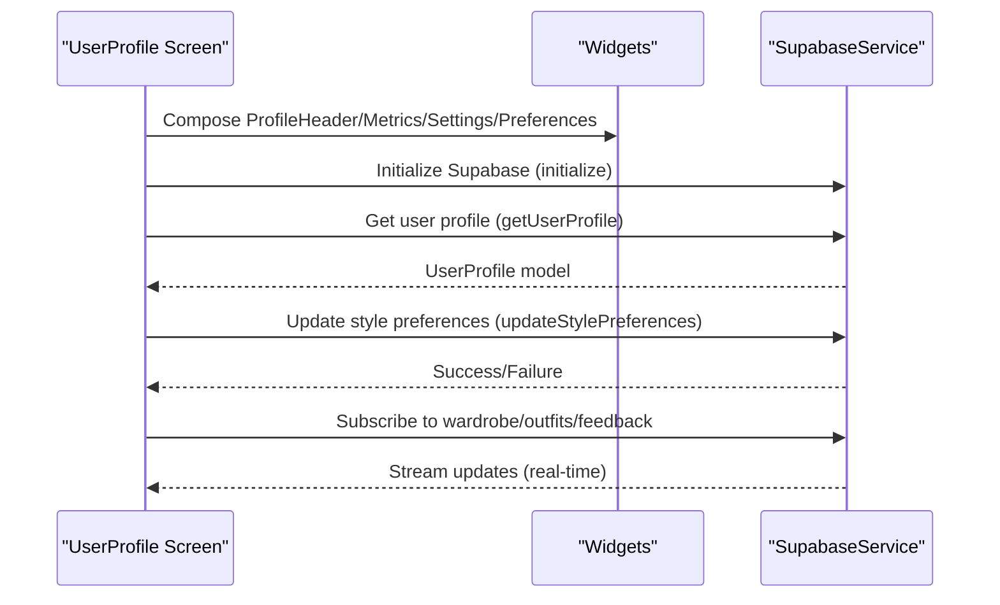
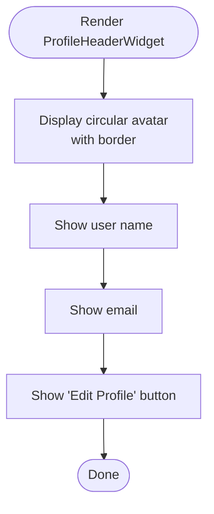
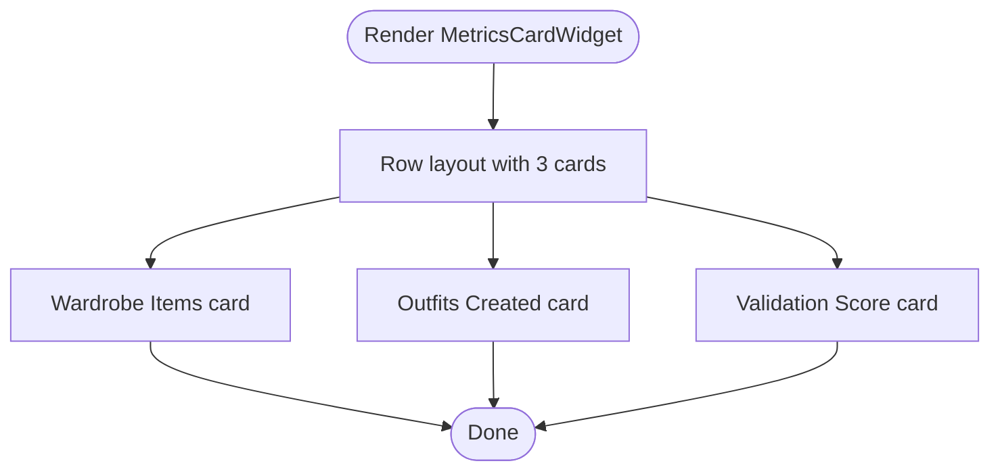
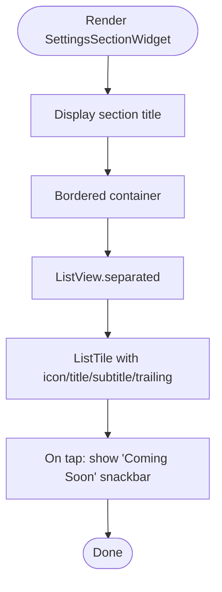
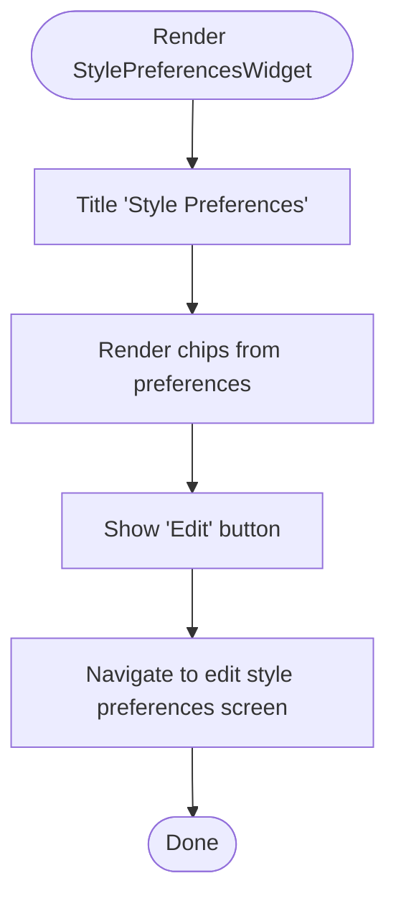
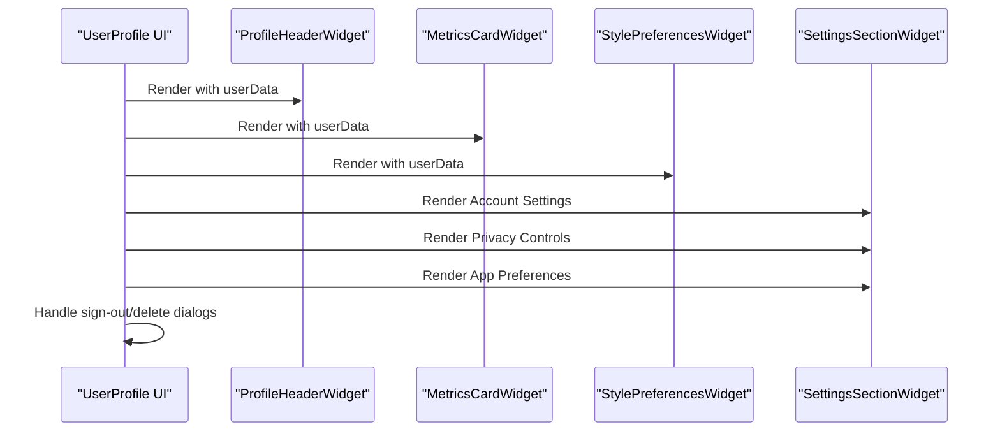
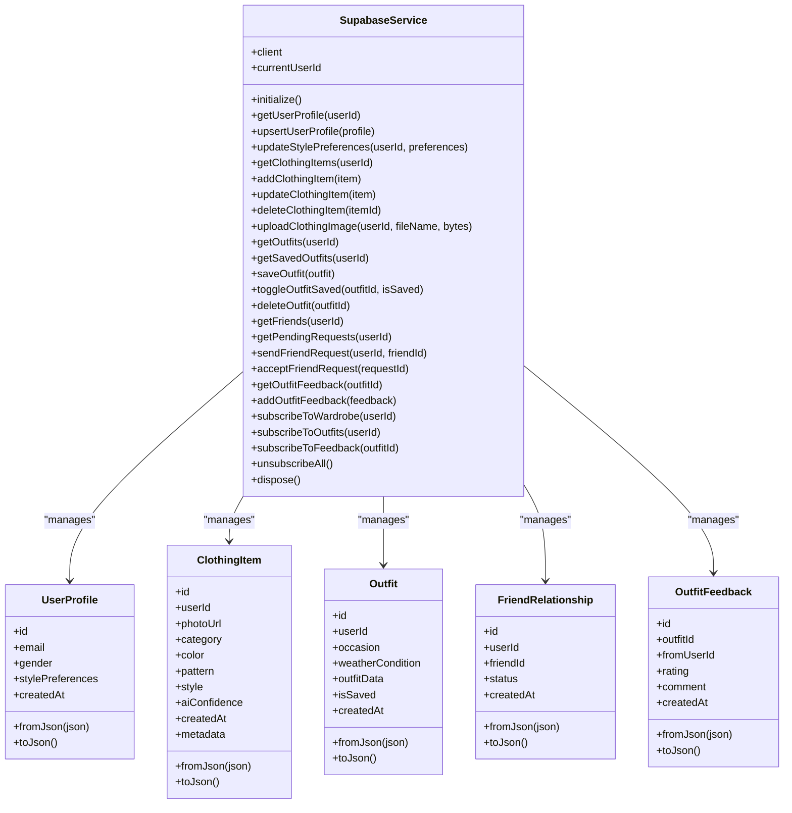
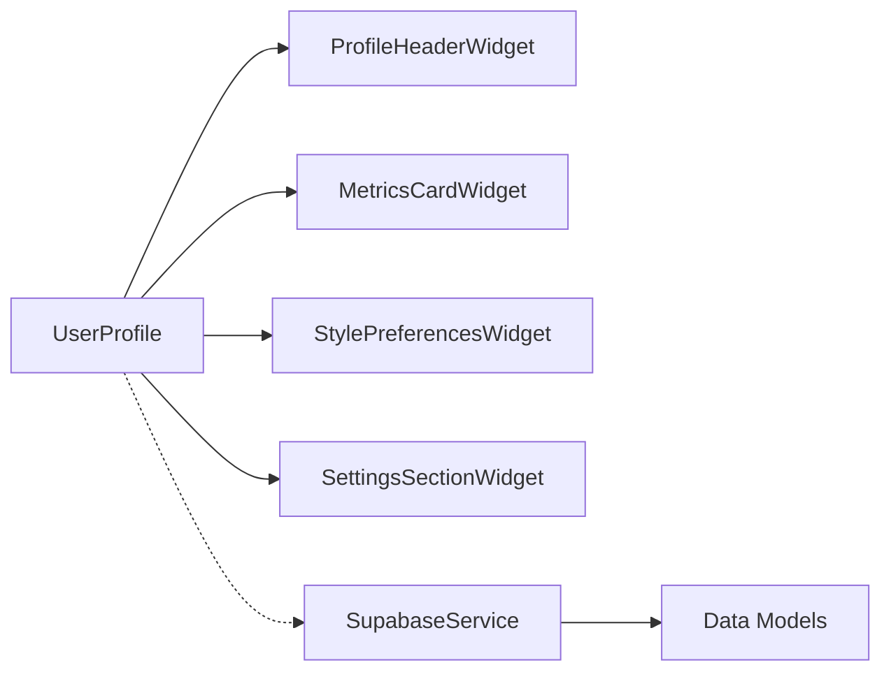

# User Profile

<cite>
**Referenced Files in This Document**
- [user_profile.dart](file://lib/presentation/user_profile/user_profile.dart)
- [profile_header_widget.dart](file://lib/presentation/user_profile/widgets/profile_header_widget.dart)
- [metrics_card_widget.dart](file://lib/presentation/user_profile/widgets/metrics_card_widget.dart)
- [settings_section_widget.dart](file://lib/presentation/user_profile/widgets/settings_section_widget.dart)
- [style_preferences_widget.dart](file://lib/presentation/user_profile/widgets/style_preferences_widget.dart)
- [supabase_service.dart](file://lib/services/supabase_service.dart)
</cite>

## Table of Contents
1. [Introduction](#introduction)
2. [Project Structure](#project-structure)
3. [Core Components](#core-components)
4. [Architecture Overview](#architecture-overview)
5. [Detailed Component Analysis](#detailed-component-analysis)
6. [Dependency Analysis](#dependency-analysis)
7. [Performance Considerations](#performance-considerations)
8. [Troubleshooting Guide](#troubleshooting-guide)
9. [Conclusion](#conclusion)
10. [Appendices](#appendices)

## Introduction
This document describes the User Profile system, focusing on the profile header widget, metrics cards, settings sections, and style preferences widget. It also explains how the system integrates with Supabase for profile synchronization, data persistence, and real-time updates. Privacy-focused data handling, preference storage, customization options, responsive design, form validation, accessibility, data export, account security, and cross-device preference synchronization are covered.

## Project Structure
The User Profile feature is organized under the presentation layer with dedicated widgets and a central screen orchestrating layout and navigation. Supabase service provides backend connectivity and real-time capabilities.

**Diagram sources**
- [user_profile.dart](file://lib/presentation/user_profile/user_profile.dart#L1-L393)
- [profile_header_widget.dart](file://lib/presentation/user_profile/widgets/profile_header_widget.dart#L1-L84)
- [metrics_card_widget.dart](file://lib/presentation/user_profile/widgets/metrics_card_widget.dart#L1-L101)
- [settings_section_widget.dart](file://lib/presentation/user_profile/widgets/settings_section_widget.dart#L1-L96)
- [style_preferences_widget.dart](file://lib/presentation/user_profile/widgets/style_preferences_widget.dart#L1-L80)
- [supabase_service.dart](file://lib/services/supabase_service.dart#L1-L673)

**Section sources**
- [user_profile.dart](file://lib/presentation/user_profile/user_profile.dart#L1-L393)

## Core Components
- UserProfile screen: Hosts the profile UI, scrollable content, and action dialogs for sign-out and account deletion. It composes the profile header, metrics cards, style preferences, and settings sections.
- ProfileHeaderWidget: Displays avatar, name, email, and an edit action.
- MetricsCardWidget: Horizontal cards for wardrobe items, outfits created, and validation score.
- SettingsSectionWidget: Grouped settings rows with icons, titles, subtitles, and a trailing chevron; includes a placeholder “Coming Soon” behavior for non-style settings.
- StylePreferencesWidget: Lists current style preferences as chips and provides an edit action.
- SupabaseService: Centralized backend service for initializing Supabase, managing user profiles, style preferences, real-time subscriptions, and data models.

**Section sources**
- [user_profile.dart](file://lib/presentation/user_profile/user_profile.dart#L11-L232)
- [profile_header_widget.dart](file://lib/presentation/user_profile/widgets/profile_header_widget.dart#L6-L84)
- [metrics_card_widget.dart](file://lib/presentation/user_profile/widgets/metrics_card_widget.dart#L7-L101)
- [settings_section_widget.dart](file://lib/presentation/user_profile/widgets/settings_section_widget.dart#L7-L96)
- [style_preferences_widget.dart](file://lib/presentation/user_profile/widgets/style_preferences_widget.dart#L7-L80)
- [supabase_service.dart](file://lib/services/supabase_service.dart#L16-L448)

## Architecture Overview
The profile screen renders static mock data locally and delegates persistent operations to SupabaseService. Real-time updates are supported via Supabase streams for wardrobe, outfits, and feedback.

**Diagram sources**
- [user_profile.dart](file://lib/presentation/user_profile/user_profile.dart#L41-L63)
- [supabase_service.dart](file://lib/services/supabase_service.dart#L41-L63)
- [supabase_service.dart](file://lib/services/supabase_service.dart#L74-L114)
- [supabase_service.dart](file://lib/services/supabase_service.dart#L395-L439)

## Detailed Component Analysis

### Profile Header Widget
Purpose:
- Display avatar with circular border, user name, email, and an edit action.
- Provide semantic labeling for accessibility.

Behavior:
- Avatar uses a custom image widget with a semantic label.
- Edit action navigates to an edit profile route.

Accessibility and responsiveness:
- Uses theme-aware typography and spacing.
- Circular avatar with border ensures consistent sizing.

**Diagram sources**
- [profile_header_widget.dart](file://lib/presentation/user_profile/widgets/profile_header_widget.dart#L14-L82)

**Section sources**
- [profile_header_widget.dart](file://lib/presentation/user_profile/widgets/profile_header_widget.dart#L6-L84)

### Metrics Card Widget
Purpose:
- Present three horizontal metric cards: wardrobe items, outfits created, validation score.

Structure:
- Three equal-width expanded cards arranged in a row.
- Each card displays an icon, value, and label.

Responsiveness:
- Uses percentage-based widths and spacing for adaptive layouts.

**Diagram sources**
- [metrics_card_widget.dart](file://lib/presentation/user_profile/widgets/metrics_card_widget.dart#L14-L53)

**Section sources**
- [metrics_card_widget.dart](file://lib/presentation/user_profile/widgets/metrics_card_widget.dart#L7-L101)

### Settings Section Widget
Purpose:
- Group related settings under a titled section with a bordered container.
- Provide list items with leading icons, titles, optional subtitles, and trailing chevrons.

Behavior:
- Tapping a list item currently shows a “Coming Soon” snackbar for non-style preference settings.
- Divider separators and non-scrollable list are used for compact grouping.

**Diagram sources**
- [settings_section_widget.dart](file://lib/presentation/user_profile/widgets/settings_section_widget.dart#L18-L94)

**Section sources**
- [settings_section_widget.dart](file://lib/presentation/user_profile/widgets/settings_section_widget.dart#L7-L96)

### Style Preferences Widget
Purpose:
- Display current style preferences as chips and provide an edit action.

Behavior:
- Renders chips from the user’s style preferences array.
- Provides a prominent edit button to navigate to the style preferences editor.

**Diagram sources**
- [style_preferences_widget.dart](file://lib/presentation/user_profile/widgets/style_preferences_widget.dart#L14-L79)

**Section sources**
- [style_preferences_widget.dart](file://lib/presentation/user_profile/widgets/style_preferences_widget.dart#L7-L80)

### UserProfile Screen Composition
Purpose:
- Orchestrate the profile UI, handle actions, and manage dialogs.

Key elements:
- Custom app bar with headline and settings icon.
- Scrollable column containing profile header, metrics, style preferences, and grouped settings sections.
- Sign-out and delete-account dialogs with confirmation steps.

Actions:
- Biometric toggle updates local state.
- Navigation placeholders for settings screens.
- Dialogs for sign-out and account deletion.

**Diagram sources**
- [user_profile.dart](file://lib/presentation/user_profile/user_profile.dart#L42-L232)

**Section sources**
- [user_profile.dart](file://lib/presentation/user_profile/user_profile.dart#L11-L232)

### Supabase Integration
Capabilities:
- Initialization from environment configuration.
- User profile retrieval and upsert.
- Style preferences update.
- Real-time subscriptions for wardrobe, outfits, and feedback with broadcast stream controllers.
- Data models for user, clothing items, outfits, friend relationships, and feedback.

**Diagram sources**
- [supabase_service.dart](file://lib/services/supabase_service.dart#L16-L448)
- [supabase_service.dart](file://lib/services/supabase_service.dart#L452-L672)

**Section sources**
- [supabase_service.dart](file://lib/services/supabase_service.dart#L16-L448)

## Dependency Analysis
- UserProfile depends on:
  - ProfileHeaderWidget, MetricsCardWidget, StylePreferencesWidget, SettingsSectionWidget for rendering.
  - SupabaseService for initialization, user profile operations, style preference updates, and real-time subscriptions.
- Widgets are self-contained and receive data via props (userData), enabling testability and reuse.
- SupabaseService encapsulates Supabase client usage, error logging, and stream management.

**Diagram sources**
- [user_profile.dart](file://lib/presentation/user_profile/user_profile.dart#L1-L393)
- [supabase_service.dart](file://lib/services/supabase_service.dart#L1-L673)

**Section sources**
- [user_profile.dart](file://lib/presentation/user_profile/user_profile.dart#L1-L393)
- [supabase_service.dart](file://lib/services/supabase_service.dart#L1-L673)

## Performance Considerations
- Rendering:
  - Metrics cards use fixed-width expansion for balanced layout; ensure minimal rebuilds by keeping widget stateless where possible.
  - SettingsSectionWidget disables scrolling internally to prevent nested scrolling conflicts.
- Data operations:
  - Batch updates to style preferences reduce network calls.
  - Real-time subscriptions stream incremental updates; ensure proper cancellation on dispose to avoid leaks.
- Image loading:
  - Avatar uses a custom image widget; consider caching and placeholder strategies for improved UX.

[No sources needed since this section provides general guidance]

## Troubleshooting Guide
Common issues and resolutions:
- Supabase initialization failure:
  - Verify environment variables are present in the configuration file and loaded correctly during initialization.
- Empty or stale profile data:
  - Confirm the current user ID exists and that the user profile is fetched after authentication.
- Real-time updates not received:
  - Ensure subscriptions are established for the current user and not canceled prematurely.
- Settings item taps:
  - Non-style settings currently show a “Coming Soon” snackbar; implement navigation to respective settings screens.

**Section sources**
- [supabase_service.dart](file://lib/services/supabase_service.dart#L41-L63)
- [supabase_service.dart](file://lib/services/supabase_service.dart#L395-L439)
- [settings_section_widget.dart](file://lib/presentation/user_profile/widgets/settings_section_widget.dart#L78-L86)

## Conclusion
The User Profile system combines a clean, responsive UI with robust backend integration via Supabase. It supports profile display, metrics visualization, settings management, and style preferences while laying the groundwork for real-time updates and secure data handling. Extending the settings actions and integrating with the Supabase models will complete the profile management lifecycle.

[No sources needed since this section summarizes without analyzing specific files]

## Appendices

### Privacy-Focused Data Handling
- Local state management for quick toggles (e.g., biometrics) with eventual sync to the backend.
- Real-time subscriptions enable synchronized updates across devices.
- Secure credential loading from environment configuration during initialization.

**Section sources**
- [user_profile.dart](file://lib/presentation/user_profile/user_profile.dart#L254-L258)
- [supabase_service.dart](file://lib/services/supabase_service.dart#L41-L63)
- [supabase_service.dart](file://lib/services/supabase_service.dart#L395-L439)

### Preference Storage and Cross-Device Sync
- Style preferences are stored in the user profile and updated via Supabase.
- Real-time subscriptions propagate changes to subscribed clients.

**Section sources**
- [supabase_service.dart](file://lib/services/supabase_service.dart#L99-L114)
- [supabase_service.dart](file://lib/services/supabase_service.dart#L408-L419)

### Responsive Design and Accessibility
- Percentage-based spacing and adaptive widgets ensure consistent appearance across screen sizes.
- Semantic labels for images improve accessibility.
- Theme-aware colors and typography maintain readability and contrast.

**Section sources**
- [profile_header_widget.dart](file://lib/presentation/user_profile/widgets/profile_header_widget.dart#L30-L36)
- [metrics_card_widget.dart](file://lib/presentation/user_profile/widgets/metrics_card_widget.dart#L62-L98)
- [settings_section_widget.dart](file://lib/presentation/user_profile/widgets/settings_section_widget.dart#L34-L90)

### Data Export and Account Security
- Account deletion follows a multi-step confirmation flow to prevent accidental loss.
- Data export pathways can be integrated via Supabase queries for user-owned records.

**Section sources**
- [user_profile.dart](file://lib/presentation/user_profile/user_profile.dart#L268-L391)