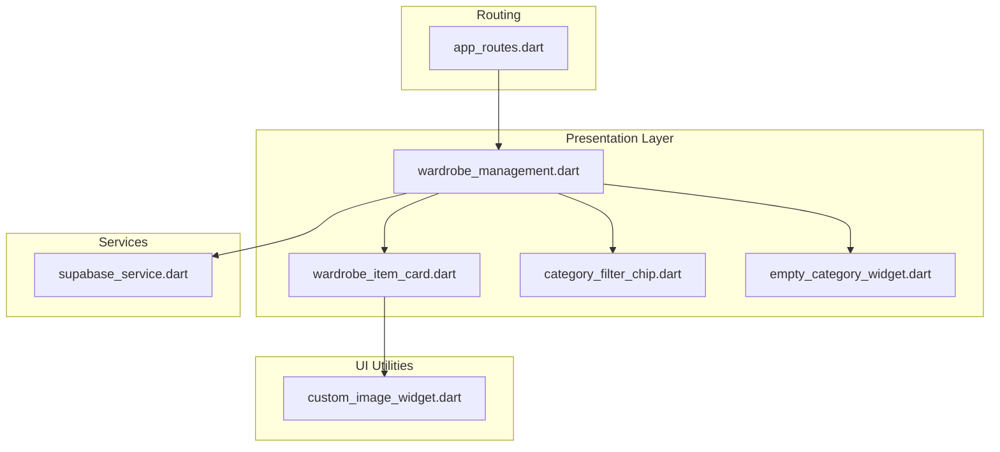
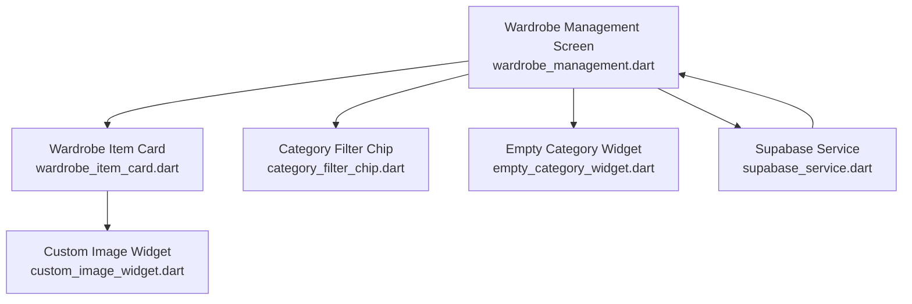
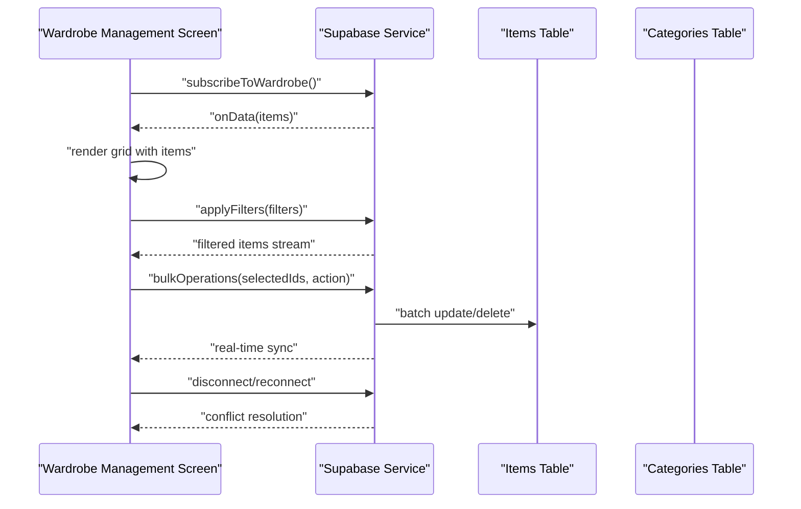
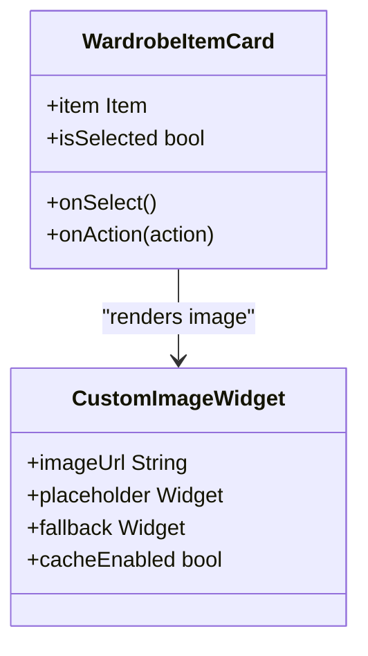
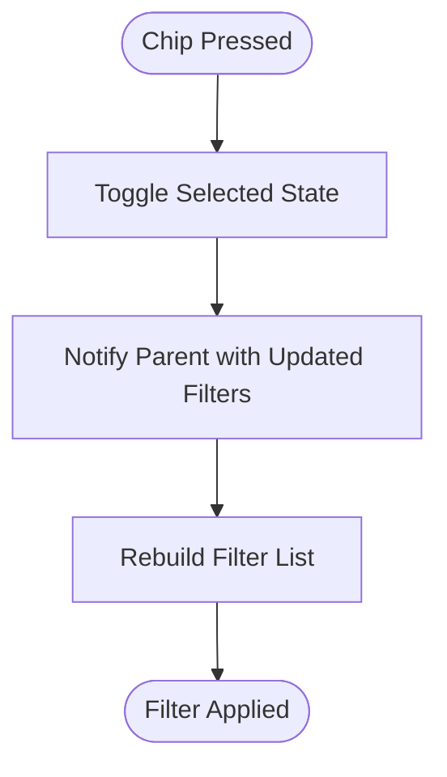
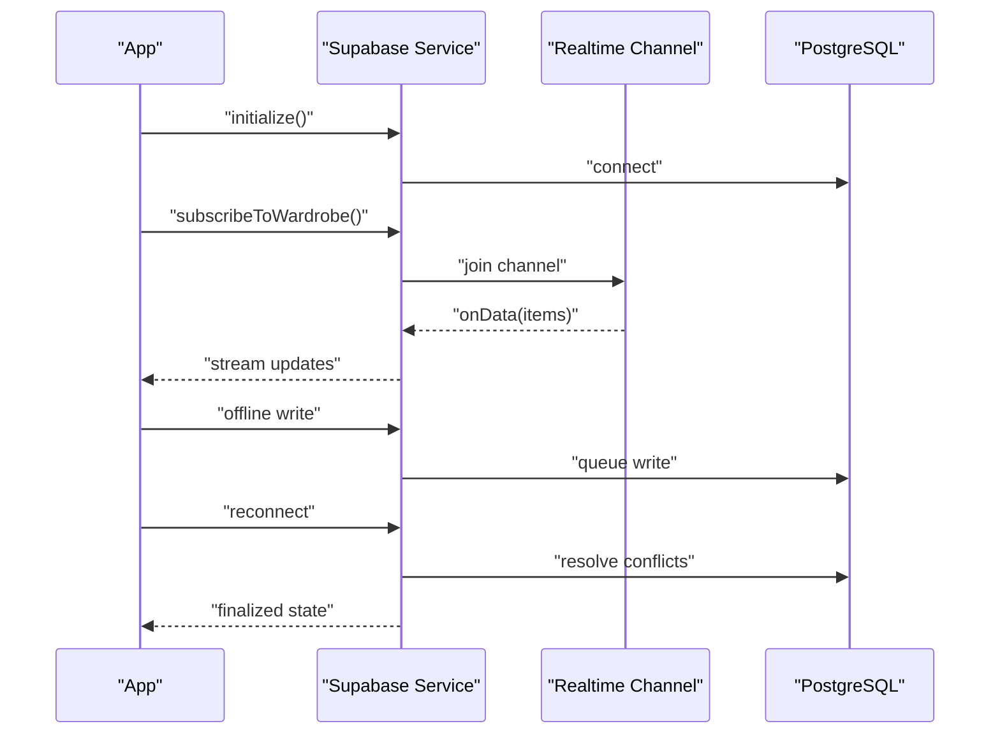
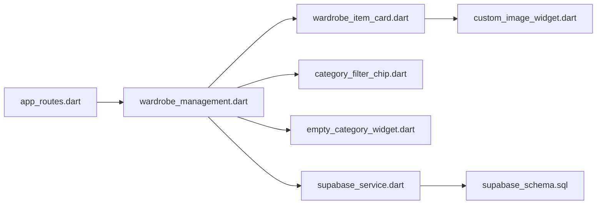

# Wardrobe Management

<cite>
**Referenced Files in This Document**
- [wardrobe_management.dart](file://lib/presentation/wardrobe_management/wardrobe_management.dart)
- [wardrobe_item_card.dart](file://lib/presentation/wardrobe_management/widgets/wardrobe_item_card.dart)
- [category_filter_chip.dart](file://lib/presentation/wardrobe_management/widgets/category_filter_chip.dart)
- [empty_category_widget.dart](file://lib/presentation/wardrobe_management/widgets/empty_category_widget.dart)
- [supabase_service.dart](file://lib/services/supabase_service.dart)
- [custom_image_widget.dart](file://lib/widgets/custom_image_widget.dart)
- [app_routes.dart](file://lib/routes/app_routes.dart)
- [main.dart](file://lib/main.dart)
- [supabase_schema.sql](file://supabase_schema.sql)
</cite>

## Table of Contents
1. [Introduction](#introduction)
2. [Project Structure](#project-structure)
3. [Core Components](#core-components)
4. [Architecture Overview](#architecture-overview)
5. [Detailed Component Analysis](#detailed-component-analysis)
6. [Dependency Analysis](#dependency-analysis)
7. [Performance Considerations](#performance-considerations)
8. [Troubleshooting Guide](#troubleshooting-guide)
9. [Conclusion](#conclusion)
10. [Appendices](#appendices)

## Introduction
This document describes the Wardrobe Management system, a digital wardrobe organization feature. It covers the item catalog implementation, category-based organization, filter chips for filtering, the wardrobe item card widget (image display, metadata, and interactive actions), search and sorting capabilities, bulk operations, Supabase integration for real-time synchronization and offline data management, empty state handling, category management, item categorization workflows, responsive grid layouts, touch interactions, accessibility features, data validation, image optimization, and storage management for large datasets.

## Project Structure
The wardrobe management feature is organized under the presentation layer with dedicated widgets and a main screen controller. Services handle Supabase integration, while reusable UI components support image rendering and routing integrates the feature into the app.

**Diagram sources**
- [wardrobe_management.dart](file://lib/presentation/wardrobe_management/wardrobe_management.dart#L1-L200)
- [wardrobe_item_card.dart](file://lib/presentation/wardrobe_management/widgets/wardrobe_item_card.dart#L1-L200)
- [category_filter_chip.dart](file://lib/presentation/wardrobe_management/widgets/category_filter_chip.dart#L1-L200)
- [empty_category_widget.dart](file://lib/presentation/wardrobe_management/widgets/empty_category_widget.dart#L1-L200)
- [supabase_service.dart](file://lib/services/supabase_service.dart#L1-L200)
- [custom_image_widget.dart](file://lib/widgets/custom_image_widget.dart#L1-L200)
- [app_routes.dart](file://lib/routes/app_routes.dart#L1-L200)

**Section sources**
- [wardrobe_management.dart](file://lib/presentation/wardrobe_management/wardrobe_management.dart#L1-L200)
- [app_routes.dart](file://lib/routes/app_routes.dart#L1-L200)

## Core Components
- Wardrobe Management Screen: Orchestrates item catalog display, filters, search, sorting, and bulk operations. Manages reactive state updates and real-time synchronization via Supabase.
- Wardrobe Item Card Widget: Renders individual items with image, metadata, and interactive actions (e.g., edit, delete, toggle favorite).
- Category Filter Chip: Provides category-based filtering with multi-selection support and dynamic chip generation.
- Empty Category Widget: Displays contextual guidance and actions when a selected category has no items.
- Supabase Service: Handles authentication, real-time subscriptions, offline caching, and conflict resolution strategies.
- Custom Image Widget: Optimizes image loading, caching, and fallback handling for large wardrobe datasets.

**Section sources**
- [wardrobe_management.dart](file://lib/presentation/wardrobe_management/wardrobe_management.dart#L1-L200)
- [wardrobe_item_card.dart](file://lib/presentation/wardrobe_management/widgets/wardrobe_item_card.dart#L1-L200)
- [category_filter_chip.dart](file://lib/presentation/wardrobe_management/widgets/category_filter_chip.dart#L1-L200)
- [empty_category_widget.dart](file://lib/presentation/wardrobe_management/widgets/empty_category_widget.dart#L1-L200)
- [supabase_service.dart](file://lib/services/supabase_service.dart#L1-L200)
- [custom_image_widget.dart](file://lib/widgets/custom_image_widget.dart#L1-L200)

## Architecture Overview
The system follows a reactive architecture with a presentation controller managing state and UI composition, widgets encapsulating UI concerns, and a service layer abstracting Supabase operations. Real-time synchronization is achieved through Supabase subscriptions, with offline-first strategies and conflict resolution policies.

**Diagram sources**
- [wardrobe_management.dart](file://lib/presentation/wardrobe_management/wardrobe_management.dart#L1-L200)
- [wardrobe_item_card.dart](file://lib/presentation/wardrobe_management/widgets/wardrobe_item_card.dart#L1-L200)
- [category_filter_chip.dart](file://lib/presentation/wardrobe_management/widgets/category_filter_chip.dart#L1-L200)
- [empty_category_widget.dart](file://lib/presentation/wardrobe_management/widgets/empty_category_widget.dart#L1-L200)
- [supabase_service.dart](file://lib/services/supabase_service.dart#L1-L200)
- [custom_image_widget.dart](file://lib/widgets/custom_image_widget.dart#L1-L200)

## Detailed Component Analysis

### Wardrobe Management Screen
Responsibilities:
- Item catalog display with responsive grid layout.
- Search and sorting controls.
- Bulk operations (select multiple items, batch delete, update categories).
- Category-based filtering using filter chips.
- Empty state handling per category.
- Integration with Supabase for real-time updates and offline persistence.

Key behaviors:
- Reactive state management for items, filters, search term, sort criteria, and selection set.
- Real-time subscription to wardrobe items and category metadata.
- Offline-first caching with optimistic updates and conflict resolution on reconnect.
- Responsive grid adapting to device width and orientation.

**Diagram sources**
- [wardrobe_management.dart](file://lib/presentation/wardrobe_management/wardrobe_management.dart#L1-L200)
- [supabase_service.dart](file://lib/services/supabase_service.dart#L1-L200)

**Section sources**
- [wardrobe_management.dart](file://lib/presentation/wardrobe_management/wardrobe_management.dart#L1-L200)
- [supabase_service.dart](file://lib/services/supabase_service.dart#L1-L200)

### Wardrobe Item Card Widget
Responsibilities:
- Display item image via optimized image widget.
- Present metadata (name, category, color, season, last worn date).
- Provide interactive actions (edit, delete, favorite toggle).
- Support selection for bulk operations.

Implementation highlights:
- Uses custom image widget for lazy loading, caching, and fallback handling.
- Touch targets sized for accessibility; supports long-press for selection.
- Metadata truncation and ellipsis for readability on small screens.

**Diagram sources**
- [wardrobe_item_card.dart](file://lib/presentation/wardrobe_management/widgets/wardrobe_item_card.dart#L1-L200)
- [custom_image_widget.dart](file://lib/widgets/custom_image_widget.dart#L1-L200)

**Section sources**
- [wardrobe_item_card.dart](file://lib/presentation/wardrobe_management/widgets/wardrobe_item_card.dart#L1-L200)
- [custom_image_widget.dart](file://lib/widgets/custom_image_widget.dart#L1-L200)

### Category Filter Chip
Responsibilities:
- Dynamically render chips for each category.
- Toggle selection state for multi-category filtering.
- Emit filter changes to the parent screen.

Implementation highlights:
- Stateless chip widget with callback for selection changes.
- Visual feedback for selected/unselected states.
- Responsive wrapping to fit available width.

**Diagram sources**
- [category_filter_chip.dart](file://lib/presentation/wardrobe_management/widgets/category_filter_chip.dart#L1-L200)

**Section sources**
- [category_filter_chip.dart](file://lib/presentation/wardrobe_management/widgets/category_filter_chip.dart#L1-L200)

### Empty Category Widget
Responsibilities:
- Inform users when a selected category has no items.
- Provide actionable guidance (add new item, change category, browse suggestions).

Implementation highlights:
- Clear messaging and iconography.
- Single tap action to navigate to add item flow.
- Accessible contrast and readable text sizes.

**Section sources**
- [empty_category_widget.dart](file://lib/presentation/wardrobe_management/widgets/empty_category_widget.dart#L1-L200)

### Supabase Service Integration
Responsibilities:
- Authentication and session management.
- Real-time subscriptions for items and categories.
- Offline caching with optimistic writes and conflict resolution.
- Conflict resolution strategies (last-writer-wins, merge, manual override).

Key patterns:
- Stream-based updates for immediate UI refresh.
- Local cache for offline availability.
- Conflict detection and resolution on reconnection.

**Diagram sources**
- [supabase_service.dart](file://lib/services/supabase_service.dart#L1-L200)

**Section sources**
- [supabase_service.dart](file://lib/services/supabase_service.dart#L1-L200)
- [supabase_schema.sql](file://supabase_schema.sql#L1-L200)

## Dependency Analysis
- Presentation depends on service layer for data and real-time updates.
- Widgets depend on shared UI utilities for image rendering.
- Routing integrates the wardrobe screen into the app navigation.
- Supabase schema defines tables and relationships for items and categories.

**Diagram sources**
- [app_routes.dart](file://lib/routes/app_routes.dart#L1-L200)
- [wardrobe_management.dart](file://lib/presentation/wardrobe_management/wardrobe_management.dart#L1-L200)
- [wardrobe_item_card.dart](file://lib/presentation/wardrobe_management/widgets/wardrobe_item_card.dart#L1-L200)
- [category_filter_chip.dart](file://lib/presentation/wardrobe_management/widgets/category_filter_chip.dart#L1-L200)
- [empty_category_widget.dart](file://lib/presentation/wardrobe_management/widgets/empty_category_widget.dart#L1-L200)
- [supabase_service.dart](file://lib/services/supabase_service.dart#L1-L200)
- [custom_image_widget.dart](file://lib/widgets/custom_image_widget.dart#L1-L200)
- [supabase_schema.sql](file://supabase_schema.sql#L1-L200)

**Section sources**
- [app_routes.dart](file://lib/routes/app_routes.dart#L1-L200)
- [supabase_schema.sql](file://supabase_schema.sql#L1-L200)

## Performance Considerations
- Virtualized lists or grid rendering to handle large item sets efficiently.
- Image optimization: lazy loading, caching, progressive loading, and fallbacks.
- Debounced search input to reduce query frequency.
- Batch operations for bulk updates to minimize network requests.
- Offline-first caching with incremental sync to reduce latency.
- Conflict resolution strategies to avoid stale reads after offline edits.

[No sources needed since this section provides general guidance]

## Troubleshooting Guide
Common issues and resolutions:
- Items not updating in real-time: Verify subscription initialization and channel join status.
- Images not loading: Check image URL validity, network connectivity, and fallback rendering.
- Filters not applying: Confirm filter state propagation and stream rebinding.
- Conflicts after offline edits: Review conflict resolution policy and reconcile user intent.
- Empty category state persists: Ensure category change triggers reload and empty state reset.

**Section sources**
- [supabase_service.dart](file://lib/services/supabase_service.dart#L1-L200)
- [wardrobe_management.dart](file://lib/presentation/wardrobe_management/wardrobe_management.dart#L1-L200)
- [custom_image_widget.dart](file://lib/widgets/custom_image_widget.dart#L1-L200)

## Conclusion
The Wardrobe Management system provides a robust, responsive, and accessible solution for organizing digital wardrobes. It leverages Supabase for real-time synchronization and offline-first experiences, while modular widgets enable maintainable UI composition. The design balances usability with scalability, supporting large datasets through optimized rendering and efficient data management.

[No sources needed since this section summarizes without analyzing specific files]

## Appendices

### Data Validation and Storage Management
- Validation: Enforce required fields (name, category) and acceptable ranges (season, colors). Sanitize inputs and reject invalid images.
- Storage: Use image compression and progressive loading. Cache frequently accessed images locally. Implement pagination or virtualization for large catalogs.

[No sources needed since this section provides general guidance]

### Accessibility Features
- Touch target sizing and spacing for easy selection.
- High contrast and readable typography.
- VoiceOver support for labels and actions.
- Keyboard navigation for desktop/tablet builds.

[No sources needed since this section provides general guidance]

### Responsive Grid Layout and Touch Interactions
- Grid adapts column count based on viewport width.
- Touch gestures: tap to select, long press for context menu, swipe for quick actions.
- Orientation changes trigger grid recalculation.

[No sources needed since this section provides general guidance]