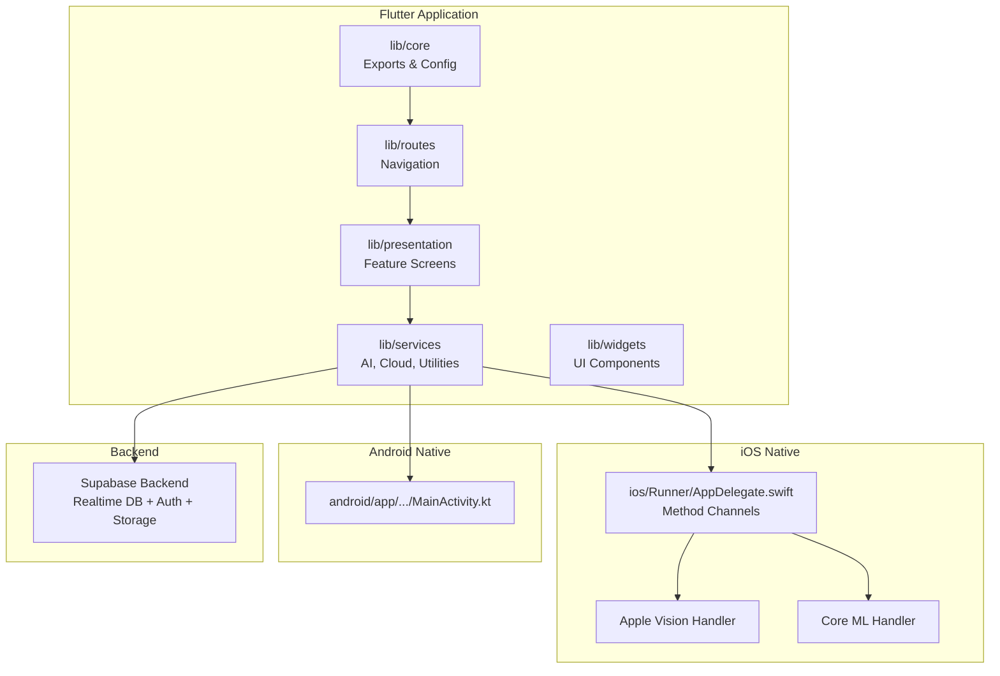
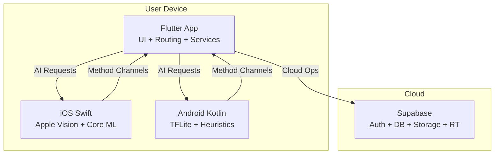
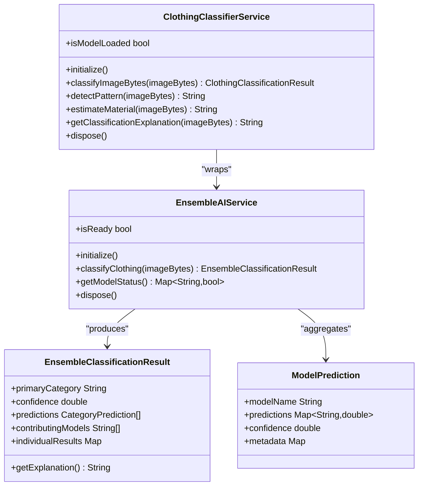
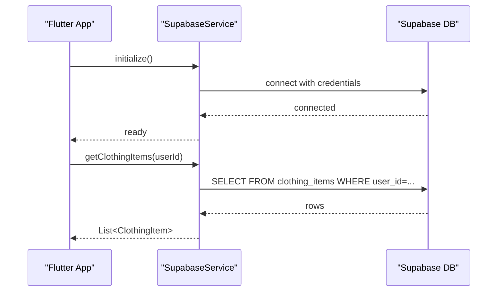
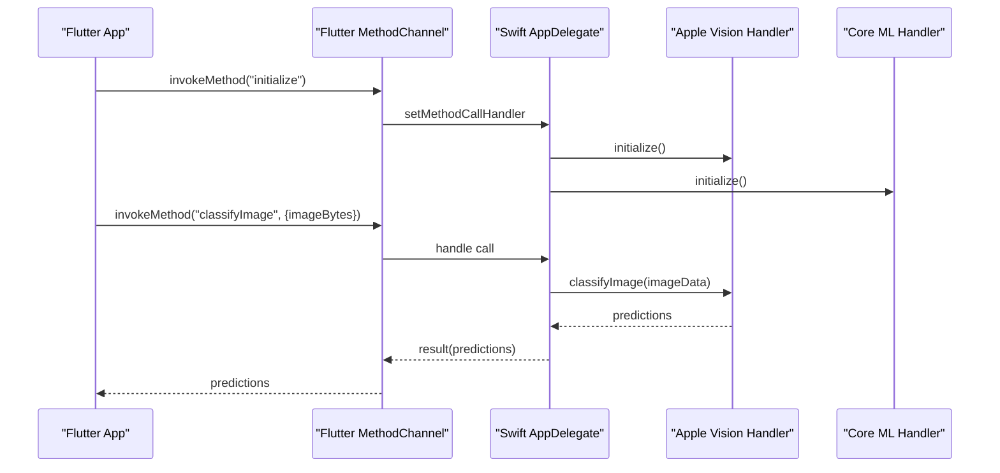
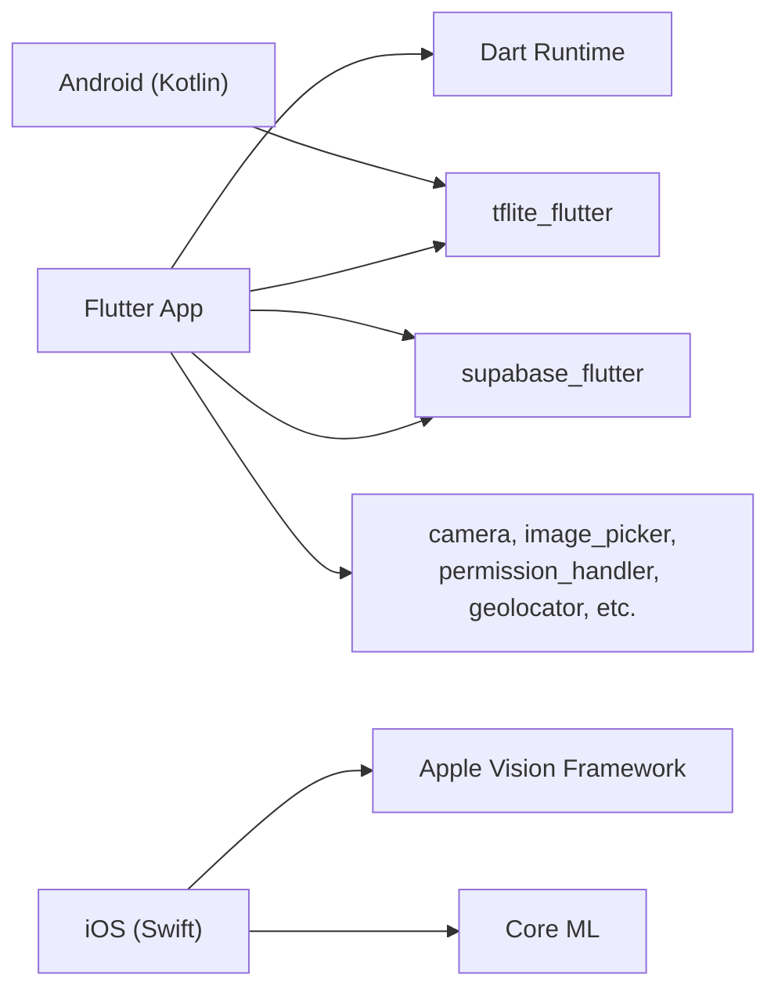

# Project Overview

<cite>
**Referenced Files in This Document**
- [README.md](file://README.md)
- [pubspec.yaml](file://pubspec.yaml)
- [lib/main.dart](file://lib/main.dart)
- [lib/routes/app_routes.dart](file://lib/routes/app_routes.dart)
- [lib/core/app_export.dart](file://lib/core/app_export.dart)
- [lib/services/supabase_service.dart](file://lib/services/supabase_service.dart)
- [lib/services/ensemble_ai_service.dart](file://lib/services/ensemble_ai_service.dart)
- [lib/services/clothing_classifier_service.dart](file://lib/services/clothing_classifier_service.dart)
- [ios/Runner/AppDelegate.swift](file://ios/Runner/AppDelegate.swift)
- [android/app/src/main/kotlin/com/prismstyle_ai/app/MainActivity.kt](file://android/app/src/main/kotlin/com/prismstyle_ai/app/MainActivity.kt)
</cite>

## Table of Contents
1. [Introduction](#introduction)
2. [Project Structure](#project-structure)
3. [Core Components](#core-components)
4. [Architecture Overview](#architecture-overview)
5. [Detailed Component Analysis](#detailed-component-analysis)
6. [Dependency Analysis](#dependency-analysis)
7. [Performance Considerations](#performance-considerations)
8. [Troubleshooting Guide](#troubleshooting-guide)
9. [Conclusion](#conclusion)

## Introduction
PrismStyle AI is an AI-powered fashion companion designed to help users manage their wardrobes intelligently, recognize clothing items, and generate stylish outfit suggestions. It emphasizes privacy-first and offline-first principles, enabling users to capture images via the camera, analyze them locally using on-device machine learning, and organize digital wardrobes with minimal data leakage. The application supports iOS 18+ and Android, delivering a seamless cross-platform experience powered by Flutter.

Key value propositions:
- Smart wardrobe management with AI-driven categorization and tagging
- Clothing recognition leveraging a multi-model ensemble (TFLite, Apple Vision, Core ML, and heuristic analysis)
- Outfit generation guided by weather and personal style preferences
- Zero-cost AI classification using free Apple frameworks plus optional custom TFLite models
- Privacy-first and offline-first design with local processing and opt-in cloud sync

Target audience:
- Fashion-conscious individuals who want a private, offline-capable wardrobe assistant
- Users seeking intelligent outfit suggestions based on weather and style
- Developers and makers interested in a production-ready Flutter + native integration example

## Project Structure
The project follows a layered, feature-based structure:
- lib/core: foundational exports and app configuration
- lib/presentation: UI screens organized by feature (dashboard, wardrobe, generator, profile, etc.)
- lib/services: business logic and integrations (AI, Supabase, weather, notifications)
- lib/routes: centralized navigation
- lib/widgets/theme: reusable UI components and design system
- ios/Runner: iOS native integration (Swift) for Apple Vision and Core ML
- android/app: Android entrypoint and Gradle configuration
- assets/models: on-device ML models and configuration
- Root docs and scripts: setup guides, environment configuration, and training assets

**Diagram sources**
- [lib/main.dart](file://lib/main.dart#L12-L65)
- [lib/routes/app_routes.dart](file://lib/routes/app_routes.dart#L14-L42)
- [lib/services/supabase_service.dart](file://lib/services/supabase_service.dart#L40-L63)
- [ios/Runner/AppDelegate.swift](file://ios/Runner/AppDelegate.swift#L11-L27)
- [android/app/src/main/kotlin/com/prismstyle_ai/app/MainActivity.kt](file://android/app/src/main/kotlin/com/prismstyle_ai/app/MainActivity.kt#L1-L7)

**Section sources**
- [README.md](file://README.md#L133-L159)
- [lib/main.dart](file://lib/main.dart#L12-L65)
- [lib/routes/app_routes.dart](file://lib/routes/app_routes.dart#L14-L42)

## Core Components
- Cross-platform entry and initialization:
  - Application bootstraps Supabase, local notifications, and AI classifier during startup, sets orientation lock, and defines global routes and themes.
- AI ensemble engine:
  - Orchestrates multiple classification models (TFLite, Apple Vision, Core ML) and a heuristic baseline, combining results with weighted voting for robust predictions.
- Cloud synchronization:
  - Supabase service manages user profiles, wardrobe items, saved outfits, friend relationships, and real-time subscriptions for synchronized experiences.
- Navigation and routing:
  - Centralized route definitions enable modular screen composition across dashboard, wardrobe, generator, and profile areas.
- iOS native integration:
  - Swift AppDelegate registers Flutter channels for Apple Vision and Core ML, enabling zero-cost classification on supported devices.

**Section sources**
- [lib/main.dart](file://lib/main.dart#L12-L65)
- [lib/services/ensemble_ai_service.dart](file://lib/services/ensemble_ai_service.dart#L17-L54)
- [lib/services/supabase_service.dart](file://lib/services/supabase_service.dart#L16-L63)
- [lib/routes/app_routes.dart](file://lib/routes/app_routes.dart#L14-L42)
- [ios/Runner/AppDelegate.swift](file://ios/Runner/AppDelegate.swift#L11-L27)

## Architecture Overview
High-level system architecture:
- Flutter application handles UI, navigation, and orchestrates services.
- Native iOS integration (Swift) exposes Apple Vision and Core ML via Flutter channels for on-device classification.
- Android relies on TFLite and heuristic analysis for on-device inference.
- Supabase backend provides authentication, relational database, object storage, and real-time subscriptions.

**Diagram sources**
- [lib/main.dart](file://lib/main.dart#L12-L65)
- [ios/Runner/AppDelegate.swift](file://ios/Runner/AppDelegate.swift#L35-L97)
- [lib/services/supabase_service.dart](file://lib/services/supabase_service.dart#L40-L63)

## Detailed Component Analysis

### AI Ensemble Classification Engine
The Ensemble AI Service coordinates multiple classification models:
- TFLite model (optional custom DeepFashion2 or fallback)
- Apple Vision and Core ML (iOS only, free Apple frameworks)
- Heuristic analysis (baseline always available)
- Weighted combination for final prediction

**Diagram sources**
- [lib/services/ensemble_ai_service.dart](file://lib/services/ensemble_ai_service.dart#L17-L531)
- [lib/services/clothing_classifier_service.dart](file://lib/services/clothing_classifier_service.dart#L9-L131)

**Section sources**
- [lib/services/ensemble_ai_service.dart](file://lib/services/ensemble_ai_service.dart#L17-L531)
- [lib/services/clothing_classifier_service.dart](file://lib/services/clothing_classifier_service.dart#L9-L131)

### Supabase Backend Integration
SupabaseService initializes the client, loads environment variables, and provides:
- User profiles and style preferences
- Wardrobe items CRUD and category filtering
- Outfit creation, saving, and deletion
- Friend relationships and feedback
- Real-time subscriptions for synchronized updates

**Diagram sources**
- [lib/main.dart](file://lib/main.dart#L15-L21)
- [lib/services/supabase_service.dart](file://lib/services/supabase_service.dart#L40-L63)
- [lib/services/supabase_service.dart](file://lib/services/supabase_service.dart#L118-L133)

**Section sources**
- [lib/services/supabase_service.dart](file://lib/services/supabase_service.dart#L16-L448)

### iOS Native Integration (Swift)
The iOS AppDelegate registers two Flutter method channels:
- com.prismstyle_ai/apple_vision for Apple Vision Framework classification
- com.prismstyle_ai/coreml for Core ML classification

**Diagram sources**
- [ios/Runner/AppDelegate.swift](file://ios/Runner/AppDelegate.swift#L35-L97)

**Section sources**
- [ios/Runner/AppDelegate.swift](file://ios/Runner/AppDelegate.swift#L11-L27)
- [ios/Runner/AppDelegate.swift](file://ios/Runner/AppDelegate.swift#L35-L97)

### Android Native Entry Point
Android uses a standard FlutterFragmentActivity entry point, integrating with the Flutter runtime and platform plugins.

**Section sources**
- [android/app/src/main/kotlin/com/prismstyle_ai/app/MainActivity.kt](file://android/app/src/main/kotlin/com/prismstyle_ai/app/MainActivity.kt#L1-L7)

## Dependency Analysis
Technology stack highlights:
- Frontend: Flutter 3.38.4 with Dart
- AI/ML: TensorFlow Lite, Apple Vision Framework, Apple Core ML
- Backend: Supabase (realtime DB, auth, storage)
- Utilities: image processing, location/weather, notifications, secure storage
- Platform: iOS 18+, Android 8.0+

**Diagram sources**
- [pubspec.yaml](file://pubspec.yaml#L9-L55)
- [ios/Runner/AppDelegate.swift](file://ios/Runner/AppDelegate.swift#L18-L21)
- [lib/services/ensemble_ai_service.dart](file://lib/services/ensemble_ai_service.dart#L6-L7)

**Section sources**
- [pubspec.yaml](file://pubspec.yaml#L9-L76)
- [README.md](file://README.md#L16-L25)

## Performance Considerations
- AI classification speed varies by device class, with sub-50ms inference on modern iOS devices and reasonable Android performance depending on hardware.
- Accuracy improves with all models enabled; baseline heuristics still provide useful results without training.
- On-device processing minimizes latency and enhances privacy.

[No sources needed since this section provides general guidance]

## Troubleshooting Guide
Common issues and resolutions:
- Flutter command not found: use FVM prefix for commands if configured.
- iOS build failures: deintegrate CocoaPods, reinstall pods, then clean Flutter cache and pub get.
- TFLite model not loading: ensure model assets are included in pubspec.yaml under assets/models/.
- Apple frameworks not working: verify iOS 13+ requirement, test on real device, check Xcode console logs.

**Section sources**
- [README.md](file://README.md#L210-L240)

## Conclusion
PrismStyle AI delivers a privacy-centric, offline-capable fashion companion with powerful AI-driven wardrobe management and outfit generation. Its cross-platform Flutter architecture integrates seamlessly with native iOS capabilities while maintaining Android compatibility. The ensemble AI strategy ensures high accuracy without ongoing costs, and Supabase enables scalable, real-time cloud features. Positioned at the intersection of personal style and intelligent automation, PrismStyle AI offers a practical solution for users seeking a modern, private, and efficient wardrobe assistant.