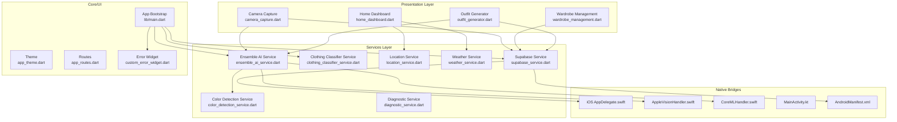
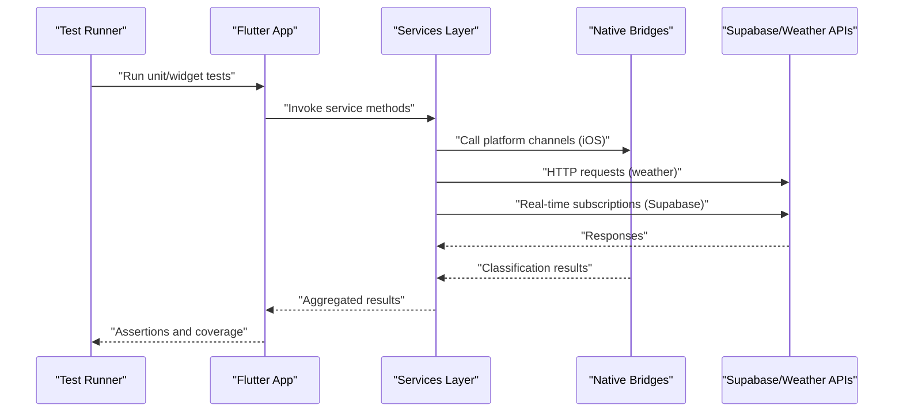
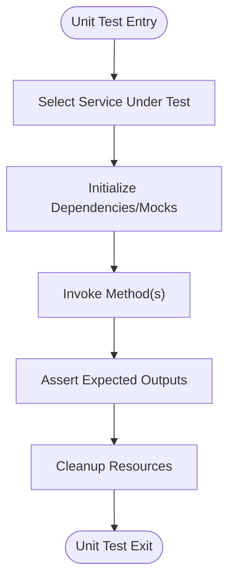
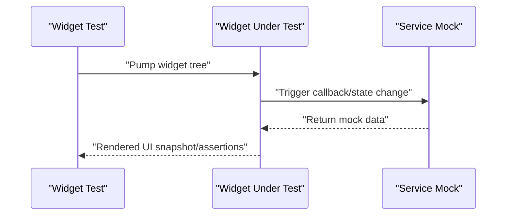
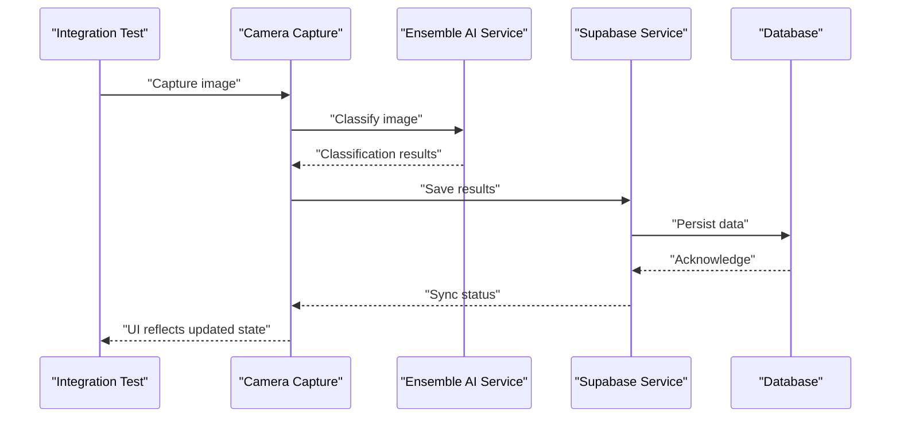
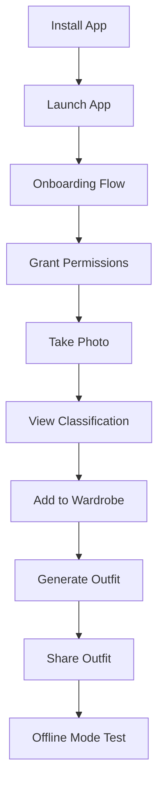
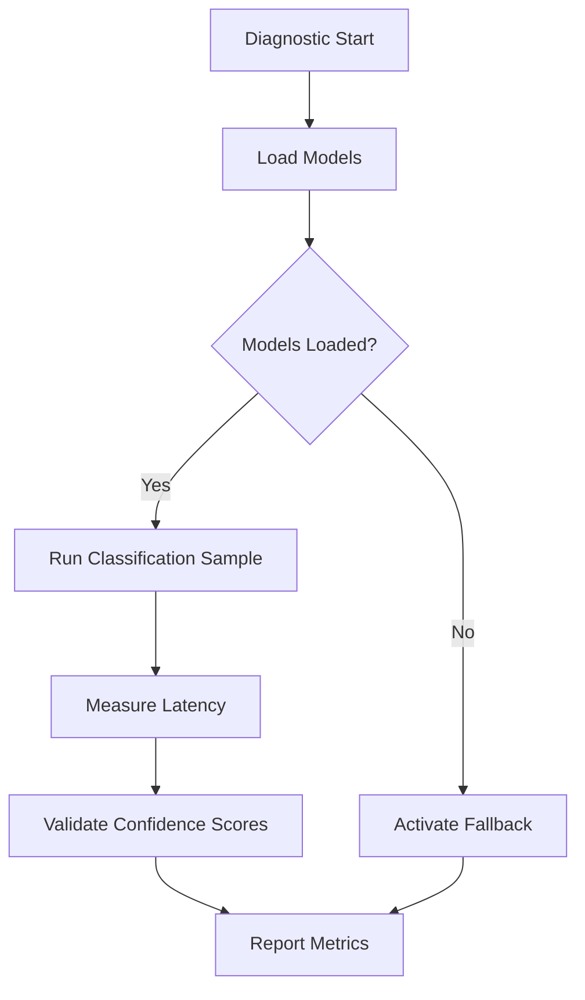
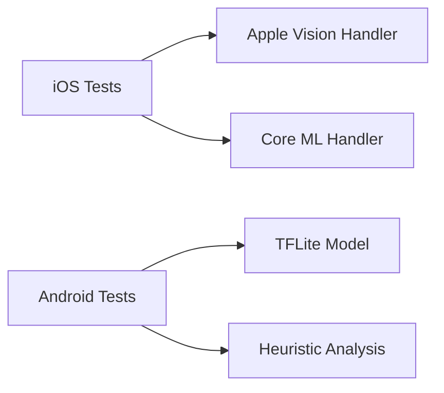
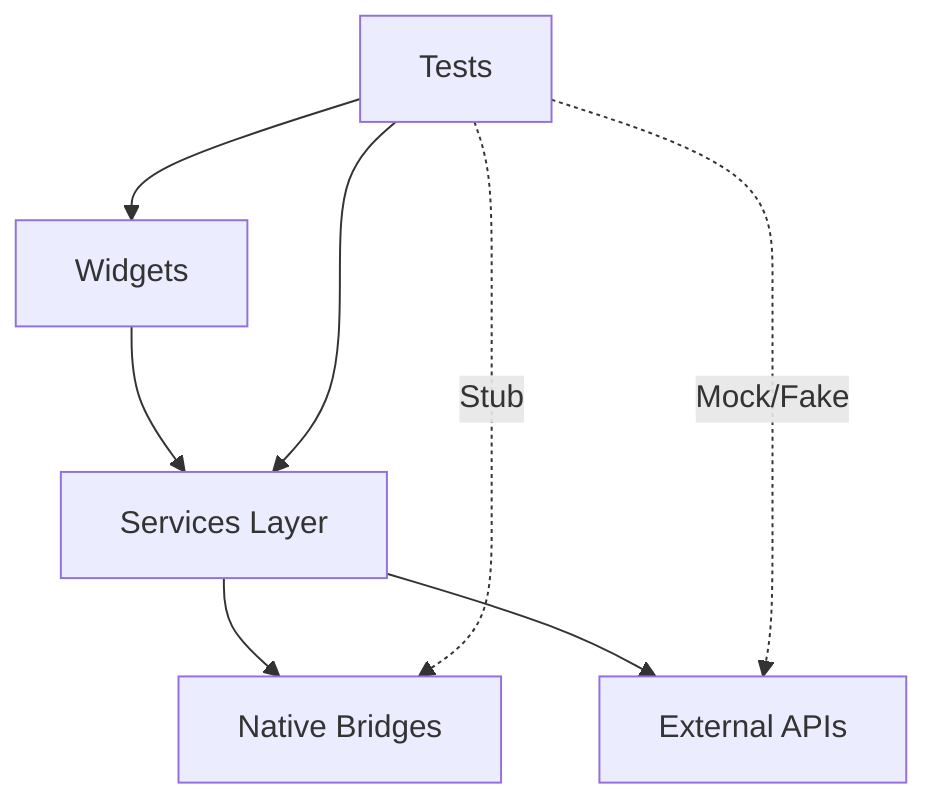

# Testing Strategy

<cite>
**Referenced Files in This Document**
- [README.md](file://README.md)
- [TESTING_CHECKLIST.md](file://TESTING_CHECKLIST.md)
- [pubspec.yaml](file://pubspec.yaml)
- [lib/main.dart](file://lib/main.dart)
- [lib/services/diagnostic_service.dart](file://lib/services/diagnostic_service.dart)
- [lib/services/ensemble_ai_service.dart](file://lib/services/ensemble_ai_service.dart)
- [lib/services/clothing_classifier_service.dart](file://lib/services/clothing_classifier_service.dart)
- [lib/services/color_detection_service.dart](file://lib/services/color_detection_service.dart)
- [lib/services/location_service.dart](file://lib/services/location_service.dart)
- [lib/services/weather_service.dart](file://lib/services/weather_service.dart)
- [lib/services/supabase_service.dart](file://lib/services/supabase_service.dart)
- [lib/presentation/camera_capture/camera_capture.dart](file://lib/presentation/camera_capture/camera_capture.dart)
- [lib/presentation/camera_capture/widgets/camera_overlay_widget.dart](file://lib/presentation/camera_capture/widgets/camera_overlay_widget.dart)
- [lib/presentation/camera_capture/widgets/capture_controls_widget.dart](file://lib/presentation/camera_capture/widgets/capture_controls_widget.dart)
- [lib/presentation/camera_capture/widgets/item_details_widget.dart](file://lib/presentation/camera_capture/widgets/item_details_widget.dart)
- [lib/presentation/camera_capture/widgets/processing_overlay_widget.dart](file://lib/presentation/camera_capture/widgets/processing_overlay_widget.dart)
- [lib/presentation/home_dashboard/home_dashboard.dart](file://lib/presentation/home_dashboard/home_dashboard.dart)
- [lib/presentation/home_dashboard/widgets/outfit_recommendation_card_widget.dart](file://lib/presentation/home_dashboard/widgets/outfit_recommendation_card_widget.dart)
- [lib/presentation/home_dashboard/widgets/recent_favorite_card_widget.dart](file://lib/presentation/home_dashboard/widgets/recent_favorite_card_widget.dart)
- [lib/presentation/home_dashboard/widgets/trending_style_card_widget.dart](file://lib/presentation/home_dashboard/widgets/trending_style_card_widget.dart)
- [lib/presentation/home_dashboard/widgets/weather_card_widget.dart](file://lib/presentation/home_dashboard/widgets/weather_card_widget.dart)
- [lib/presentation/wardrobe_management/wardrobe_management.dart](file://lib/presentation/wardrobe_management/wardrobe_management.dart)
- [lib/presentation/wardrobe_management/widgets/wardrobe_item_card.dart](file://lib/presentation/wardrobe_management/widgets/wardrobe_item_card.dart)
- [lib/presentation/outfit_generator/outfit_generator.dart](file://lib/presentation/outfit_generator/outfit_generator.dart)
- [lib/presentation/outfit_generator/widgets/action_bar_widget.dart](file://lib/presentation/outfit_generator/widgets/action_bar_widget.dart)
- [lib/presentation/outfit_generator/widgets/category_carousel_widget.dart](file://lib/presentation/outfit_generator/widgets/category_carousel_widget.dart)
- [lib/presentation/outfit_generator/widgets/compatibility_score_widget.dart](file://lib/presentation/outfit_generator/widgets/compatibility_score_widget.dart)
- [lib/presentation/outfit_generator/widgets/outfit_preview_widget.dart](file://lib/presentation/outfit_generator/widgets/outfit_preview_widget.dart)
- [lib/presentation/outfit_generator/widgets/weather_widget.dart](file://lib/presentation/outfit_generator/widgets/weather_widget.dart)
- [lib/routes/app_routes.dart](file://lib/routes/app_routes.dart)
- [lib/theme/app_theme.dart](file://lib/theme/app_theme.dart)
- [lib/widgets/custom_error_widget.dart](file://lib/widgets/custom_error_widget.dart)
- [lib/widgets/custom_app_bar.dart](file://lib/widgets/custom_app_bar.dart)
- [lib/widgets/custom_bottom_bar.dart](file://lib/widgets/custom_bottom_bar.dart)
- [lib/widgets/custom_icon_widget.dart](file://lib/widgets/custom_icon_widget.dart)
- [lib/widgets/custom_image_widget.dart](file://lib/widgets/custom_image_widget.dart)
- [ios/Runner/AppDelegate.swift](file://ios/Runner/AppDelegate.swift)
- [ios/Runner/AppleVisionHandler.swift](file://ios/Runner/AppleVisionHandler.swift)
- [ios/Runner/CoreMLHandler.swift](file://ios/Runner/CoreMLHandler.swift)
- [android/app/src/main/kotlin/com/prismstyle_ai/app/MainActivity.kt](file://android/app/src/main/kotlin/com/prismstyle_ai/app/MainActivity.kt)
- [android/app/src/main/AndroidManifest.xml](file://android/app/src/main/AndroidManifest.xml)
</cite>

## Table of Contents
1. [Introduction](#introduction)
2. [Project Structure](#project-structure)
3. [Core Components](#core-components)
4. [Architecture Overview](#architecture-overview)
5. [Detailed Component Analysis](#detailed-component-analysis)
6. [Dependency Analysis](#dependency-analysis)
7. [Performance Considerations](#performance-considerations)
8. [Troubleshooting Guide](#troubleshooting-guide)
9. [Conclusion](#conclusion)
10. [Appendices](#appendices)

## Introduction
This document defines PrismStyle AI’s comprehensive testing strategy across unit, widget, integration, and end-to-end testing layers. It covers testing frameworks, organization patterns, continuous integration practices, diagnostic service validation, native platform integration testing (camera, Apple Vision/Core ML, Supabase real-time), performance benchmarking, memory leak detection, and battery usage testing. It also provides best practices for Flutter applications, mock data strategies, automated pipelines, and troubleshooting guidance.

## Project Structure
PrismStyle AI follows a Flutter-centric structure with clear separation of concerns:
- Presentation layer: Screens and widgets organized by feature areas (camera capture, home dashboard, wardrobe management, outfit generation).
- Services layer: Business logic and integrations (AI classification, color detection, location, weather, Supabase).
- Core/UI utilities: App bootstrap, theme, routes, and error handling.
- Native platform bridges: iOS Swift handlers for Apple Vision and Core ML; Android Kotlin entry point.

**Diagram sources**
- [lib/main.dart](file://lib/main.dart#L12-L65)
- [lib/services/ensemble_ai_service.dart](file://lib/services/ensemble_ai_service.dart)
- [lib/services/clothing_classifier_service.dart](file://lib/services/clothing_classifier_service.dart)
- [lib/services/color_detection_service.dart](file://lib/services/color_detection_service.dart)
- [lib/services/location_service.dart](file://lib/services/location_service.dart)
- [lib/services/weather_service.dart](file://lib/services/weather_service.dart)
- [lib/services/supabase_service.dart](file://lib/services/supabase_service.dart)
- [lib/services/diagnostic_service.dart](file://lib/services/diagnostic_service.dart)
- [lib/presentation/camera_capture/camera_capture.dart](file://lib/presentation/camera_capture/camera_capture.dart)
- [lib/presentation/home_dashboard/home_dashboard.dart](file://lib/presentation/home_dashboard/home_dashboard.dart)
- [lib/presentation/wardrobe_management/wardrobe_management.dart](file://lib/presentation/wardrobe_management/wardrobe_management.dart)
- [lib/presentation/outfit_generator/outfit_generator.dart](file://lib/presentation/outfit_generator/outfit_generator.dart)
- [ios/Runner/AppDelegate.swift](file://ios/Runner/AppDelegate.swift)
- [ios/Runner/AppleVisionHandler.swift](file://ios/Runner/AppleVisionHandler.swift)
- [ios/Runner/CoreMLHandler.swift](file://ios/Runner/CoreMLHandler.swift)
- [android/app/src/main/kotlin/com/prismstyle_ai/app/MainActivity.kt](file://android/app/src/main/kotlin/com/prismstyle_ai/app/MainActivity.kt)
- [android/app/src/main/AndroidManifest.xml](file://android/app/src/main/AndroidManifest.xml)

**Section sources**
- [README.md](file://README.md#L133-L159)
- [lib/main.dart](file://lib/main.dart#L12-L65)

## Core Components
This section outlines the primary testing targets and their roles in the testing strategy.

- Ensemble AI Service: Orchestrates multiple AI backends (TFLite, Apple Vision, Core ML, heuristics) and validates weighted voting and fallback behavior.
- Clothing Classifier Service: Initializes and manages AI classification lifecycle, including model loading and error handling.
- Color Detection Service: Validates color extraction and clustering for wardrobe categorization.
- Location and Weather Services: Validate GPS permission handling, geocoding, and weather API resilience.
- Supabase Service: Validates real-time subscriptions, authentication, and data persistence.
- Diagnostic Service: Provides diagnostic routines for AI model validation and performance measurement.
- Presentation Components: Camera capture UI, dashboard widgets, wardrobe cards, and outfit generator widgets require widget and integration tests.

**Section sources**
- [lib/services/ensemble_ai_service.dart](file://lib/services/ensemble_ai_service.dart)
- [lib/services/clothing_classifier_service.dart](file://lib/services/clothing_classifier_service.dart)
- [lib/services/color_detection_service.dart](file://lib/services/color_detection_service.dart)
- [lib/services/location_service.dart](file://lib/services/location_service.dart)
- [lib/services/weather_service.dart](file://lib/services/weather_service.dart)
- [lib/services/supabase_service.dart](file://lib/services/supabase_service.dart)
- [lib/services/diagnostic_service.dart](file://lib/services/diagnostic_service.dart)

## Architecture Overview
The testing architecture aligns with Flutter’s layered design and native platform integrations:

**Diagram sources**
- [lib/main.dart](file://lib/main.dart#L12-L65)
- [lib/services/ensemble_ai_service.dart](file://lib/services/ensemble_ai_service.dart)
- [lib/services/supabase_service.dart](file://lib/services/supabase_service.dart)
- [lib/services/weather_service.dart](file://lib/services/weather_service.dart)
- [ios/Runner/AppleVisionHandler.swift](file://ios/Runner/AppleVisionHandler.swift)
- [ios/Runner/CoreMLHandler.swift](file://ios/Runner/CoreMLHandler.swift)

## Detailed Component Analysis

### Unit Testing Strategy
- Framework: Flutter test harness with dart:io and mockito-like patterns.
- Organization: Group by feature/service under test/services and test/widgets.
- Coverage goals:
  - Ensemble AI Service: Initialization, model loading, weighted voting, error handling, fallback behavior.
  - Clothing Classifier Service: Initialization lifecycle and error handling.
  - Color Detection Service: Color extraction and clustering correctness.
  - Location/Weather Services: Permission handling, geocoding, caching, and offline behavior.
  - Supabase Service: Connection, subscription, authentication, and RLS enforcement.
  - Diagnostic Service: Model validation routines and performance measurement.

**Diagram sources**
- [TESTING_CHECKLIST.md](file://TESTING_CHECKLIST.md#L132-L154)

**Section sources**
- [TESTING_CHECKLIST.md](file://TESTING_CHECKLIST.md#L132-L154)

### Widget Testing Strategy
- Focus: Render and interaction validation for presentation components.
- Targets:
  - Camera capture widgets: overlays, controls, processing indicators.
  - Dashboard widgets: recommendation cards, favorites, trends, weather.
  - Wardrobe widgets: item cards and filters.
  - Outfit generator widgets: previews, compatibility scores, action bars.
- Approach: Use Flutter’s widget testing utilities to pump widgets, simulate gestures, and assert UI state transitions.

**Diagram sources**
- [lib/presentation/camera_capture/widgets/camera_overlay_widget.dart](file://lib/presentation/camera_capture/widgets/camera_overlay_widget.dart)
- [lib/presentation/camera_capture/widgets/capture_controls_widget.dart](file://lib/presentation/camera_capture/widgets/capture_controls_widget.dart)
- [lib/presentation/camera_capture/widgets/processing_overlay_widget.dart](file://lib/presentation/camera_capture/widgets/processing_overlay_widget.dart)
- [lib/presentation/home_dashboard/widgets/outfit_recommendation_card_widget.dart](file://lib/presentation/home_dashboard/widgets/outfit_recommendation_card_widget.dart)
- [lib/presentation/wardrobe_management/widgets/wardrobe_item_card.dart](file://lib/presentation/wardrobe_management/widgets/wardrobe_item_card.dart)
- [lib/presentation/outfit_generator/widgets/outfit_preview_widget.dart](file://lib/presentation/outfit_generator/widgets/outfit_preview_widget.dart)

**Section sources**
- [TESTING_CHECKLIST.md](file://TESTING_CHECKLIST.md#L145-L154)

### Integration Testing Strategy
- Supabase Integration:
  - Connectivity verification, real-time subscriptions, data persistence/retrieval, authentication flow, and RLS enforcement.
- Location and Weather:
  - Coordinate acquisition, geocoding, weather fetching, updates on location change, and cached data behavior.
- AI Pipeline:
  - Camera capture → image classification → color detection → database save → UI refresh.

**Diagram sources**
- [lib/presentation/camera_capture/camera_capture.dart](file://lib/presentation/camera_capture/camera_capture.dart)
- [lib/services/ensemble_ai_service.dart](file://lib/services/ensemble_ai_service.dart)
- [lib/services/supabase_service.dart](file://lib/services/supabase_service.dart)

**Section sources**
- [TESTING_CHECKLIST.md](file://TESTING_CHECKLIST.md#L157-L180)

### End-to-End Testing Strategy
- User workflows:
  - First-time user onboarding, camera capture, classification, wardrobe addition, outfit generation, location-based recommendations, offline mode.
- Validation criteria:
  - Smooth UX, permission handling, accurate classification, cache behavior, and graceful degradation.

**Diagram sources**
- [TESTING_CHECKLIST.md](file://TESTING_CHECKLIST.md#L274-L316)

**Section sources**
- [TESTING_CHECKLIST.md](file://TESTING_CHECKLIST.md#L274-L316)

### Diagnostic Service Testing
- Purpose: Validate AI model health, performance metrics, and fallback mechanisms.
- Approaches:
  - Model availability checks and weighted model reporting.
  - Latency measurements for classification steps.
  - Confidence threshold validation and error logging.
  - Fallback activation testing when primary models fail.

**Diagram sources**
- [lib/services/diagnostic_service.dart](file://lib/services/diagnostic_service.dart)

**Section sources**
- [lib/services/diagnostic_service.dart](file://lib/services/diagnostic_service.dart)

### Native Platform Integration Testing
- iOS:
  - Verify Apple Vision and Core ML initialization on real devices.
  - Confirm method channel registration and Swift handler compilation.
  - Validate permissions dialogs and deployment target.
- Android:
  - Verify camera and storage permissions, manifest entries, and build outputs.
  - Validate TFLite fallback behavior and heuristic analysis.

**Diagram sources**
- [ios/Runner/AppleVisionHandler.swift](file://ios/Runner/AppleVisionHandler.swift)
- [ios/Runner/CoreMLHandler.swift](file://ios/Runner/CoreMLHandler.swift)
- [android/app/src/main/kotlin/com/prismstyle_ai/app/MainActivity.kt](file://android/app/src/main/kotlin/com/prismstyle_ai/app/MainActivity.kt)
- [android/app/src/main/AndroidManifest.xml](file://android/app/src/main/AndroidManifest.xml)

**Section sources**
- [TESTING_CHECKLIST.md](file://TESTING_CHECKLIST.md#L20-L130)

### Continuous Integration Practices
- Command-driven testing:
  - Unit tests: run service and widget tests via the Flutter test runner.
  - Platform-specific runs: iOS simulator/device and Android emulator/device.
- Recommended CI tasks:
  - Install dependencies, run unit tests, run widget tests, build artifacts, and upload coverage.
- Environment prerequisites:
  - Flutter SDK, Xcode (iOS), Android Studio (Android), and Supabase credentials.

**Section sources**
- [README.md](file://README.md#L161-L180)
- [TESTING_CHECKLIST.md](file://TESTING_CHECKLIST.md#L132-L154)

## Dependency Analysis
Testing dependencies and coupling:
- Services depend on native bridges and external APIs; isolate these via mocks/fakes in unit tests.
- Presentation components depend on services; use service mocking to validate UI behavior.
- Supabase service couples to real-time subscriptions; use controlled test environments or stubs.

**Diagram sources**
- [lib/services/supabase_service.dart](file://lib/services/supabase_service.dart)
- [lib/services/ensemble_ai_service.dart](file://lib/services/ensemble_ai_service.dart)
- [ios/Runner/AppleVisionHandler.swift](file://ios/Runner/AppleVisionHandler.swift)
- [android/app/src/main/AndroidManifest.xml](file://android/app/src/main/AndroidManifest.xml)

**Section sources**
- [pubspec.yaml](file://pubspec.yaml#L9-L76)

## Performance Considerations
- Benchmark targets:
  - iOS: AI classification under 50 ms (iPhone 12+), camera capture under 100 ms, app launch under 2s, memory under 150 MB.
  - Android: AI classification under 100 ms (high-end), camera capture under 150 ms, app launch under 3s, memory under 200 MB.
- Measurement techniques:
  - Microbenchmarks for classification latency.
  - Memory profiling during repeated classifications and UI animations.
  - Battery usage monitoring during extended sessions and background location updates.
- Optimization tips:
  - Minimize model warm-up overhead.
  - Use efficient image preprocessing and caching.
  - Reduce UI frame drops by avoiding heavy computations on the UI thread.

**Section sources**
- [TESTING_CHECKLIST.md](file://TESTING_CHECKLIST.md#L212-L229)

## Troubleshooting Guide
Common testing issues and resolutions:
- Flutter command not found: Use FVM prefix for commands if applicable.
- iOS build failures: De-integrate and reinstall pods, then clean Flutter cache.
- TFLite model not loading: Ensure model assets are included in pubspec.yaml.
- Apple frameworks not working: Requires iOS 13+ (project targets 18+), test on real device, inspect Xcode console logs.
- Permission denials: App should explain why permissions are needed and function without camera/location where possible.
- Model loading failures: Verify fallback behavior and user messaging.
- Edge cases: Validate empty wardrobe, invalid image formats, extreme lighting conditions, and orientation handling.

**Section sources**
- [README.md](file://README.md#L210-L240)
- [TESTING_CHECKLIST.md](file://TESTING_CHECKLIST.md#L183-L210)

## Conclusion
PrismStyle AI’s testing strategy emphasizes robust unit and widget tests, integration validations for Supabase and AI pipelines, and comprehensive manual/end-to-end scenarios. By leveraging platform-specific native bridges, structured diagnostic routines, and performance benchmarks, the project ensures reliability, accuracy, and compliance across iOS and Android.

## Appendices

### Testing Best Practices for Flutter Applications
- Keep tests isolated and deterministic; use mocks for external dependencies.
- Prefer widget tests for UI logic; use integration tests for cross-component flows.
- Maintain a dedicated test directory structure mirroring the app’s feature layout.
- Use golden tests sparingly; favor snapshot tests for critical UI states.

### Mock Data Strategies
- Define small, reproducible datasets for AI classification and color detection.
- Use fake Supabase responses to simulate real-time events and offline scenarios.
- Create synthetic location/temperature data for weather service tests.

### Automated Testing Pipelines
- CI jobs should install dependencies, run unit tests, run widget tests, and produce coverage reports.
- For native builds, run platform-specific tests on emulators/simulators and real devices when required.