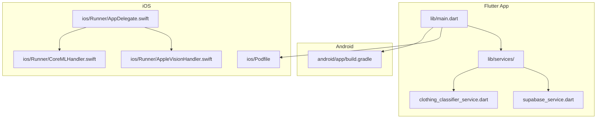
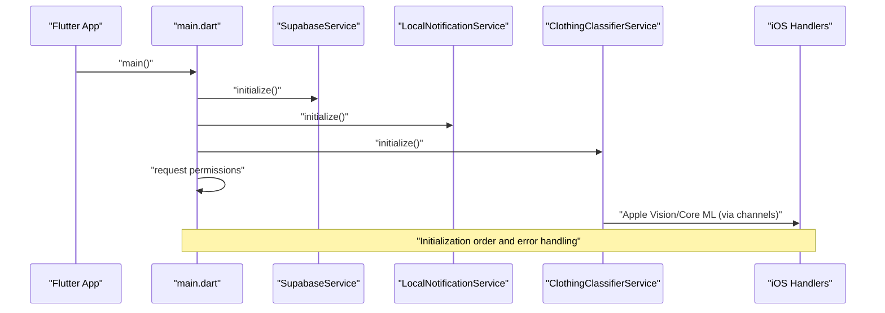

# Troubleshooting and FAQ

<cite>
**Referenced Files in This Document**
- [README.md](file://README.md)
- [pubspec.yaml](file://pubspec.yaml)
- [android/app/build.gradle](file://android/app/build.gradle)
- [ios/Podfile](file://ios/Podfile)
- [lib/main.dart](file://lib/main.dart)
- [lib/services/supabase_service.dart](file://lib/services/supabase_service.dart)
- [lib/services/clothing_classifier_service.dart](file://lib/services/clothing_classifier_service.dart)
- [ios/Runner/AppDelegate.swift](file://ios/Runner/AppDelegate.swift)
- [ios/Runner/AppleVisionHandler.swift](file://ios/Runner/AppleVisionHandler.swift)
- [ios/Runner/CoreMLHandler.swift](file://ios/Runner/CoreMLHandler.swift)
- [env.json](file://env.json)
</cite>

## Table of Contents
1. [Introduction](#introduction)
2. [Project Structure](#project-structure)
3. [Core Components](#core-components)
4. [Architecture Overview](#architecture-overview)
5. [Detailed Component Analysis](#detailed-component-analysis)
6. [Dependency Analysis](#dependency-analysis)
7. [Performance Considerations](#performance-considerations)
8. [Troubleshooting Guide](#troubleshooting-guide)
9. [Conclusion](#conclusion)
10. [Appendices](#appendices)

## Introduction
This document provides a comprehensive troubleshooting and FAQ guide for PrismStyle AI. It focuses on platform-specific issues (iOS build errors, Android permission problems), native integration challenges (Apple Vision and Core ML), debugging techniques for AI model performance and camera capture, and real-time database synchronization failures. It also covers development environment setup, dependency conflicts, configuration issues, performance optimization strategies, error handling patterns, logging strategies, diagnostic tools, network connectivity, authentication, and data synchronization.

## Project Structure
PrismStyle AI is a Flutter application with platform-specific integrations:
- Flutter app code under lib/
- Android configuration under android/
- iOS configuration under ios/
- AI services under lib/services/ (Supabase, AI classification, notifications)
- Native iOS handlers for Apple Vision and Core ML under ios/Runner/

**Diagram sources**
- [lib/main.dart](file://lib/main.dart#L1-L122)
- [lib/services/supabase_service.dart](file://lib/services/supabase_service.dart#L1-L673)
- [lib/services/clothing_classifier_service.dart](file://lib/services/clothing_classifier_service.dart#L1-L186)
- [android/app/build.gradle](file://android/app/build.gradle#L1-L67)
- [ios/Podfile](file://ios/Podfile#L1-L44)
- [ios/Runner/AppDelegate.swift](file://ios/Runner/AppDelegate.swift#L1-L102)
- [ios/Runner/AppleVisionHandler.swift](file://ios/Runner/AppleVisionHandler.swift#L1-L121)
- [ios/Runner/CoreMLHandler.swift](file://ios/Runner/CoreMLHandler.swift#L1-L321)

**Section sources**
- [README.md](file://README.md#L146-L172)
- [lib/main.dart](file://lib/main.dart#L1-L122)

## Core Components
- Application bootstrap initializes Supabase, local notifications, and the AI classifier, then requests runtime permissions.
- Supabase service manages authentication, database operations, and real-time subscriptions.
- Clothing classifier service wraps ensemble AI classification and exposes a compatibility interface.
- iOS integrates Apple Vision and Core ML via method channels and native handlers.

Key initialization and permission flows are centralized in the main entry point.

**Section sources**
- [lib/main.dart](file://lib/main.dart#L12-L92)
- [lib/services/supabase_service.dart](file://lib/services/supabase_service.dart#L41-L63)
- [lib/services/clothing_classifier_service.dart](file://lib/services/clothing_classifier_service.dart#L32-L36)
- [ios/Runner/AppDelegate.swift](file://ios/Runner/AppDelegate.swift#L11-L27)

## Architecture Overview
High-level flow:
- App starts and initializes services.
- Permissions are requested at startup.
- AI classification uses an ensemble strategy (TFLite + Apple Vision + Core ML + Heuristics).
- Supabase handles authentication, storage, and real-time subscriptions.

**Diagram sources**
- [lib/main.dart](file://lib/main.dart#L12-L65)
- [lib/services/supabase_service.dart](file://lib/services/supabase_service.dart#L41-L63)
- [lib/services/clothing_classifier_service.dart](file://lib/services/clothing_classifier_service.dart#L32-L36)
- [ios/Runner/AppDelegate.swift](file://ios/Runner/AppDelegate.swift#L11-L27)

## Detailed Component Analysis

### Supabase Service
- Loads credentials from env.json at runtime.
- Provides user, wardrobe, outfit, friend, and feedback operations.
- Manages real-time subscriptions and stream controllers.
- Exposes dispose to cancel subscriptions and close streams.

Common issues:
- Missing or empty credentials in env.json cause initialization failure.
- Real-time subscriptions require a valid connection and proper event filtering.

**Section sources**
- [lib/services/supabase_service.dart](file://lib/services/supabase_service.dart#L41-L63)
- [lib/services/supabase_service.dart](file://lib/services/supabase_service.dart#L395-L447)
- [env.json](file://env.json)

### Clothing Classifier Service
- Initializes EnsembleAIService and exposes classification APIs.
- Maps detailed categories to app categories.
- Returns classification results with confidence and tags.

Common issues:
- Ensemble initialization failures lead to unknown classification results.
- Image path/file existence errors cause classification to fail.

**Section sources**
- [lib/services/clothing_classifier_service.dart](file://lib/services/clothing_classifier_service.dart#L32-L36)
- [lib/services/clothing_classifier_service.dart](file://lib/services/clothing_classifier_service.dart#L42-L85)

### iOS Apple Vision and Core ML Integration
- AppDelegate registers method channels for Apple Vision and Core ML.
- AppleVisionHandler performs image classification using Vision framework.
- CoreMLHandler loads a custom model (if present) or falls back to heuristic analysis.

Common issues:
- Missing or incorrectly named Core ML model files.
- iOS version requirements and simulator limitations.
- Method channel argument validation failures.

**Section sources**
- [ios/Runner/AppDelegate.swift](file://ios/Runner/AppDelegate.swift#L29-L99)
- [ios/Runner/AppleVisionHandler.swift](file://ios/Runner/AppleVisionHandler.swift#L12-L68)
- [ios/Runner/CoreMLHandler.swift](file://ios/Runner/CoreMLHandler.swift#L50-L81)

## Dependency Analysis
- Flutter dependencies include Supabase, camera, permission_handler, tflite_flutter, and others.
- Android Gradle config sets ABI filters and disables compression for .tflite files.
- iOS Podfile sets platform to 18.0 and installs Flutter pods.

Potential conflicts:
- Version mismatches in Flutter/Dart SDK.
- Android NDK/JDK compatibility and desugaring.
- iOS CocoaPods cache or mismatched Flutter config.

**Section sources**
- [pubspec.yaml](file://pubspec.yaml#L9-L76)
- [android/app/build.gradle](file://android/app/build.gradle#L32-L42)
- [ios/Podfile](file://ios/Podfile#L1-L44)

## Performance Considerations
- AI classification speed varies by device generation; iOS generally outperforms Android.
- Accuracy improves with ensemble models; baseline heuristics offer 75% accuracy.
- Optimize image sizes and avoid unnecessary reprocessing.
- Use GPU delegates on Android where applicable.

[No sources needed since this section provides general guidance]

## Troubleshooting Guide

### Development Environment Setup
- Ensure Flutter SDK and Dart SDK versions meet requirements.
- Use FVM if necessary and prefix commands accordingly.
- Verify environment variables are present in env.json.

Resolution steps:
- Confirm Flutter and Dart versions align with project requirements.
- Validate env.json contains SUPABASE_URL and SUPABASE_ANON_KEY.
- Re-run dependency resolution if packages are missing.

**Section sources**
- [README.md](file://README.md#L50-L58)
- [README.md](file://README.md#L225-L230)
- [env.json](file://env.json)

### Android Build and Permissions
Common issues:
- TFLite model not loading due to asset misconfiguration.
- Android minSdk/targetSdk mismatch.
- Missing or incorrect ABI filters causing runtime crashes.

Resolution steps:
- Confirm assets/models is included in pubspec.yaml assets.
- Verify minSdk and ABI filters in build.gradle.
- Ensure .tflite files are not compressed by aaptOptions.
- Clean and rebuild after changes.

**Section sources**
- [README.md](file://README.md#L242-L247)
- [android/app/build.gradle](file://android/app/build.gradle#L23-L42)
- [pubspec.yaml](file://pubspec.yaml#L65-L71)

### iOS Build and Native Integrations
Common issues:
- CocoaPods installation failures or stale cache.
- Apple frameworks not initializing on simulator vs. real device.
- Missing or wrong model file names/extensions.

Resolution steps:
- Deintegrate and reinstall pods; clean Flutter build cache.
- Test Apple Vision/Core ML on a real iOS device.
- Verify Core ML model bundle names and extensions.
- Check iOS 18.0+ deployment target and Xcode project settings.

**Section sources**
- [README.md](file://README.md#L232-L241)
- [README.md](file://README.md#L249-L252)
- [ios/Podfile](file://ios/Podfile#L1-L44)
- [ios/Runner/CoreMLHandler.swift](file://ios/Runner/CoreMLHandler.swift#L54-L81)

### Camera Capture Problems
Symptoms:
- Camera permission denied.
- Camera preview not appearing.
- Images not captured or processed.

Resolution steps:
- Ensure camera permission is granted at startup.
- Verify camera plugin is configured and supported on the device/emulator.
- Check image picker and camera plugin versions.

**Section sources**
- [lib/main.dart](file://lib/main.dart#L68-L92)
- [pubspec.yaml](file://pubspec.yaml#L28-L29)

### AI Model Performance and Classification Failures
Symptoms:
- Unknown classification results.
- Low confidence predictions.
- Ensemble initialization errors.

Resolution steps:
- Confirm ensemble AI initialization succeeds.
- Validate image bytes and paths.
- Compare performance across devices; use higher-end devices for Apple Vision/Core ML.
- Review heuristic fallback behavior and adjust expectations.

**Section sources**
- [lib/services/clothing_classifier_service.dart](file://lib/services/clothing_classifier_service.dart#L32-L36)
- [lib/services/clothing_classifier_service.dart](file://lib/services/clothing_classifier_service.dart#L42-L85)

### Real-Time Database Synchronization Failures
Symptoms:
- Real-time updates not received.
- Subscriptions not firing.
- Disconnection during sync.

Resolution steps:
- Verify Supabase credentials in env.json.
- Ensure subscriptions are established with correct primary keys and filters.
- Check network connectivity and firewall rules.
- Dispose and recreate subscriptions on route changes.

**Section sources**
- [lib/services/supabase_service.dart](file://lib/services/supabase_service.dart#L41-L63)
- [lib/services/supabase_service.dart](file://lib/services/supabase_service.dart#L395-L447)

### Authentication Failures
Symptoms:
- Login/signup errors.
- Session not persisting.
- Auth state not updating.

Resolution steps:
- Confirm SUPABASE_URL and SUPABASE_ANON_KEY are set.
- Check Supabase project status and rate limits.
- Clear local auth state and retry login.

**Section sources**
- [lib/services/supabase_service.dart](file://lib/services/supabase_service.dart#L41-L63)
- [env.json](file://env.json)

### Network Connectivity Issues
Symptoms:
- Requests timing out.
- Images failing to upload/download.
- Real-time subscriptions disconnecting.

Resolution steps:
- Test connectivity on multiple networks.
- Use connectivity_plus to detect network status.
- Retry logic and exponential backoff for transient failures.

**Section sources**
- [pubspec.yaml](file://pubspec.yaml#L23-L24)

### Logging and Diagnostics
- Centralized error handling displays a custom error widget once per session.
- Extensive debug prints in services and handlers.
- Use Xcode console for iOS diagnostics and Android logcat for Android.

Resolution steps:
- Enable verbose logging locally.
- Capture logs during reproduction of the issue.
- Share logs with team for analysis.

**Section sources**
- [lib/main.dart](file://lib/main.dart#L44-L57)
- [lib/services/supabase_service.dart](file://lib/services/supabase_service.dart#L41-L63)
- [ios/Runner/AppleVisionHandler.swift](file://ios/Runner/AppleVisionHandler.swift#L38-L67)
- [ios/Runner/CoreMLHandler.swift](file://ios/Runner/CoreMLHandler.swift#L113-L174)

### Step-by-Step Resolution Guides

#### iOS Build Fails
1. Navigate to ios/ and run pod deintegrate followed by pod install.
2. From project root, run flutter clean and flutter pub get.
3. Reopen Xcode workspace and build again.

**Section sources**
- [README.md](file://README.md#L232-L241)

#### TFLite Model Not Loading
1. Place model files under assets/models/.
2. Ensure assets/models is declared in pubspec.yaml assets.
3. Rebuild the app.

**Section sources**
- [README.md](file://README.md#L242-L247)
- [pubspec.yaml](file://pubspec.yaml#L65-L71)

#### Apple Vision/Core ML Not Working
1. Test on a physical iOS device (not simulator).
2. Verify iOS 18.0+ deployment target.
3. Confirm model bundle names and extensions are present.
4. Check Xcode console for initialization and classification logs.

**Section sources**
- [README.md](file://README.md#L249-L252)
- [ios/Podfile](file://ios/Podfile#L1-L44)
- [ios/Runner/CoreMLHandler.swift](file://ios/Runner/CoreMLHandler.swift#L54-L81)

#### Camera Permission Denied
1. Relaunch the app and grant camera permission when prompted.
2. Check device settings if permission was permanently denied.
3. Verify camera plugin configuration.

**Section sources**
- [lib/main.dart](file://lib/main.dart#L68-L92)
- [pubspec.yaml](file://pubspec.yaml#L28-L29)

#### Supabase Credentials Missing
1. Open env.json and add SUPABASE_URL and SUPABASE_ANON_KEY.
2. Restart the app to reload credentials.

**Section sources**
- [lib/services/supabase_service.dart](file://lib/services/supabase_service.dart#L41-L63)
- [env.json](file://env.json)

#### Real-Time Subscription Not Updating
1. Ensure subscription filters match inserted records.
2. Cancel and re-create subscriptions on route changes.
3. Verify network connectivity.

**Section sources**
- [lib/services/supabase_service.dart](file://lib/services/supabase_service.dart#L395-L447)

### Escalation Procedures
- Collect logs from both Flutter and platform-specific layers.
- Provide device OS version, model, and reproduction steps.
- Include Supabase project status and environment variable values.
- For iOS, attach Xcode console logs; for Android, attach logcat output.

[No sources needed since this section provides general guidance]

## Conclusion
This guide consolidates common issues and their resolutions across platforms and components. By following the step-by-step guides, validating configurations, and leveraging built-in logging, most issues can be resolved quickly. For persistent problems, escalate with comprehensive logs and environment details.

[No sources needed since this section summarizes without analyzing specific files]

## Appendices

### Environment Variables Reference
- SUPABASE_URL: Supabase project URL
- SUPABASE_ANON_KEY: Supabase anonymous public key
- SUPABASE_SECRET_KEY: Supabase secret key (backend only)
- OPEN_METEO_API_URL: Weather API endpoint

**Section sources**
- [README.md](file://README.md#L261-L269)
- [env.json](file://env.json)

### Platform Support Matrix
- iOS: Camera, TFLite AI, Apple Vision, Apple Core ML, Location, Notifications, Supabase
- Android: Camera, TFLite AI, Location, Notifications, Supabase

**Section sources**
- [README.md](file://README.md#L121-L131)