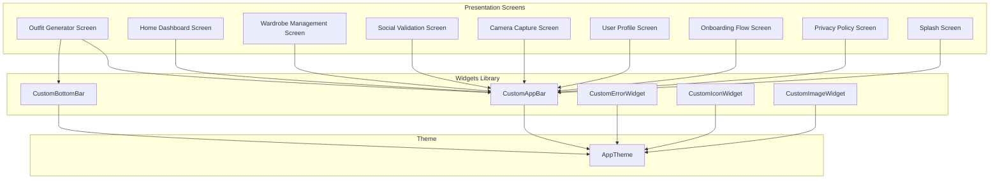
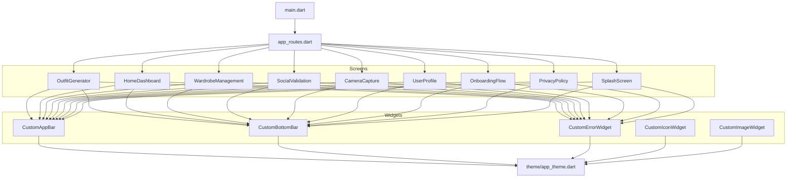
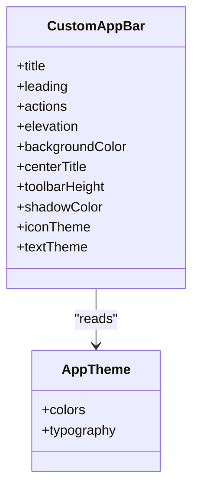
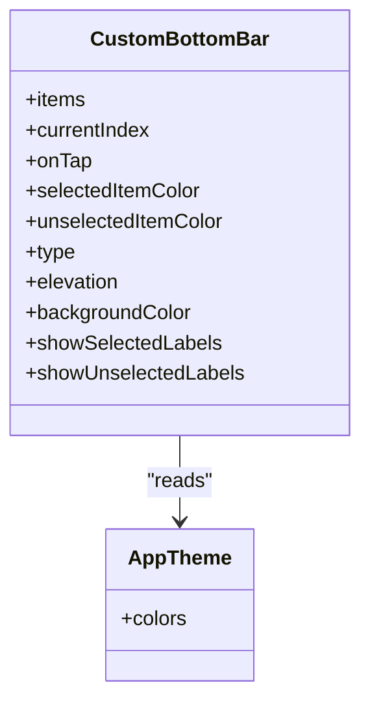
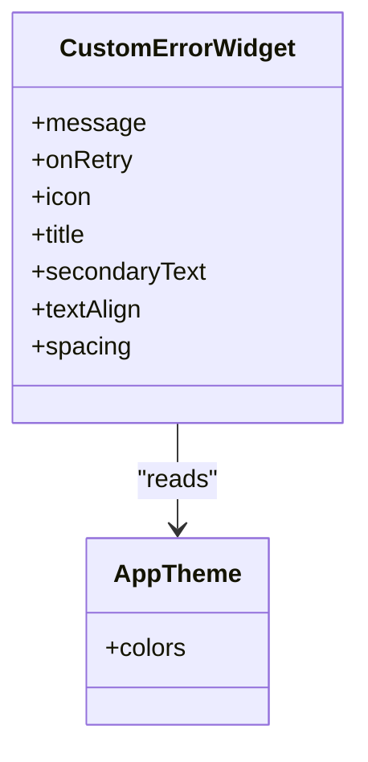
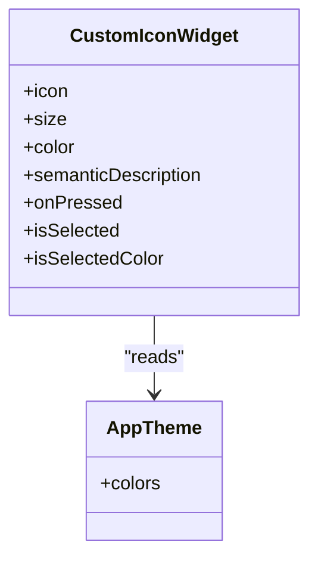
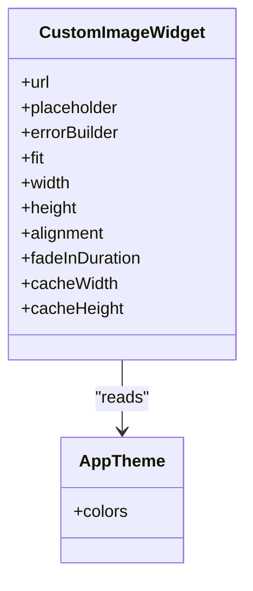
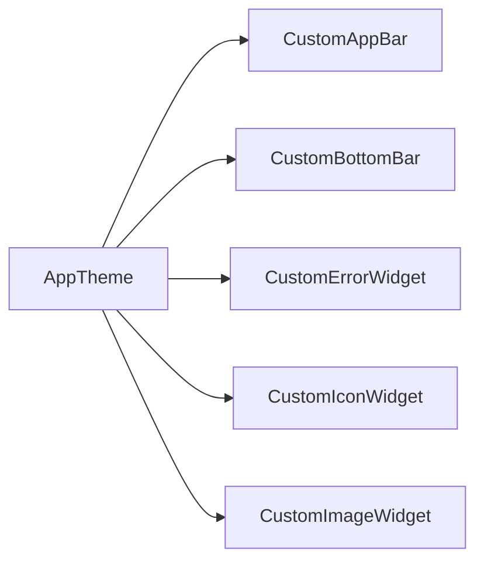

# UI Components

<cite>
**Referenced Files in This Document**
- [custom_app_bar.dart](file://lib/widgets/custom_app_bar.dart)
- [custom_bottom_bar.dart](file://lib/widgets/custom_bottom_bar.dart)
- [custom_error_widget.dart](file://lib/widgets/custom_error_widget.dart)
- [custom_icon_widget.dart](file://lib/widgets/custom_icon_widget.dart)
- [custom_image_widget.dart](file://lib/widgets/custom_image_widget.dart)
- [app_theme.dart](file://lib/theme/app_theme.dart)
- [main.dart](file://lib/main.dart)
- [app_routes.dart](file://lib/routes/app_routes.dart)
- [outfit_generator.dart](file://lib/presentation/outfit_generator/outfit_generator.dart)
- [home_dashboard.dart](file://lib/presentation/home_dashboard/home_dashboard.dart)
- [wardrobe_management.dart](file://lib/presentation/wardrobe_management/wardrobe_management.dart)
- [social_validation.dart](file://lib/presentation/social_validation/social_validation.dart)
- [camera_capture.dart](file://lib/presentation/camera_capture/camera_capture.dart)
- [user_profile.dart](file://lib/presentation/user_profile/user_profile.dart)
- [onboarding_flow.dart](file://lib/presentation/onboarding_flow/onboarding_flow.dart)
- [privacy_policy_screen.dart](file://lib/presentation/privacy_policy/privacy_policy_screen.dart)
- [splash_screen.dart](file://lib/presentation/splash_screen/splash_screen.dart)
</cite>

## Table of Contents
1. [Introduction](#introduction)
2. [Project Structure](#project-structure)
3. [Core Components](#core-components)
4. [Architecture Overview](#architecture-overview)
5. [Detailed Component Analysis](#detailed-component-analysis)
6. [Dependency Analysis](#dependency-analysis)
7. [Performance Considerations](#performance-considerations)
8. [Troubleshooting Guide](#troubleshooting-guide)
9. [Conclusion](#conclusion)
10. [Appendices](#appendices)

## Introduction
This document describes PrismStyle AI’s custom UI component library and how to use, extend, and optimize the reusable widgets. It focuses on five primary widgets: CustomAppBar, CustomBottomBar, CustomErrorWidget, CustomIconWidget, and CustomImageWidget. The guide explains design patterns, prop interfaces, theming integration, responsive behavior, accessibility, composition strategies, state management integration, animations, performance optimization, and extension guidelines.

## Project Structure
PrismStyle AI organizes UI logic under lib/widgets and integrates with screens and navigation via lib/presentation and lib/routes. Theming is centralized in lib/theme. The following diagram shows how the UI widgets relate to the rest of the app.

**Diagram sources**
- [custom_app_bar.dart](file://lib/widgets/custom_app_bar.dart#L1-L200)
- [custom_bottom_bar.dart](file://lib/widgets/custom_bottom_bar.dart#L1-L200)
- [custom_error_widget.dart](file://lib/widgets/custom_error_widget.dart#L1-L200)
- [custom_icon_widget.dart](file://lib/widgets/custom_icon_widget.dart#L1-L200)
- [custom_image_widget.dart](file://lib/widgets/custom_image_widget.dart#L1-L200)
- [app_theme.dart](file://lib/theme/app_theme.dart#L1-L200)
- [outfit_generator.dart](file://lib/presentation/outfit_generator/outfit_generator.dart#L1-L200)
- [home_dashboard.dart](file://lib/presentation/home_dashboard/home_dashboard.dart#L1-L200)
- [wardrobe_management.dart](file://lib/presentation/wardrobe_management/wardrobe_management.dart#L1-L200)
- [social_validation.dart](file://lib/presentation/social_validation/social_validation.dart#L1-L200)
- [camera_capture.dart](file://lib/presentation/camera_capture/camera_capture.dart#L1-L200)
- [user_profile.dart](file://lib/presentation/user_profile/user_profile.dart#L1-L200)
- [onboarding_flow.dart](file://lib/presentation/onboarding_flow/onboarding_flow.dart#L1-L200)
- [privacy_policy_screen.dart](file://lib/presentation/privacy_policy/privacy_policy_screen.dart#L1-L200)
- [splash_screen.dart](file://lib/presentation/splash_screen/splash_screen.dart#L1-L200)

**Section sources**
- [custom_app_bar.dart](file://lib/widgets/custom_app_bar.dart#L1-L200)
- [custom_bottom_bar.dart](file://lib/widgets/custom_bottom_bar.dart#L1-L200)
- [custom_error_widget.dart](file://lib/widgets/custom_error_widget.dart#L1-L200)
- [custom_icon_widget.dart](file://lib/widgets/custom_icon_widget.dart#L1-L200)
- [custom_image_widget.dart](file://lib/widgets/custom_image_widget.dart#L1-L200)
- [app_theme.dart](file://lib/theme/app_theme.dart#L1-L200)

## Core Components
This section introduces each widget’s purpose, typical props, and integration patterns.

- CustomAppBar
  - Purpose: Provides a consistent top app bar across screens with optional actions, title, and flexible layout.
  - Typical props: title, leading, actions, elevation, backgroundColor, centerTitle, toolbarHeight.
  - Integration: Used in most presentation screens to maintain brand consistency and navigation affordances.

- CustomBottomBar
  - Purpose: Renders a bottom navigation bar with items, icons, labels, and selection state.
  - Typical props: items, currentIndex, onTap, selectedItemColor, unselectedItemColor, type.
  - Integration: Centralizes bottom navigation UX and aligns with AppTheme colors and typography.

- CustomErrorWidget
  - Purpose: Displays a friendly error state with optional retry action and descriptive messaging.
  - Typical props: message, onRetry, icon, title, secondaryText.
  - Integration: Used inside lists, grids, and detail views when asynchronous operations fail.

- CustomIconWidget
  - Purpose: Encapsulates icon rendering with consistent sizing, tinting, and interaction behavior.
  - Typical props: icon, size, color, semanticDescription, onPressed, isSelected.
  - Integration: Reusable across buttons, tabs, and interactive elements.

- CustomImageWidget
  - Purpose: Handles image loading, caching, placeholders, and error fallbacks with responsive sizing.
  - Typical props: url, placeholder, errorBuilder, fit, width, height, alignment, fadeInDuration.
  - Integration: Used in galleries, cards, and profile sections.

**Section sources**
- [custom_app_bar.dart](file://lib/widgets/custom_app_bar.dart#L1-L200)
- [custom_bottom_bar.dart](file://lib/widgets/custom_bottom_bar.dart#L1-L200)
- [custom_error_widget.dart](file://lib/widgets/custom_error_widget.dart#L1-L200)
- [custom_icon_widget.dart](file://lib/widgets/custom_icon_widget.dart#L1-L200)
- [custom_image_widget.dart](file://lib/widgets/custom_image_widget.dart#L1-L200)

## Architecture Overview
The UI components are designed as leaf-level widgets that depend on AppTheme for visual consistency and are composed by presentation screens. Navigation and routing are handled separately, while widgets focus on rendering and interaction.

**Diagram sources**
- [main.dart](file://lib/main.dart#L1-L200)
- [app_routes.dart](file://lib/routes/app_routes.dart#L1-L200)
- [app_theme.dart](file://lib/theme/app_theme.dart#L1-L200)
- [custom_app_bar.dart](file://lib/widgets/custom_app_bar.dart#L1-L200)
- [custom_bottom_bar.dart](file://lib/widgets/custom_bottom_bar.dart#L1-L200)
- [custom_error_widget.dart](file://lib/widgets/custom_error_widget.dart#L1-L200)
- [custom_icon_widget.dart](file://lib/widgets/custom_icon_widget.dart#L1-L200)
- [custom_image_widget.dart](file://lib/widgets/custom_image_widget.dart#L1-L200)
- [outfit_generator.dart](file://lib/presentation/outfit_generator/outfit_generator.dart#L1-L200)
- [home_dashboard.dart](file://lib/presentation/home_dashboard/home_dashboard.dart#L1-L200)
- [wardrobe_management.dart](file://lib/presentation/wardrobe_management/wardrobe_management.dart#L1-L200)
- [social_validation.dart](file://lib/presentation/social_validation/social_validation.dart#L1-L200)
- [camera_capture.dart](file://lib/presentation/camera_capture/camera_capture.dart#L1-L200)
- [user_profile.dart](file://lib/presentation/user_profile/user_profile.dart#L1-L200)
- [onboarding_flow.dart](file://lib/presentation/onboarding_flow/onboarding_flow.dart#L1-L200)
- [privacy_policy_screen.dart](file://lib/presentation/privacy_policy/privacy_policy_screen.dart#L1-L200)
- [splash_screen.dart](file://lib/presentation/splash_screen/splash_screen.dart#L1-L200)

## Detailed Component Analysis

### CustomAppBar
- Design pattern: Stateless widget with optional callbacks for actions and navigation. Uses AppBar defaults with theme-aware colors and typography.
- Props interface:
  - title: Widget or String
  - leading: Widget?
  - actions: List<Widget>?
  - elevation: double?
  - backgroundColor: Color?
  - centerTitle: bool?
  - toolbarHeight: double?
  - shadowColor: Color?
  - iconTheme: IconThemeData?
  - textTheme: TextTheme?
- Theming integration: Reads colors and typography from AppTheme to ensure consistency with global design tokens.
- Accessibility: Supports semantic labels via semantics and respects platform accessibility defaults.
- Responsive behavior: Adapts to safe areas and dynamic type scaling via inherited theme.
- Composition: Typically placed at the top of Scaffold in presentation screens.
- Animation support: Inherits standard AppBar transitions from Navigator.
- Usage example path: See [outfit_generator.dart](file://lib/presentation/outfit_generator/outfit_generator.dart#L1-L200) for a screen that composes CustomAppBar.

**Diagram sources**
- [custom_app_bar.dart](file://lib/widgets/custom_app_bar.dart#L1-L200)
- [app_theme.dart](file://lib/theme/app_theme.dart#L1-L200)

**Section sources**
- [custom_app_bar.dart](file://lib/widgets/custom_app_bar.dart#L1-L200)
- [app_theme.dart](file://lib/theme/app_theme.dart#L1-L200)
- [outfit_generator.dart](file://lib/presentation/outfit_generator/outfit_generator.dart#L1-L200)

### CustomBottomBar
- Design pattern: Stateless widget that renders a bottom navigation bar with index-driven selection and callback-driven navigation.
- Props interface:
  - items: List<BottomNavigationBarItem>
  - currentIndex: int
  - onTap: Function(int)
  - selectedItemColor: Color?
  - unselectedItemColor: Color?
  - type: BottomNavigationBarType?
  - elevation: double?
  - backgroundColor: Color?
  - showSelectedLabels: bool?
  - showUnselectedLabels: bool?
- Theming integration: Uses AppTheme colors for selected/unselected states and background.
- Accessibility: Supports label visibility and semantic hints; ensure each item has a meaningful label.
- Responsive behavior: Adapts to device width and orientation; consider compact vs expanded layouts.
- Composition: Used alongside body content in Scaffold to provide persistent navigation.
- Animation support: Inherits standard Material bottom navigation transitions.
- Usage example path: See [home_dashboard.dart](file://lib/presentation/home_dashboard/home_dashboard.dart#L1-L200) for a screen that composes CustomBottomBar.

**Diagram sources**
- [custom_bottom_bar.dart](file://lib/widgets/custom_bottom_bar.dart#L1-L200)
- [app_theme.dart](file://lib/theme/app_theme.dart#L1-L200)

**Section sources**
- [custom_bottom_bar.dart](file://lib/widgets/custom_bottom_bar.dart#L1-L200)
- [app_theme.dart](file://lib/theme/app_theme.dart#L1-L200)
- [home_dashboard.dart](file://lib/presentation/home_dashboard/home_dashboard.dart#L1-L200)

### CustomErrorWidget
- Design pattern: Stateless widget that displays an error state with optional retry action. Encapsulates layout and interaction.
- Props interface:
  - message: String?
  - onRetry: VoidCallback?
  - icon: IconData?
  - title: String?
  - secondaryText: String?
  - textAlign: TextAlign?
  - spacing: double?
- Theming integration: Uses AppTheme colors for text and accents.
- Accessibility: Provides semantic labels and supports keyboard focus for retry button.
- Responsive behavior: Adapts to viewport width and vertical spacing via padding and alignment.
- Composition: Used within scrollable lists or grid tiles to surface transient errors.
- Animation support: Can be combined with FadeTransition or SlideTransition for entrance effects.
- Usage example path: See [wardrobe_management.dart](file://lib/presentation/wardrobe_management/wardrobe_management.dart#L1-L200) for a screen that composes CustomErrorWidget.

**Diagram sources**
- [custom_error_widget.dart](file://lib/widgets/custom_error_widget.dart#L1-L200)
- [app_theme.dart](file://lib/theme/app_theme.dart#L1-L200)

**Section sources**
- [custom_error_widget.dart](file://lib/widgets/custom_error_widget.dart#L1-L200)
- [app_theme.dart](file://lib/theme/app_theme.dart#L1-L200)
- [wardrobe_management.dart](file://lib/presentation/wardrobe_management/wardrobe_management.dart#L1-L200)

### CustomIconWidget
- Design pattern: Stateless widget that wraps an icon with consistent sizing, tinting, and optional interaction.
- Props interface:
  - icon: IconData
  - size: double?
  - color: Color?
  - semanticDescription: String?
  - onPressed: VoidCallback?
  - isSelected: bool?
  - isSelectedColor: Color?
- Theming integration: Uses AppTheme color roles for default and selected states.
- Accessibility: Supports semanticDescription and integrates with touch targets for accessibility services.
- Responsive behavior: Scales with text themes and respects dynamic font sizing.
- Composition: Used inside buttons, tabs, and controls to maintain visual consistency.
- Animation support: Can be combined with AnimatedSwitcher or AnimatedBuilder for state transitions.
- Usage example path: See [social_validation.dart](file://lib/presentation/social_validation/social_validation.dart#L1-L200) for a screen that composes CustomIconWidget.

**Diagram sources**
- [custom_icon_widget.dart](file://lib/widgets/custom_icon_widget.dart#L1-L200)
- [app_theme.dart](file://lib/theme/app_theme.dart#L1-L200)

**Section sources**
- [custom_icon_widget.dart](file://lib/widgets/custom_icon_widget.dart#L1-L200)
- [app_theme.dart](file://lib/theme/app_theme.dart#L1-L200)
- [social_validation.dart](file://lib/presentation/social_validation/social_validation.dart#L1-L200)

### CustomImageWidget
- Design pattern: Stateless widget that handles image loading, caching, and fallbacks with responsive sizing.
- Props interface:
  - url: String?
  - placeholder: Widget?
  - errorBuilder: Widget Function(BuildContext)?
  - fit: BoxFit?
  - width: double?
  - height: double?
  - alignment: AlignmentGeometry?
  - fadeInDuration: Duration?
  - cacheWidth: int?
  - cacheHeight: int?
- Theming integration: Uses AppTheme colors for borders and placeholders.
- Accessibility: Supports semantic descriptions and alt text via accessibility labels.
- Responsive behavior: Adapts to container constraints and respects aspect ratio.
- Composition: Used in cards, galleries, and profile sections.
- Animation support: Includes fade-in transition for loaded images.
- Usage example path: See [camera_capture.dart](file://lib/presentation/camera_capture/camera_capture.dart#L1-L200) for a screen that composes CustomImageWidget.

**Diagram sources**
- [custom_image_widget.dart](file://lib/widgets/custom_image_widget.dart#L1-L200)
- [app_theme.dart](file://lib/theme/app_theme.dart#L1-L200)

**Section sources**
- [custom_image_widget.dart](file://lib/widgets/custom_image_widget.dart#L1-L200)
- [app_theme.dart](file://lib/theme/app_theme.dart#L1-L200)
- [camera_capture.dart](file://lib/presentation/camera_capture/camera_capture.dart#L1-L200)

## Dependency Analysis
The widgets depend on AppTheme for colors and typography, and are consumed by presentation screens. There are no circular dependencies among the widgets themselves.

**Diagram sources**
- [app_theme.dart](file://lib/theme/app_theme.dart#L1-L200)
- [custom_app_bar.dart](file://lib/widgets/custom_app_bar.dart#L1-L200)
- [custom_bottom_bar.dart](file://lib/widgets/custom_bottom_bar.dart#L1-L200)
- [custom_error_widget.dart](file://lib/widgets/custom_error_widget.dart#L1-L200)
- [custom_icon_widget.dart](file://lib/widgets/custom_icon_widget.dart#L1-L200)
- [custom_image_widget.dart](file://lib/widgets/custom_image_widget.dart#L1-L200)

**Section sources**
- [app_theme.dart](file://lib/theme/app_theme.dart#L1-L200)
- [custom_app_bar.dart](file://lib/widgets/custom_app_bar.dart#L1-L200)
- [custom_bottom_bar.dart](file://lib/widgets/custom_bottom_bar.dart#L1-L200)
- [custom_error_widget.dart](file://lib/widgets/custom_error_widget.dart#L1-L200)
- [custom_icon_widget.dart](file://lib/widgets/custom_icon_widget.dart#L1-L200)
- [custom_image_widget.dart](file://lib/widgets/custom_image_widget.dart#L1-L200)

## Performance Considerations
- Prefer StatelessWidgets for leaf components to reduce rebuild costs.
- Use const constructors and const widgets where possible to enable tree sharing.
- Defer heavy work to background threads; keep UI thread responsive.
- For CustomImageWidget:
  - Use cacheWidth/cacheHeight to avoid excessive recomputation.
  - Provide a lightweight placeholder to prevent layout thrashing.
  - Limit fadeInDuration to balance perceived performance and fidelity.
- For CustomErrorWidget and CustomIconWidget:
  - Keep child trees shallow; avoid unnecessary nested widgets.
  - Use Semantics sparingly; only when necessary for accessibility.
- For CustomBottomBar:
  - Keep items count reasonable; consider collapsing rarely used items.
  - Avoid rebuilding entire navigation bars on state changes; pass immutable lists.
- For CustomAppBar:
  - Minimize expensive actions in onEnter/exit callbacks; defer to Future.microtask if needed.
- Memory management:
  - Dispose of streams/subscriptions in StatefulWidget lifecycles.
  - Avoid retaining large bitmaps unnecessarily; use appropriate image sizes.
- Rendering:
  - Use RepaintBoundary judiciously around expensive subtrees.
  - Prefer Transform.translate over moving containers to reduce layout cost.

[No sources needed since this section provides general guidance]

## Troubleshooting Guide
- Theming mismatches:
  - Verify AppTheme colors are applied consistently across widgets.
  - Ensure Scaffold and AppBar are configured to use the app theme.
- Accessibility issues:
  - Provide semanticDescription for CustomIconWidget where icons convey meaning.
  - Ensure CustomErrorWidget has sufficient contrast and readable text sizes.
- Responsive problems:
  - Test CustomBottomBar on small screens; adjust showSelectedLabels/showUnselectedLabels as needed.
  - For CustomImageWidget, specify fit and alignment to avoid overflow or stretching.
- Interaction problems:
  - Ensure onPressed handlers in CustomIconWidget are non-null when the icon is actionable.
  - For CustomErrorWidget, confirm onRetry is set to recover from transient failures.
- State management integration:
  - Pass current index to CustomBottomBar from state management (e.g., Bloc, Riverpod, or ChangeNotifier).
  - Update CustomAppBar title and actions based on route or state changes.

**Section sources**
- [app_theme.dart](file://lib/theme/app_theme.dart#L1-L200)
- [custom_icon_widget.dart](file://lib/widgets/custom_icon_widget.dart#L1-L200)
- [custom_error_widget.dart](file://lib/widgets/custom_error_widget.dart#L1-L200)
- [custom_bottom_bar.dart](file://lib/widgets/custom_bottom_bar.dart#L1-L200)
- [custom_image_widget.dart](file://lib/widgets/custom_image_widget.dart#L1-L200)

## Conclusion
PrismStyle AI’s custom UI components provide a cohesive, theme-aware, and accessible foundation for building screens. By following the design patterns and integration strategies outlined here—consistent theming, responsive behavior, accessibility, and performance—you can compose reliable experiences and extend the library with new widgets that adhere to established conventions.

[No sources needed since this section summarizes without analyzing specific files]

## Appendices

### Usage Examples and Integration Patterns
- Compose CustomAppBar in a screen scaffold to provide a unified header.
  - Example path: [outfit_generator.dart](file://lib/presentation/outfit_generator/outfit_generator.dart#L1-L200)
- Integrate CustomBottomBar for persistent navigation across multiple screens.
  - Example path: [home_dashboard.dart](file://lib/presentation/home_dashboard/home_dashboard.dart#L1-L200)
- Display CustomErrorWidget when asynchronous operations fail.
  - Example path: [wardrobe_management.dart](file://lib/presentation/wardrobe_management/wardrobe_management.dart#L1-L200)
- Use CustomIconWidget inside buttons and tabs for consistent interaction affordances.
  - Example path: [social_validation.dart](file://lib/presentation/social_validation/social_validation.dart#L1-L200)
- Render images with CustomImageWidget for galleries and feeds.
  - Example path: [camera_capture.dart](file://lib/presentation/camera_capture/camera_capture.dart#L1-L200)

**Section sources**
- [outfit_generator.dart](file://lib/presentation/outfit_generator/outfit_generator.dart#L1-L200)
- [home_dashboard.dart](file://lib/presentation/home_dashboard/home_dashboard.dart#L1-L200)
- [wardrobe_management.dart](file://lib/presentation/wardrobe_management/wardrobe_management.dart#L1-L200)
- [social_validation.dart](file://lib/presentation/social_validation/social_validation.dart#L1-L200)
- [camera_capture.dart](file://lib/presentation/camera_capture/camera_capture.dart#L1-L200)

### State Management Integration
- Bottom navigation:
  - Maintain currentIndex in state and update via onTap callback.
  - Example path: [home_dashboard.dart](file://lib/presentation/home_dashboard/home_dashboard.dart#L1-L200)
- AppBar title and actions:
  - Derive title and actions from current route or state.
  - Example path: [outfit_generator.dart](file://lib/presentation/outfit_generator/outfit_generator.dart#L1-L200)
- Error handling:
  - Trigger CustomErrorWidget when state indicates failure; expose onRetry to reattempt operations.
  - Example path: [wardrobe_management.dart](file://lib/presentation/wardrobe_management/wardrobe_management.dart#L1-L200)

**Section sources**
- [home_dashboard.dart](file://lib/presentation/home_dashboard/home_dashboard.dart#L1-L200)
- [outfit_generator.dart](file://lib/presentation/outfit_generator/outfit_generator.dart#L1-L200)
- [wardrobe_management.dart](file://lib/presentation/wardrobe_management/wardrobe_management.dart#L1-L200)

### Animation Support
- AppBar transitions:
  - Rely on Navigator-driven transitions; keep CustomAppBar lean to preserve smoothness.
- BottomBar transitions:
  - Use IndexedStack or similar to minimize rebuilds during navigation.
- Error and icon widgets:
  - Combine with FadeTransition or AnimatedSwitcher for subtle feedback.
- Image loading:
  - Use fadeInDuration for a polished reveal effect.

**Section sources**
- [custom_app_bar.dart](file://lib/widgets/custom_app_bar.dart#L1-L200)
- [custom_bottom_bar.dart](file://lib/widgets/custom_bottom_bar.dart#L1-L200)
- [custom_error_widget.dart](file://lib/widgets/custom_error_widget.dart#L1-L200)
- [custom_icon_widget.dart](file://lib/widgets/custom_icon_widget.dart#L1-L200)
- [custom_image_widget.dart](file://lib/widgets/custom_image_widget.dart#L1-L200)

### Extending Existing Components and Creating New Widgets
- Follow the existing widget structure:
  - Stateless widget with a focused responsibility.
  - Accept props via constructor parameters; prefer named parameters for clarity.
  - Use AppTheme for colors and typography.
- Maintain accessibility:
  - Provide semanticDescription where icons convey meaning.
  - Ensure sufficient contrast and readable text sizes.
- Optimize performance:
  - Use const constructors and immutable lists.
  - Avoid heavy computations in build.
- Keep composition simple:
  - Prefer small, composable widgets over monolithic ones.
- Example reference paths for patterns:
  - [custom_app_bar.dart](file://lib/widgets/custom_app_bar.dart#L1-L200)
  - [custom_bottom_bar.dart](file://lib/widgets/custom_bottom_bar.dart#L1-L200)
  - [custom_error_widget.dart](file://lib/widgets/custom_error_widget.dart#L1-L200)
  - [custom_icon_widget.dart](file://lib/widgets/custom_icon_widget.dart#L1-L200)
  - [custom_image_widget.dart](file://lib/widgets/custom_image_widget.dart#L1-L200)

**Section sources**
- [custom_app_bar.dart](file://lib/widgets/custom_app_bar.dart#L1-L200)
- [custom_bottom_bar.dart](file://lib/widgets/custom_bottom_bar.dart#L1-L200)
- [custom_error_widget.dart](file://lib/widgets/custom_error_widget.dart#L1-L200)
- [custom_icon_widget.dart](file://lib/widgets/custom_icon_widget.dart#L1-L200)
- [custom_image_widget.dart](file://lib/widgets/custom_image_widget.dart#L1-L200)